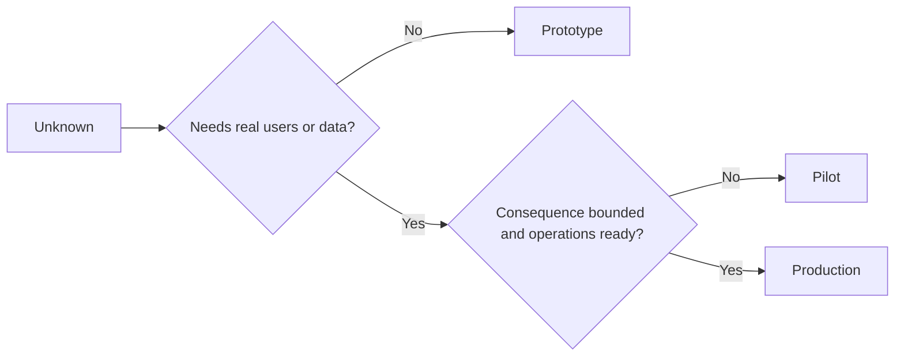

# 프로토타입, 파일럿, 프로덕션을 의도적으로 선택하세요

> 이것들은 연마 수준의 차이가 아니라 서로 다른 학습 환경입니다. 불필요한 결과가 가장 적은 단계로 현재 알지 못하는 부분을 해결하는 단계를 선택해 보세요.

**유형:** Learn + Build
**언어:** Python (stdlib)
**선수 요건:** 14단계 50-52강
**시간:** 약 70분

## 학습 목표

- 알지 못하는 부분, 대상 사용자, 데이터, 결과, 준비 상태를 고려하여 빌드 단계를 선택하세요.
- 단계별 통제 및 종료 기준을 정의하세요.
- 프로토타입이 조용히 프로덕션 시스템으로 변하는 것을 방지하세요.
- 증거와 운영이 이를 정당화할 때까지 실제 권한을 지연하세요.

## 세 가지 다른 질문

| 단계 | 주요 질문 |
|---|---|
| 프로토타입 | 이 메커니즘이 증거를 생성할 수 있는가? |
| 파일럿 | 제한된 실제 대상 사용자와 실제 조건에서 안전하게 작동하는가? |
| 프로덕션 | 약속된 신뢰성 및 위험 수준에서 지속적으로 소유할 수 있는가? |

프로토타입은 기술적으로 완성될 수 있으며 여전히 일회용일 수 있습니다. 파일럿은 프로덕션 데이터를 사용하되 대상 사용자와 권한이 제한된 상태로 유지될 수 있습니다. 프로덕션은 조직이 지속적인 책임을 수용할 때 시작됩니다.

## 프로토타입

알지 못하는 부분이 실제 사용자나 실제 데이터를 필요로 하지 않을 때 프로토타입을 사용하세요. 다음을 유지하세요:

- 폐기 가능;
- 격리됨;
- 행동이 좁음;
- 학습 질문에 대해 명확함;
- 허위 운영 보장이 없음.

메커니즘이 다음 단계를 획득하기 전에 아키텍처를 최적화하지 마세요.

## 파일럿

알지 못하는 부분이 실제 행동, 현실적인 데이터, 또는 실제 워크플로우를 필요로 하지만 결과나 준비 상태가 광범위한 릴리스와 호환되지 않을 때 파일럿을 사용하세요.

파일럿에는 다음이 필요합니다:

- 명명된 대상 사용자;
- 인간 소유자;
- 제한된 기간 및 권한;
- 감사 및 롤백;
- 결과 및 가드레일 임계값;
- 확장, 수정, 중단의 종료 기준.

## 프로덕션

프로덕션은 배포 그 이상을 필요로 합니다:

- 서비스 수준 목표(SLO);
- 온콜 및 인시던트 소유권;
- 보안 및 프라이버시 검토;
- 비용 및 용량 제어;
- 롤백 및 복구;
- 지속적인 모니터링;
- 은퇴 경로.



## 단계 드리프트

프로토타입 코드는 사용자, 데이터, 권한을 획득하면서 소유권을 획득하지 못했을 때 위험해집니다. 구성, 접근 제어, 텔레메트리, 문서에서 프로토타입 및 파일럿 경계를 표시하세요. 경고 배너만으로는 충분하지 않습니다.

단계는 시스템 자체에서 관측 가능해야 합니다.

## 구현하기

랩은 결정 컨텍스트에서 단계를 선택하고, 필요한 제어 항목을 반환하며, `outputs/stage-decisions.json`를 작성합니다.

```bash
python3 code/main.py
python3 -m unittest discover code/tests -v
```

파일럿 예제를 낮은 결과와 운영 준비 상태로 변경하세요. 프로덕션을 정당화할 추가 증거가 무엇인지 설명해 보세요.

## 연습 문제

1. 세 개의 현재 프로젝트를 배포 상태가 아닌 학습 단계로 분류하세요.
2. 중단 결정을 포함하는 파일럿 종료 기준을 작성하세요.
3. 프로토타입이 프로덕션 데이터에 도달하는 것을 방지하는 기술적 제어 항목을 추가하세요.
4. 빌드를 프로덕션으로 만드는 첫 번째 운영 책임 식별하세요.
5. 범위가 제한된 파일럿에 대한 롤백 영수증을 설계하세요.

## 추가 읽기

- [Barry Boehm, A Spiral Model of Software Development and Enhancement](https://dl.acm.org/doi/10.1145/12944.12948), 각 반복의 약속을 해결된 위험과 매칭하기 위해.
- [Fagerholm et al., Building Blocks for Continuous Experimentation](https://doi.org/10.1145/2601248.2601276), 실험을 지속적으로 실행하기 위해 필요한 조직 및 기술적 조건을 위해.

## 보유할 것

`outputs/stage-decisions.json`를 유지하세요. 이 문서는 각 단계가 정당화되는 이유와 다음 단계로 넘어가기 전에 존재해야 하는 제어 항목을 기록합니다.
