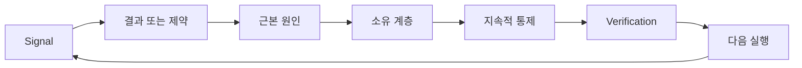

# 소유권과 은퇴 조건을 갖춘 피드백 래칫(Feedback Ratchet) 구축하기

> 출시(shipping)는 하나의 빌드 루프를 닫고 학습 루프를 엽니다. 증거가 시스템을 변화시키지 못하면, 아무도 소유하지 않는 텔레메트리(telemetry)가 됩니다.

**유형:** Learn + Build
**언어:** Python (stdlib)
**선수 요건:** 14단계 46강 및 53강
**시간:** 약 75분

## 학습 목표

- 인시던트, 평가, 사용자 행동, 교정을 소유된 행동으로 전환하세요.
- 각 신호를 컨텍스트, 평가, 정책, 런타임, 백로그로 라우팅하세요.
- 심각도와 빈도에 따라 재발 우선순위를 정하세요.
- 모든 통제에 은퇴(retirement) 조건을 부여하세요.
- 증거, 트레이드오프(tradeoff), 책임 있는 소유자를 포함하여 전달(delivery) 결정을 소통하세요.

## 피드백은 인프라입니다

팀은 추적(trace), 평가, 지원 티켓, 인시던트 로그를 수집하되 그중 아무것도로부터 학습하지 못할 수 있습니다. 누락된 메커니즘은 승격(promotion)입니다: 관찰에서 소유자와 증거를 갖춘 지속적 변화로 이어지는 정의된 경로가 필요합니다.

루프는 다음과 같습니다:

1. 구체적인 신호를 관찰합니다;
2. 이를 결과, 제약, 또는 가정에 연결합니다;
3. 원인을 소유하는 가장 이른 시스템 계층을 식별합니다;
4. 범위가 한정된 변경을 생성합니다;
5. 재발 가능성이 낮아지는지 검증합니다;
6. 통제를 유지해야 하는지 검토합니다.

## 소유 계층으로 라우팅하기

| 신호 | 목적지 |
|---|---|
| 오탐(false positive), 회귀(regression), 잘못된 결과 | 평가 또는 테스트 |
| 누락된 컨텍스트, 중복 작업, 오래된 사실 | 컨텍스트 소스 또는 검색 경로 |
| 안전하지 않은 행동 또는 권한 공백 | 정책 또는 권한 경계 |
| 타임아웃, 재시도 폭풍, 사용 불가능한 의존성 | 런타임 통제 |
| 새로운 제품 요구사항 또는 해결되지 않은 트레이드오프 | 구체화된 백로그 항목 |

가장 효과적인 계층에서 원인을 수정하세요. 테스트나 권한 설정으로 실패를 불가능하게 만들 수 있는데 프롬프트 단락을 추가하지 마세요.



## 소유권은 통제의 일부입니다

모든 래칫(ratchet) 작업에는 다음이 필요합니다:

- 한 명의 소유자;
- 결과와 재발 빈도에 기반한 우선순위;
- 변경할 산출물;
- 변경을 증명하는 검증;
- 검토 또는 만료 기간;
- 은퇴 조건.

소유되지 않은 개선은 형식이 더 잘 갖춰진 관찰일 뿐입니다.

## 오래된 통제 은퇴하기

피드백 시스템은 정책이 누적됩니다. 이 정책은 모순되고 비용이 많이 들 수 있습니다. 다음 경우 통제를 검토하세요:

- 아키텍처나 워크플로우가 변경될 때;
- 하위 수준 불변 조건이 상위 수준 지시를 대체할 때;
- 선택한 기간 동안 보호된 실패가 나타나지 않았을 때;
- 통제가 해를 방지하는 것보다 합법적인 작업을 더 자주 차단할 때.

은퇴에도 증거가 필요합니다. 오래된 것 같다고 해서 통제를 삭제하지 마세요.

## 빌드 및 코딩 에이전트 피드백 연결하기

동일한 래칫이 두 트랙 모두에 적용됩니다:

- 제품 증거는 결과 프레임, 가정, 슬라이스(slice), 또는 측정 계획을 변경합니다.
- 코딩 에이전트 수정은 테스트, 컨텍스트, 범위, 자동화, 또는 핸드오프(handoff)를 변경합니다.
- 인시던트(incident)는 제품 경계와 에이전트 작업대 모두를 변경할 수 있습니다.

이 때문에 빌드 형상화(shaping)는 코딩 전에 끝나는 단계가 아닙니다. 모든 승인된 변경을 통해 계속됩니다.

## 구현하기

랩은 신호를 분류하고, 소유된 래칫 작업을 생성하며, 우선순위를 정하고, `outputs/feedback-backlog.json`에 작성합니다.

```bash
python3 code/main.py
python3 -m unittest discover code/tests -v
```

런타임 시간 초과(time-out) 신호를 추가하고, 일반 백로그가 아닌 런타임으로 라우팅되는지 확인하세요.

## 연습 랩: 좌절 후 결정 소유하기

커리어 경로 포트폴리오 프로젝트에서 워크플로우 하나를 선택하세요. 하나의 결정, 작은 실험, 그리고 검토를 통해 진행하세요. [career delivery template](https://github.com/rohitg00/ai-engineering-from-scratch/blob/main/phases/14-agent-engineering/54-build-the-feedback-ratchet/outputs/career-delivery-evidence.md)에 증거를 보관하세요.

Python 실습은 예제 백로그 작업을 생성합니다. 사용자를 관찰하거나, 개입을 측정하거나, 직업 준비도를 증명하지는 않습니다. 이 실습을 완료하는 것은 이 연습을 위한 준비입니다.

### 1. 무슨 일이 일어났는지 파악하기

사용자, 작업, 현재 워크플로, 그리고 개선하고자 했던 결과를 기록하세요. 동의된 관찰, 편집된 지원 기록, 또는 재현 가능한 작업 추적을 연결하세요. 관찰한 것과 누군가가 보고한 것, 그리고 추론한 것을 구분하세요.

좌절을 찾아보세요: 실패한 가정, 사용할 수 없는 결과, 예상치 못한 비용, 또는 지연된 핸드오프. 어떤 증거가 이해를 바꿨는지 설명하세요. 좌절은 성공 스토리를 작성하는 것이 아니라, 대응과 결정을 필요로 합니다.

사용자와 함께 작업할 수 없다면, 동료와 함께 명확히 라벨링된 시뮬레이션을 실행하거나 명시된 시나리오를 사용하세요. 시뮬레이션된 관찰은 실제 사용자 증거와 분리하여 유지하세요. 인터뷰, 승인, 채택, 또는 비즈니스 영향을 만들어내지 마세요.

### 2. 권한 범위 내에서 진전 만들기

알 수 없는 것들을 나열하고, 가장 중요한 것을 해결할 수 있는 가장 저렴하고 되돌릴 수 있는 행동을 선택하세요. 무엇을 결정할 수 있는지, 기존 합의에 의해 제한되는 것은 무엇인지, 실행 전에 승인이 필요한 것은 무엇인지 명시하세요.

예를 들어, 고객 데이터를 사용할 수 있는 허락을 기다리는 동안 편집된 오프라인 재생을 준비할 수 있습니다. 주도권을 취한다는 것은 승인된 작업을 진전시키고 막힌 결정을 명확히 하는 것을 의미합니다. 접근 권한이나 승인 권한을 확장하는 것이 아닙니다.

### 3. 옵션 비교 및 결정 소유자에게 브리핑하기

구현 세부 사항이 필요하지 않은 사람을 위해 짧은 결정 브리프를 작성하세요. 포함할 내용:

- 사용자 문제와 계획을 바꾼 증거;
- 신뢰할 수 있는 경우 더 저렴한 수동 옵션이나 빌드하지 않는 옵션을 포함하여 최소 두 가지 옵션;
- 품질, 인터랙션 디자인, 노력, 운영 비용, 및 위험 트레이드오프;
- 권장 사항, 남은 불확실성, 및 필요한 결정;
- 결정 소유자, 영향을 받는 이해관계자, 및 결정이 필요한 날짜.

동료에게 영향을 받는 이해관계자 역할을 맡겨 하나의 트레이드오프에 대해 도전해 보세요. 이의를 기록하고, 이 이의가 권장 사항을 어떻게 변경하는지, 또는 변경하지 못하는지 기록하세요. 역할극 피드백은 시뮬레이션된 것으로 라벨링하세요. 실제 이해관계자의 합의를 대체할 수 없습니다.

### 4. 범위가 제한된 실험을 실행하세요

답해야 할 질문에 따라 프로토타입, 파일럿, 또는 프로덕션 작업을 선택하세요. 결과를 수집하기 전에 대상, 데이터, 권한, 기간, 롤백 및 계속/변경/중단의 조건을 정의하세요.

사용자의 시작점에서 완료된 작업까지 상호작용을 순서대로 따라가 보세요. 잘못된 출력이나 데이터가 누락된 경우를 포함하세요. 사용자가 실패를 감지하고, 이를 수정하며, 사용자의 숨겨진 도움 없이 복구할 수 있는지 관찰하세요.

인간 검토 및 수정 시간을 워크플로우의 일부로 계산하세요. 더 빠른 모델 응답이 전체 작업을 더 느리게 만들거나 신뢰하기 어렵게 만들 수 있습니다.

### 5. 결과와 경제성을 비교하세요

동일한 지표 정의, 작업 대상 집단, 수집 방법 및 비교 가능한 관찰 기간을 사용하여 기준선과 후속 기록을 작성하세요. 표본 수, 제외 항목 및 증거 링크를 수치 옆에 유지하세요. 이러한 조건이 변경되면 비교가 제한적인 이유를 설명하세요.

사용자 결과 하나, 품질 또는 안전 가드레일 하나, 총 인간 검토 노력을 포함하세요. 목표에 미달하더라도 결과를 기록하세요. 작은 표본이나 시뮬레이션된 표본은 범위가 제한된 학습 주장을 뒷받침할 뿐, 입증된 비즈니스 영향에 대한 주장을 뒷받침하지는 않습니다.

모델 호출, 재시도, 지원 서비스 및 인간 검토를 사용하여 성공적으로 완료된 작업당 비용을 추정하세요. 노동 단가 가정을 명시하고 측정된 사용량과 추정치를 분리하세요. 그 비용을 수동 대안이나 프로젝트의 가치 가정과 비교하세요.

기존 [FinOps for LLMs lesson](https://aiengineeringfromscratch.com/lesson?path=phases/17-infrastructure-and-production/27-finops-llms)를 사용하여 귀인 및 단위 경제성을 심화하세요. 모델 변경은 가능한 대응 중 하나일 뿐이며, 워크플로우를 좁히거나 수동 단계를 유지하는 것이 더 나은 제품 결정일 수 있습니다.

### 6. 루프를 닫으세요

미리 선언된 기준을 사용하여 계속, 변경 또는 중단을 권장하세요. 증거가 불확실하다면 누락된 관찰과 다음 범위가 제한된 테스트를 명시하세요. 책임 있는 결정 소유자의 응답을 기록하고, 결정이 내려지지 않았다면 보류 상태로 남겨두세요.

전달 프로세스 자체에 대한 개선 사항 하나를 선택하세요: 더 명확한 작업 프레임, 더 이른 시점의 사용자 워크스루, 더 나은 리뷰 체크리스트, 더 작은 에이전트 핸드오프, 또는 더 엄격한 평가 케이스. 소유자와 리뷰 날짜를 지정하세요.

리뷰 시 해당 개선 사항을 유지, 수정 또는 폐기할지 결정하세요. 선택에 대한 근거를 기록하세요. 대상 실패를 방지하지 못하면서 더 많은 작업을 유발하는 새로운 체크리스트는 영속성을 획득하지 못했습니다.

## 출시된 산출물

[career-delivery-evidence.md](https://github.com/rohitg00/ai-engineering-from-scratch/blob/main/phases/14-agent-engineering/54-build-the-feedback-ratchet/outputs/career-delivery-evidence.md)을 자신의 프로젝트에 복사하고 근거 링크를 포함하여 완성하세요. 체크인된 템플릿이 재사용 가능하도록 유지하세요. 결정 브리프, 상호작용 워크스루, 측정 비교, 소유된 후속 조치를 커리어 포트폴리오 산출물에 포함하세요.

## 검증하기

동료와 함께 이 수락 루브릭을 사용하세요. 각 행을 **충족**, **작업 필요**, 또는 **관측되지 않음**으로 표시하고, 근거 링크나 특정 누락된 관측 사항을 제공하세요. 필드가 채워진 것은 판단이 타당하다는 증거가 아닙니다.

| 체크 | 충족하는 근거 |
|---|---|
| 워크플로우 근거 | 추적 가능한 관측이 문제를 뒷받침하며, 보고된 주장, 추론, 시뮬레이션이 라벨링되어 있습니다. |
| 권한 존중 | 되돌릴 수 있는 다음 작업이 명확하며, 제한된 작업은 실제 결정 소유자의 결정을 기다립니다. |
| 트레이드오프 전달 | 신뢰할 수 있는 대안, 이해관계자의 이의, 권장 사항, 명시적인 결정 요청이 기록되어 있습니다. |
| 상호작용 테스트 | 워크스루가 성공, 실패, 복구 및 인간 리뷰 노력을 다루고 있습니다. |
| 결과 비교 | 기준선 및 후속 정의가 일치하며, 샘플, 가드레일, 비용 및 비교 한계가 명확히 보입니다. |
| 좌절 소유 | 근거가 계속/변경/중단 결정을 바꾸고 책임 있는 다음 조치를 지정합니다. |
| 프로세스 개선 | 하나의 워크플로우 개선 사항에 소유자, 리뷰 날짜 및 근거 기반 유지/수정/폐기 결정이 있습니다. |

모든 시뮬레이션된 단계가 통과하더라도 관측되지 않은 실제 사용자 행동은 여전히 공백으로 남습니다. 포트폴리오 주장에서 그 경계를 보존하고, 공백을 메우기 위해 필요한 다음 관측 사항을 식별하세요.

## 연습 문제

1. 하나의 인시던트와 하나의 사용자 불만을 래칫(ratchet) 조치로 전환하세요.
2. 각 재발을 방지할 수 있는 가장 이른 계층을 지정해 보세요.
3. 실험실 출력에 검증 명령이나 관찰 결과를 추가해 보세요.
4. 정책 규칙에 대한 종료 조건을 정의해 보세요.
5. 수락된 수정 사항 하나를 다음 작업 프레임으로 추적해 보세요.

## 추가 읽기

- [Basili, Caldiera, and Rombach, The Goal Question Metric Approach](https://www.cs.toronto.edu/~sme/CSC444F/handouts/GQM-paper.pdf), 목표 지향적 측정을 통한 조직 학습을 위해.
- [Fagerholm et al., Building Blocks for Continuous Experimentation](https://doi.org/10.1145/2601248.2601276), 증거를 지속적인 제품 개발과 연결하는 기술 및 조직 루프를 위해.
- [Nuseibeh and Easterbrook, Requirements Engineering: A Roadmap](https://www.cs.toronto.edu/~sme/papers/2000/ICSE2000.pdf), 요구사항이 시스템 수명 주기를 통해 진화하는 것으로 취급하기 위해.

## 보유하는 것

`outputs/feedback-backlog.json`를 라우팅 예시로, 완료된 커리어 전달 증거를 자신의 결정에 대한 기록으로 유지하세요. 이 둘은 제품 판단 및 전달 경로를 마무리하고 다음 결과 프레임을 안내합니다.
