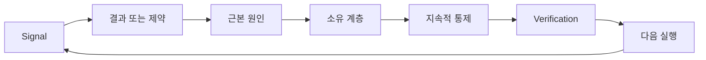

# 소유권과 은퇴 조건을 갖춘 피드백 래칫(Feedback Ratchet) 구축하기

> 출시(shipping)는 하나의 빌드 루프를 닫고 학습 루프를 엽니다. 증거가 시스템을 변경하지 않으면, 아무도 소유하지 않는 텔레메트리(telemetry)가 됩니다.

**유형:** Learn + Build
**언어:** Python (stdlib)
**선수 요건:** 14단계 46강 및 53강
**시간:** 약 75분

## 학습 목표

- 인시던트, 평가, 사용자 행동, 교정을 소유된 행동으로 전환하세요.
- 각 신호를 컨텍스트, 평가, 정책, 런타임, 백로그로 라우팅하세요.
- 심각도와 빈도에 따라 재발 우선순위를 정하세요.
- 모든 통제에 은퇴 조건을 부여하세요.

## 피드백은 인프라입니다

팀은 추적(trace), 평가, 지원 티켓, 인시던트 로그를 수집하되 그중 아무것도로부터 학습하지 않을 수 있습니다. 누락된 메커니즘은 승격(promotion)입니다: 관찰에서 소유자와 증거를 갖춘 지속적 변경으로 이어지는 정의된 경로가 필요합니다.

루프는 다음과 같습니다:

1. 구체적인 신호를 관찰합니다;
2. 그 신호를 결과, 제약, 또는 가정에 연결합니다;
3. 원인을 소유하는 가장 이른 시스템 계층을 식별합니다;
4. 범위가 한정된 변경을 생성합니다;
5. 재발 가능성이 낮아지는지 검증합니다;
6. 통제를 유지해야 하는지 검토합니다.

## 소유 계층으로 라우팅하기

| 신호 | 목적지 |
|---|---|
| 오탐(false positive), 회귀(regression), 잘못된 결과 | 평가 또는 테스트 |
| 누락된 컨텍스트, 중복 작업, 오래된 사실 | 컨텍스트 소스 또는 검색 경로 |
| 안전하지 않은 행동 또는 권한 공백 | 정책 또는 권한 경계 |
| 타임아웃, 재시도 폭풍, 사용 불가능한 의존성 | 런타임 통제 |
| 새로운 제품 요구사항 또는 해결되지 않은 트레이드오프 | 구체화된 백로그 항목 |

가장 효과적인 계층에서 원인을 수정하세요. 테스트나 권한 설정으로 실패를 불가능하게 만들 수 있는데 프롬프트 단락을 추가하지 마세요.



## 소유권은 통제의 일부입니다

모든 래칫(ratchet) 작업에는 다음이 필요합니다:

- 한 명의 소유자;
- 결과와 재발 빈도에 기반한 우선순위;
- 변경할 산출물;
- 변경을 증명하는 검증;
- 검토 또는 만료 기간;
- 은퇴 조건.

소유자가 없는 개선은 형식만 개선된 관찰일 뿐입니다.

## 오래된 통제 은퇴하기

피드백 시스템은 정책이 누적됩니다. 이 정책은 모순되고 비용이 많이 들 수 있습니다. 다음 경우 통제를 검토하세요:

- 아키텍처나 워크플로우가 변경될 때;
- 하위 수준 불변 조건이 상위 수준 지시를 대체할 때;
- 선택한 기간 동안 보호된 실패가 나타나지 않았을 때;
- 통제가 해를 방지하는 것보다 합법적인 작업을 더 자주 차단할 때.

은퇴에도 증거가 필요합니다. 오래된 것 같다고 해서 통제를 삭제하지 마세요.

## 빌드 및 코딩 에이전트 피드백 연결하기

동일한 래칫이 두 트랙 모두에 적용됩니다:

- 제품 증거는 결과 프레임, 가정, 슬라이스(slice), 또는 측정 계획을 변경합니다.
- 코딩 에이전트 수정은 테스트, 컨텍스트, 범위, 자동화, 또는 핸드오프(handoff)를 변경합니다.
- 인시던트(incident)는 제품 경계와 에이전트 작업대 모두를 변경할 수 있습니다.

이 때문에 빌드 형상화(shaping)는 코딩 전에 끝나는 단계가 아닙니다. 모든 승인된 변경을 통해 계속됩니다.

## 구현하기

랩(lab)은 신호를 분류하고, 소유된 래칫 작업을 생성하며, 우선순위를 정하고, `outputs/feedback-backlog.json`를 작성합니다.

```bash
python3 code/main.py
python3 -m unittest discover code/tests -v
```

런타임 시간 초과(time-out) 신호를 추가하고, 일반 백로그(backlog)가 아닌 런타임으로 라우팅되는지 확인하세요.

## 연습 문제

1. 인시던트 하나와 사용자 불만 한 건을 래칫 작업으로 전환하세요.
2. 각 재발을 방지할 수 있는 가장 초기 계층을 지정하세요.
3. 랩 출력에 검증 명령이나 관찰을 추가하세요.
4. 정책 규칙에 대한 은퇴 조건을 정의하세요.
5. 승인된 수정 하나를 다음 작업 프레임으로 추적하세요.

## 추가 읽기

- [Basili, Caldiera, and Rombach, The Goal Question Metric Approach](https://www.cs.toronto.edu/~sme/CSC444F/handouts/GQM-paper.pdf), 목표 지향적 측정을 통한 조직 학습을 위해.
- [Fagerholm et al., Building Blocks for Continuous Experimentation](https://doi.org/10.1145/2601248.2601276), 증거를 지속적인 제품 개발과 연결하는 기술 및 조직 루프를 위해.
- [Nuseibeh and Easterbrook, Requirements Engineering: A Roadmap](https://www.cs.toronto.edu/~sme/papers/2000/ICSE2000.pdf), 요구사항을 시스템 수명 주기 동안 진화하는 것으로 취급하기 위해.

## 보유하는 것

`outputs/feedback-backlog.json`을 유지하세요. 이는 제품 판단 및 전달 경로에서 마무리 산출물이며, 다음 결과 프레임의 입력입니다.
