# 통신 프로토콜

> 같은 언어를 구사하지 못하는 에이전트(Agent)는 팀이 아닙니다. 허공에 소리를 지르는 낯선 사람들일 뿐입니다.

**유형:** Build
**언어:** TypeScript
**선수 요건:** 14단계 (에이전트 엔지니어링), 16.01강 (멀티 에이전트 이유)
**시간:** 약 120분

## 학습 목표

- 외부 서버가 노출한 도구를 에이전트(Agent)가 사용할 수 있도록 MCP 도구 발견 및 호출을 구현해 보세요
- HTTP를 통해 한 에이전트(Agent)가 다른 에이전트(Agent)에게 작업을 위임(Delegation)할 수 있도록 A2A 에이전트 카드 및 작업 엔드포인트를 구축해 보세요
- MCP (도구 접근), A2A (에이전트 간), ACP (엔터프라이즈 감사), ANP (분산 신뢰)를 비교하고, 각 프로토콜이 어떤 문제를 해결하는지 설명해 보세요
- 에이전트(Agent)가 MCP로 도구를 발견하고 A2A로 작업을 위임(Delegation)하는 단일 시스템에 여러 프로토콜을 연결해 보세요

## 문제점

시스템을 여러 에이전트(Agent)로 분리했습니다. 연구자, 코더, 리뷰어. 각자의 역할은 훌륭합니다. 하지만 이제 서로 실제로 대화해야 합니다.

첫 번째 시도는 명확합니다. 문자열을 서로 전달하는 것이죠. 연구자가 텍스트 덩어리를 반환하면, 코더가 할 수 있는 대로 파싱합니다. 코더가 연구 요약본을 오해하거나, 두 에이전트(Agent)가 서로를 기다리며 데드락에 빠지거나, 다른 팀이 만든 에이전트(Agent)들이 협력해야 할 때 문제가 생깁니다. 갑자기 "그냥 문자열을 전달하는 것"이 무너집니다.

이것이 통신 프로토콜 문제입니다. 에이전트(Agent)가 정보를 교환하는 방식에 대한 공유된 계약이 없으면, 멀티 에이전트 시스템은 취약하고, 감사할 수 없으며, 직접 작성한 몇몇 에이전트(Agent)를 넘어서 확장하는 것이 불가능합니다.

AI 생태계는 문제의 각 부분을 해결하는 네 가지 프로토콜로 대응했습니다:

- **MCP**는 도구 접근용
- **A2A**는 에이전트 간 협력용
- **ACP**는 엔터프라이즈 감사 가능성용
- **ANP**는 분산 신원 및 신뢰용

이 강의는 깊게 다룹니다. 각 사양의 실제 와이어 형식을 읽고, 작동하는 구현을 구축하며, 네 가지를 통합된 시스템으로 연결합니다.

## 개념

### 프로토콜 현황

이 네 가지 프로토콜을 계층으로 생각해 보세요. 각 계층은 서로 다른 질문에 답합니다:

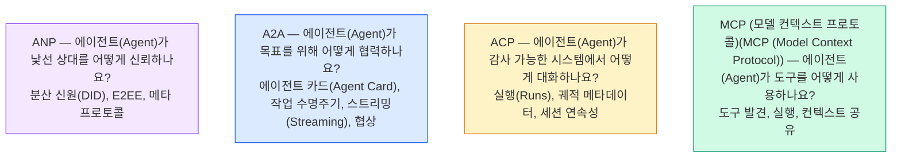

이들은 경쟁 관계가 아닙니다. 서로 다른 수준에서 서로 다른 문제를 해결합니다.

### MCP (모델 컨텍스트 프로토콜)(MCP (Model Context Protocol)) (요약)

MCP (모델 컨텍스트 프로토콜)(MCP (Model Context Protocol))는 13단계에서 상세히 다루고 있습니다. 간단히 요약하면, MCP는 LLM (대규모 언어 모델)(LLM (Large Language Model))이 외부 도구 및 데이터 소스에 연결하는 방식을 표준화합니다. 이는 에이전트(Agent)(클라이언트)가 서버가 노출한 도구를 발견하고 호출하는 **클라이언트-서버** 프로토콜입니다.

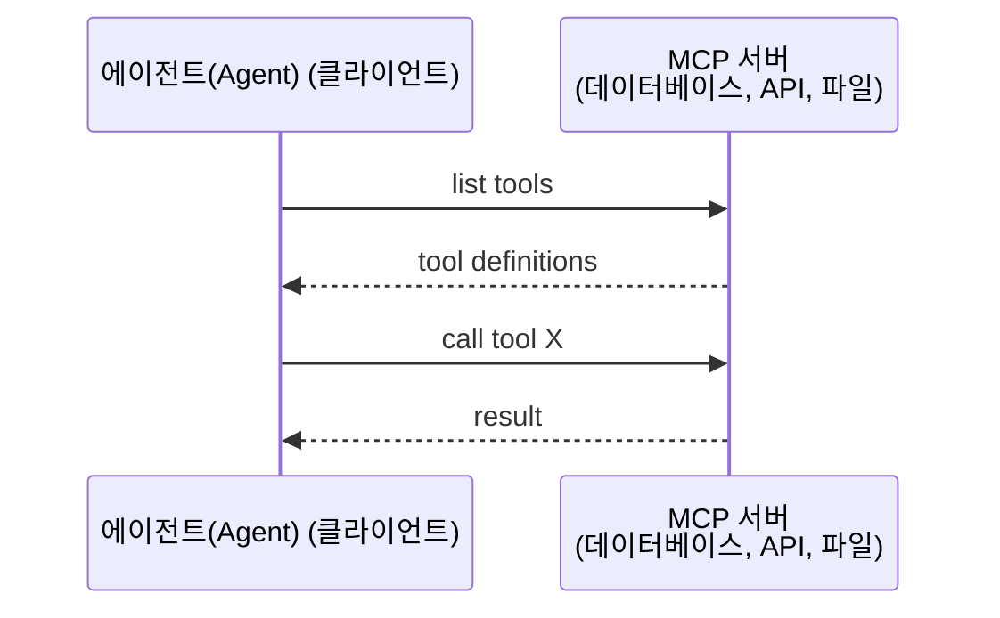

MCP는 **에이전트(Agent)-도구 간** 통신입니다. 에이전트(Agent)끼리 대화하는 데는 도움이 되지 않습니다.

### A2A (에이전트 간 프로토콜)(A2A (Agent2Agent Protocol))

**개발 주체:** Google (현재 Linux Foundation 산하 `lf.a2a.v1`)
**명세 버전:** 1.0.1
**문제점:** 자율 에이전트(Agent)가 서로 협력하고, 협상하며, 작업을 위임(Delegation)하려면 어떻게 해야 할까요?

A2A는 **피어 투 피어 에이전트(Agent) 협력**을 위한 프로토콜입니다. MCP가 에이전트(Agent)를 도구에 연결한다면, A2A는 에이전트(Agent)를 다른 에이전트(Agent)에 연결합니다. 각 에이전트(Agent)는 잘 알려진 URL에 **에이전트 카드(Agent Card)**를 게시하며, 다른 에이전트(Agent)는 이를 발견하고, 협상하며, 작업을 위임(Delegation)합니다.

#### A2A 작동 방식

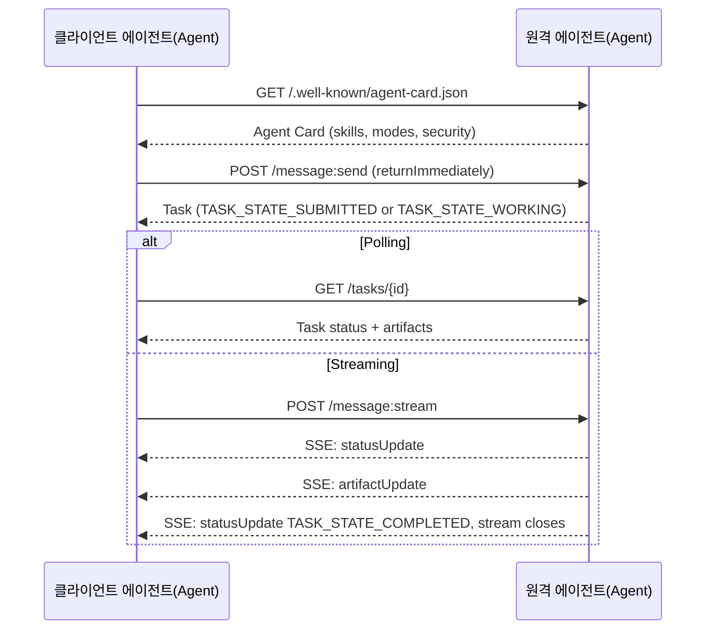

#### 실제 에이전트 카드(Agent Card)

실제 환경에서 A2A 에이전트 카드(Agent Card)가 어떻게 생겼는지 보여줍니다. `GET /.well-known/agent-card.json`에서 제공됩니다:

```json
{
  "name": "Research Agent",
  "description": "Searches documentation and summarizes findings",
  "version": "1.0.0",
  "supportedInterfaces": [
    {
      "url": "https://research-agent.example.com/a2a/v1",
      "protocolBinding": "JSONRPC",
      "protocolVersion": "1.0"
    },
    {
      "url": "https://research-agent.example.com/a2a/rest",
      "protocolBinding": "HTTP+JSON",
      "protocolVersion": "1.0"
    }
  ],
  "provider": {
    "organization": "Your Company",
    "url": "https://example.com"
  },
  "capabilities": {
    "streaming": true,
    "pushNotifications": false
  },
  "defaultInputModes": ["text/plain", "application/json"],
  "defaultOutputModes": ["text/plain", "application/json"],
  "skills": [
    {
      "id": "web-research",
      "name": "Web Research",
      "description": "Searches the web and synthesizes findings",
      "tags": ["research", "search", "summarization"],
      "examples": ["Research the latest changes in React 19"]
    },
    {
      "id": "doc-analysis",
      "name": "Documentation Analysis",
      "description": "Reads and analyzes technical documentation",
      "tags": ["docs", "analysis"],
      "inputModes": ["text/plain", "application/pdf"],
      "outputModes": ["application/json"]
    }
  ],
  "securitySchemes": {
    "bearer": {
      "httpAuthSecurityScheme": {
        "scheme": "Bearer",
        "bearerFormat": "JWT"
      }
    }
  },
  "securityRequirements": [{ "schemes": { "bearer": { "list": [] } } }]
}
```

주목해야 할 핵심 포인트는 다음과 같습니다:
- **스킬(Skill)**은 에이전트(Agent)가 할 수 있는 작업입니다. 각 스킬은 ID, 태그 및 지원되는 입력/출력 MIME 유형을 가집니다. 클라이언트 에이전트(Agent)는 이를 통해 원격 에이전트(Agent)가 요청을 처리할 수 있는지 결정합니다.
- **supportedInterfaces**는 여러 프로토콜 바인딩을 나열합니다. 단일 에이전트(Agent)는 JSON-RPC, REST, gRPC를 동시에 사용할 수 있습니다.
- **보안**은 카드에 내장되어 있습니다: `securitySchemes`이 각 스키마를 명시하고 `securityRequirements`이 적용되는 스키마를 알려줍니다. 클라이언트는 단일 요청을 보내기 전에 필요한 인증이 무엇인지 파악할 수 있습니다.

#### 작업 생명주기

작업은 A2A의 핵심 작업 단위입니다. 정의된 상태들을 거치며 진행됩니다 (다이어그램은 모든 상태가 전송 시 포함하는 `TASK_STATE_` 접두사를 생략했습니다):

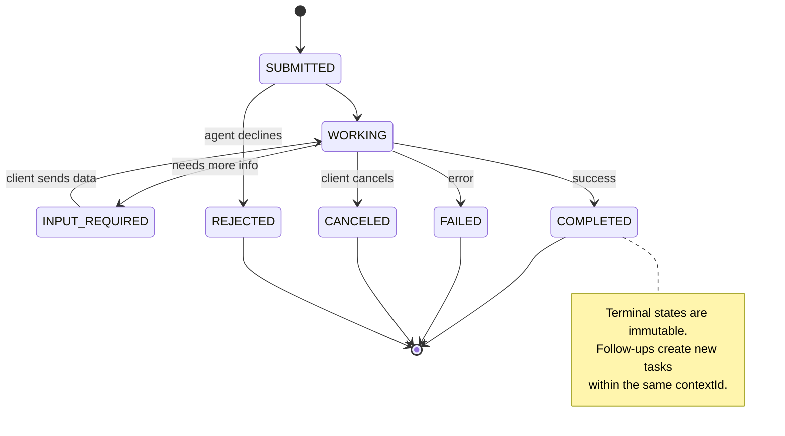

8개의 모든 상태 (스펙은 `UNSPECIFIED`를 센티널로 정의하지만, 여기서는 생략했습니다):

| 상태 | 종결 여부 | 의미 |
|---|---|---|
| `TASK_STATE_SUBMITTED` | 아니오 | 승인됨, 아직 처리되지 않음 |
| `TASK_STATE_WORKING` | 아니오 | 활발히 처리 중 |
| `TASK_STATE_INPUT_REQUIRED` | 아니오 | 에이전트가 클라이언트로부터 추가 정보가 필요함 |
| `TASK_STATE_AUTH_REQUIRED` | 아니오 | 인증이 필요함 |
| `TASK_STATE_COMPLETED` | 예 | 성공적으로 완료됨 |
| `TASK_STATE_FAILED` | 예 | 오류로 완료됨 |
| `TASK_STATE_CANCELED` | 예 | 완료 전에 취소됨 |
| `TASK_STATE_REJECTED` | 예 | 에이전트가 작업을 거절함 |

작업이 종결 상태에 도달하면 변경이 불가능합니다. 추가 메시지는 없습니다. 후속 작업은 동일한 `contextId` 내에서 새로운 작업을 생성합니다.

#### 전송 형식

A2A는 JSON-RPC 2.0을 사용합니다. 실제 메시지 교환은 다음과 같습니다:

**클라이언트가 메시지를 전송합니다:**
```json
{
  "jsonrpc": "2.0",
  "id": 1,
  "method": "SendMessage",
  "params": {
    "message": {
      "messageId": "msg-001",
      "role": "ROLE_USER",
      "parts": [{ "text": "Research React 19 compiler features" }]
    },
    "configuration": {
      "acceptedOutputModes": ["text/plain", "application/json"],
      "historyLength": 10
    }
  }
}
```

**에이전트가 작업으로 응답합니다:**
```json
{
  "jsonrpc": "2.0",
  "id": 1,
  "result": {
    "task": {
      "id": "task-abc-123",
      "contextId": "ctx-xyz-789",
      "status": {
        "state": "TASK_STATE_COMPLETED",
        "timestamp": "2026-03-27T10:30:00Z"
      },
      "artifacts": [
        {
          "artifactId": "art-001",
          "name": "research-results",
          "parts": [{
            "data": {
              "findings": [
                "React 19 compiler auto-memoizes components",
                "No more manual useMemo/useCallback needed",
                "Compiler runs at build time, not runtime"
              ]
            },
            "mediaType": "application/json"
          }]
        }
      ]
    }
  }
}
```

**SSE를 통한 스트리밍:**
```text
POST /message:stream HTTP/1.1
Content-Type: application/a2a+json
A2A-Version: 1.0

data: {"task":{"id":"task-123","contextId":"ctx-123","status":{"state":"TASK_STATE_WORKING"}}}

data: {"statusUpdate":{"taskId":"task-123","contextId":"ctx-123","status":{"state":"TASK_STATE_WORKING","message":{"messageId":"msg-002","role":"ROLE_AGENT","parts":[{"text":"Searching documentation..."}]}}}}

data: {"artifactUpdate":{"taskId":"task-123","contextId":"ctx-123","artifact":{"artifactId":"art-1","parts":[{"text":"partial findings..."}]},"append":true,"lastChunk":false}}

data: {"statusUpdate":{"taskId":"task-123","contextId":"ctx-123","status":{"state":"TASK_STATE_COMPLETED"}}}
```

### ACP (에이전트 통신 프로토콜)(Agent Communication Protocol)

**개발 주체:** IBM / BeeAI
**스펙 버전:** 0.2.0 (OpenAPI 3.1.1)
**상태:** Linux Foundation 산하에서 A2A와 병합 중
**문제점:** 에이전트가 완전한 감사 가능성, 세션 연속성, 궤적 추적과 함께 통신하려면 어떻게 해야 할까요?

ACP는 **엔터프라이즈 프로토콜**입니다. 많은 요약이 주장하는 것과 달리, ACP는 JSON-LD를 **사용하지 않습니다**. OpenAPI로 정의된 단순한 REST/JSON API입니다. ACP를 특별하게 만드는 것은 **궤적 메타데이터(TrajectoryMetadata)**입니다. 모든 에이전트 응답은 이를 생성한 추론 단계와 도구 호출의 상세한 로그를 포함할 수 있습니다.

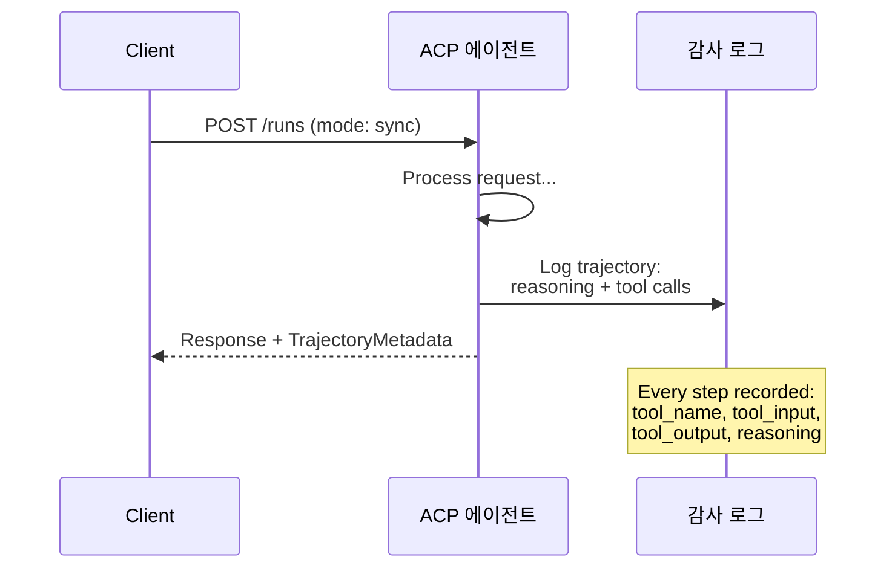

#### ACP에서의 에이전트 발견

ACP는 네 가지 발견 방법을 정의합니다:

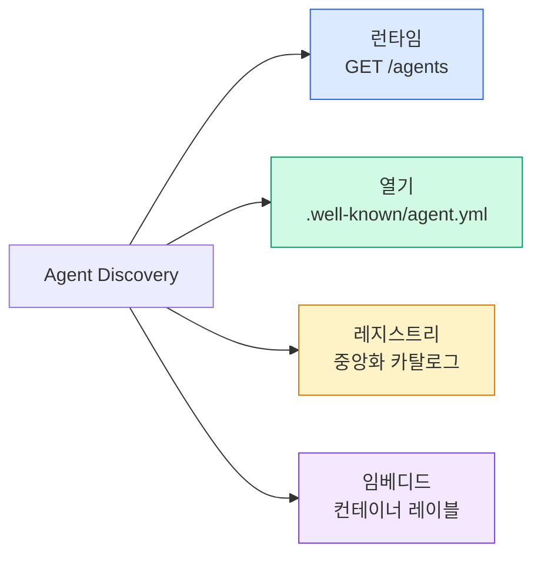

**AgentManifest**는 A2A의 Agent Card보다 단순합니다:

```json
{
  "name": "summarizer",
  "description": "Summarizes documents with source citations",
  "input_content_types": ["text/plain", "application/pdf"],
  "output_content_types": ["text/plain", "application/json"],
  "metadata": {
    "tags": ["summarization", "RAG"],
    "framework": "BeeAI",
    "capabilities": [
      {
        "name": "Document Summarization",
        "description": "Condenses long documents into key points"
      }
    ],
    "recommended_models": ["llama3.3:70b-instruct-fp16"],
    "license": "Apache-2.0",
    "programming_language": "Python"
  }
}
```

#### 실행 생명주기

ACP는 "Tasks" 대신 "Runs"를 사용합니다. Run은 세 가지 모드를 가진 에이전트 실행입니다:

| 모드 | 동작 |
|---|---|
| `sync` | 차단 모드. 응답에 완전한 결과가 포함됩니다. |
| `async` | 즉시 202를 반환합니다. `GET /runs/{id}`로 상태를 폴링하세요. |
| `stream` | SSE 스트림. 에이전트가 작업하는 동안 이벤트가 발생합니다. |

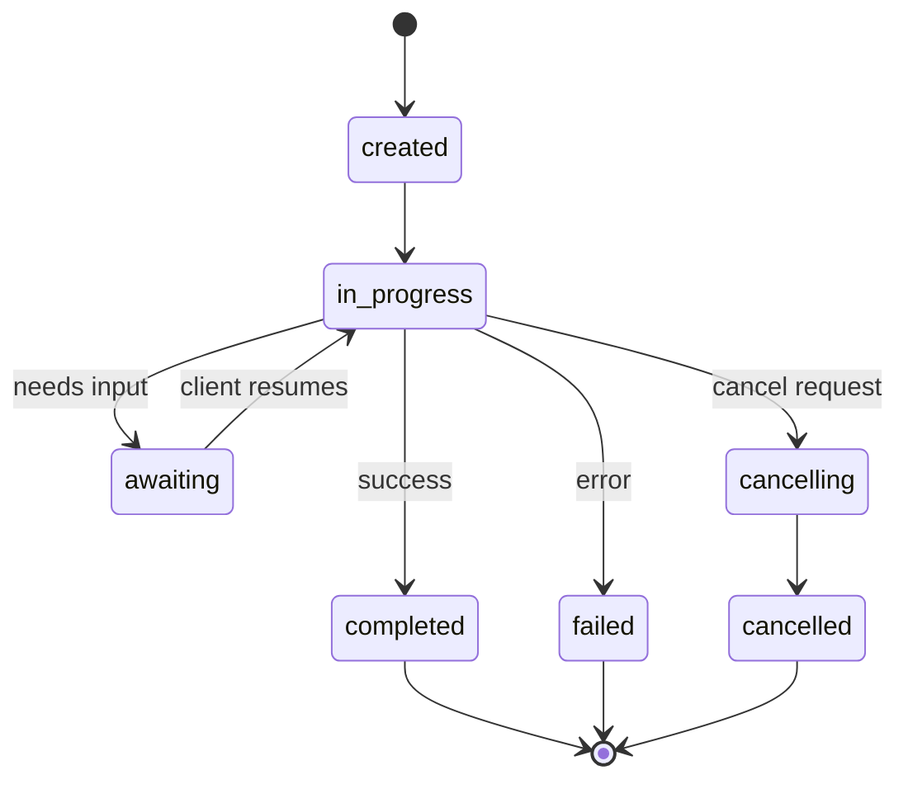

#### TrajectoryMetadata (감사 추적)

이것이 ACP의 핵심 차별점입니다. 모든 메시지 파트는 에이전트가 정확히 무엇을 했는지 보여주는 메타데이터를 포함할 수 있습니다:

```json
{
  "role": "agent/researcher",
  "parts": [
    {
      "content_type": "text/plain",
      "content": "The weather in San Francisco is 72F and sunny.",
      "metadata": {
        "kind": "trajectory",
        "message": "I need to check the weather for this location",
        "tool_name": "weather_api",
        "tool_input": { "location": "San Francisco, CA" },
        "tool_output": { "temperature": 72, "condition": "sunny" }
      }
    }
  ]
}
```

규제 산업에서는 이것이 금입니다. 모든 답변은 증명 가능한 추론 체인을 포함합니다: 어떤 도구가 호출되었는지, 어떤 입력이 사용되었는지, 어떤 출력이 수신되었는지. 블랙 박스가 없습니다.

ACP는 출처 표기를 위한 **CitationMetadata**도 지원합니다:

```json
{
  "kind": "citation",
  "start_index": 0,
  "end_index": 47,
  "url": "https://weather.gov/sf",
  "title": "NWS San Francisco Forecast"
}
```

### ANP (에이전트 네트워크 프로토콜)

**작성자:** 오픈소스 커뮤니티 (GaoWei Chang이 창립)
**저장소:** [github.com/agent-network-protocol/AgentNetworkProtocol](https://github.com/agent-network-protocol/AgentNetworkProtocol)
**문제:** 중앙 기관 없이 서로 다른 조직의 에이전트들이 어떻게 서로를 신뢰할 수 있을까요?

ANP는 **분산된 신원 프로토콜**입니다. W3C 분산 식별자(DID)와 종단 간 암호화를 사용하여 신뢰를 구축합니다. 알려진 엔드포인트를 통해 에이전트를 발견하는 A2A와 달리, ANP는 에이전트가 암호화 방식으로 신원을 증명할 수 있게 합니다.

ANP는 세 가지 계층을 가집니다:

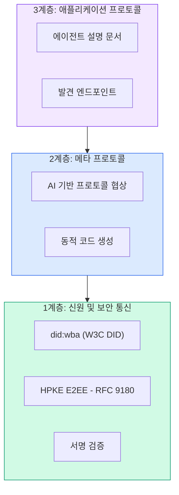

#### DID 문서 (실제 구조)

ANP는 `did:wba` (웹 기반 에이전트)라고 불리는 커스텀 DID 메서드를 사용합니다. DID `did:wba:example.com:user:alice`는 `https://example.com/user/alice/did.json`로 해석됩니다:

```json
{
  "@context": [
    "https://www.w3.org/ns/did/v1",
    "https://w3id.org/security/suites/jws-2020/v1",
    "https://w3id.org/security/suites/secp256k1-2019/v1"
  ],
  "id": "did:wba:example.com:user:alice",
  "verificationMethod": [
    {
      "id": "did:wba:example.com:user:alice#key-1",
      "type": "EcdsaSecp256k1VerificationKey2019",
      "controller": "did:wba:example.com:user:alice",
      "publicKeyJwk": {
        "crv": "secp256k1",
        "x": "NtngWpJUr-rlNNbs0u-Aa8e16OwSJu6UiFf0Rdo1oJ4",
        "y": "qN1jKupJlFsPFc1UkWinqljv4YE0mq_Ickwnjgasvmo",
        "kty": "EC"
      }
    },
    {
      "id": "did:wba:example.com:user:alice#key-x25519-1",
      "type": "X25519KeyAgreementKey2019",
      "controller": "did:wba:example.com:user:alice",
      "publicKeyMultibase": "z9hFgmPVfmBZwRvFEyniQDBkz9LmV7gDEqytWyGZLmDXE"
    }
  ],
  "authentication": [
    "did:wba:example.com:user:alice#key-1"
  ],
  "keyAgreement": [
    "did:wba:example.com:user:alice#key-x25519-1"
  ],
  "humanAuthorization": [
    "did:wba:example.com:user:alice#key-1"
  ],
  "service": [
    {
      "id": "did:wba:example.com:user:alice#agent-description",
      "type": "AgentDescription",
      "serviceEndpoint": "https://example.com/agents/alice/ad.json"
    }
  ]
}
```

주목해야 할 주요 사항:
- **키 분리**가 강제됩니다. 서명 키(secp256k1)는 암호화 키(X25519)와 분리되어 있습니다.
- **`humanAuthorization`**는 ANP에 고유합니다. 이 키는 사용 전에 명시적인 인간 승인(생체 인식, 비밀번호, HSM)이 필요합니다. 자금 이체와 같은 고위험 작업은 이 경로를 거칩니다.
- **`keyAgreement`** 키는 HPKE 종단 간 암호화(RFC 9180)에 사용됩니다.
- **서비스** 섹션은 에이전트 설명 문서로 연결됩니다.

#### ANP에서 신뢰가 작동하는 방식

ANP는 웹 오브 트러스트(web-of-trust)나 추천 그래프를 **사용하지 않습니다**. 신뢰는 양자간(bilateral)이며 상호작용마다 검증됩니다:

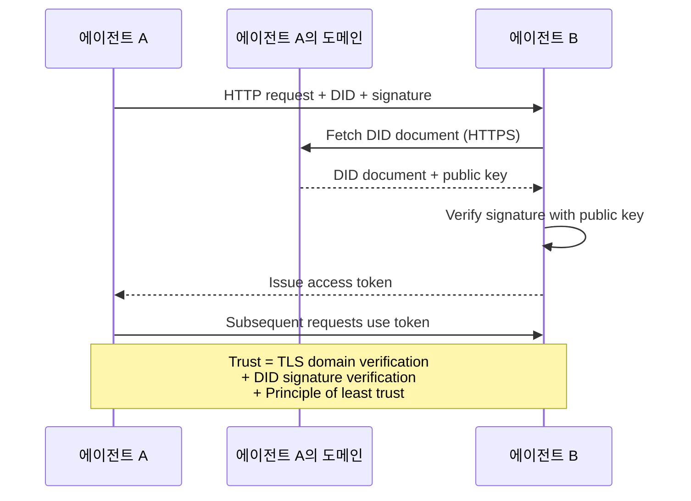

신뢰는 세 가지 출처에서 나옵니다:
1. **도메인 수준 TLS**는 DID 문서 호스트를 검증합니다
2. **DID 암호화 서명**은 에이전트의 신원을 검증합니다
3. **최소 신뢰 원칙**은 최소한의 권한만 부여합니다

가십 기반 신뢰 전파나 PageRank 점수 매기기는 없습니다. 각 에이전트를 DID를 통해 직접 검증합니다.

#### 메타 프로토콜 협상

이것은 ANP의 가장 새로운 기능입니다. 서로 다른 생태계의 두 에이전트가 만나면 사전에 합의된 데이터 형식이 필요하지 않습니다. 자연어로 협상합니다:

```json
{
  "action": "protocolNegotiation",
  "sequenceId": 0,
  "candidateProtocols": "I can communicate using:\n1. JSON-RPC with hotel booking schema\n2. REST with OpenAPI 3.1 spec\n3. Natural language over HTTP",
  "modificationSummary": "Initial proposal",
  "status": "negotiating"
}
```

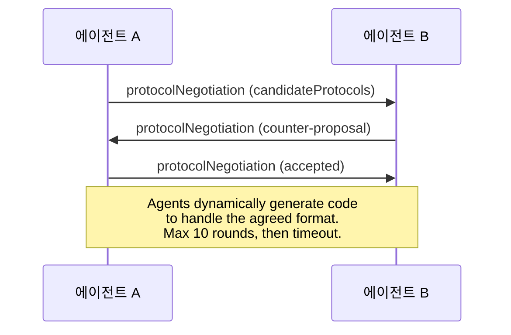

에이전트들은 형식에 합의할 때까지 왕복합니다(최대 10 라운드). 이후 형식을 처리하기 위해 코드를 동적으로 생성합니다. 상태 값: `negotiating`, `rejected`, `accepted`, `timeout`.

이것은 서로를 본 적이 없는 두 에이전트가 공유 스키마를 사전에 정의하지 않아도 통신 방법을 파악할 수 있음을 의미합니다.

### 비교 (수정됨)

| | MCP | A2A | ACP | ANP |
|---|---|---|---|---|
| **만든 주체** | Anthropic | Google / Linux Foundation | IBM / BeeAI | 커뮤니티 |
| **사양 형식** | JSON-RPC | JSON-RPC / REST / gRPC | OpenAPI 3.1 (REST) | JSON-RPC |
| **주요 용도** | 에이전트에서 도구로 | 에이전트에서 에이전트로 | 에이전트에서 에이전트로 | 에이전트에서 에이전트로 |
| **발견** | 도구 목록 | `/.well-known/agent-card.json` | `GET /agents`, `/.well-known/agent.yml` | `/.well-known/agent-descriptions`, DID 서비스 엔드포인트 |
| **신원** | 암시적 (로컬) | 보안 스킴 (OAuth, mTLS) | 서버 수준 | W3C DID (`did:wba`) 및 E2EE |
| **감사 추적** | N/A | 기본 (작업 기록) | TrajectoryMetadata (도구 호출, 추론) | 공식적으로 지정되지 않음 |
| **상태 머신** | N/A | 9개 작업 상태 | 7개 실행 상태 | N/A |
| **스트리밍** | N/A | SSE | SSE | 전송 방식에 독립적 |
| **독특한 기능** | 도구 스키마 | 에이전트 카드 + 스킬 | 궤적 감사 추적 | 메타 프로토콜 협상 |
| **최적 용도** | 도구 및 데이터 | 동적 협업 | 규제 산업 | 조직 간 신뢰 |
| **상태** | 안정적 | 안정적 (v1.0) | A2A로 병합 중 | 활발한 개발 중 |

### 함께 작동하는 방식

이 프로토콜들은 상호 배타적이지 않습니다. 현실적인 기업 시스템은 여러 프로토콜을 사용합니다:

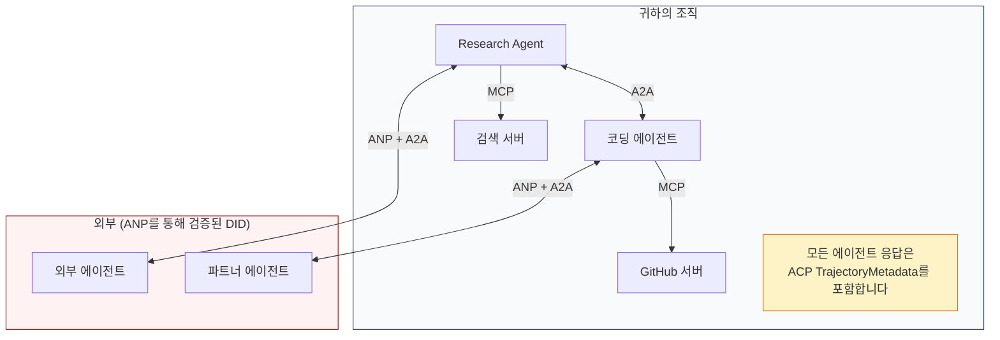

- **MCP**는 각 에이전트를 도구에 연결합니다
- **A2A**는 에이전트 간 (내부 및 외부) 협업을 처리합니다
- **ACP**는 감사 가능성을 위해 응답을 궤적 메타데이터로 감쌉니다
- **ANP**는 귀하가 제어하지 않는 에이전트에 대한 신원 검증을 제공합니다

```figure
swarm-message-bus
```

## 구현하기

### 1단계: 핵심 메시지 유형

모든 다중 에이전트 시스템은 메시지 형식으로 시작합니다. 실제 프로토콜이 사용하는 것과 매핑되는 유형을 정의합니다:

```typescript
import crypto from "node:crypto";

type MessageRole = "ROLE_USER" | "ROLE_AGENT";

type MessagePart =
  | { text: string }
  | { data: unknown; mediaType: string }
  | { url: string; filename: string; mediaType: string };

type TrajectoryEntry = {
  reasoning: string;
  toolName?: string;
  toolInput?: unknown;
  toolOutput?: unknown;
  timestamp: number;
};

type AgentMessage = {
  id: string;
  role: MessageRole;
  parts: MessagePart[];
  trajectory?: TrajectoryEntry[];
  replyTo?: string;
  timestamp: number;
};

function createMessage(
  role: MessageRole,
  parts: MessagePart[],
  replyTo?: string
): AgentMessage {
  return {
    id: crypto.randomUUID(),
    role,
    parts,
    replyTo,
    timestamp: Date.now(),
  };
}

function textMessage(role: MessageRole, text: string): AgentMessage {
  return createMessage(role, [{ text }]);
}
```

참고: `MessagePart`는 실제 A2A 및 ACP 사양과 마찬가지로 멀티모달 (텍스트, 구조화된 데이터, 파일)입니다. A2A 1.00강 마찬가지로, 존재하는 필드 (`text`, `data` 또는 `url`)는 해당 부분이 무엇인지 나타내며, `kind` 태그는 없습니다. `TrajectoryEntry`는 ACP의 TrajectoryMetadata와 일치하는 추론 체인을 캡처합니다.

### 2단계: A2A 에이전트 카드 및 레지스트리

실제 A2A 사양과 일치하는 에이전트 발견을 구축합니다:

```typescript
type Skill = {
  id: string;
  name: string;
  description: string;
  tags: string[];
  inputModes: string[];
  outputModes: string[];
};

type AgentInterface = {
  url: string;
  protocolBinding: string;
  protocolVersion: string;
};

type AgentCard = {
  name: string;
  description: string;
  version: string;
  supportedInterfaces: AgentInterface[];
  capabilities: {
    streaming: boolean;
    pushNotifications: boolean;
  };
  defaultInputModes: string[];
  defaultOutputModes: string[];
  skills: Skill[];
};

class AgentRegistry {
  private cards: Map<string, AgentCard> = new Map();

  register(card: AgentCard) {
    this.cards.set(card.name, card);
  }

  discoverBySkillTag(tag: string): AgentCard[] {
    return [...this.cards.values()].filter((card) =>
      card.skills.some((skill) => skill.tags.includes(tag))
    );
  }

  discoverByInputMode(mimeType: string): AgentCard[] {
    return [...this.cards.values()].filter(
      (card) =>
        card.defaultInputModes.includes(mimeType) ||
        card.skills.some((skill) => skill.inputModes.includes(mimeType))
    );
  }

  resolve(name: string): AgentCard | undefined {
    return this.cards.get(name);
  }

  listAll(): AgentCard[] {
    return [...this.cards.values()];
  }
}
```

이것은 단순한 이름-기능 매핑보다 훨씬 풍부합니다. 실제 A2A 사양이 지원하는 것처럼, 스킬 태그, 입력 MIME 유형, 이름으로 에이전트를 검색할 수 있습니다.

### 3단계: A2A 작업 생명주기

전체 작업 상태 머신을 구축합니다:

```typescript
type TaskState =
  | "TASK_STATE_SUBMITTED"
  | "TASK_STATE_WORKING"
  | "TASK_STATE_INPUT_REQUIRED"
  | "TASK_STATE_AUTH_REQUIRED"
  | "TASK_STATE_COMPLETED"
  | "TASK_STATE_FAILED"
  | "TASK_STATE_CANCELED"
  | "TASK_STATE_REJECTED";

const TERMINAL_STATES: TaskState[] = [
  "TASK_STATE_COMPLETED",
  "TASK_STATE_FAILED",
  "TASK_STATE_CANCELED",
  "TASK_STATE_REJECTED",
];

type TaskStatus = {
  state: TaskState;
  message?: AgentMessage;
  timestamp: number;
};

type Artifact = {
  id: string;
  name: string;
  parts: MessagePart[];
};

type Task = {
  id: string;
  contextId: string;
  status: TaskStatus;
  artifacts: Artifact[];
  history: AgentMessage[];
};

type TaskEvent =
  | { statusUpdate: { taskId: string; status: TaskStatus } }
  | {
      artifactUpdate: {
        taskId: string;
        artifact: Artifact;
        append: boolean;
        lastChunk: boolean;
      };
    };

type TaskHandler = (
  task: Task,
  message: AgentMessage
) => AsyncGenerator<TaskEvent>;

class TaskManager {
  private tasks: Map<string, Task> = new Map();
  private handlers: Map<string, TaskHandler> = new Map();
  private listeners: Map<string, ((event: TaskEvent) => void)[]> = new Map();

  registerHandler(agentName: string, handler: TaskHandler) {
    this.handlers.set(agentName, handler);
  }

  subscribe(taskId: string, listener: (event: TaskEvent) => void) {
    const existing = this.listeners.get(taskId) ?? [];
    existing.push(listener);
    this.listeners.set(taskId, existing);
  }

  async sendMessage(
    agentName: string,
    message: AgentMessage,
    contextId?: string
  ): Promise<Task> {
    const handler = this.handlers.get(agentName);
    if (!handler) {
      const task = this.createTask(contextId);
      task.status = {
        state: "TASK_STATE_REJECTED",
        timestamp: Date.now(),
        message: textMessage("ROLE_AGENT", `No handler for ${agentName}`),
      };
      return task;
    }

    const task = this.createTask(contextId);
    task.history.push(message);
    task.status = { state: "TASK_STATE_SUBMITTED", timestamp: Date.now() };

    this.processTask(task, handler, message).catch((err) => {
      task.status = {
        state: "TASK_STATE_FAILED",
        timestamp: Date.now(),
        message: textMessage("ROLE_AGENT", String(err)),
      };
    });
    return task;
  }

  getTask(taskId: string): Task | undefined {
    return this.tasks.get(taskId);
  }

  cancelTask(taskId: string): boolean {
    const task = this.tasks.get(taskId);
    if (!task || TERMINAL_STATES.includes(task.status.state)) return false;
    task.status = { state: "TASK_STATE_CANCELED", timestamp: Date.now() };
    this.emit(taskId, {
      statusUpdate: { taskId, status: task.status },
    });
    return true;
  }

  private createTask(contextId?: string): Task {
    const task: Task = {
      id: crypto.randomUUID(),
      contextId: contextId ?? crypto.randomUUID(),
      status: { state: "TASK_STATE_SUBMITTED", timestamp: Date.now() },
      artifacts: [],
      history: [],
    };
    this.tasks.set(task.id, task);
    return task;
  }

  private async processTask(
    task: Task,
    handler: TaskHandler,
    message: AgentMessage
  ) {
    task.status = { state: "TASK_STATE_WORKING", timestamp: Date.now() };
    this.emit(task.id, {
      statusUpdate: { taskId: task.id, status: task.status },
    });

    try {
      for await (const event of handler(task, message)) {
        if (TERMINAL_STATES.includes(task.status.state)) break;

        if ("statusUpdate" in event) {
          task.status = event.statusUpdate.status;
        }
        if ("artifactUpdate" in event) {
          const update = event.artifactUpdate;
          const existing = task.artifacts.find(
            (a) => a.id === update.artifact.id
          );
          if (existing && update.append) {
            existing.parts.push(...update.artifact.parts);
          } else {
            task.artifacts.push(update.artifact);
          }
        }
        this.emit(task.id, event);
      }
    } catch (err) {
      task.status = {
        state: "TASK_STATE_FAILED",
        timestamp: Date.now(),
        message: textMessage("ROLE_AGENT", String(err)),
      };
      this.emit(task.id, {
        statusUpdate: { taskId: task.id, status: task.status },
      });
    }
  }

  private emit(taskId: string, event: TaskEvent) {
    for (const listener of this.listeners.get(taskId) ?? []) {
      listener(event);
    }
  }
}
```

이것은 실제 A2A 작업 생명주기를 구현합니다: `TASK_STATE_SUBMITTED`, `TASK_STATE_WORKING`, `TASK_STATE_INPUT_REQUIRED`, 그리고 최종 상태. 핸들러는 `statusUpdate` 및 `artifactUpdate` 이벤트를 생성하는 비동기 생성자이며, SSE 스트림이 전달하는 것과 동일한 래퍼입니다.

### 4단계: ACP 스타일 감사 추적

트래젝토리 추적을 통해 통신을 래핑합니다:

```typescript
type AuditEntry = {
  runId: string;
  agentName: string;
  input: AgentMessage[];
  output: AgentMessage[];
  trajectory: TrajectoryEntry[];
  status: "created" | "in-progress" | "completed" | "failed" | "awaiting";
  startedAt: number;
  completedAt?: number;
  sessionId?: string;
};

class AuditableRunner {
  private log: AuditEntry[] = [];
  private handlers: Map<
    string,
    (input: AgentMessage[]) => Promise<{
      output: AgentMessage[];
      trajectory: TrajectoryEntry[];
    }>
  > = new Map();

  registerAgent(
    name: string,
    handler: (input: AgentMessage[]) => Promise<{
      output: AgentMessage[];
      trajectory: TrajectoryEntry[];
    }>
  ) {
    this.handlers.set(name, handler);
  }

  async run(
    agentName: string,
    input: AgentMessage[],
    sessionId?: string
  ): Promise<AuditEntry> {
    const entry: AuditEntry = {
      runId: crypto.randomUUID(),
      agentName,
      input: structuredClone(input),
      output: [],
      trajectory: [],
      status: "created",
      startedAt: Date.now(),
      sessionId,
    };
    this.log.push(entry);

    const handler = this.handlers.get(agentName);
    if (!handler) {
      entry.status = "failed";
      return entry;
    }

    entry.status = "in-progress";
    try {
      const result = await handler(input);
      entry.output = structuredClone(result.output);
      entry.trajectory = structuredClone(result.trajectory);
      entry.status = "completed";
      entry.completedAt = Date.now();
    } catch (err) {
      entry.status = "failed";
      entry.trajectory.push({
        reasoning: `Error: ${String(err)}`,
        timestamp: Date.now(),
      });
      entry.completedAt = Date.now();
    }
    return entry;
  }

  getFullAuditLog(): AuditEntry[] {
    return structuredClone(this.log);
  }

  getAuditLogForAgent(agentName: string): AuditEntry[] {
    return structuredClone(
      this.log.filter((e) => e.agentName === agentName)
    );
  }

  getAuditLogForSession(sessionId: string): AuditEntry[] {
    return structuredClone(
      this.log.filter((e) => e.sessionId === sessionId)
    );
  }

  getTrajectoryForRun(runId: string): TrajectoryEntry[] {
    const entry = this.log.find((e) => e.runId === runId);
    return entry ? structuredClone(entry.trajectory) : [];
  }
}
```

모든 에이전트 실행은 완전한 감사 항목을 생성합니다: 입력 내용, 출력 내용, 그리고 그 사이의 도구 호출 및 추론 단계의 전체 트래젝토리. 에이전트, 세션, 개별 실행별로 쿼리할 수 있습니다.

### 5단계: ANP 스타일 신원 검증

DID 기반 신원 및 검증을 구축합니다:

```typescript
type VerificationMethod = {
  id: string;
  type: string;
  controller: string;
  publicKeyDer: string;
};

type DIDDocument = {
  id: string;
  verificationMethod: VerificationMethod[];
  authentication: string[];
  keyAgreement: string[];
  humanAuthorization: string[];
  service: { id: string; type: string; serviceEndpoint: string }[];
};

type AgentIdentity = {
  did: string;
  document: DIDDocument;
  privateKey: crypto.KeyObject;
  publicKey: crypto.KeyObject;
};

class IdentityRegistry {
  private documents: Map<string, DIDDocument> = new Map();

  publish(doc: DIDDocument) {
    this.documents.set(doc.id, doc);
  }

  resolve(did: string): DIDDocument | undefined {
    return this.documents.get(did);
  }

  verify(did: string, signature: string, payload: string): boolean {
    const doc = this.documents.get(did);
    if (!doc) return false;

    const authKeyIds = doc.authentication;
    const authKeys = doc.verificationMethod.filter((vm) =>
      authKeyIds.includes(vm.id)
    );

    for (const key of authKeys) {
      const publicKey = crypto.createPublicKey({
        key: Buffer.from(key.publicKeyDer, "base64"),
        format: "der",
        type: "spki",
      });
      const isValid = crypto.verify(
        null,
        Buffer.from(payload),
        publicKey,
        Buffer.from(signature, "hex")
      );
      if (isValid) return true;
    }
    return false;
  }

  requiresHumanAuth(did: string, operationKeyId: string): boolean {
    const doc = this.documents.get(did);
    if (!doc) return false;
    return doc.humanAuthorization.includes(operationKeyId);
  }
}

function createIdentity(domain: string, agentName: string): AgentIdentity {
  const did = `did:wba:${domain}:agent:${agentName}`;
  const { publicKey, privateKey } = crypto.generateKeyPairSync("ed25519");

  const publicKeyDer = publicKey
    .export({ format: "der", type: "spki" })
    .toString("base64");

  const keyId = `${did}#key-1`;
  const encKeyId = `${did}#key-x25519-1`;

  const document: DIDDocument = {
    id: did,
    verificationMethod: [
      {
        id: keyId,
        type: "Ed25519VerificationKey2020",
        controller: did,
        publicKeyDer,
      },
      {
        id: encKeyId,
        type: "X25519KeyAgreementKey2019",
        controller: did,
        publicKeyDer,
      },
    ],
    authentication: [keyId],
    keyAgreement: [encKeyId],
    humanAuthorization: [],
    service: [
      {
        id: `${did}#agent-description`,
        type: "AgentDescription",
        serviceEndpoint: `https://${domain}/agents/${agentName}/ad.json`,
      },
    ],
  };

  return { did, document, privateKey, publicKey };
}

function signPayload(identity: AgentIdentity, payload: string): string {
  return crypto
    .sign(null, Buffer.from(payload), identity.privateKey)
    .toString("hex");
}
```

이것은 실제 ANP 신원 모델을 반영합니다: 에이전트는 인증, 키 합의, 인간 승인 키가 분리된 DID 문서를 가지고 있습니다. `IdentityRegistry`는 DID 해석을 시뮬레이션합니다(프로덕션에서는 에이전트 도메인에 대한 HTTP 가져오기가 됩니다).

### 6단계: 프로토콜 게이트웨이

네 가지 프로토콜을 통합 시스템으로 연결합니다:

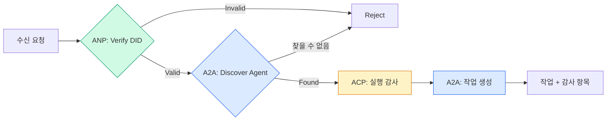

```typescript
class ProtocolGateway {
  private registry: AgentRegistry;
  private taskManager: TaskManager;
  private auditRunner: AuditableRunner;
  private identityRegistry: IdentityRegistry;

  constructor(
    registry: AgentRegistry,
    taskManager: TaskManager,
    auditRunner: AuditableRunner,
    identityRegistry: IdentityRegistry
  ) {
    this.registry = registry;
    this.taskManager = taskManager;
    this.auditRunner = auditRunner;
    this.identityRegistry = identityRegistry;
  }

  async delegateTask(
    fromDid: string,
    signature: string,
    targetAgent: string,
    message: AgentMessage,
    sessionId?: string
  ): Promise<{ task: Task; audit: AuditEntry } | { error: string }> {
    if (!this.identityRegistry.verify(fromDid, signature, message.id)) {
      return { error: "Identity verification failed" };
    }

    const card = this.registry.resolve(targetAgent);
    if (!card) {
      return { error: `Agent ${targetAgent} not found in registry` };
    }

    const audit = await this.auditRunner.run(
      targetAgent,
      [message],
      sessionId
    );
    const task = await this.taskManager.sendMessage(targetAgent, message);

    return { task, audit };
  }

  discoverAndDelegate(
    fromDid: string,
    signature: string,
    skillTag: string,
    message: AgentMessage
  ): Promise<{ task: Task; audit: AuditEntry } | { error: string }> {
    const candidates = this.registry.discoverBySkillTag(skillTag);
    if (candidates.length === 0) {
      return Promise.resolve({
        error: `No agents found with skill tag: ${skillTag}`,
      });
    }
    return this.delegateTask(
      fromDid,
      signature,
      candidates[0].name,
      message
    );
  }
}
```

게이트웨이는 한 번의 호출로 네 가지 작업을 수행합니다:
1. **ANP**: DID 서명을 통해 호출자의 신원을 검증합니다
2. **A2A**: 대상 에이전트를 검색하고 기능을 확인합니다
3. **ACP**: 트래젝토리가 포함된 감사 추적에 실행을 래핑합니다
4. **A2A**: 전체 생명주기 추적을 통해 작업을 생성합니다

### 7단계: 전체 연결

```typescript
async function protocolDemo() {
  const registry = new AgentRegistry();
  registry.register({
    name: "researcher",
    description: "Searches and summarizes findings",
    version: "1.0.0",
    supportedInterfaces: [
      {
        url: "https://researcher.local/a2a/v1",
        protocolBinding: "JSONRPC",
        protocolVersion: "1.0",
      },
    ],
    capabilities: { streaming: true, pushNotifications: false },
    defaultInputModes: ["text/plain"],
    defaultOutputModes: ["text/plain", "application/json"],
    skills: [
      {
        id: "web-research",
        name: "Web Research",
        description: "Searches the web",
        tags: ["research", "search", "summarization"],
        inputModes: ["text/plain"],
        outputModes: ["application/json"],
      },
    ],
  });
  registry.register({
    name: "coder",
    description: "Writes code from specs",
    version: "1.0.0",
    supportedInterfaces: [
      {
        url: "https://coder.local/a2a/v1",
        protocolBinding: "JSONRPC",
        protocolVersion: "1.0",
      },
    ],
    capabilities: { streaming: false, pushNotifications: false },
    defaultInputModes: ["text/plain", "application/json"],
    defaultOutputModes: ["text/plain"],
    skills: [
      {
        id: "code-gen",
        name: "Code Generation",
        description: "Generates code",
        tags: ["coding", "generation"],
        inputModes: ["text/plain", "application/json"],
        outputModes: ["text/plain"],
      },
    ],
  });

  const taskManager = new TaskManager();
  const auditRunner = new AuditableRunner();

  const researchTrajectory: TrajectoryEntry[] = [];

  taskManager.registerHandler(
    "researcher",
    async function* (task, message) {
      yield {
        statusUpdate: {
          taskId: task.id,
          status: {
            state: "TASK_STATE_WORKING" as const,
            timestamp: Date.now(),
          },
        },
      };

      researchTrajectory.push({
        reasoning: "Searching for React 19 documentation",
        toolName: "web_search",
        toolInput: { query: "React 19 compiler features" },
        toolOutput: {
          results: ["react.dev/blog/react-19", "github.com/react/react"],
        },
        timestamp: Date.now(),
      });

      researchTrajectory.push({
        reasoning: "Extracting key findings from search results",
        toolName: "doc_analysis",
        toolInput: { url: "react.dev/blog/react-19" },
        toolOutput: {
          summary:
            "React 19 compiler auto-memoizes, no manual useMemo needed",
        },
        timestamp: Date.now(),
      });

      yield {
        artifactUpdate: {
          taskId: task.id,
          artifact: {
            id: crypto.randomUUID(),
            name: "research-results",
            parts: [
              {
                data: {
                  findings: [
                    "React 19 compiler auto-memoizes components",
                    "No more manual useMemo/useCallback needed",
                    "Compiler runs at build time, not runtime",
                  ],
                  sources: ["react.dev/blog/react-19"],
                },
                mediaType: "application/json",
              },
            ],
          },
          append: false,
          lastChunk: true,
        },
      };

      yield {
        statusUpdate: {
          taskId: task.id,
          status: {
            state: "TASK_STATE_COMPLETED" as const,
            timestamp: Date.now(),
          },
        },
      };
    }
  );

  auditRunner.registerAgent("researcher", async () => ({
    output: [
      textMessage("ROLE_AGENT", "React 19 compiler auto-memoizes components"),
    ],
    trajectory: researchTrajectory,
  }));

  const identityRegistry = new IdentityRegistry();

  const coderIdentity = createIdentity("coder.local", "coder");
  const researcherIdentity = createIdentity("researcher.local", "researcher");

  identityRegistry.publish(coderIdentity.document);
  identityRegistry.publish(researcherIdentity.document);

  const gateway = new ProtocolGateway(
    registry,
    taskManager,
    auditRunner,
    identityRegistry
  );

  console.log("=== Protocol Demo ===\n");

  console.log("1. Agent Discovery (A2A)");
  const researchAgents = registry.discoverBySkillTag("research");
  console.log(
    `   Found ${researchAgents.length} agent(s):`,
    researchAgents.map((a) => a.name)
  );

  console.log("\n2. Identity Verification (ANP)");
  const message = textMessage("ROLE_USER", "Research React 19 compiler features");
  const signature = signPayload(coderIdentity, message.id);
  const verified = identityRegistry.verify(
    coderIdentity.did,
    signature,
    message.id
  );
  console.log(`   Coder DID: ${coderIdentity.did}`);
  console.log(`   Signature verified: ${verified}`);

  console.log("\n3. Task Delegation (A2A + ACP + ANP)");
  const result = await gateway.delegateTask(
    coderIdentity.did,
    signature,
    "researcher",
    message,
    "session-001"
  );

  if ("error" in result) {
    console.log(`   Error: ${result.error}`);
    return;
  }

  console.log(`   Task ID: ${result.task.id}`);
  console.log(`   Task state: ${result.task.status.state}`);
  console.log(`   Artifacts: ${result.task.artifacts.length}`);

  console.log("\n4. Audit Trail (ACP)");
  console.log(`   Run ID: ${result.audit.runId}`);
  console.log(`   Status: ${result.audit.status}`);
  console.log(`   Trajectory steps: ${result.audit.trajectory.length}`);
  for (const step of result.audit.trajectory) {
    console.log(`     - ${step.reasoning}`);
    if (step.toolName) {
      console.log(`       Tool: ${step.toolName}`);
    }
  }

  console.log("\n5. Full Audit Log");
  const fullLog = auditRunner.getFullAuditLog();
  console.log(`   Total runs: ${fullLog.length}`);
  for (const entry of fullLog) {
    const duration = entry.completedAt
      ? `${entry.completedAt - entry.startedAt}ms`
      : "in-progress";
    console.log(`   ${entry.agentName}: ${entry.status} (${duration})`);
  }
}

protocolDemo().catch((err) => {
  console.error("Protocol demo failed:", err);
  process.exitCode = 1;
});
```

## 문제가 발생하는 부분

프로토콜은 정상적인 경로(happy path)를 해결합니다. 프로덕션에서는 다음이 깨집니다:

**스키마 드리프트.** 에이전트 A가 `application/json` 출력을 광고하는 에이전트 카드를 게시합니다. 하지만 JSON 스키마가 버전 간에 변경됩니다. 에이전트 B는 이전 형식을 파싱하여 무의미한 데이터를 얻습니다. 해결 방법: 스킬과 출력 스키마에 버전을 지정하세요. A2A 사양은 이 이유로 에이전트 카드에 `version`을 지원합니다.

**상태 머신 위반.** 에이전트 핸들러가 `TASK_STATE_COMPLETED` 상태 업데이트를 생성한 후 추가 아티팩트를 생성하려고 시도합니다. 작업은 변경할 수 없습니다. 코드가 업데이트를 조용히 버리거나 예외를 발생시킵니다. 해결 방법: 생성 전에 종결 상태를 확인하세요. 위의 `TaskManager`은 종결 상태 이후 `break`을 통해 이를 강제합니다.

**신뢰 해결 실패.** 에이전트 A가 에이전트 B의 DID를 검증하려고 하지만, 에이전트 B의 도메인이 다운되어 있습니다. DID 문서를 가져올 수 없습니다. 열려 있는 상태로 실패할까요(검증되지 않은 에이전트를 허용)? 아니면 닫혀 있는 상태로 실패할까요(모든 것을 거부)? ANP는 최소 신뢰 원칙과 함께 닫혀 있는 상태로 실패할 것을 권장합니다.

**트래젝토리 팽창.** ACP 트래젝토리 로깅은 강력하지만 비용이 많이 듭니다. 한 실행당 200번의 도구 호출을 수행하는 복잡한 에이전트는 방대한 감사 항목을 생성합니다. 해결 방법: 설정 가능한 상세 수준으로 트래젝토리를 로깅하세요. 준수를 위해 도구 이름과 입출력을 기록하고, 규제 대상이 아닌 워크로드의 경우 추론 단계를 건너뛰세요.

**발견 썬더링 허드.** 50개의 에이전트가 모두 시작 시 `GET /agents`을 동시에 쿼리합니다. 해결 방법: TTL로 에이전트 카드를 캐싱하고, 발견 간격을 분산하거나, 폴링 대신 푸시 기반 등록을 사용하세요.

## 사용하기

### 실제 구현

**A2A**는 가장 성숙합니다. Google의 [official spec](https://github.com/google/A2A)는 Linux Foundation 산하의 오픈소스입니다. Python 및 TypeScript용 SDK가 있습니다. 에이전트가 동적 발견 및 협업을 필요로 한다면 여기서 시작하세요.

**ACP**는 A2A에 통합되고 있습니다. IBM의 [BeeAI project](https://github.com/i-am-bee/acp)는 REST 우선 대안으로 ACP를 만들었지만, 트래젝토리 메타데이터 개념은 A2A 생태계에 흡수되고 있습니다. A2A를 전송 수단으로 사용하더라도 ACP 패턴(트래젝토리 로깅, 실행 수명 주기)을 사용하세요.

**ANP**는 가장 실험적입니다. [community repo](https://github.com/agent-network-protocol/AgentNetworkProtocol)에는 Python SDK(AgentConnect)가 있습니다. 메타 프로토콜 협상 개념은 진정으로 독창적입니다. 조직 간 에이전트 배포를 위해 주목할 가치가 있습니다.

**MCP**는 이미 13단계에서 다루었습니다. 에이전트가 도구를 사용하려면 MCP가 표준입니다.

### 올바른 프로토콜 선택

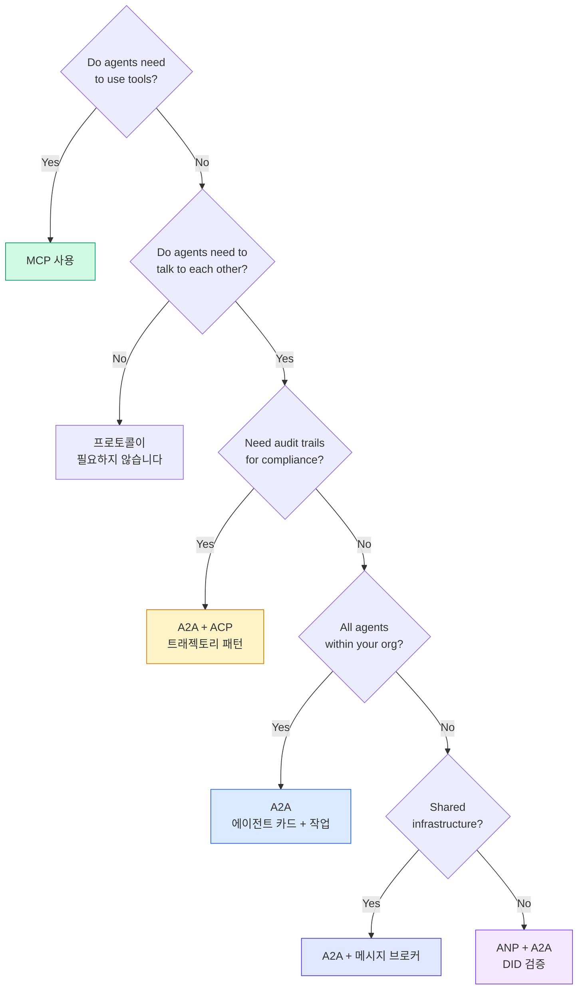

## 출시하기

이 강의에서 생성되는 결과물:
- `code/main.ts` -- 네 가지 프로토콜 패턴의 완전한 구현
- `outputs/prompt-protocol-selector.md` -- 시스템에 적합한 프로토콜을 선택하는 데 도움이 되는 프롬프트

## 연습 문제

1. **다중 홉 작업 위임.** `TaskManager`을 확장하여 에이전트 핸들러가 하위 작업을 다른 에이전트에게 위임할 수 있도록 해 보세요. 연구자 에이전트가 작업을 받으면 "검색" 및 "요약" 하위 작업을 두 전문가 에이전트에게 위임하고, 두 작업이 완료될 때까지 기다린 후 결과를 자신의 산출물에 병합합니다.

2. **스트리밍 감사 추적.** `AuditableRunner`을 수정하여 스트리밍 모드를 지원해 보세요. 전체 결과를 기다리는 대신, 트래젝토리 항목이 추가될 때 `AuditEntry` 업데이트를 실시간으로 생성합니다. 감사 스냅샷을 생성하는 비동기 생성기를 사용하세요.

3. **DID 로테이션.** `IdentityRegistry`에 키 로테이션을 추가해 보세요. 에이전트가 `previousDid` 참조를 유지하면서 업데이트된 키를 포함하는 새로운 DID 문서를 게시할 수 있어야 합니다. 검증자는 유예 기간 동안 현재 키와 이전 키의 서명을 모두 허용해야 합니다.

4. **프로토콜 협상.** ANP의 메타 프로토콜 개념을 구현해 보세요. 두 에이전트가 후보 형식(예: "JSON-RPC를 사용할 수 있습니다" vs "REST를 선호합니다")을 포함하는 `protocolNegotiation` 메시지를 교환합니다. 최대 3라운드 후 형식에 합의하거나 시간 초과가 발생합니다. 합의된 형식에 따라 `TaskManager` 또는 `AuditableRunner`를 사용하게 됩니다.

5. **속도 제한된 발견.** `RateLimitedRegistry` 래퍼를 추가하여 에이전트 카드 조회를 설정 가능한 TTL로 캐싱하고 에이전트당 초당 발견 쿼리를 제한해 보세요. 100개 에이전트가 시작 시 서로를 발견하는 썬더링 허드(thundering herd) 상황을 시뮬레이션하고 차이를 측정하세요.

## 핵심 용어

| 용어 | 사람들이 말하는 것 | 실제 의미 |
|------|----------------|----------------------|
| MCP | "AI 도구용 프로토콜" | 에이전트가 도구를 발견하고 사용하는 클라이언트-서버 프로토콜입니다. 에이전트 간 통신이 아닌, 에이전트-도구 간 통신입니다. |
| A2A | "Google의 에이전트 프로토콜" | Linux Foundation 산하의 에이전트 협업을 위한 피어 투 피어(P2P) 프로토콜입니다. 에이전트 카드를 통한 발견, 9단계 작업 수명주기, SSE를 통한 스트리밍을 지원합니다. JSON-RPC, REST, gRPC 바인딩을 지원합니다. |
| ACP | "엔터프라이즈 에이전트 메시징" | IBM/BeeAI의 에이전트 실행용 REST API로, TrajectoryMetadata를 포함합니다. 모든 응답은 전체 추론 체인과 도구 호출을 담고 있습니다. A2A로 통합 중입니다. |
| ANP | "분산형 에이전트 신원" | `did:wba` (DID)를 암호화 신원, HPKE를 E2EE, AI 기반 메타 프로토콜 협상을 통해 서로 본 적 없는 에이전트 간에 활용하는 커뮤니티 프로토콜입니다. |
| Agent Card | "에이전트의 명함" | `/.well-known/agent-card.json`에 위치하며 스킬, 지원 MIME 타입, 보안 스키마, 프로토콜 바인딩을 설명하는 JSON 문서입니다. |
| DID | "분산형 ID" | 에이전트 자체 도메인에 호스팅되는 암호화 검증 가능한 신원을 위한 W3C 표준입니다. ANP는 `did:wba` 방법을 사용합니다. |
| TrajectoryMetadata | "감사 영수증" | 모든 에이전트 응답에 추론 단계, 도구 호출 및 그 입력/출력을 첨부하는 ACP의 메커니즘입니다. |
| Meta-protocol | "에이전트가 대화 방식을 협상하는 것" | ANP의 접근 방식으로, 에이전트가 자연어를 사용하여 데이터 형식을 동적으로 합의한 후 이를 처리하는 코드를 생성합니다. |
| Task | "작업 단위" | 제출부터 완료까지 작업을 추적하는 A2A의 상태 유지 객체입니다. 종결 상태가 되면 변경할 수 없습니다. |

## 추가 읽기

- [Google A2A specification](https://github.com/google/A2A) -- 공식 사양 및 SDK (v1.0.1, Linux Foundation)
- [IBM/BeeAI ACP specification](https://github.com/i-am-bee/acp) -- 에이전트 실행 및 궤적 메타데이터용 OpenAPI 3.1 사양
- [Agent Network Protocol](https://github.com/agent-network-protocol/AgentNetworkProtocol) -- DID 기반 신원, E2EE, 메타 프로토콜 협상
- [Model Context Protocol docs](https://modelcontextprotocol.io/) -- Anthropic의 MCP 사양 (13단계에서 다룸)
- [W3C Decentralized Identifiers](https://www.w3.org/TR/did-core/) -- ANP의 기반이 되는 신원 표준
- [RFC 9180 (HPKE)](https://www.rfc-editor.org/rfc/rfc9180) -- ANP가 E2EE에 사용하는 암호화 방식
- [FIPA Agent Communication Language](http://www.fipa.org/specs/fipa00061/SC00061G.html) -- 현대 에이전트 프로토콜의 학술적 선구자
