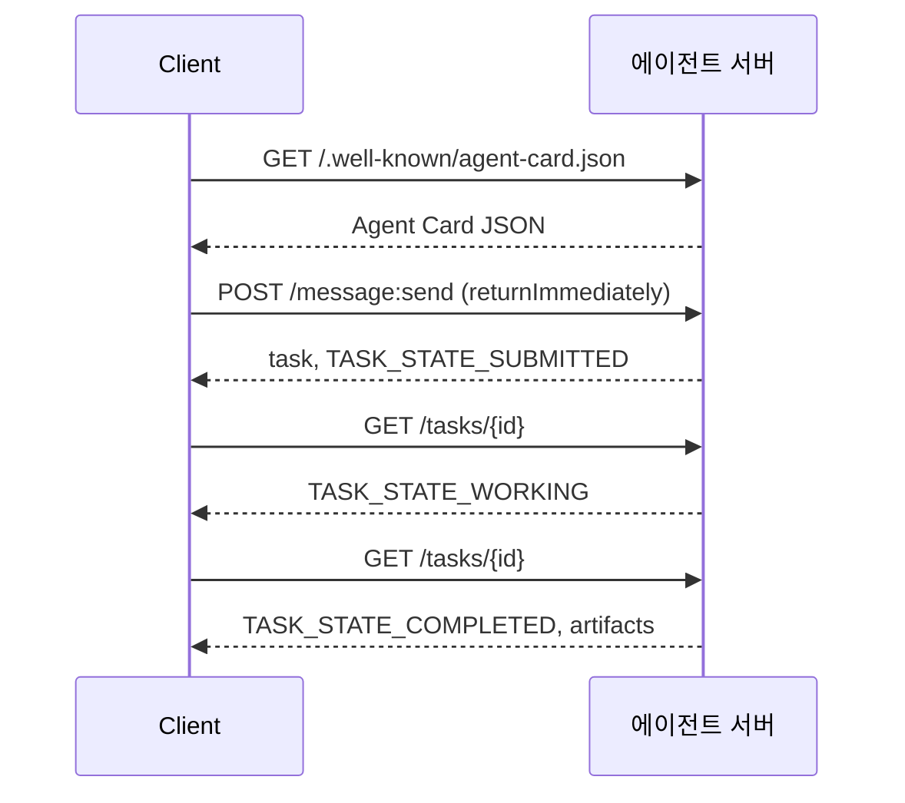

# A2A — 에이전트 간 프로토콜

> Google은 2025년 4월에 A2A를 발표했으며, 2026년 4월 현재 사양은 https://a2a-protocol.org/latest/specification/에 도달했고 150개 이상의 조직이 이를 지지하고 있습니다. A2A는 MCP (13강)의 수평적 보완재입니다. MCP가 수직적(에이전트 ↔ 도구)인 반면, A2A는 피어 투 피어(에이전트 ↔ 에이전트)입니다. 에이전트 카드(발견), 아티팩트(텍스트, 구조화된 데이터, 비디오)가 포함된 작업, 불투명한 작업 수명 주기, 인증을 정의합니다. 프로덕션 시스템은 MCP와 A2A를 점점 더 많이 결합하고 있습니다. Google Cloud는 2025-2026년 동안 Vertex AI Agent Builder에 A2A 지원 기능을 통합했습니다.

**유형:** Learn + Build
**언어:** Python (stdlib, `http.server`, `json`)
**선수 요건:** 16단계 · 04강 (원시 모델)
**시간:** 약 75분

## 문제점

에이전트가 다른 시스템의 다른 에이전트를 호출해야 합니다. 어떻게 해야 할까요? HTTP 엔드포인트를 노출하고, 맞춤형 JSON 스키마를 정의하고, 상대방이 이를 따르기를 바랄 수 있습니다. 모든 에이전트 쌍은 맞춤형 통합이 됩니다.

A2A는 이러한 호출을 위한 범용 와이어 프로토콜입니다. 표준 발견, 표준 작업 모델, 표준 전송, 표준 아티팩트. 에이전트를 일급 시민으로 취급하는 HTTP+REST와 유사합니다.

## 개념

### 네 가지 요소

**에이전트 카드.** `/.well-known/agent-card.json`에 있는 JSON 문서로 에이전트를 설명합니다: 이름, 스킬, `supportedInterfaces` (엔드포인트 URL, 프로토콜 바인딩, 프로토콜 버전), 기본 입력 및 출력 미디어 유형, 인증 요구 사항(`securitySchemes` 및 `securityRequirements`). 발견은 카드를 읽는 것으로 이루어집니다.

```http
GET /.well-known/agent-card.json HTTP/1.1
Host: agent.example.com
```

```json
{
  "name": "code-review-agent",
  "description": "Reviews Python and TypeScript code.",
  "version": "1.0.0",
  "supportedInterfaces": [
    {
      "url": "https://agent.example.com",
      "protocolBinding": "HTTP+JSON",
      "protocolVersion": "1.0"
    }
  ],
  "capabilities": {"streaming": false, "pushNotifications": false},
  "securitySchemes": {
    "bearer": {"httpAuthSecurityScheme": {"scheme": "Bearer"}}
  },
  "securityRequirements": [{"schemes": {"bearer": {"list": []}}}],
  "defaultInputModes": ["text/plain", "application/json"],
  "defaultOutputModes": ["application/json"],
  "skills": [
    {
      "id": "review-python",
      "name": "Review Python",
      "description": "Reviews Python code.",
      "tags": ["code-review", "python"]
    },
    {
      "id": "review-typescript",
      "name": "Review TypeScript",
      "description": "Reviews TypeScript code.",
      "tags": ["code-review", "typescript"]
    }
  ]
}
```

**작업.** 작업의 단위입니다. 수명 주기를 가진 비동기 상태ful 객체입니다: `TASK_STATE_SUBMITTED` → `TASK_STATE_WORKING` → `TASK_STATE_COMPLETED` / `TASK_STATE_FAILED` / `TASK_STATE_CANCELED`. 클라이언트가 메시지를 보내면 서버가 작업을 생성하고, 클라이언트는 업데이트를 폴링하거나 구독합니다.

**아티팩트.** 작업이 생성하는 결과 유형입니다. 텍스트, 구조화된 JSON, 이미지, 비디오, 오디오. 아티팩트는 타입이 지정됩니다: 각 부분은 `text`, `raw`, `url`, `data` 중 하나를 포함하며 `mediaType`를 지정할 수 있으므로, 다양한 모달리티가 일급 시민입니다.

**불투명한 수명 주기.** A2A는 원격 에이전트가 작업을 *어떻게* 해결하는지 규정하지 않습니다. 클라이언트는 상태 전환과 아티팩트를 보며, 구현은 임의의 프레임워크를 자유롭게 사용할 수 있습니다.

### MCP/A2A 분리

- **MCP** (13강): 에이전트 ↔ 도구. 에이전트는 JSON-RPC를 통해 도구 서버에 읽고 씁니다. 기본적으로 상태 비저장입니다.
- **A2A**: 에이전트 ↔ 에이전트. 피어 프로토콜; 양쪽 모두 자체 추론을 수행하는 에이전트입니다.

프로덕션 멀티 에이전트 시스템은 두 프로토콜을 모두 사용합니다. A2A 피어는 자기 측에서 MCP 도구를 호출합니다. 이 분리는 두 가지 관심사를 깔끔하게 유지합니다.

### 발견 흐름



이것은 HTTP+JSON 바인딩 라우트이며, 모든 요청은 `A2A-Version: 1.0`를 포함합니다. 기본적으로 `SendMessage`는 작업이 종결 상태나 중단 상태에 도달할 때까지 차단하므로, 폴링 클라이언트는 `configuration.returnImmediately`를 설정하여 즉시 작업 결과를 받습니다.

스트리밍을 사용하는 경우: `POST /message:stream`는 서버 전송 이벤트(Server-Sent Events)를 반환합니다(먼저 `task`, 그 후 `statusUpdate` 및 `artifactUpdate` 이벤트). `/tasks/{id}:subscribe`는 실행 중인 작업에 다시 연결합니다. 스트림은 작업이 종결 상태에 도달하면 닫히며, `final` 플래그는 없습니다.

### 인증

A2A는 세 가지 일반적인 패턴을 지원합니다:

- **베어러 토큰**: OAuth2 또는 불투명 토큰(`httpAuthSecurityScheme` 또는 `oauth2SecurityScheme`).
- **mTLS**: 상호 TLS; 조직 간에 신원을 증명합니다(`mtlsSecurityScheme`).
- **API 키**: 헤더, 쿼리 매개변수, 또는 쿠키에 키를 포함합니다(`apiKeySecurityScheme`).

인증은 에이전트 카드에 선언됩니다: `securitySchemes`는 각 스키마를 지정하고 `securityRequirements`는 클라이언트가 충족해야 하는 스키마를 명시합니다. 클라이언트는 이를 발견하고 준수합니다.

### 2026년 4월까지 150개 이상의 조직

엔터프라이즈 도입이 A2A의 규모를 확대했습니다. 핵심은 A2A가 엔터프라이즈 에이전트 시스템이 신뢰 경계를 넘나드는 방식이 되었다는 점입니다. Google Cloud는 Vertex AI Agent Builder에 A2A 지원을 출시했으며, Microsoft Agent Framework도 이를 지원합니다. 주요 프레임워크 대부분(LangGraph, CrewAI, AutoGen)은 A2A 어댑터를 제공합니다.

### A2A가 승리하는 영역

- **조직 간 호출.** 회사 A의 에이전트가 회사 B의 에이전트를 호출합니다. A2A가 없으면 모든 쌍은 맞춤형 계약이 됩니다.
- **이질적인 프레임워크.** LangGraph 에이전트가 CrewAI 에이전트를 호출하고, 다시 커스텀 Python 에이전트를 호출합니다. A2A가 이를 표준화합니다.
- **타입 지정된 아티팩트.** 비디오 결과, 구조화된 JSON, 오디오 — 모두 일급 객체입니다.
- **장기 실행 작업.** 불투명한 생명주기 + 폴링으로 수 시간 걸리는 작업을 쉽게 처리합니다.

### A2A가 어려움을 겪는 영역

- **레이턴시 민감한 마이크로 호출.** A2A의 생명주기는 비동기입니다. 밀리초 단위 에이전트 간 통신에는 맞지 않으므로, 직접 RPC를 사용하세요.
- **밀접하게 결합된 프로세스 내 에이전트.** 두 에이전트가 동일한 Python 프로세스에서 실행된다면, A2A의 HTTP 왕복은 과한 선택입니다.
- **소규모 팀.** 사양(spec)의 오버헤드는 실재합니다. 내부 전용 에이전트라면 형식적인 절차가 필요하지 않을 수 있습니다.

### A2A vs ACP, ANP, NLIP

2024-2026년 사이에 여러 관련 사양이 등장했습니다:

- **ACP** (IBM/Linux Foundation) — A2A의 전신이며, 범위가 더 좁습니다.
- **ANP** (에이전트 네트워크 프로토콜) — 피어 발견에 중점을 두며, 분산 우선적입니다.
- **NLIP** (Ecma 자연어 상호작용 프로토콜, 2025년 12월 표준화) — 자연어 콘텐츠 유형입니다.

2026년 4월 기준으로 A2A는 가장 많이 채택된 피어 프로토콜입니다. 비교는 arXiv:2505.02279 (Liu et al., "A Survey of Agent Interoperability Protocols")를 참고하세요.

```figure
sw-agent-card-discovery
```

## 구현하기

`code/main.py`는 `http.server`과 JSON을 사용하여 1.0 HTTP+JSON 바인딩에 기반한 A2A 최소 서버와 클라이언트를 구현합니다. 서버는:

- `/.well-known/agent-card.json`을 노출합니다,
- `POST /message:send`을 수락합니다,
- 작업 상태를 관리합니다,
- `GET /tasks/{id}`에서 아티팩트를 반환합니다.

클라이언트는:

- 에이전트 카드를 가져옵니다,
- `returnImmediately`을 사용하여 메시지를 전송합니다,
- 완료될 때까지 폴링합니다,
- 아티팩트를 읽습니다.

실행:

```
python3 code/main.py
```

스크립트는 백그라운드 스레드에서 서버를 시작한 후, 이를 대상으로 클라이언트를 실행합니다. 발견, 제출, 폴링, 아티팩트라는 전체 흐름을 확인할 수 있습니다.

## 사용하기

`outputs/skill-a2a-integrator.md`는 에이전트 카드 내용, 작업 스키마, 인증 선택, 스트리밍 vs 폴링 등 A2A 통합을 설계합니다.

## 출시하기

체크리스트:

- **사양 버전을 고정하세요.** A2A는 아직 진화 중입니다. 모든 `supportedInterfaces` 항목은 `protocolVersion`을 선언하며, 클라이언트는 `A2A-Version: 1.0`을 전송합니다.
- **멱등적인 작업 생성.** 중복 제출(네트워크 재시도)은 하나의 작업을 생성해야 합니다. 클라이언트의 `messageId`에서 중복을 제거하세요.
- **아티팩트 스키마.** 에이전트가 반환하는 형태를 선언하세요. 소비자는 이를 검증해야 합니다.
- **속도 제한 + 인증.** A2A는 공개-facing이므로 표준 웹 보안 규정을 적용하세요.
- **실패한 작업에 대한 데드 레터.** 반복적인 실패 유형을 파악하기 위해 시간에 따른 패턴을 검토하세요.

## 연습 문제

1. `code/main.py`을 실행하세요. 클라이언트가 서버를 발견하고 올바른 아티팩트를 수신하는지 확인하세요.
2. 서버에 두 번째 스킬(예: "요약")을 추가하세요. 에이전트 카드를 업데이트하세요. 작업 유형에 따라 스킬을 선택하는 클라이언트를 작성하세요. 1.0 요청에는 스킬 필드가 없으므로, 서버는 메시지 부분을 기반으로 라우팅합니다.
3. `POST /message:stream`을 구현하세요: 서버 전송 이벤트(Server-Sent Events)로 응답(먼저 `task`, 그 후 `statusUpdate` 이벤트)하고 종단 상태에 도달하면 스트림을 닫으세요. 클라이언트는 무엇을 다르게 해야 합니까?
4. A2A 사양(https://a2a-protocol.org/latest/specification/)을 읽어보세요. 이 데모가 구현하지 않은 사양의 필수 사항 세 가지를 식별하세요.
5. A2A(에이전트 카드 발견)와 MCP(`listTools`를 통한 서버 측 기능 목록)를 비교하세요. 자기 서술형 에이전트와 기능 탐색 간의 트레이드오프는 무엇입니까?

## 핵심 용어

| 용어 | 사람들이 말하는 것 | 실제 의미 |
|------|----------------|------------------------|
| A2A | "에이전트 간(agent-to-agent)" | 시스템 간에 에이전트가 다른 에이전트를 호출하기 위한 피어 프로토콜. Google 2025. |
| 에이전트 카드 | "에이전트의 명함" | `/.well-known/agent-card.json`에 있는 JSON으로 스킬, `supportedInterfaces`, 인증을 설명합니다. |
| 작업(Task) | "작업 단위" | 생명주기를 가진 비동기 상태 유지 객체; 완료 시 아티팩트가 생성됩니다. |
| 아티팩트(Artifact) | "결과물" | 타입이 지정된 출력: 텍스트, 구조화된 JSON, 이미지, 비디오, 오디오. 일급 미디어입니다. |
| 불투명 생명주기 | "해결 방법은 에이전트의 몫" | 클라이언트는 상태 전환을 보며, 서버는 프레임워크/도구를 자유롭게 선택할 수 있습니다. |
| 발견(Discovery) | "에이전트 찾기" | `GET /.well-known/agent-card.json`가 카드를 반환합니다. |
| MCP vs A2A | "도구 vs 피어" | MCP: 수직적 에이전트 ↔ 도구. A2A: 수평적 에이전트 ↔ 에이전트. |
| ACP / ANP / NLIP | "형제 프로토콜" | 인접 사양들; A2A는 2026년 가장 많이 채택되었습니다. |

## 추가 읽기

- [A2A specification](https://a2a-protocol.org/latest/specification/) — 공식 사양
- [A2A v1.0.1 release](https://github.com/a2aproject/A2A/tree/v1.0.1): 이 강의가 따르는 태그가 지정된 `docs/specification.md` 및 `specification/a2a.proto`
- [Google Developers Blog — A2A announcement](https://developers.googleblog.com/en/a2a-a-new-era-of-agent-interoperability/) — 2025년 4월 출시 포스트
- [A2A GitHub repo](https://github.com/a2aproject/A2A) — 참고 구현 및 SDK
- [Liu et al. — A Survey of Agent Interoperability Protocols](https://arxiv.org/html/2505.02279v1) — MCP, ACP, A2A, ANP 비교
