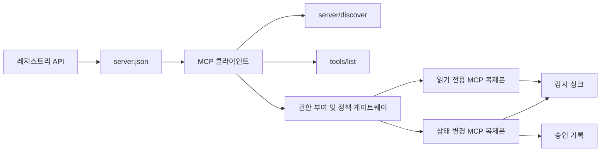

# 캡스톤 13: 레지스트리와 거버넌스를 갖춘 상태 비저장 MCP 서버

> 프로덕션 MCP는 하나의 서버 프로세스가 아닙니다. 게시 가능한 메타데이터, 실시간 발견, 상태 비저장 요청 엔벨로프, 인증, 정책, 감사, 배포 증적이라는 계약의 연쇄입니다.

**유형:** Capstone
**언어:** Python 및 TypeScript 참조 모델; 모든 프로덕션 언어
**선수 요건:** 11단계, 13단계, 14단계, 17단계, 18단계

**필수 MCP 심화 학습:** [28강: Tool Contracts](../../../13-tools-and-protocols/28-mcp-tool-contracts-and-content/docs/en.md), [29강: Reliability](../../../13-tools-and-protocols/29-mcp-reliability-cancellation-and-flow-control/docs/en.md), [30강: Registry Supply Chain](../../../13-tools-and-protocols/30-mcp-registry-supply-chain-and-drift/docs/en.md), [31강: Conformance Operations](../../../13-tools-and-protocols/31-mcp-conformance-versioning-and-operations/docs/en.md)
**프로토콜 대상:** MCP `2026-07-28`
**시간:** 약 25시간

## 학습 목표

- 상태 비저장 MCP 요청 및 결과 엔벨로프를 구현하세요.
- 레지스트리 메타데이터를 실시간 프로토콜 발견과 분리하세요.
- 결정적이고 캐시 인식 도구 발견을 구축하세요.
- 모든 도구 호출에 대해 발급자, 대상자, 범위, 승인 정책을 강제하세요.
- 세션 어피니티 없이 Streamable HTTP를 배포하세요.
- 와이어, 인증, 정책, 레지스트리, 감사 경계에서 동작을 증명하세요.

## 필수 MCP 선수 요건 경로

이 캡스톤을 프로덕션 준비 상태로 간주하기 전에 연결된 13단계의 네 강의를 순서대로 완료하세요:

1. [28강](../../../13-tools-and-protocols/28-mcp-tool-contracts-and-content/docs/en.md)는 이 서버가 노출해야 하는 도구, 스키마, 콘텐츠, 페이지네이션, 완료, 라우팅, 오류 계약을 정의합니다.
2. [29강](../../../13-tools-and-protocols/29-mcp-reliability-cancellation-and-flow-control/docs/en.md)는 취소 경쟁, 마감 시간, 멱등성(Idempotency), 백프레셔(Backpressure), 재시도, 재연결 동작을 정의합니다.
3. [30강](../../../13-tools-and-protocols/30-mcp-registry-supply-chain-and-drift/docs/en.md)는 네임스페이스, 출처(Data Provenance), 수용 고정, 레지스트리 상태, 드리프트, 원장, 롤백(Rollback) 증적을 정의합니다.
4. [31강](../../../13-tools-and-protocols/31-mcp-conformance-versioning-and-operations/docs/en.md)는 골든 및 네거티브 트랜스크립트, 엄격한 버전 시대, SDK 차이 검사, 프록시 증명, 편집, 건강 상태, 릴리스 게이트를 정의합니다.

이 캡스톤은 이러한 산출물을 통합합니다. 하나의 해피 패스 SDK 테스트로 대체하지 않습니다.

## 문제점

내부 플랫폼은 읽기 전용 데이터 도구와 소수의 상태 변경 도구를 필요로 합니다. 개발자는 서버를 발견하고, 연결 방법을 이해하고, 실시간 기능을 검사하고, 사용이 승인된 작업만 호출할 수 있어야 합니다.

어려운 부분은 함수를 등록하는 것이 아닙니다. 어려운 부분은 여섯 가지 서로 다른 진실을 정렬하는 것입니다:

1. `server.json`는 서버가 설치되거나 연결될 수 있는 위치를 나타냅니다.
2. `server/discover`는 현재 실행 중인 프로세스가 지원하는 내용을 나타냅니다.
3. 모든 요청은 사용하는 프로토콜 개정판 및 클라이언트 기능을 명시합니다.
4. 인증은 호출자를 올바른 발급자, 리소스 및 범위에 연결합니다.
5. 정책은 이 특정 작업이 실행될 수 있는지 결정합니다.
6. 감사 증거는 비밀이나 민감한 페이로드를 유출하지 않으면서 경계를 넘은 내용을 기록합니다.

이 중 하나라도 이탈하면 플랫폼이 도달할 수 없는 서버를 나열하거나, 호환되지 않는 클라이언트로 라우팅하거나, 다른 리소스를 위해 발행된 토큰을 허용하거나, 예상된 검토 없이 파괴적인 작업을 노출할 수 있습니다.

## 두 개의 발견 계층

레지스트리와 실행 중인 MCP 서버는 서로 다른 질문에 답합니다.

| 계층 | 계약 | 답하는 질문 |
|---|---|---|
| 게시 | `server.json` 및 레지스트리 API | 이 서버는 무엇이며, 패키지나 원격 엔드포인트는 어디에 있고, 어떻게 구성됩니까? |
| 런타임 | `server/discover` | 이 프로세스는 어떤 프로토콜 버전, 기능, 확장 및 서버 식별자를 지원합니까? |

공식 레지스트리는 버전화된 `server.json` 스키마를 사용합니다. 원격 항목은 Streamable HTTP URL을 지정할 수 있습니다:

```json
{
  "$schema": "https://static.modelcontextprotocol.io/schemas/2025-12-11/server.schema.json",
  "name": "com.example/internal-readonly",
  "title": "Internal Read-Only Tools",
  "description": "Read-only incident and data lookup tools.",
  "version": "1.0.0",
  "remotes": [
    {
      "type": "streamable-http",
      "url": "https://mcp.internal.example.com/readonly"
    }
  ]
}
```

레지스트리 스키마 버전과 MCP 프로토콜 개정판은 독립적입니다. 한쪽의 날짜를 다른 쪽과 일치하도록 재작성하지 마세요. 각 문서를 자체 계약에 대해 검증하세요.

스키마 유효성은 네임스페이스 소유권을 증명하지 못합니다. `example.com`에 대해 검증된 게시자는 역방향 DNS 네임스페이스 `com.example/*` 또는 그 하위 네임스페이스 중 하나를 사용합니다. 레지스트리 인증 흐름이 소유권을 증명합니다. 도메인 레이블을 일반적인 순서대로 유지하면 다른 네임스페이스가 지정됩니다.

표준 라이브러리 모델의 `validate_registry_document` 함수는 의도적으로 부분적인 원격 프로필 검증기입니다. 공식적으로 필수인 `name`, `description`, `version` 필드, 선택적인 `title`, 공개된 이름 및 길이 제약 조건, 구체적 버전 형식, 그리고 각 `streamable-http` 또는 `sse` 원격의 HTTP(S) URL 형식을 확인합니다. 또한 이 캡스톤은 항상 원격을 실시간으로 프로빙하므로 비어 있지 않은 `remotes` 목록을 요구합니다. `validate_publisher_namespace`은 검증된 게시자 도메인에 대해 이름을 별도로 확인하며, `validate_runtime_alignment`는 공개된 이름과 버전을 실시간 `serverInfo`과 비교합니다. 공식 스키마는 패키지 전용 레코드와 더 많은 원격 필드도 지원합니다. 게시하기 전에 고정된 공식 JSON 스키마 또는 `mcp-publisher`로 전체 문서를 검증하세요. 이 의존성 없는 하위 집합을 완전한 스키마 검증으로 제시하지 마세요.

서버는 `server/discover`을 구현해야 하며, 클라이언트는 다른 메서드 호출 전에 이를 호출할 수 있습니다. 이 캡스톤 클라이언트는 엔드포인트를 해석한 후 이를 호출하여 현재 프로토콜 개정판과 실시간 기능을 받습니다:

```json
{
  "resultType": "complete",
  "supportedVersions": ["2026-07-28"],
  "capabilities": {
    "tools": {
      "listChanged": false
    }
  },
  "_meta": {
    "io.modelcontextprotocol/serverInfo": {
      "name": "com.example/internal-readonly",
      "version": "1.0.0"
    }
  },
  "ttlMs": 3600000,
  "cacheScope": "public"
}
```

비공개 카탈로그는 추가적인 소유권, 리뷰, 또는 수명주기 데이터를 인덱싱할 수 있지만, 그 데이터를 MCP 와이어 필드나 루트 `server.json` 필드로 발명해서는 안 됩니다. 조직 정책을 게시된 레코드 옆에 저장하세요. 공개 커스텀 메타데이터가 필요할 경우, Registry의 `_meta.io.modelcontextprotocol.registry/publisher-provided` 확장을 사용하며 그 4 KB 한도 내에 머물러야 합니다.

## 상태 비저장 MCP 코어

MCP 개정판 `2026-07-28`은 프로토콜 세션과 `initialize` / `notifications/initialized` 핸드셰이크를 제거합니다. 또한 `Mcp-Session-Id`도 제거합니다.

모든 요청은 `params._meta`에 프로토콜 컨텍스트를 담습니다:

```json
{
  "io.modelcontextprotocol/protocolVersion": "2026-07-28",
  "io.modelcontextprotocol/clientCapabilities": {},
  "io.modelcontextprotocol/clientInfo": {
    "name": "internal-platform-client",
    "version": "1.0.0"
  }
}
```

버전과 기능은 연결 사실이 아닌 요청 사실입니다. 로드 밸런서는 연속적인 요청을 서로 다른 건강한 복제본으로 보낼 수 있습니다. 왜냐하면 어느 복제본이든 메시지 자체로부터 요청을 검증할 수 있기 때문입니다.

일반적인 결과는 `resultType: "complete"`을 포함합니다. 서버는 각 결과의 `_meta.io.modelcontextprotocol/serverInfo`에 자신의 식별자를 배치해야 합니다. 누락된 문자열이 아닌 프로토콜 버전은 유효하지 않은 매개변수 `-32602`입니다. 에러 `-32022`은 지원되지 않는 제공된 문자열에 대해서만 사용되며, 그 데이터는 정확히 `{"supported": ["2026-07-28"], "requested": "..."}`이어야 합니다.

### 캐싱 가능한 발견

`tools/list`은 동일한 유효 도구 집합에 대해 결정적이어야 합니다. 결과는 다음을 포함합니다:

- `ttlMs`, 클라이언트를 위한 신선도 힌트;
- `cacheScope`, `public` 또는 `private`;
- 동일한 목록이 프롬프트 캐시를 재사용할 수 있도록 안정적인 도구 순서;
- `resultType: "complete"` 및 서버 식별자 메타데이터.

사용자별 권한 부여는 일반적으로 `cacheScope: "private"`를 생성해야 합니다. 사용자별 도구 가시성을 공유 공개 캐시 뒤에 두지 마세요.

## 스트리밍 HTTP

네트워크 서버는 POST를 허용하는 하나의 MCP 엔드포인트를 노출합니다. 각 JSON-RPC 요청 또는 알림은 자체 POST를 받습니다.

요청에 대해 서버는 하나의 JSON 객체 또는 해당 요청에 범위가 지정된 SSE 스트림을 반환합니다. 장기 `subscriptions/listen` 요청은 옵트인된 변경 알림을 포함합니다. 현재 전송에는 독립적인 GET 스트림, 세션 DELETE, 세션 헤더 또는 `Last-Event-ID` 재생이 없습니다.

각 요청은 다음을 포함합니다:

- `MCP-Protocol-Version`, 본문 메타데이터와 일치;
- `Mcp-Method`, JSON-RPC 메서드와 일치;
- `tools/call`, `resources/read` 및 `prompts/get`에 대한 `Mcp-Name`;
- `Accept: application/json, text/event-stream`.

미러링된 헤더가 일치하지 않으면 지정된 `-32020` 오류로 거부하세요. `Origin`을 검증하고, 로컬 개발 서버를 루프백에 바인딩하며, 원격 클라이언트를 인증하고, 닫힌 요청 범위 SSE 응답을 취소로 처리하세요.



```figure
cf-mcp-gate
```

## 권한 부여 및 정책

전송 메타데이터는 권한 부여가 아닙니다. 모든 호출에서 권한 부여를 검증하세요.

원격 서버의 경우:

1. 보호된 리소스 메타데이터를 발견하세요.
2. 해당 리소스에 대한 권한 부여 서버를 선택하세요.
3. 클라이언트 등록을 위해 클라이언트 ID 메타데이터 문서를 선호하세요. 동적 클라이언트 등록은 호환성 지원으로 취급하세요.
4. 권한 부여 중에 리소스 지표(resource indicator)를 전송하세요.
5. 반환된 `iss` 값을 흐름에 기록된 권한 부여 서버와 대조하여 검증하세요.
6. 발행자(issuer)별로 클라이언트 자격 증명을 키로 지정하세요. 발행자 간에 등록 데이터를 재사용하지 마세요.
7. MCP 서버에서 토큰 발급자, 대상 또는 리소스, 만료일 및 범위를 검증합니다.
8. 구체적인 도구와 인자에 대해 두 번째 정책 결정을 적용합니다.

`readOnlyHint` 및 `destructiveHint`와 같은 도구 주석은 클라이언트가 위험을 제시하는 데 도움이 됩니다. 이들은 신뢰할 수 있는 권한 제어 장치가 아닙니다.

### 승인은 기록이며, 마법 같은 범위(scope)가 아닙니다

상태를 변경하는 호출은 행위자(actor), 도구, 정규화된 인자 또는 다이제스트, 대상 환경, 만료일 및 일회용 또는 반복 사용 정책과 연결된 승인 기록이 필요합니다. 채팅 메시지 자체는 승인에 대한 증거가 아닙니다.

Python 모델은 정렬된 키를 가진 표준 JSON을 해싱한 후, 해당 다이제스트를 토큰 주체, 도구 이름, 서버 URL 및 만료일과 연결합니다. 인자 중 하나만 변경된 상태로 기록을 재생하면 핸들러가 실행되기 전에 실패합니다. 승인은 접근 토큰에 추가된 범위가 아니라 별도의 증거입니다.

폭발 반경(blast radius)을 실질적으로 줄일 수 있다면, 고위험 도구를 별도로 검토 가능한 표면에 유지합니다. 자격 증명, 정책, 배포 식별자 및 감사 제어 또한 분리되어 있을 때만 분리 조치가 유용합니다.

## 구현하기

### 1. 모델 공개 메타데이터

`server.json`을 생성하고 스키마를 검증합니다. 게시자가 인증된 네임스페이스 내의 안정된 이름, 버전, 설명, 해당되는 경우 공식 `repository` 또는 `packages` 메타데이터, 원격 또는 stdio 전송을 포함합니다. 비밀은 선언된 환경 변수 입력으로 유지하며, 리터럴 값은 절대 사용하지 않습니다.

### 2. 라이브 디스커버리 구현

기능 RPC 전에 `server/discover`을 구현합니다. 지원되는 프로토콜 버전, 기능, 확장 및 서버 식별자를 광고합니다. `-32022`을 사용하여 버전 거부 케이스를 추가합니다.

### 3. 상태 비저장(envelope) 구현

모든 요청에서 프로토콜 버전 및 클라이언트 기능을 요구합니다. 모든 결과에서 `resultType` 및 서버 식별자를 반환합니다. 초기화 상태, 연결 범위 기능 캐시 및 세션 식별자를 제거합니다.

### 4. 도구 표면 구축

두 개의 읽기 전용 도구와 하나의 상태 변경 도구로 시작합니다. 각 도구에 제한된 JSON Schema, 정확한 설명, 결정적인 결과 형식 및 정직한 주석을 부여합니다. 클라이언트가 구조화된 결과에 의존할 경우 출력 스키마를 추가합니다.

### 5. 캐시 인식 목록 추가

`ttlMs`와 `cacheScope`를 사용하여 도구를 안정된 순서로 반환합니다. 캐시 만료 및 목록 변경 알림 동작을 별도로 연습해 보세요.

### 6. 인증 및 정책 추가

발행자, 대상, 만료일 및 범위를 검증합니다. 모든 도구 호출에 대해 정책 결정을 실행합니다. 승인된 항목을 정확히 높은 위험도의 작업에 바인딩합니다. 핸들러를 실행하기 전에 누락되거나 오래된 승인을 거부합니다.

### 7. 레지스트리 및 런타임 검증 분리

정적 `server.json` 레코드를 검증한 후 `server/discover`로 원격 엔드포인트를 프로빙합니다. 게시된 원격, 신원, 버전 또는 필수 기능이 라이브 프로세스와 일치하지 않을 경우 드리프트를 보고합니다.

### 8. 감사 증거 추가

행위자, 발행자, 리소스, 도구, 정책 결정, 요청 식별자, 추적 컨텍스트, 지연 시간 및 결과를 기록합니다. 민감한 인자 및 결과를 영속화하기 전에 마스킹하거나 다이제스트합니다. 감사 싱크는 모델 가시 컨텍스트 외부에 유지합니다.

### 9. 수평 확장 연습

로드 밸런서 뒤에 두 개의 상태 비저장(replica)를 배치합니다. 최소 100개의 동시 요청을 전송합니다. 정확성이 어피니티에 의존하지 않음을 입증합니다. 도구가 호출 간 상태가 필요하다면 명시적인 불투명 핸들(opaque handle)을 생성하고 공유 내구성 시스템에 저장합니다.

### 10. 실제 네트워크를 통과

실제 서버 바이너리에 대한 적합성 검사를 실행합니다. SDK 객체뿐만 아니라 요청 헤더와 JSON 본문을 캡처합니다. 잘못된 버전, 헤더 불일치, 누락된 범위, 잘못된 대상, 형식이 잘못된 인자, 핸들러 실패, 취소 및 캐시 만료를 연습해 보세요.

## 필수 증거 팩

제출물은 다음 다섯 가지 증거 클래스를 모두 포함할 때까지 불완전합니다:

| 증거 | 최소 증명 | 출처 강 |
|---|---|---|
| 네트워크(Wire) | 골든 및 네거티브 케이스에 대한 마스킹된 원시 헤더와 JSON-RPC 본문(메타데이터 타입 실패, 헤더 불일치, 지원되지 않는 버전, 누락되거나 알 수 없는 `resultType`, 알림 무응답, 응답 ID 매칭 포함) | [31강](../../../13-tools-and-protocols/31-mcp-conformance-versioning-and-operations/docs/en.md) |
| 프록시 | 동일한 안정된 케이스를 직접 실행하고 배포된 중개자를 통해 실행하며, ingress, origin 및 egress 상태와 본문 다이제스트를 포함합니다. 프로토콜 오류가 일반적인 500 응답으로 축약되지 않고 스트리밍이 버퍼링되지 않음을 증명합니다. | [Lessons 29](../../../13-tools-and-protocols/29-mcp-reliability-cancellation-and-flow-control/docs/en.md) 및 [31](../../../13-tools-and-protocols/31-mcp-conformance-versioning-and-operations/docs/en.md) |
| 수용 | 검증된 게시자 네임스페이스, 불변 레지스트리 레코드 다이제스트, 아티팩트 또는 원격 출처, 실시간 `server/discover` 신원 및 기능 관찰, 디스크립터 고정, 현재 레지스트리 상태, 수용 대장 이벤트 | [30강](../../../13-tools-and-protocols/30-mcp-registry-supply-chain-and-drift/docs/en.md) |
| 재시도 | 취소 대 완료 경쟁, 명시적 시간 초과, 안전한 읽기 재시도, 변경 멱등성 키, 재연결 후 재조회, 요청 취소가 내구성 있는 작업 취소를 조용히 유발할 수 없음을 증명 | [29강](../../../13-tools-and-protocols/29-mcp-reliability-cancellation-and-flow-control/docs/en.md) |
| 롤백 | 정확한 이전 버전, 수용 및 아티팩트 다이제스트, 디스크립터 고정, 활성 레지스트리 상태, 현재 헬스 윈도우, 라우트 복원 결과, 마스킹된 결정 증거 | [Lessons 30](../../../13-tools-and-protocols/30-mcp-registry-supply-chain-and-drift/docs/en.md) 및 [31](../../../13-tools-and-protocols/31-mcp-conformance-versioning-and-operations/docs/en.md) |

마스킹된 팩의 다이제스트를 릴리스와 함께 저장하세요. 어떤 클래스가 누락되면 릴리스를 보류하세요. 프로세스 내 디스패처로 프록시 동작을 추론하지 마세요. 레지스트리 존재로 수용을 추론하지 마세요. 새로운 JSON-RPC id로 재시도 안전성을 추론하지 마세요. “이전 배포”로 롤백 준비 상태를 추론하지 마세요.

## 로컬 참조 모델

Python 모델은 네트워크 소켓을 열지 않고 레지스트리 메타데이터, 역-DNS 게시자 네임스페이스 검증, 게시-런타임 신원 확인, 실시간 발견, 결정적 도구 목록, 요청별 메타데이터, 신뢰된 발급자, 대상, 만료 및 범위 검사, 작업 바운드 승인, 문서화된 부분 레지스트리 검증기, 정책 및 감사를 시연합니다:

```bash
cd phases/19-capstone-projects/13-mcp-server-with-registry
python3 code/main.py
python3 -m unittest discover -s code/tests -v
```

TypeScript 프로젝트는 MCP SDK 없이 stdio를 통해 상태 비저장 JSON-RPC 형태를 노출합니다. `tools/call` 경로는 `tools/list`이 광고하는 동일한 제한된 입력 스키마를 강제합니다. 알려진 도구에 대한 유효하지 않은 인수는 실행기를 호출하지 않고 `isError: true`로 완전한 결과를 반환합니다:

```bash
cd phases/19-capstone-projects/13-mcp-server-with-registry/code/ts
npm install
npm run typecheck
npm test
npm run demo
```

이 모델들은 로컬 계약 로직을 증명합니다. HTTP 헤더, OAuth 교환, 레지스트리 게시, OPA 통합, 로드 밸런싱, 수집기 수신을 증명하지는 않습니다.

## 와이어 예제

```http
POST /mcp HTTP/1.1
Host: mcp.internal.example.com
Content-Type: application/json
Accept: application/json, text/event-stream
MCP-Protocol-Version: 2026-07-28
Mcp-Method: tools/call
Mcp-Name: postgres.readonly
Authorization: Bearer REDACTED

{
  "jsonrpc": "2.0",
  "id": 42,
  "method": "tools/call",
  "params": {
    "name": "postgres.readonly",
    "arguments": {"sql": "SELECT 1"},
    "_meta": {
      "io.modelcontextprotocol/protocolVersion": "2026-07-28",
      "io.modelcontextprotocol/clientCapabilities": {},
      "io.modelcontextprotocol/clientInfo": {
        "name": "internal-platform-client",
        "version": "1.0.0"
      }
    }
  }
}
```

## 출시하기

다음 내용을 포함하는 저장소를 출시하세요:

- 스키마 유효한 `server.json`;
- 읽기 전용 및 상태 변경 서버 표면;
- `server/discover`, 결정적 `tools/list`, 정책 게이트가 적용된 `tools/call`;
- 두 개의 상호 교환 가능한 복제본을 가진 Streamable HTTP 배포;
- 인증 및 승인 통합;
- 레지스트리 게시자 또는 비공개 레지스트리 API 어댑터;
- 정책 정의 및 작업 바인딩 승인 기록;
- 편집된 감사 출력 및 추적 전파;
- 전송 및 프록시 실패 증거;
- 수용 제어, 재시도, 상태 확인 및 롤백 증거와 편집된 팩의 다이제스트.

| 가중치 | 기준 | 증거 |
|---:|---|---|
| 25 | 프로토콜 정확성 | 상태 비저장 요청 메타데이터, 발견, 결과, 헤더 및 부정적 케이스 |
| 20 | 권한 부여 | 발급자, 대상, 만료, 범위 및 작업 바인딩 승인 케이스 |
| 15 | 레지스트리 무결성 | 유효한 `server.json`, 게시 기록, 라이브 발견 프로브 및 드리프트 보고서 |
| 15 | 정책 및 안전 | 허용, 거부, 형식 오류, 만료된 승인 및 민감한 데이터 케이스 |
| 15 | 확장성 및 신뢰성 | 두 개의 복제본, 어피니티 의존성 없음, 취소, 시간 초과 및 복구 |
| 10 | 감사 가능성 | 편집된 수신 측 감사 및 추적 증거 |

## 연습 문제

1. 라이브 서버는 변경하지 않으면서 게시된 원격 URL을 변경해 보세요. 레지스트리 검증이 정확한 드리프트를 보고하도록 해 보세요.
2. `tools/list`를 동일한 입력으로 두 번 전송하여 바이트 안정적 도구 순서를 증명해 보세요. 그런 다음 `ttlMs`를 만료시키고 갱신해 보세요.
3. 유효한 본문과 다른 `MCP-Protocol-Version` 헤더를 전송해 보세요. `-32020`를 반환하고 정책이나 도구를 호출하지 않도록 해 보세요.
4. 읽기 전용 서버용 토큰을 발급하여 상태 변경 서버에 제시해 보세요. 핸들러가 실행되기 전에 대상 검증이 실패함을 증명해 보세요.
5. 하나의 정규화된 인자 다이제스트에 승인을 바인딩해 보세요. 한 필드를 변경하여 승인을 재생할 수 없음을 증명해 보세요.
6. 연속 호출을 교대로 복제본으로 라우팅해 보세요. 워크플로우가 지속성을 필요로 하는 곳에서 숨겨진 프로세스 메모리를 명시적인 공유 핸들로 교체해 보세요.
7. 요청 범위 SSE 연결을 끊고 새로운 JSON-RPC 요청 ID로 재시도해 보세요. `Last-Event-ID` 복구 경로가 사용되지 않음을 확인해 보세요.

## 핵심 용어

| 용어 | 사람들이 말하는 것 | 실제 의미 |
|---|---|---|
| 상태 비저장 MCP(Stateless MCP) | "어디에도 상태가 없다" | 프로토콜 세션 없음; 호출 간 상태는 명시적이며 서버가 관리함 |
| `server.json` | "도구 매니페스트" | 명명, 패키징, 구성 및 전송에 대한 레지스트리 메타데이터 |
| `server/discover` | "핸드셰이크" | 라이브 버전 및 기능에 대한 필수 RPC이며, 세션 초기화자가 아닙니다 |
| 캐시 범위 | "캐시할 수 있나요?" | 캐시 가능한 결과가 공유 또는 개인 재사용에 안전한지 여부 |
| 정책 결정 | "토큰이 허용합니다" | 행위자, 도구, 대상, 인자 및 컨텍스트에 대한 별도의 결정 |
| 승인 기록 | "사람이 예라고 클릭했습니다" | 만료 정책 하에 하나의 행위자와 결과적 행동에 바인딩된 증거 |
| 명시적 핸들 | "세션 ID" | 명명된 서버 관리 상태에 대한 일반적인 애플리케이션 데이터이며, 프로토콜 연결 상태가 아닙니다 |

## 추가 읽기

- [MCP 2026-07-28 key changes](https://modelcontextprotocol.io/specification/2026-07-28/changelog)
- [Streamable HTTP](https://modelcontextprotocol.io/specification/2026-07-28/basic/transports/streamable-http)
- [Server discovery](https://modelcontextprotocol.io/specification/2026-07-28/server/discover)
- [MCP authorization](https://modelcontextprotocol.io/specification/2026-07-28/basic/authorization)
- [Official Registry server.json requirements](https://github.com/modelcontextprotocol/registry/blob/main/docs/reference/server-json/official-registry-requirements.md)
- [Official Registry OpenAPI contract](https://registry.modelcontextprotocol.io/openapi.yaml)
