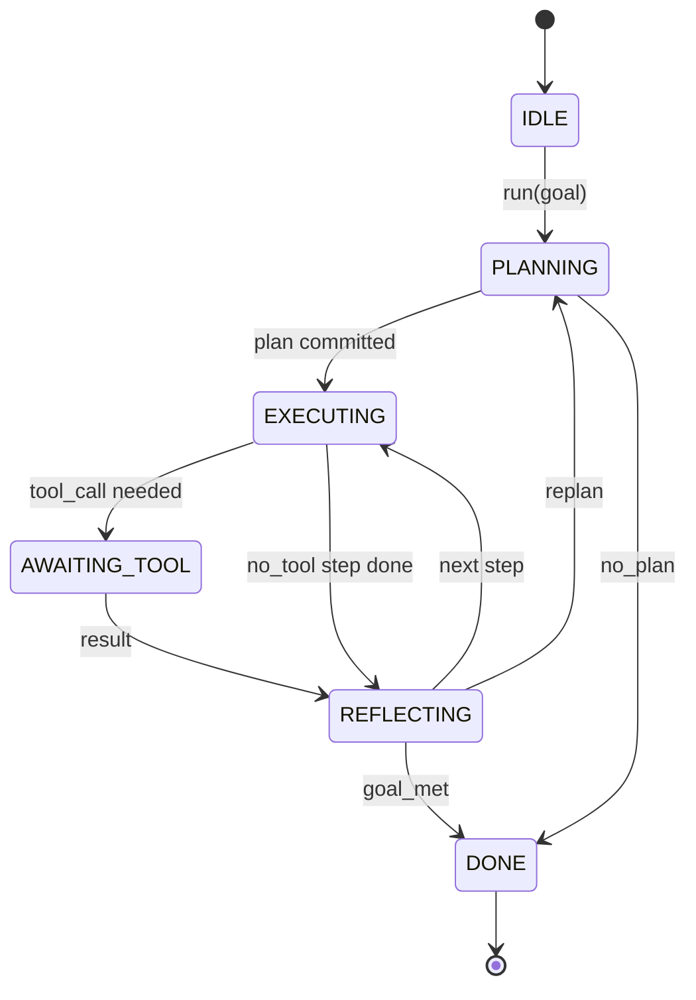

# 에이전트 하네스 루프 계약

> 하네스가 에이전트입니다. 모델은 보조 프로세서입니다. 이 강의에서는 모든 모델을 연결할 수 있는 루프 계약을 고정합니다.

**유형:** Build
**언어:** Python
**선수 요건:** 13단계 01-07강 및 14강단계 01강
**시간:** 약 90분

## 학습 목표
- 명시적 전이를 가진 결정적 상태 기계로 에이전트 하네스 루프를 지정해 보세요.
- 운영자가 정책, 텔레메트리, 가드레일을 연결하는 10가지 생명주기 훅 주제를 구현해 보세요.
- 루프가 제어권을 호출자에게 반환하고 새로운 입력으로 재개하는 두 개의 풀 포인트를 정의해 보세요.
- 초과 시 부분 상태가 유출되지 않도록 세션별 예산(턴, 도구 호출, 벽 시계)을 강제해 보세요.
- 11가지 이벤트 타입의 타입 지정된 스트림을 방출하여 다운스트림 UI와 트레이서가 루프를 직접 검사하지 않고도 구독할 수 있도록 해 보세요.

```figure
cf-loop-contract
```

## 프레임

40턴 동안 무인 상태로 실행되는 코딩 에이전트는 채팅 루프가 아닙니다. 운영자가 노드를 가로채고 엣지를 감사할 수 있는 상태 기계입니다. 계약을 문서화하면 모델, 도구, 정책의 교체는 리팩토링이 아니라 등록 호출이 됩니다.

이 강의는 그 계약을 구축합니다. 6가지 상태, 10가지 훅 주제, 2가지 풀 포인트, 11가지 이벤트 타입, 예산 범위를 정의합니다. 하네스의 나머지 모든 부분(도구 레지스트리, JSON-RPC 전송, 디스패처, 플래너)은 이 형태에 연결됩니다.

## 상태

루프에는 6가지 상태가 있습니다. 5가지는 활성 상태이고, 1가지는 종단 상태입니다.



`IDLE`은 유일한 합법적 진입점입니다. `DONE`은 유일한 합법적 출구입니다. `AWAITING_TOOL`는 풀 포인트를 생성하는 유일한 상태입니다. 다른 모든 전이는 내부적입니다.

상태 기계는 결정적입니다. 동일한 이벤트 로그가 주어지면 하네스는 동일한 상태로 재진입합니다. 이 특성 덕분에 모델을 다시 호출하지 않고도 디버깅을 위해 세션을 재생할 수 있습니다.

## 훅 주제

훅은 루프에 대한 운영자의 접점입니다. 하네스는 10가지 주제를 발화합니다. 각 주제는 임의 수의 구독자를 허용합니다. 구독자는 등록 순서대로 발화됩니다. 구독자는 페이로드를 변경하거나, 예외를 발생시켜 턴을 중단하거나, 다음 단계를 건너뛰기 위해 센티널을 반환할 수 있습니다.

```text
before_plan         after_plan
before_tool_call    after_tool_call
before_step         after_step
on_error
on_pause
on_budget_exceeded
on_complete
```

이 형태는 Claude Code, Cursor, OpenCode가 2025년 중반까지 모두 수렴한 것과 유사합니다. 이름은 기능적이며, 브랜드화된 것이 아닙니다. `rm -rf`을 차단하는 훅은 `before_tool_call`에 위치합니다. OpenTelemetry 스팬을 전송하는 훅은 `after_step`에 위치합니다. 일시 중지된 세션에서 재개하는 훅은 `on_pause`에 위치합니다.

## 풀 포인트

루프는 두 번 제어권을 양도합니다. 첫 번째는 `AWAITING_TOOL`에서 도구 결과 없이는 진행할 수 없을 때입니다. 두 번째는 `on_pause`에서 예산이 소진되거나 훅이 명시적으로 인간 검토를 요청할 때입니다.

풀 포인트는 예외가 아닙니다. 반환입니다. 호출자는 하네스 상태를 검사하고, 하네스가 요청한 것을 가져온 후 `resume(payload)`을 호출합니다. 하네스는 중단된 지점부터 다시 시작합니다. 이는 Python 제너레이터와 동일한 형태입니다. 풀 포인트를 통한 전송 방식은 선택 사항입니다. TUI에서는 키 입력입니다. MCP에서는 `tools/call`입니다. 큐에서는 작업 폴링입니다.

## 이벤트 스트림

루프는 계약의 특정 지점에서 타입이 지정된 스트림에 이벤트를 추가합니다. 스트림은 추가 전용이며, 구독자는 오프셋에서 재생할 수 있습니다. 구현된 11가지 이벤트 타입은 다음과 같습니다:

- `session.start` — `run(goal)`이 호출될 때 한 번 방출
- `plan.draft` — 플래너가 초안 계획을 반환할 때 방출
- `plan.commit` — 초안이 활성 계획으로 커밋된 후 방출
- `step.start` — 각 실행 단계의 시작 시 방출
- `step.end` — 각 실행 단계의 종료 시 방출
- `tool.call` — 도구 필요 단계가 호출자에게 제어권을 양도할 때 방출
- `tool.result` — 도구 결과와 함께 재개될 때 방출
- `tool.error` — 오류와 함께 재개되거나 훅이 호출을 중단할 때 방출
- `budget.warn` — 예산 한도에 도달할 때 방출
- `session.pause` — 루프가 일시 중지(예산 또는 훅)로 양도할 때 방출
- `session.complete` — 루프가 `DONE`에 도달할 때 한 번 방출

이벤트는 훅 페이로드를 중복하지 않습니다. 훅은 명령형(변경, 중단)이고, 이벤트는 관측형(기록, 전송)입니다. 이 둘을 직교하는 것으로 취급하세요.

## 예산 엔벨로프

세션은 세 가지 제한을 가집니다. 턴 수, 도구 호출 수, 실시간(월클록) 초입니다. 각 턴은 턴 수를 1 증가시킵니다. 각 도구 호출은 도구 호출 수를 1 증가시킵니다. 실시간은 모든 상태 전환 시에 체크됩니다. 어떤 제한이 도달하면, 루프가 `on_budget_exceeded`를 발동하고, `budget.warn`를 방출한 후, 다음 풀 포인트에서 예산 초과 사유와 함께 `IDLE`로 전환합니다.

예산은 킬 스위치가 아닙니다. 이는 양보(yield)입니다. 호출자가 예산을 연장하고 재개할지, 아니면 세션을 종료할지 결정합니다.

## 이 강이 하지 않는 것

이 강은 모델을 호출하지 않습니다. 실제 도구를 등록하지 않습니다. 트랜스포트(전송 계층)를 구현하지 않습니다. 이 네 가지는 다음 네 강에서 다룹니다. 이 강은 계약을 확정하여, 다음 네 강이 재작성 없이 여기에 연결할 수 있도록 합니다.

`main.py`의 결정적 플래너는 대용품입니다. 세 단계의 하드코딩된 계획을 반환하며, 그중 두 단계는 도구 결과를 요구합니다. 요점은 플래너가 아니라 루프입니다.

## 코드 읽는 방법

`HarnessLoop`는 메인 클래스입니다. 상태를 유지하고, 훅을 발동하며, 이벤트를 방출합니다. `Budget`은 제한을 추적합니다. `Event`는 스트림 위의 타입 지정된 엔벨로프입니다. `HookRegistry`는 디스패치 테이블입니다. `_transition`는 상태를 변경하는 유일한 함수이므로, 상태 머신 불변 조건이 한 곳에 집중되어 있습니다.

`main.py`를 위에서 아래로 읽어 보세요. 그 다음 `code/tests/test_loop.py`를 읽어 보세요. 테스트는 모든 상태 전환과 모든 훅 발동 순서를 고정합니다.

## 더 깊이 들어가기

프로덕션에서 하네스를 구축하는 가장 어려운 부분은 상태 머신이 아닙니다. 계약을 강제 가능하게 만드는 것입니다. 계약은 플래너의 핫 리로드를 견뎌야 합니다. 잘못된 JSON을 반환하는 도구를 견뎌야 합니다. 40턴 세션의 2/3 지점에서 `before_tool_call`에서 예외를 발생시키는 훅을 견뎌야 합니다. 이 강의 테스트는 이러한 실패 모드들을 연습합니다. 실행해 보세요. 깨뜨려 보세요. 케이스를 추가하세요.

다음 강은 도구 레지스트리를 추가합니다. 그 다음에 JSON-RPC 트랜스포트가 옵니다. 그 다음에 디스패처가 옵니다. 24강이 되면, 이 파일의 루프는 실제 도구와 실제 예산이 강제되는 실제 계획을 실행하게 될 것입니다.
