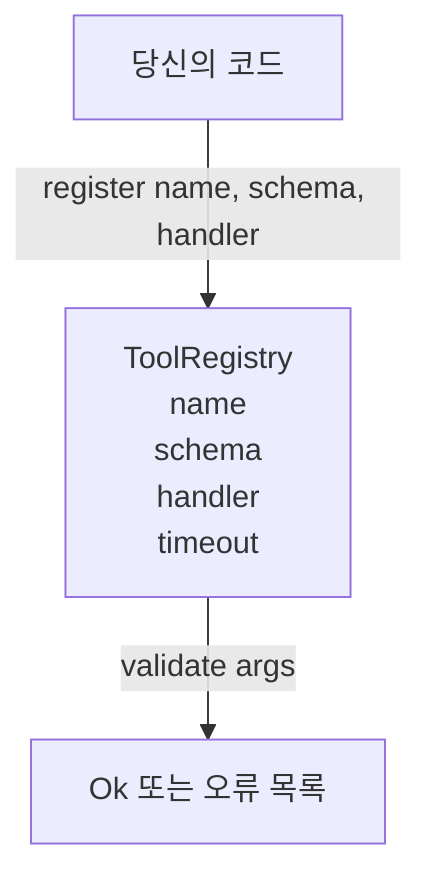

# 스키마 검증이 포함된 도구 레지스트리

> 에이전트가 검증할 수 없는 도구는 에이전트가 호출할 수 없는 도구입니다. 도구를 만들기 전에 레지스트리와 스키마 검사기를 먼저 구축하세요.

**유형:** Build
**언어:** Python
**선수 요건:** 13단계 01-07강 및 14강단계 01강
**시간:** 약 90분

## 학습 목표
- 디스패처가 한 번만 요청하고 이후에는 신뢰할 수 있는, 도구 이름 → 스키마 → 핸들러로 구성된 타입이 지정된 레지스트리를 유지하세요.
- 도구 호출의 90%가 실제로 사용하는 키워드를 포함하는 JSON Schema 2020-12 하위 집합을 구현하세요.
- 모델이 한 번의 왕복으로 스스로 수정할 수 있도록, json-pointer 형태의 정확한 오류 경로를 반환하세요.
- 명시적인 오버라이드 없이 재등록을 거부하세요. 조용한 덮어쓰기는 프로덕션 도구 카탈로그가 드리프트(drift)되는 방식이기 때문입니다.
- 검증기를 순수하게 유지하세요(I/O, 시간, 전역 변수 없음). 그러면 재생 로그(replay log)에서 다시 실행할 수 있습니다.

```figure
cf-registry-validate
```

## 도구보다 레지스트리가 먼저인 이유

2026년의 코딩 에이전트는 모델이 단일 컨텍스트 윈도우에 담을 수 있는 것보다 더 많은 등록 도구를 가지고 있습니다. 비자명한(non-trivial) 하네스는 200개의 도구를 등록하고, 특정 턴(turn)에서 10~40개를 노출합니다. 레지스트리는 "어떤 도구가 존재하는가", "그들의 인수는 어떤 형태를 취하는가", "어떤 핸들러를 호출해야 하는가"에 대한 진실의 원천(source of truth)입니다. 이 세 가지 답이 고정되면, 하네스의 나머지 부분은 추측을 멈출 수 있습니다.

우리가 피하려는 실수는 스키마 없이 핸들러를 출시하거나, 검증 없이 스키마를 출시하는 것입니다. 둘 다 흔합니다. 둘 다 다음 계층(23강의 디스패처)을 추측 게임으로 만드며, 유일한 실패 모드는 핸들러에서 나오는 스택 트레이스(stack trace)가 됩니다.

## 도구 레코드의 모습

```text
ToolRecord
  name        : str          (unique, lowercase alphanumeric and underscore segments separated by dots, e.g., snake_case.segment.case)
  description : str          (one line, shown to the model)
  schema      : dict         (JSON Schema 2020-12 subset)
  handler     : Callable     (async or sync, returns Any)
  idempotent  : bool         (dispatcher uses this for retry decisions)
  timeout_ms  : int          (override per-tool dispatcher default)
```

스키마는 검증기가 건드리는 유일한 필드입니다. 핸들러는 검증기에 대해 불투명(opaque)합니다. 우리는 의도적으로 이 둘을 분리합니다. 스키마는 데이터입니다. 핸들러는 코드입니다. 이 둘을 섞으면 핸들러 내부에 검증 로직을 넣게 되며, 이것이 우리가 막으려는 버그입니다.

## JSON Schema 2020-12 하위 집합

2020-12 전체 사양은 논문입니다. 우리는 8개의 키워드가 필요합니다.

```text
type           string / number / integer / boolean / object / array / null
properties     map of property name -> schema
required       list of property names
enum           list of allowed primitive values
minLength      integer, applies to strings
maxLength      integer, applies to strings
pattern        ECMA-262-compatible regex, applies to strings
items          schema applied to every array element
```

이것은 도구 API가 실제로 필요로 하는 것을 충분히 다루기에 충분합니다. 추가하지 않는 키워드(oneOf, anyOf, allOf, $ref, 조건부)는 프로덕션 스키마에서 유효하지만, 검증기를 사이클이 있는 트리 순회기로 만듭니다. 우리는 JSON Schema 엔진이 아니라 레지스트리를 구축하고 있습니다.

## JSON 포인터 오류 경로

검증이 실패하면 검증기는 오류 목록을 반환합니다. 각 오류는 입력에 대한 JSON 포인터 경로를 포함합니다. 포인터는 슬래시로 시작하는 속성 이름과 배열 인덱스의 시퀀스입니다.

```text
{"a": {"b": [1, 2, "x"]}}
                    ^
                    /a/b/2
```

모델은 문장보다 오류 경로를 더 잘 읽습니다. 스키마가 `args.user.email`을 요구하는데 모델이 정수를 전달했다면, 오류는 `/user/email`이며 `expected_type: string`이어야 합니다. 모델은 자연어 라운드 없이 다음 호출에서 이를 수정합니다.

## 등록 및 덮어쓰기

`register(name, schema, handler, **opts)`은 기본적으로 재등록을 거부합니다. 호출자는 `override=True`을 전달하여 대체해야 합니다. 이는 운영 위생입니다. 코드베이스의 두 부분이 동일한 도구 이름을 조용히 등록하는 것은 프로덕션에서 찾는 데 일주일 걸리는 종류의 버그입니다.

레지스트리는 세 개의 읽기 메서드를 노출합니다. `get(name)`은 레코드를 반환하거나 예외를 발생시킵니다. `validate(name, args)`은 `Ok` 또는 오류 목록을 반환합니다. `names()`은 등록 순서대로 도구 이름을 반환합니다.

## 검증기가 무엇이며 무엇인지 아닌지

스키마 트리를 재귀적으로 한 번 순회합니다. 순수합니다. 핸들러를 호출하지 않습니다. 타입을 강제하지 않습니다(문자열 `"42"`은 숫자 스키마를 통과하지 못합니다). 조용히 잘라내지 않습니다.

보안 경계가 아닙니다. 악성 핸들러는 검증이 통과된 후에도 여전히 잘못 동작할 수 있습니다. 23강의 디스패처는 타임아웃 및 샌드박스 레이어를 추가합니다. 레지스트리는 형태를 추가합니다.

## 형태



## 코드를 읽는 방법

`code/main.py`는 `ToolRegistry`, `ToolRecord`, `ValidationError` 및 8개의 검증 함수를 정의합니다. 검증기는 `schema["type"]`에 따라 분기하며, `enum`가 있는 스키마는 타입 없는 enum 검사로 처리합니다. 각 타입 검증기는 빈 리스트 또는 `ValidationError` 리스트를 반환합니다. 최상위 워커는 오류를 연결하고, 하위 계층으로 내려갈 때 경로 세그먼트를 앞에 붙입니다.

`code/tests/test_registry.py`는 등록, 덮어쓰기, 검증 성공, 경로가 포함된 검증 실패, 그리고 하위 집합의 모든 키워드를 다룹니다.

## 더 깊이 들어가기

이 강의를 완료한 후 원하게 될 두 가지 확장 기능은 로컬 definitions 블록에 대한 `$ref` 해석과 엄격한 형태를 위한 `additionalProperties: false`입니다. 둘 다 작습니다. 도구 카탈로그가 50개를 넘으면 둘 다 흔하게 추가됩니다. 파일이 한 번 읽는 분량을 넘지 않도록 강의에서는 이를 제외했습니다.

다음 강의(22강)는 이 레지스트리를 모델 클라이언트에 노출하는 JSON-RPC stdio 전송을 구축합니다. 그 다음 강의(23강)는 둘 다 타임아웃과 재시도가 있는 디스패처 뒤에 감쌉니다.
