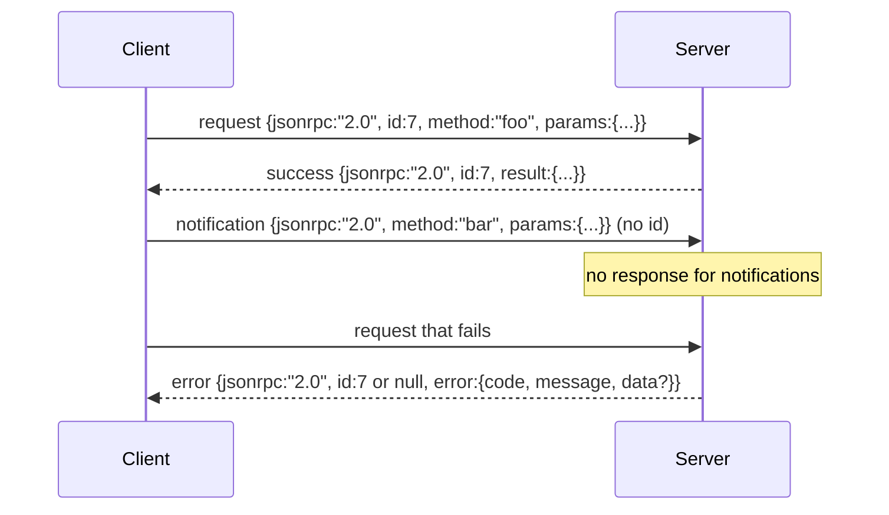

# 줄 구분자 기반 표준 입출력(Stdio)를 통한 JSON-RPC 2.0

> 모델 클라이언트와 도구 서버 간의 전송은 표준 입출력(stdio)를 통한 JSON-RPC입니다. 한 번 직접 구현해 보면 모든 프레이밍 계층이 무엇을 위해 존재하는지 이해할 수 있습니다.

**유형:** Build
**언어:** Python
**선수 요건:** 13단계 01-07강 및 14강단계 01강
**시간:** 약 90분

## 학습 목표
- 표준 입력(stdin)과 표준 출력(stdout)를 통해 줄 구분자 기반 JSON으로 프레이밍된 JSON-RPC 2.0을 구사할 수 있습니다.
- 5가지 표준 오류 코드(-32700, -32600, -32601, -32602, -32603)를 매핑하고 올바른 의미로 처리할 수 있습니다.
- 새로운 엔벨로프 키를 만들지 않고 요청, 응답, 알림, 배치를 구분할 수 있습니다.
- 나머지 스트림을 오염시키지 않으면서 한 줄에 대한 파싱 오류를 처리할 수 있습니다.
- io.BytesIO를 사용하여 자식 프로세스를 생성하지 않고도 실행되는 자기 종료 데모를 구축할 수 있습니다.

```figure
cf-jsonrpc-frames
```

## JSON-RPC가 공통 언어로 남는 이유

2026년의 코딩 에이전트(Coding Agent)는 한 세션에서 최대 12개의 도구 서버와 통신합니다. 각 서버는 독립적인 프로세스이거나 원격 엔드포인트입니다. 와이어 형식은 2013년 이후 동일합니다. JSON-RPC 2.0은 2페이지 규격입니다. 대안(gRPC, 호출별 HTTP, 사용자 정의 바이너리)은 JSON-RPC가 하지 않는 트레이드오프를 강요하기 때문에 JSON-RPC가 살아남습니다. 대안들은 스트리밍, 배치, 전송 결합 중 하나를 선택합니다. JSON-RPC는 stdio, 소켓, 웹소켓, HTTP에 걸쳐 대칭적이며, 규격을 준수하는 클라이언트는 처음 보는 서버도 제어할 수 있습니다.

이 강의는 stdio 변형을 구축합니다. 줄 구분자 기반 JSON입니다. 각 요청은 한 줄입니다. 각 응답은 한 줄입니다. 전송 경계는 `\n`입니다.

## 와이어 형식

4가지 엔벨로프 형식이 존재합니다. 두 가지는 클라이언트가 발화하고, 두 가지는 서버가 발화합니다.



알림(Notification)에는 `id`이 없습니다. 서버는 이에 응답하지 않아야 합니다. 서버가 알림에 응답을 반환하면 클라이언트는 이를 호출 지점에 연결할 방법이 없습니다. 이 단일 규칙이 프레이밍 연산을 단순하게 유지합니다.

배치는 요청 또는 알림의 JSON 배열입니다. 서버는 알림이 아닌 항목마다 하나씩, 임의의 순서로 응답 배열을 반환합니다. 배치의 모든 항목이 알림인 경우, 서버는 아무것도 보내지 않습니다.

## 5가지 오류 코드

```text
-32700  Parse error      JSON could not be parsed
-32600  Invalid Request  Envelope shape is wrong
-32601  Method not found
-32602  Invalid params
-32603  Internal error
```

-32000강 -32099 사이의 코드는 서버 정의 오류를 위해 예약되어 있습니다. 그 외의 모든 코드는 애플리케이션 정의입니다. 이 강의는 5가지 코드만 다룹니다. 핸들러가 예외를 발생시키면, 트랜스포트는 `data.exception`에 예외 클래스 이름을 포함하여 -32603으로 감싸서 처리합니다.

구문 분석 오류에는 특별한 규칙이 있습니다. 응답의 `id`는 `null`입니다. 요청이 id를 추출할 만큼 충분히 구문 분석되지 않았기 때문입니다.

## 줄바꿈 프레이밍과 BytesIO 데모

트랜스포트는 한 번에 한 줄씩 읽습니다. 한 줄은 `\n`을 포함하여 그까지의 바이트입니다. 줄을 구문 분석할 수 없는 경우, 트랜스포트는 `id: null`을 포함하여 -32700 응답을 작성하고 계속 진행합니다. 스트림은 오염되지 않습니다. 다음 줄은 새로 구문 분석됩니다.

이 강의에서는 `io.BytesIO` 쌍을 stdin과 stdout으로 감쌉니다. 서버는 EOF까지 요청을 읽고, 각각에 대해 응답을 작성한 후 반환합니다. 클라이언트는 응답을 다시 읽습니다. 프로세스 생성이 없습니다. 타임아웃이 없습니다. Python의 `io` 인터페이스가 동일한 `.readline()` 및 `.write()` 계약을 제시하므로, 트랜스포트의 동작은 실제 하위 프로세스 파이프와 동일합니다.

## 메서드 디스패치

트랜스포트는 어떤 메서드가 존재하는지 알지 못합니다. 하네스가 제공하는 호출 가능한 `handler(method, params)`에 전달합니다. 핸들러는 결과를 반환하거나 예외를 발생시킵니다. 세 가지 예외 클래스가 특정 코드를 드러냅니다.

```text
MethodNotFound -> -32601
InvalidParams  -> -32602
Anything else  -> -32603 with exception name in data
```

트랜스포트는 도구 레지스트리를 보지 못합니다. 레지스트리는 핸들러 뒤에 있습니다. 이것이 우리가 원하는 계층화입니다. 트랜스포트는 JSON-RPC를 말하고, 레지스트리는 도구 형태를 말하며, 디스패처(23강)가 이 둘을 연결합니다.

## 오류 발생 시 스트림 동작

```text
client writes              server reads             server writes
---------------            -----------              -------------
{...valid request...}      parses ok                {...response, id matches...}
{...broken json...         parse fails              {id:null, error: -32700}
{...valid request...}      parses ok                {...response, id matches...}
{...missing method...}     invalid envelope         {id:X, error: -32600}
```

손상된 JSON 줄은 루프를 멈추지 않습니다. `method` 필드가 누락되어도 루프를 멈추지 않습니다. 핸들러 예외도 루프를 멈추지 않습니다. 트랜스포트는 EOF까지 계속 읽습니다.

## 알림 및 비대칭 흐름

알림은 fire-and-forget 방식입니다. 하네스는 진행 상황 이벤트, 취소 신호, 로그 라인을 위해 알림을 사용합니다. 알림은 긴 시간 실행되는 도구가 각각의 요청 왕복 없이 상태 업데이트를 스트리밍하는 방법입니다.

이 강의는 하나의 발신 알림 헬퍼 `write_notification`를 구현합니다. 서버는 요청이 처리 중일 때 진행 상황을 방출하기 위해 이를 사용합니다. 데모는 패턴을 보여줍니다: 요청이 들어오면 핸들러가 두 개의 진행 알림을 방출한 후 최종 응답을 작성합니다.

## 코드를 읽는 방법

`code/main.py`는 `StdioTransport`, 파싱 헬퍼 (`parse_request`), 세 개의 쓰기 헬퍼 (`write_response`, `write_error`, `write_notification`), 그리고 디스패치 루프 `serve`를 정의합니다. 에러 코드 상수는 모듈 스코프에 있습니다.

`code/tests/test_transport.py`는 다섯 개의 에러 코드, 알림 (응답이 작성되지 않음), 배치 (배열 입력, 배열 출력, 알림 건너뛰기), 깨진 JSON (파싱 오류 후 계속), 그리고 핸들러가 호출 중 알림을 작성하는 비대칭 흐름을 다룹니다.

## 더 깊이 들어가기

이 전송 방식은 이후 강의에 충분합니다. 프로덕션 전송 방식은 세 가지를 추가합니다. 전달을 통해 유지되는 상관 ID 필드 (여러분의 `id`가 이미 이 역할을 하지만, 메시에서는 외부 추적 ID도 필요합니다). 취소 채널 (처리 중인 호출의 ID를 가진 `$/cancelRequest`와 같은 알림). 그리고 같은 소켓이 JSON-RPC와 Streamable HTTP를 모두 처리할 수 있도록 하는 콘텐츠 타입 협상 핸드셰이크입니다. 이 모든 것은 와이어를 변경하지 않습니다. 메타데이터를 추가할 뿐입니다.
