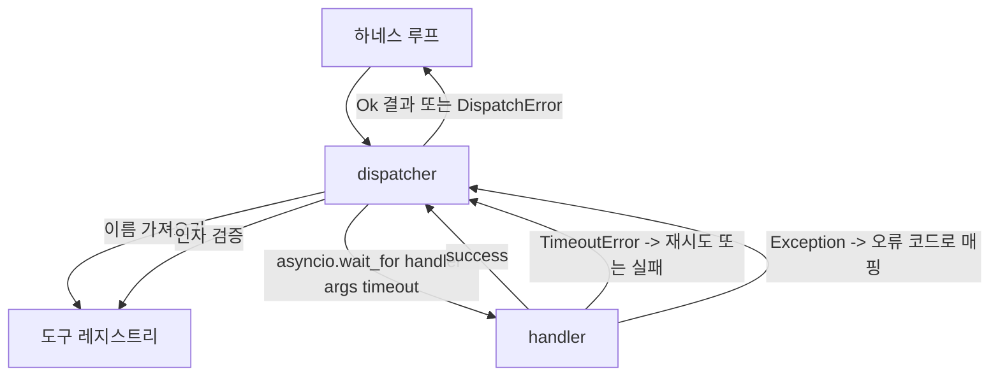

# 함수 호출 디스패처

> 디스패처는 스키마가 약속한 모든 것에 대해 하네스가 비용을 치르는 지점입니다. 타임아웃, 재시도, 중복 제거, 오류 매핑. 모두 하나의 접합부에서 처리됩니다.

**유형:** Build
**언어:** Python
**선수 요건:** 13단계 01-07강 및 14강단계 01강
**시간:** 약 90분

## 학습 목표
- 도구 핸들러를 호출별 타임아웃으로 감싸서, 루프가 멈추는 대신 타입이 지정된 오류를 반환하도록 해 보세요.
- 지터(jitter)와 최대 시도 횟수를 포함한 지수 백오프 재시도를 적용해 보세요.
- 멱등성 키(idempotency key)로 재시도를 중복 제거하여, 느린 원본 요청과 경쟁하는 재시도가 두 번 실행되지 않도록 해 보세요.
- 핸들러 예외와 전송 장애를 하네스 루프가 이미 이해하는 단일 오류 인벨로프(error envelope)로 매핑해 보세요.
- 병렬 디스패치를 동시성 제한으로 제한하여, 40개 도구 호출의 팬아웃(fan-out)이 이벤트 루프를 고갈시키지 않도록 해 보세요.

```figure
cf-dispatch-retry
```

## 디스패처가 위치하는 곳

하네스 루프(20강)와 도구 레지스트리(21강) 사이에 위치합니다. 전송 계층(22강)이 루프에 데이터를 공급합니다. 루프는 도구 호출을 디스패처에 전달합니다. 디스패처는 레지스트리를 호출하고, 핸들러를 실행하며, 결과 또는 JSON-RPC 형식의 오류 인벨로프를 반환합니다.



디스패처는 타이머, 재시도, 멱등성을 아는 유일한 계층입니다. 루프는 알지 못합니다. 레지스트리도 알지 못합니다. 핸들러도 알지 못합니다. 그 격리가 핵심입니다.

## 타임아웃

각 도구에는 기본 타임아웃이 있습니다. 레지스트리 레코드는 `timeout_ms`을 포함합니다. 하네스가 호출별 오버라이드를 전달하면 디스패처가 이를 오버라이드합니다. `asyncio.wait_for`을 사용합니다. 타임아웃 발생 시, 핸들러 작업이 취소되고 디스패처는 `DispatchError(kind="timeout")`을 반환합니다.

멱등성이 없는 도구에 대해 시간 초시는 기본적으로 재시도 가능한 오류가 아닙니다. `db.write`가 시간 초시를 겪은 경우, 커밋되었을 수도 있고 커밋되지 않았을 수도 있습니다. 재시도는 쓰기를 중복시킵니다. 디스패처는 레지스트리 레코드의 `idempotent` 플래그를 따릅니다. 멱등성 있는 도구는 재시도합니다. 멱등성 없는 도구는 재시도하지 않습니다.

## 지수 백오프를 사용하는 재시도

재시도 정책은 최대 세 번의 시도입니다. 백오프는 지수 백오프이며 지터가 포함됩니다.

```text
attempt 1  -> delay 0
attempt 2  -> delay 0.1s * (1 + random[0..0.5])
attempt 3  -> delay 0.4s * (1 + random[0..0.5])
```

`timeout` 및 `transient` 오류만 재시도합니다. `schema` 오류, `not_found`, 또는 `internal` 오류는 재시도하지 않습니다. 스키마 오류는 결정적입니다. 재시도해도 결과가 변하지 않으며 예산을 소진합니다.

재시도 루프는 하네스의 예산을 따릅니다. 호출자의 예산에 남은 도구 호출이 0이면, 디스패처는 첫 번째 시도에서 즉시 실패하며 `kind="budget_exceeded"`를 반환합니다.

## 멱등성 키 중복 제거

원래 호출이 아직 진행 중일 때 재시도가 실행되는 것은 실제 프로덕션 버그입니다. 첫 번째 호출이 4.9초(시간 초시 직전)에서 멈추면, 재시도가 5초에 실행됩니다. 이제 두 요청이 동일한 백엔드와 경쟁합니다. 도구가 `payments.charge`인 경우, 두 번 청구됩니다.

디스패처는 선택적인 `idempotency_key`를 허용합니다. 호출이 도착했을 때 동일한 키가 진행 중이면, 디스패처는 진행 중인 future를 기다리고 그 결과를 반환합니다. 캐시는 늦은 재시도를 흡수하기 위해 완료 후 60초 동안 키를 유지합니다.

키는 호출자의 책임입니다. 하네스는 플래너에서 이를 파생합니다: `f"{step_id}:{tool_name}:{hash(args)}"`. 디스패처는 키를 발명하지 않습니다. 인자만으로 키를 파생하면 두 개의 의미적으로 다른 호출이 동일해 보이기 때문입니다.

## 오류 엔벨로프

실패한 디스패치는 단일 형태를 반환합니다.

```text
DispatchError
  kind        : "timeout" | "transient" | "schema" | "not_found" | "internal" | "budget_exceeded"
  message     : str
  attempts    : int
  jsonrpc_code: int   (one of -32601, -32602, -32603)
```

하네스 루프는 `kind`를 다음 상태로 매핑합니다. `schema` 및 `not_found`는 `on_error`로 이동하며 재계획을 트리거합니다. `timeout` 및 `transient`는 `on_error`로 이동하며, 시도 횟수에 따라 재계획을 트리거할 수도 있고 하지 않을 수도 있습니다. `budget_exceeded`는 `on_budget_exceeded`를 트리거합니다.

## 팬아웃에 대한 동시성 제한

`gather(*calls)`는 모든 코루틴을 동시에 실행합니다. 40개의 도구 호출이 있으면, 40개의 열린 소켓이나 40개의 하위 프로세스 파이프가 열립니다. 대부분의 백엔드는 한 클라이언트에서 40개의 병렬 연결을 좋아하지 않습니다.

디스패처는 `gather`을 세마포어로 감쌉니다. 기본 동시성 제한은 8입니다. 각 호출은 디스패치하기 전에 세마포어를 획득하고 완료 시에 해제합니다. 호출자는 `gather` 형태의 출력을 보지만, 실제 스케줄링은 제한되어 있습니다.

## 단일 호출의 흐름

```mermaid
flowchart TD
    start(["caller: dispatch name, args, opts"])
    validate["registry.validate name, args"]
    schema_err["DispatchError kind=schema"]
    idem_check{idempotency cache?}
    in_flight["기존 future를 await"]
    cached["캐시된 결과 반환"]
    attempt["asyncio.wait_for handler args, timeout"]
    success["캐시 + 결과 반환"]
    timeout_branch{TimeoutError + idempotent?}
    retry["백오프 재시도(Retry with Backoff)"]
    fail["DispatchError"]
    transient_branch{TransientError?}
    other["Exception을 kind에 매핑, 재시도 없음"]
    exhausted["DispatchError"]

    start --> validate
    validate -->|errors| schema_err
    validate -->|ok| idem_check
    idem_check -->|진행 중(hit in flight)에 해당| in_flight
    idem_check -->|최근(hit recent)에 해당| cached
    idem_check -->|miss| attempt
    attempt --> success
    attempt --> timeout_branch
    timeout_branch -->|yes| retry
    timeout_branch -->|no| fail
    attempt --> transient_branch
    transient_branch -->|예, 시도 횟수 남음| retry
    transient_branch -->|exhausted| exhausted
    attempt --> other
    retry --> attempt
```

## 코드 읽는 방법

`code/main.py`은 `Dispatcher`, `DispatchError`, `TransientError`를 정의합니다. 디스패처는 생성 시 레지스트리를 받습니다. async `dispatch(name, args, ...)`가 유일한 진입점입니다. 시도별 타임아웃은 `_run_with_retries` 내부에서 `asyncio.wait_for`를 사용하여 인라인으로 적용됩니다. `gather_bounded(calls)`은 동시성 제한을 사용하여 여러 디스패치를 실행합니다.

`code/tests/test_dispatcher.py`은 타임아웃 발동, 일시적 오류 시 재시도, 스키마 오류 시 재시도 없음, 멱등성 중복 제거(동일한 키로 두 개의 동시 호출이 하나의 핸들러 호출로 수렴), 동시성 제한(세마포어 작동)을 다룹니다.

테스트는 `asyncio.sleep(0)`와 결정적인 `Counter` 기반 핸들러를 사용하므로, 밀리초 안에 완료되며 벽시계 시간(wall-clock timing)에 의존하지 않습니다.

## 더 나아가기

프로덕션 디스패처가 추가하는 두 가지 확장 기능이 있습니다. 첫째, 모든 전환 시에 구조화된 로깅(루프의 이벤트 스트림이 이미 제공하지만, 디스패처는 `dispatch.attempt` 및 `dispatch.retry` 이벤트도 방출해야 합니다). 둘째, 서킷 브레이커(Circuit Breaker): 윈도우 내 N번의 실패 후, 도구는 쿨다운 기간을 가지며, 핸들러를 시도하는 대신 `kind="circuit_open"`로 즉시 디스패치를 반환합니다. 둘 다 계약(contract)을 변경하지 않고 이 디스패처 위에 적용할 수 있습니다.

24강은 디스패처를 계획 및 실행(plan-and-execute) 에이전트(Agent)에 연결하여 네 가지 요소가 모두 작동하는 것을 볼 수 있습니다.
