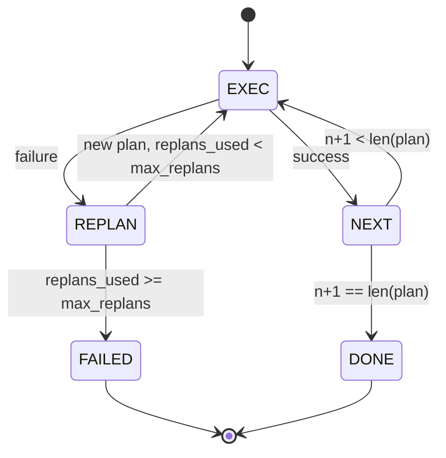

# 계획-실행 제어 흐름

> 실패를 견디지 못하는 계획은 스크립트입니다. 재계획이 가능한 스크립트는 에이전트입니다. 재계획기를 먼저 구축하세요.

**유형:** Build
**언어:** Python
**선수 요건:** 13단계 01-07강 및 14강단계 01강
**시간:** 약 90분

## 학습 목표
- 계획을 타입이 지정된 단계의 순서 있는 목록으로 표현하여, 실행기가 진행 상황과 결과를 추론할 수 있도록 하세요.
- 단계들을 순차적으로 실행하며, 실패 시 계획기로 제어된 핸드오프를 수행하세요.
- 현재 커서 위치에서 이전 오류를 컨텍스트에 포함하여 재계획함으로써, 다음 계획이 정보를 반영하도록 하세요.
- 각 개정 시 계획 차이를 방출하여, 다운스트림 트레이서나 UI가 계획이 변경된 이유를 표시할 수 있도록 하세요.
- 두 가지 예산을 강제하세요: 하드 단계 상한과 하드 재계획 상한.

```figure
cg-plan-replan
```

## 계획하고 실행하기, 사고의 연쇄(CoT)가 아닌

사고의 연쇄(CoT) 에이전트는 토큰을 방출하고 루프가 도구 호출이 끝나는 위치를 추측하게 합니다. 계획-실행 에이전트는 먼저 구조화된 계획을 방출한 후, 각 단계를 결정적으로 실행합니다. 계획은 하네스가 내부를 들여다볼 수 있는 데이터입니다. 실행은 하네스가 그 데이터를 디스패처를 통해 실행하는 것입니다.

두 부분입니다. 계획을 생성하는 계획기. 계획을 실행하는 실행기. 흥미로운 작업은 실행기가 실패에 도달했을 때 일어나는 일입니다. 세 가지 옵션:

```text
1. Abort         (return failed, surface the error)
2. Skip          (mark step failed, continue with the rest)
3. Replan        (hand the error to the planner, get a new plan from the cursor)
```

재계획은 스크립트를 에이전트로 바꾸는 것입니다.

## 단계의 형태

```text
Step
  id              : int           (monotonic within a plan revision)
  tool_name       : str
  args            : dict
  expected_outcome: str           (planner's stated success condition)
  result          : Any | None
  error           : str | None
```

`expected_outcome`는 계획기가 단계와 함께 방출하는 짧은 문장입니다. 실행기가 이를 강제하지는 않습니다. 두 가지 용도가 있습니다: 재계획기는 계획을 개정할 때 이를 읽습니다; 이벤트 스트림은 이를 방출하여 트레이서가 "이 단계는 X를 수행해야 했다"를 표시할 수 있도록 합니다.

## 계획기의 형태

```python
def planner(goal: str, history: list[Step], last_error: str | None) -> list[Step]:
    ...
```

순수 함수입니다. `goal`는 사용자 목표입니다. `history`는 이미 실행된 단계들(결과와 오류가 채워진 상태)입니다. `last_error`는 첫 호출에서는 None이고, 이후 모든 호출에서는 가장 최근의 실패 메시지입니다. 계획기는 커서부터 다음 계획을 반환합니다.

계획기는 실행기에 대해 알지 못합니다. 재시도에 대해 알지 못합니다. 타임아웃에 대해 알지 못합니다. 계획을 생성합니다. 그것이 전부입니다.

## 실행기

실행기는 작은 상태 머신입니다. 각 단계는 디스패처를 통해 실행됩니다. 결과는 세 가지 중 하나입니다: 성공, 재계획 가능한 실패, 치명적 실패. 재계획 가능한 실패는 플래너에게 다시 전달됩니다. 치명적 실패(예산 초과, 재계획 한도 도달)는 `FAILED` 세션 결과를 반환합니다.



## 수정 시 계획 차이

플래너가 실패 후 새로운 계획을 반환하면, 실행기는 세 개의 필드를 가진 `plan.diff` 이벤트를 방출합니다.

```text
removed: list of step ids that were in the old plan and are not in the new
added  : list of step ids in the new plan that were not in the old
revised: list of step ids whose tool_name or args changed
```

트레이서나 UI는 제거된 단계에 취소선을, 추가된 단계에 강조 표시를 렌더링할 수 있습니다. 핵심은 차이(diff) 형식이 아닙니다. 핵심은 수정이 조용한 재작성이 아니라 가시적인 이벤트라는 점입니다.

## 두 개의 예산, 모두 하드

`max_steps`는 재계획을 포함하여 전체 세션의 총 단계 실행 횟수를 제한합니다. 기본값은 12입니다. 선형 5단계 계획이 두 번 재계획되고 매번 3단계가 추가되면 16번의 실행이 발생하여 예산을 초과합니다. 실행기는 재계획을 거부하고 FAILED를 반환합니다.

`max_replans`는 첫 번째 계획 이후 플래너가 호출되는 횟수를 제한합니다. 기본값은 5입니다. 이것이 더 중요한 제한입니다. 플래너가 같은 깨진 계획을 연속으로 5번 반환하면 단계 예산이 이를 잡을 때까지 무한 루프에 빠질 수 있습니다. 재계획을 제한하면 실패가 더 빨라지고 원인이 더 명확해집니다.

## 이 강의의 결정적 플래너

이 강의에서는 모델을 호출하지 않습니다. 이 강의는 `last_error`에 기반하여 계획을 선택하는 결정적 플래너를 제공합니다.

```text
last_error is None    -> emit a four-step plan
last_error matches X  -> emit a three-step plan that routes around X
last_error matches Y  -> emit a two-step plan that gives up gracefully
otherwise             -> return [] (signals nothing to replan)
```

이것은 성공, 한 번 재계획, 두 번 재계획, 재계획 소진, 단계 예산 소진 등 모든 전환 경로에서 실행기의 동작을 테스트하기에 충분합니다.

## 결과 형식

```text
SessionResult
  status      : "completed" | "failed"
  reason      : str     ("goal_met" | "step_budget" | "replan_budget" | "no_plan")
  history     : list[Step]
  revisions   : list[PlanDiff]
  events      : list[Event]
```

20강의 하네스 루프는 이 결과를 직접 읽을 수 있습니다. 23강의 디스패처는 각 단계를 실행합니다. 21강의 레지스트리는 각 단계의 인수를 검증합니다. 22강의 트랜스포트는 이 전체 흐름을 JSON-RPC를 통해 모델 클라이언트로 노출합니다.

## 코드를 읽는 방법

`code/main.py`는 `PlanExecuteAgent`, `Step`, `PlanDiff`, `SessionResult` 및 결정적 플래너를 정의합니다. 실행기는 `SessionResult`를 반환하는 단일 `run(goal)` 메서드입니다. 계획 차이는 단계 ID와 `(tool_name, args)` 튜플을 비교하여 계산됩니다.

`code/tests/test_agent.py`는 선형 성공, 한 번 재계획하는 중간 계획 실패, `failed:replan_budget`를 반환하는 재계획 소진, 단계 예산 소진 및 계획 차이 이벤트 형식을 다룹니다.

## 더 깊이 들어가기

이것을 실제 모델에 연결하면 원하게 될 두 가지 확장 기능이 있습니다. 첫째, 부분 계획 캐싱: 6단계 중 처음 3단계가 성공한 후 실패하는 경우, 처음 3단계를 다시 실행하지 않기를 원합니다. 실행기는 이미 기록을 유지하고 있으므로, 플래너는 이를 읽기만 하면 됩니다. 둘째, 병렬 분기: 현재 실행기는 엄격하게 순차적입니다. 독립적인 분기(`next_step` 대신 `gather_step`)를 생성하는 플래너는 디스패처를 통해 두 개의 도구 호출을 동시에 실행할 수 있습니다.

두 기능 모두 실제 복잡성을 추가합니다. 선형 실행기가 고정된 후 추가하는 것이 더 쉽습니다. 이 강의가 바로 그 역할을 합니다.
