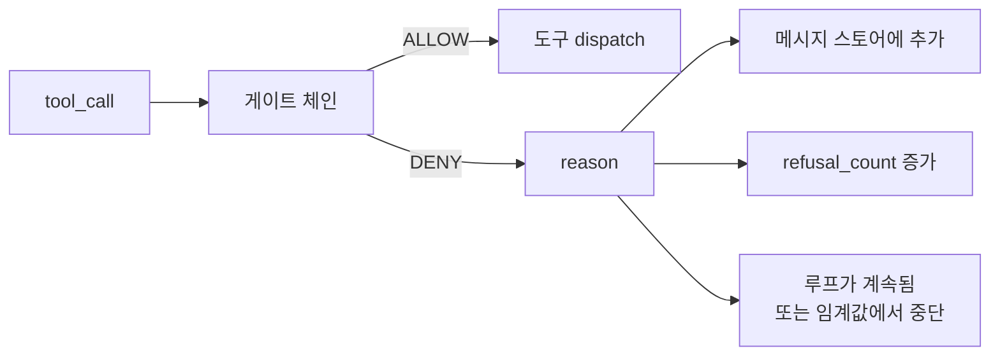
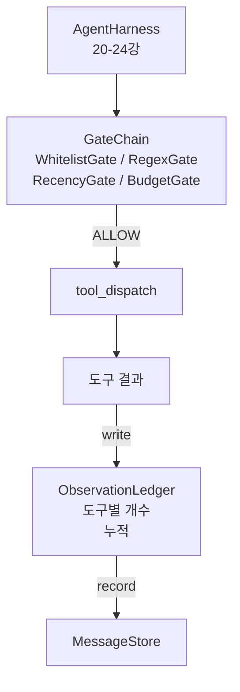

# 캡스톤 25강: 검증 게이트와 관측 예산

> 검증 계층이 없는 에이전트 하네스(Agent Harness)는 트렌치코트 속의 소원입니다. 이 강의에서는 도구 호출이 실행될 수 있는지, 에이전트가 도구 출력의 얼마나 많은 부분을 볼 수 있는지, 그리고 에이전트가 너무 많은 정보를 읽었을 때 루프가 언제 멈춰야 하는지 결정하는 결정적 게이트 체인을 구축합니다. 이 체인은 작고 이름이 붙은 게이트들과 모델이 본 모든 토큰을 추적하는 관측 대장(ledger)의 함수입니다.

**유형:** Build
**언어:** Python (stdlib)
**선수 요건:** 19단계 · 20-24강 (트랙 A1: 에이전트 루프, 도구 레지스트리, 메시지 저장소, 프롬프트 빌더, 모델 라우터), 14단계 · 33강 (제약 조건으로서의 지시문), 14단계 · 36강 (범위 계약(Scope Contract)), 14단계 · 38강 (검증 게이트(Verification Gate))
**시간:** 약 90분

## 학습 목표

- 결정적인 `evaluate(call)` 메서드를 가진 `VerificationGate` 프로토콜을 구축합니다.
- 예산, 최신성, 화이트리스트, 정규식 게이트를 숏서킷(short-circuit) 시맨틱을 가진 체인으로 구성합니다.
- 도구와 턴(turn)을 키로 하는 `ObservationLedger`를 통해 모든 관측(observation)을 추적합니다.
- 누적 관측 예산을 초과할 경우 도구 호출을 거부합니다.
- 하류(downstream) 관측 가능성(Observability)이 흡수할 수 있는 구조화된 `GateDecision` 레코드를 노출합니다.

## 문제점

에이전트 하네스(Agent Harness)가 모델의 도구 호출을 자유롭게 허용하면, 실제 사용 첫 시간 내에 세 가지 유형의 버그가 나타납니다.

첫 번째는 무제한 관측입니다. 20만 줄짜리 저장소(grep) 전체를 검색하면 다음 턴에 50만 토큰의 출력이 쏟아집니다. 모델은 킬로바이트당 한 번의 매치를 보고 나머지 컨텍스트는 낭비됩니다. 토큰 비용은 커지고, 에이전트는 작업에 대해 더 나빠질 뿐 좋아지지 않습니다.

두 번째는 최신성(stale recency) 문제입니다. 장기 실행 작업이 50번의 도구 호출을 누적합니다. 모델은 3번째 턴의 첫 read_file을 라이브 상태인 것처럼 다시 읽습니다. 47번째 턴에 이루어진 편집은 프롬프트 빌더가 가장 초기의 관측을 먼저 직렬화했기 때문에 나타나지 않습니다.

세 번째는 권한 팽창(privilege creep)입니다. 연구 작업이 `web_search`를 호출하는 것으로 시작하지만, 모델이 도구 이름을 임의로 만들어내고 하네스가 허용적(permissive) 기본값을 사용함으로써 `shell`를 실행하는 상태로 끝나게 됩니다. 누군가 추적(trace)을 읽을 시점에는 /tmp에 잡파일(junk file)이 남아 있고, 프라이빗 API에 curl이 실행된 상태가 됩니다.

검증 게이트(Verification Gate)는 하네스(harness)의 '거부'를 담당하는 구성 요소입니다. 모델이 아니며, 판사도 아닙니다. `(call, history, ledger)`의 결정적(deterministic) 함수로, 이유(reason)와 함께 ALLOW 또는 DENY를 반환합니다. 이유는 기록되고, 모델에 전달되며, 루프는 계속되거나 중단됩니다.

## 개념



게이트는 `evaluate(call, ctx) -> GateDecision` 메서드를 가진 모든 것입니다. 체인은 순서가 있는 목록입니다. 평가는 첫 번째 거부(deny)에서 단락(short-circuit)됩니다. 순서가 중요합니다: 값싼 구조적 게이트가 값비싼 토큰 계산 게이트보다 먼저 실행됩니다.

이 강의는 네 개의 게이트를 출시합니다:

- `WhitelistGate`. 허용된 도구 이름은 명시된 집합입니다. 그 밖의 것은 거부됩니다. 가장 값싼 게이트이며, 가장 먼저 실행됩니다.
- `RegexGate`. 도구 인수는 정규식(regex)과 매칭됩니다. `rm -rf`가 포함된 셸(shell) 호출이나 내부 IP에 대한 HTTP 호출을 거부하는 데 유용합니다. 호출 페이로드(payload)에 대해 순수(pure)합니다.
- `RecencyGate`. 모델은 마지막 N 턴(turn)의 관찰(observation)만 봅니다. 오래된 관찰은 마스킹(masking)됩니다. 게이트는 이미 노화(aged out)된 관찰 윈도우를 연장하는 도구 호출을 거부합니다.
- `BudgetGate`. 세션 동안 모델이 읽은 누적 토큰에는 상한(ceiling)이 있습니다. 원장(ledger)이 상한 도달을 알리면, 이후의 모든 도구 호출은 거부됩니다.

관찰 원장(observation ledger)은 장부(bookkeeping)입니다. 모든 성공적인 도구 호출은 한 행을 기록합니다: 도구 이름, 턴, 방출된 토큰, 누적. 원장은 두 질문에 답합니다: 모델이 총 얼마나 보았는지, 그리고 도구 X에 대해 얼마나 보았는지. 예산 게이트(budget gate)는 첫 번째를 읽습니다. 연습으로 작성할 도구별 예산 게이트(per-tool budget gate)는 두 번째를 읽습니다.

```figure
cg-gate-chain
```

## 아키텍처



하네스가 체인에 요청합니다. 체인은 승인하거나 거부합니다. 승인하면 도구가 실행되고, 대장이 갱신되며, 결과가 메시지 저장소에 추가됩니다. 거부하면 모델은 시스템 메시지로 거부를 전달받으며, 루프는 재시도할지 중단할지 결정합니다.

## 구현할 내용

구현은 단일 `main.py`과 테스트로 구성됩니다.

1. `Observation`과 `ToolCall` 데이터 클래스가 전송 형식을 정의합니다.
2. `ObservationLedger`은 `(turn, tool, tokens)` 행을 기록하고 `cumulative()` 및 `per_tool(name)`에 응답합니다.
3. `GateDecision`은 `(allow, reason, gate_name)`을 포함합니다.
4. `VerificationGate`은 프로토콜입니다. 각 게이트는 `evaluate(call, ctx)`을 구현합니다.
5. `GateChain`은 순서가 지정된 목록을 래핑합니다. 각 게이트를 호출하여 첫 번째 거부를 반환하거나, 모든 게이트를 통과하면 승인을 반환합니다.
6. 데모는 작은 합성 에이전트 루프를 실행합니다. 세 번의 턴. 세 번째 턴에서 예산 게이트가 트리거되어 루프가 비영(refusal count) 거부를 보고합니다.

토큰 카운터는 의도적으로 단순한 `len(text) // 4` 휴리스틱입니다. 이 강의의 요점은 게이트 배선이며, 토크나이저가 아닙니다. 프로덕션에서는 실제 토크나이저를 사용하세요.

## 체인 순서가 중요한 이유

거부는 승인보다 비용이 적게 듭니다. `WhitelistGate`은 O(1) 해시 조회로 실행됩니다. `RegexGate`은 O(pattern * argv)로 실행됩니다. `RecencyGate`는 메시지 저장소의 작은 슬라이스를 읽습니다. `BudgetGate`은 전체 대장을 읽습니다. 비용이 낮은 순서로 정렬하여, 거부된 호출이 비싼 작업을 수행하기 전에 조기 종료(short-circuit)되도록 합니다.

영향 범위(blast radius)에 따라 정렬하기도 합니다. 화이트리스트는 가장 강한 주장입니다: 이 도구는 계약에 없습니다. 정규식 게이트가 그 다음입니다: 이 인수는 계약에 없습니다. 최신성(recency)이 그 다음입니다: 하네스는 여전히 중요하게 여기지만, 호출은 구조적으로 합법적입니다. 예산은 마지막입니다. 정의상, 다른 모든 게이트를 통과했을 때만 트리거되기 때문입니다.

## 트랙 A의 나머지 부분과 결합하는 방법

이전 강에서는 루프, 도구 레지스트리, 메시지 저장소, 프롬프트 빌더, 모델 라우터를 다루었습니다. 이 강에서는 모델과 도구 사이의 계층을 추가합니다. 26강에서는 게이트 체인이 ALLOW를 반환하면 디스패처가 도구 호출을 전달하는 샌드박스를 제공합니다. 27강에서는 거절 횟수를 품질 신호로 기록하는 평가 하네스를 제공합니다. 28강에서는 게이트 결정을 OpenTelemetry 스팬에 연결합니다. 29강에서는 이 모든 요소를 통합하여 작동하는 코딩 에이전트를 완성합니다.

## 실행하기

```bash
cd phases/19-capstone-projects/25-verification-gates-observation-budget
python3 code/main.py
python3 -m pytest code/tests/ -v
```

데모는 모든 게이트 결정을 포함한 턴별 추적을 출력하고 종료 코드 0으로 종료합니다. 테스트는 원장, 각 게이트의 독립적 동작, 체인 단락, 합성 루프의 엔드투엔드 동작을 다룹니다.
