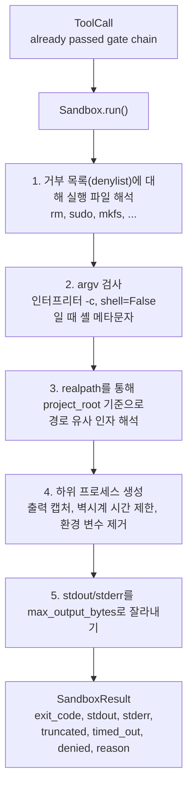
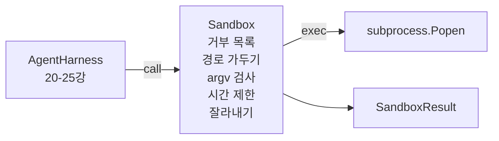

# 캡스톤 26강: 금지 목록 및 경로 격리 기능을 갖춘 샌드박스 러너

> 검증 게이트는 도구 호출을 실행할지 여부를 결정합니다. 샌드박스는 실행이 결정된 후 어떤 일이 일어나는지를 결정합니다. 이 강의에서는 위험한 실행 파일을 거부하고, 위험한 argv 구조를 거부하며, 모든 파일 경로를 프로젝트 루트로 격리하고, 과도한 크기의 출력을 잘라내며, 벽시계 시간 제한으로 폭주하는 프로세스를 종료하는 하위 프로세스 러너를 출시합니다. 이는 모델과 운영체제 사이에 위치하는 두 계층 중 두 번째 계층입니다.

**유형:** Build
**언어:** Python (stdlib)
**선수 요건:** 19단계 · 25강 (검증 게이트 및 관측 예산), 14단계 · 33강 (제약 조건으로서의 지시문), 14단계 · 38강 (검증 게이트)
**시간:** 약 90분

## 학습 목표

- 타임아웃, 캡처 및 잘라내기 기능을 갖춘 `Sandbox` 클래스를 `subprocess.run`를 래핑하여 구축해 보세요.
- 금지 목록에 대한 이름과 argv 검사기에 대한 구조를 기준으로 명령을 거부해 보세요.
- 선언된 프로젝트 루트 밖으로 해석되는 모든 경로 인자를 거부해 보세요.
- 셸 모드가 꺼져 있을 때 셸 메타문자를 거부해 보세요.
- 하류 관측 가능성 및 평가 하네스가 흡수할 수 있는 구조화된 `SandboxResult`를 반환해 보세요.

## 문제점

셸을 호출할 수 있는 코딩 에이전트는 한 턴 안에 백도어를 설치하고, 키를 유출(Data Exfiltration)하고, 개발자 노트북을 고장 내고, 클라우드 청구서를 쌓을 수 있습니다. 가장 비용이 적은 방어책은 셸을 제공하지 않는 것입니다. 그 다음으로 비용이 적은 방어책은 정밀한 패턴 목록에 대해 '아니요'라고 말하는 샌드박스입니다.

에이전트 추적에서 세 가지 유형의 실패가 반복됩니다.

첫 번째는 위험한 실행 파일입니다. 경로 문제를 해결해야 하는 압박을 받는 모델은 `sudo`, `chmod -R 777`, `rm -rf`, `mkfs`, `dd`를 시도할 것입니다. 이 중 어느 것도 에이전트 실행에 속하지 않습니다. 금지 목록은 이름과 별칭으로 이들을 포착합니다.

두 번째는 argv 트릭입니다. 셸이 금지된 모델은 인터프리터를 통해 공격을 파이프합니다: `python3 -c "import os; os.system('rm -rf /')"`, `bash -c '...'`, `node -e '...'`, `perl -e '...'`. 샌드박스는 `-c`와 유사한 플래그로 실행되는 모든 인터프리터는 추가 단계가 있는 셸 호출일 뿐임을 알아야 합니다.

세 번째는 경로 탈출입니다. 모델이 `./src/main.py`를 읽도록 지시받았지만, 대신 `../../etc/passwd`를 읽습니다. 샌드박스는 `os.path.realpath`를 통해 모든 경로 인자를 해석하고 접두어를 단정하여 모든 경로 인자를 가둡니다.

샌드박스는 운영체제 차원의 보안 경계가 아닙니다. 코드 실행 권한을 가진 결정적인 공격자는 여전히 샌드박스를 탈출할 수 있습니다. 샌드박스는 개발 시점의 가드레일(Guardrails)입니다: 흔한 실패 모드를 명확하게 드러내고, 에이전트(Agent)가 단순한 무능함으로 인해 피해를 입히는 것을 방지합니다.

## 개념



샌드박스에는 네 가지 거부 축이 있습니다: 이름, argv, 경로, 구조. 각 축은 하위 프로세스가 생성되기 전의 호출에 대한 순수 함수입니다. 하위 프로세스는 모든 축을 통과한 후에만 생성됩니다.

`SandboxResult` 종료 코드는 관례적인 값입니다: 0은 성공, 비0은 실패, 그리고 denied(-100), timed_out(-101), truncated(종료 코드는 실제 값이며, 플래그가 설정됨)를 위한 세 개의 센티널 코드가 있습니다. 이후 강의에서는 stderr를 파싱하는 대신 이 구조화된 결과를 읽습니다.

```figure
cg-path-jail
```

## 아키텍처



거부 목록은 실행 파일 기본 이름의 frozenset입니다. 별칭(`/bin/rm`, `/usr/bin/rm`)은 모두 동일한 기본 이름으로 해석됩니다. argv 검사기는 인터프리터 형태를 알고 있습니다: argv[0]이 인터프리터이고 이후 인자가 `-c` 또는 `-e`로 시작하는 모든 argv는 거부됩니다. 셸 메타문자(`;`, `|`, `&`, `>`, `<`, 백틱, `$()`)는 호출이 셸을 명시적으로 요청하지 않은 경우 거부를 유발합니다.

경로 감옥은 가장 미묘한 부분입니다. 샌드박스는 생성 시 `project_root`를 받습니다. 경로처럼 보이는 모든 인자(`/`를 포함하거나 기존 파일과 일치하는 경우)는 `os.path.realpath`를 통해 정규화된 후, 프로젝트 루트의 realpath와 비교됩니다. 해석된 대상이 루트 아래에 있지 않으면 거부합니다. 심볼릭 링크 탈출 시도(프로젝트 루트 내부의 심볼릭 링크가 외부로 가리키는 경우)는 리터럴 경로가 아닌 realpath를 확인하여 차단합니다.

## 구현할 내용

구현은 `main.py`과 tests 디렉토리로 구성됩니다.

1. `SandboxResult` dataclass: exit_code, stdout, stderr, truncated, timed_out, denied, reason, duration_ms.
2. `SandboxConfig` dataclass: project_root, max_output_bytes, timeout_seconds, denylist, interpreter_block.
3. `Sandbox` class: `run(argv, *, shell=False, cwd=None)`는 `SandboxResult`를 반환합니다.
4. 내부 거부 헬퍼: `_check_executable_denylist`, `_check_argv_interpreter`, `_check_shell_metachars`, `_check_path_jail`.
5. 명확한 `truncated` 플래그와 캡처된 스트림의 마커 라인을 사용하여 출력 잘림(truncation)을 처리합니다.
6. 하단 데모: 합법적인 호출과 적대적인 호출의 시퀀스. 각각의 결과가 표시됩니다.

샌드박스는 기본적으로 `subprocess.run`와 `shell=False`를 사용하며 `capture_output=True`를 적용합니다. 월클록(wall-clock) 타임아웃은 `timeout` 인자를 사용하며, `TimeoutExpired` 발생 시 샌드박스는 프로세스 그룹을 종료하고 SandboxResult를 합성합니다.

## 이것이 실제 샌드박스가 아닌 이유

이 강의의 샌드박스는 네임스페이스, cgroups, seccomp, gVisor, Firecracker 또는 커널 수준 격리를 사용하지 않습니다. 하위 프로세스가 할 수 있는 모든 것은 샌드박스도 할 수 있습니다. 보호는 구조적입니다: 에이전트는 가장 흔한 위험한 호출을 거부당하며, 큰 소리의 거부는 조용히 실행되는 대신 관측 가능성(observability)에 기록됩니다.

프로덕션 에이전트에서는 그 위에 계층을 추가합니다: 비권한(unprivileged) Docker 컨테이너 내부에서 실행, microVM 내부에서 실행, capabilities 제거, 프로젝트 루트를 읽기 전용으로 마운트하고 스크래치 디렉토리를 읽기/쓰기로 마운트, 메모리와 CPU에 ulimit 설정, 환경을 알려진 안전한 화이트리스트로 스크럽합니다. 29강에서 이 중 일부가 수행됩니다. 운영체제 격리는 이 강의의 범위 밖입니다.

## 실행하기

```bash
cd phases/19-capstone-projects/26-sandbox-runner-denylist
python3 code/main.py
python3 -m pytest code/tests/ -v
```

데모는 임시 디렉터리를 생성하고, 그 안에 깨끗한 파일을 넣은 후 일련의 호출을 실행합니다. 합법적인 호출은 성공합니다. 거부된 호출은 `denied=True`와 이유를 포함하는 SandboxResult를 반환합니다. 시간 초과 시 `timed_out=True`을 반환합니다. 잘림(truncation)이 발생하면 `truncated=True`가 설정됩니다. 데모는 결과의 JSON 테이블을 출력하고 종료 코드 0으로 종료합니다.

## 트랙 A의 나머지 부분과 이 요소가 결합되는 방식

25강은 게이트 체인을 생성했습니다. 26강은 게이트가 ALLOW를 반환한 후 실행되는 실행기(executor)입니다. 27강의 평가 하네스(sandbox results)는 작업별 예상 종료 코드와 샌드박스 결과를 비교합니다. 28강은 각 `Sandbox.run` 호출 주위에 `gen_ai.tool.execution` 스팬(span)을 방출합니다. 29강의 엔드투엔드(end-to-end) 데모는 실제 코딩 에이전트를 두 계층 모두를 통해 연결합니다.
