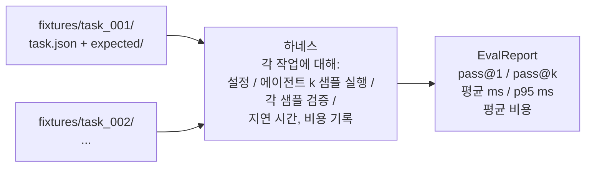
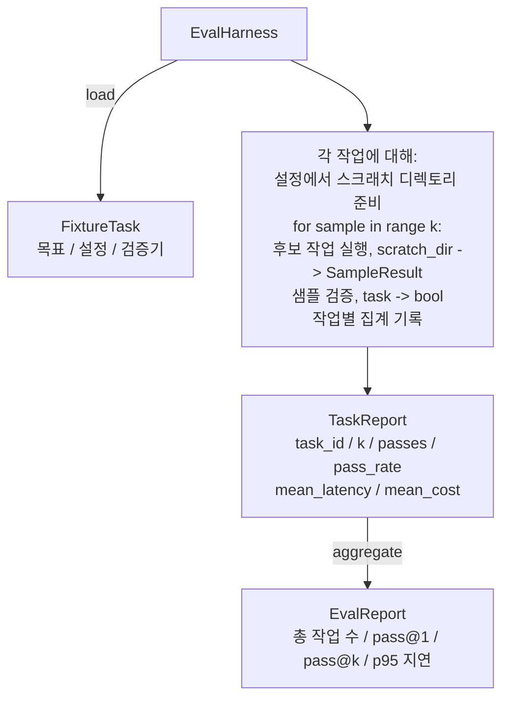

# 캡스톤 27강: Fixture Task를 활용한 Eval 하네스

> 코딩 에이전트의 성능은 측정하는 작업 세트의 품질에 달려 있습니다. 이 강의에서는 fixture task가 담긴 폴더를 받아 각 작업을 후보 에이전트를 통해 실행하고, 결정적(deterministic) 검증기를 통해 통과/실패를 점수화하며, 결과를 pass@1, pass@k, 평균 지연 시간, 평균 비용으로 집계하는 평가 하네스를 구축합니다. 이 하네스는 리팩토링과 회귀(regression)를 구분할 수 있게 해주는 신뢰할 수 있는 기준점(source of truth)입니다.

**유형:** Build
**언어:** Python (stdlib)
**선수 요건:** 19단계 · 25강 (검증 게이트), 19단계 · 26강 (샌드박스 러너), 14단계 · 30강 (평가 기반 에이전트 개발), 14단계 · 19강 (SWE-bench 및 GAIA 벤치마크)
**시간:** 약 90분

## 학습 목표

- 목표(goal), 설정(setup), 검증기(verifier)의 세 요소로 구성된 fixture task를 정의해 보세요.
- 각 작업에 대해 여러 샘플 실행을 점수화하고 pass@01강 pass@k를 계산해 보세요.
- 지연 시간과 비용을 평균 및 95th-percentile 지표로 집계해 보세요.
- 결정적 검증기(파일 diff, exit code, regex 매칭)를 재사용 가능한 함수로 연결해 보세요.
- 회귀 추적 스크립트가 흡수할 수 있는 구조화된 JSON 보고서를 생성해 보세요.

## 문제점

Eval 하네스 없이 구축된 에이전트 벤치마크는 세 가지 실패 모드에 시달립니다.

첫 번째는 검증되지 않은 통과(unverified pass)입니다. 에이전트가 버그를 수정했다고 말하고, 사람이 diff를 대충 보고, 테스트 스위트는 초록색으로 표시되며, 3주 후 회귀 테스트가 동일한 버그를 발견합니다. 에이전트는 실제로 아무것도 수정하지 않았으면서도 그럴듯하게 추론한 것입니다.

두 번째는 감지되지 않은 회귀(regression)입니다. 프롬프트 템플릿 변경으로 에이전트가 'loud task'에서는 4% 개선되고 'quiet task'에서는 14% 악화됩니다. 골든셋(goldset)과 작업별 점수가 없으면, 이 회귀는 main 브랜치로 유입되어 고객이 불평할 때에만 드러납니다.

세 번째는 작업별 드리프트(per-task drift)입니다. 월요일에는 100개 작업으로 eval을 실행했는데, 금요일에는 누군가 5개 fixture의 이름을 바꾼 탓에 95개로 실행했습니다. 통과율이 5% 개선된 것처럼 보이지만, 실제로는 그렇지 않습니다.

하네스는 이러한 실패를 사실로 변환하는 프로그램입니다. 모든 픽스처를 매번 재현 가능한 순서로 실행하며, 결정적인 검사에 대해 참 또는 거짓을 반환하는 검증기를 사용합니다.

## 개념



`FixtureTask`은 작은 JSON 파일과 선택적인 `expected/` 디렉토리로 구성됩니다. JSON은 `id`, `goal` (에이전트에 전달되는 프롬프트), `setup` 블록(스크래치 디렉토리에 넣을 파일), 그리고 `verifier` 블록을 선언합니다. 검증기 블록은 하네스의 검증기 레지스트리에 있는 함수를 지정하고 그 인수를 제공합니다.

세 가지 검증기 형태가 대부분의 유용한 작업을 커버합니다.

첫 번째는 `file_equals`입니다. 에이전트가 실행된 후, 지정된 파일을 예상된 내용과 비교합니다. 이는 "이 버그를 이 정확한 방식으로 수정"하는 작업을 포착합니다.

두 번째는 `regex_match`입니다. 지정된 파일의 내용이 정규식과 매칭됩니다. 이는 많은 허용되는 해결책이 있는 "함수가 존재하고 X를 반환해야 함" 작업을 포착합니다.

세 번째는 `shell_exit_zero`입니다. 하네스는 셸 명령을 실행하며(26강의 샌드박스를 통해), 명령이 0으로 종료할 때만 작업을 통과시킵니다. 이는 "테스트가 통과해야 함" 작업을 포착합니다.

하네스는 각 작업을 `k`번 실행합니다. Pass@k는 `1 - (1 - p)^k`이며, 여기서 p는 경험적 통과율입니다. 하네스는 또한 원시 카운트를 보고하므로 분산을 확인할 수 있습니다. 지연 시간은 샘플별 실측 시간(wall-clock)입니다. 비용은 에이전트가 자체 보고하는 값(토큰 수, USD, 또는 둘 다)이며, 하네스는 이를 샘플 전체에 대해 합산하여 작업별 및 집계된 수치를 제시합니다.

```figure
pass-at-k
```

## 아키텍처



후보(candidate)는 호출 가능한 객체입니다: `Callable[[FixtureTask, str], SampleResult]`. 하네스(harness)는 `tempfile.mkdtemp()`을 통해 스크래치 디렉터리를 생성하고, 그 경로를 일반 문자열로 전달합니다. 하네스는 후보가 어떻게 작동하는지关心하지 않습니다. 후보는 결정론적 패치 적용기(하네스 자체 테스트에 유용), 실제 LLM 에이전트, 퍼저(fuzzer) 등일 수 있습니다. 계약(contract)은 SampleResult입니다.

## 구축할 내용

`main.py`이 제공하는 것:

1. `FixtureTask` 데이터 클래스(dataclass).
2. `SampleResult` 데이터 클래스: success_self_reported, latency_ms, cost_units, edits.
3. `TaskReport`, `EvalReport` 데이터 클래스가 `to_dict()`를 포함합니다.
4. `VerifierRegistry`은 검증기(verifier) 이름을 함수에 매핑합니다. 내장 검증기: file_equals, regex_match, shell_exit_zero.
5. `EvalHarness` 클래스. 후보를 사용하여 작업(task) 디렉터리를 실행합니다. EvalReport를 반환합니다.
6. `tasks/`에 포함된 5개의 픽스처(fixture) 작업:
   - `fizzbuzz`의 오프-바이-원(off-by-one) 오류
   - `factorial`의 누락된 return
   - 오류 메시지의 오타
   - 빈 함수 본문
   - 연결 리스트 순회의 오프-바이-원 오류
7. 하네스가 clean pass@1 1.0을 시연하기 위해 사용하는 결정론적 참조 후보(`apply_known_fixes`).
8. 데모(demo)는 EvalReport JSON을 출력하고 exit code 0으로 종료합니다.

픽스처 작업은 `tasks/`의 JSON 파일과 `tasks/<id>/buggy/` 및 `tasks/<id>/expected/`의 짝을 이루는 소스 파일로 번들(bundle)되어 있습니다. 하네스는 buggy를 스크래치 디렉터리에 복사하고, 이를 후보에게 전달하며, expected와 비교하여 검증합니다.

## pass@1이 아닌 pass@k를 사용하는 이유

실제 LLM 에이전트는 확률적입니다. pass@1이 0.6인 것은 실패처럼 보입니다. pass@5가 0.95인 것은 에이전트가 대부분의 경우 정답을 맞히지만 초기 샘플에서는 잘못된 선택을 한다는 것을 의미합니다. 해결책은 더 많은 훈련이 아니라 샘플링과 순위 매기기(ranking)입니다. Pass@k는 이를 가시화합니다.

Pass@k는 pass@01강 함께 보고됩니다. pass@k는 실제 실패를 가리기 때문입니다: 모델이 20번 시도 중 한 번만 정답을 맞힌다면 유용한 에이전트가 아닙니다. 하네스는 두 값을 모두 표시합니다.

## Track A의 나머지 부분과의 조합

25강은 게이트 체인을 생성했습니다. 26강은 샌드박스를 생성했습니다. 하네스는 모든 `shell_exit_zero` 검증기에 샌드박스를 사용합니다. 28강은 각 하네스 실행을 OTel 추적에 래핑합니다. 29강은 번들된 픽스처 중 하나에 대해 엔드투엔드 데모를 실행하고 참조 후보에 대해 pass@1 = 1.0을 단언합니다.

## 실행하기

```bash
cd phases/19-capstone-projects/27-eval-harness-fixture-tasks
python3 code/main.py
python3 -m pytest code/tests/ -v
```

데모는 pass@1, pass@5, 평균 지연 시간 및 작업별 세부 정보를 포함하여 EvalReport를 JSON으로 출력합니다. 종료 코드는 0입니다. 테스트는 검증기 함수, pass@k 계산, 픽스처 로딩 및 번들된 참조 후보에 대한 하네스 엔드투엔드를 포함합니다.
