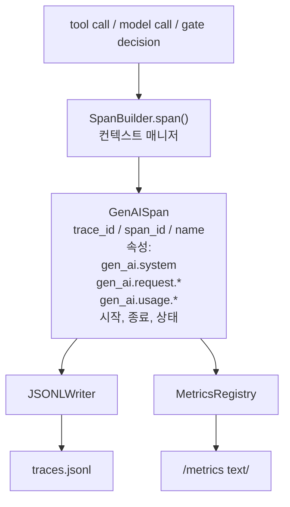
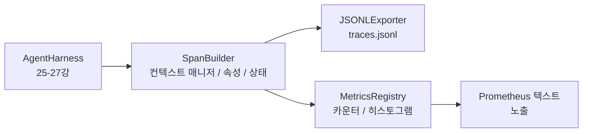

# Capstone 28강: OTel GenAI 스팬과 Prometheus 메트릭을 활용한 관측 가능성

> 관측 가능성이 없는 에이전트 하네스는 비용만 낭비하는 블랙박스입니다. 이 강의에서는 OpenTelemetry GenAI 시맨틱 컨벤션에 준수하는 레코드를 방출하는 스팬 빌더를 직접 구현하고, 한 줄에 하나의 스팬을 JSON-Lines 파일에 기록하며, Prometheus 텍스트 형식으로 카운터와 히스토그램을 노출합니다. 전체는 표준 라이브러리 Python으로 작성되며 오프라인에서 실행됩니다.

**유형:** Build
**언어:** Python (표준 라이브러리)
**선수 요건:** 19단계 · 25강 (검증 게이트), 19단계 · 26강 (샌드박스), 19단계 · 27강 (평가 하네스), 13단계 · 20강 (OpenTelemetry GenAI), 14단계 · 23강 (OTel GenAI 컨벤션)
**시간:** 약 90분

## 학습 목표

- OpenTelemetry GenAI 시맨틱 컨벤션에 맞춘 스팬 데이터 클래스를 구축합니다.
- 한 줄에 하나의 독립적인 스팬을 기록하는 JSONL 내보내기 도구(exporter)를 구현합니다.
- 레이블이 포함된 카운터와 히스토그램을 구축하고 Prometheus 텍스트 형식으로 노출합니다.
- 지속 시간, 상태, 예외를 기록하는 스팬 컨텍스트 관리자(context manager)로 모든 호출 가능한 객체를 감싸는 방식입니다.
- 방출된 스팬이 `json.loads`를 통해 왕복 왕복(roundtrip)되어 사양의 형태와 일치하는지 검증합니다.

## 문제점

프로덕션 환경의 코딩 에이전트는 매 턴마다 세 가지 유형의 산출물을 생성합니다: 모델 호출, 도구 실행, 검증 게이트 결정. 구조화된 텔레메트리(telemetry)가 없으면 이 중 어느 것도 유용하지 않습니다.

첫 번째 실패 유형은 누락된 추적(trace)입니다. 화요일에 문제가 발생했지만 유일한 기록은 500줄의 채팅 로그뿐입니다. 어떤 도구가 실행되었는지, 얼마나 오래 걸렸는지, 프롬프트에 몇 개의 토큰이 들어갔는지, 게이트가 무언가를 거부했는지 기록이 없습니다. 에이전트 작성자는 추측해야 합니다.

두 번째 실패 유형은 파싱할 수 없는 추적입니다. 하네스가 스팬을 작성했지만 자체적인 임의의(ad-hoc) 필드 이름을 사용했습니다. Grafana, Honeycomb, Jaeger, 로컬 CLI 등 그 어떤 것도 이를 읽을 수 없습니다. 팀의 스택에 존재하는 모든 도구가 스팬이 비표준적이기 때문에 낭비됩니다.

세 번째 실패 유형은 집계되지 않은 지표입니다. 추적(trace)에서 느린 도구 호출 하나를 확인할 수 있지만, 지표가 없고 추적만 존재하기 때문에 "지난 1시간 동안 read_file 호출의 p95 지연 시간은 얼마인가?"라는 질문에 답할 수 없습니다.

OpenTelemetry GenAI 시맨틱 컨벤션은 정확히 이 문제를 해결하기 위해 존재합니다. LLM 프레임워크 간에 스팬(span) 생성자가 공유하는 표준 속성 집합을 정의합니다. 하네스가 이러한 속성을 기록하면 모든 OTel 호환 백엔드가 이를 읽을 수 있습니다.

## 개념



하네스 내의 모든 연산은 스팬을 생성합니다. 스팬은 추적 ID (전체 에이전트 호출), 스팬 ID (이 연산), 이름 (예: `gen_ai.chat`, `gen_ai.tool.execution`), GenAI 컨벤션을 따르는 속성, 시작 및 종료 시간, 그리고 상태를 포함합니다.

GenAI 컨벤션은 이러한 속성 키를 표준화합니다: `gen_ai.system` (제공자, 예: `anthropic`, `openai`), `gen_ai.request.model` (모델 ID), `gen_ai.request.max_tokens`, `gen_ai.usage.input_tokens`, `gen_ai.usage.output_tokens`, `gen_ai.response.model`, `gen_ai.response.id`, `gen_ai.operation.name`, 그리고 도구별 키 `gen_ai.tool.name` 및 `gen_ai.tool.call.id`.

익스포터는 JSONL을 기록합니다. 한 줄에 하나의 JSON 객체입니다. 이는 다운스트림 도구가 스트리밍, grep, 가져오기(import)를 수행할 수 있는 가장 단순한 형식입니다. 실제 OTel 익스포터는 OTLP gRPC를 사용하지만, 이 강의의 JSONL 익스포터는 오프라인 등가물이며 모든 워크스테이션에서 정상 종료(exit zero)합니다.

지표는 추적 옆에 위치합니다. 카운터는 각 도구 호출마다 증가합니다: `tools_called_total{tool="read_file"}`. 히스토그램은 관측된 지연 시간을 기록합니다: `tool_latency_ms{tool="read_file"}`. 둘 다 푸시 기반 지표의 사실상 표준인 Prometheus 텍스트 노출 형식으로 직렬화됩니다.

```figure
trace-spans
```

## 아키텍처



스팬 빌더는 `span(name, attrs)` 메서드를 통해 컨텍스트 매니저를 반환하는 작은 클래스입니다. 이 컨텍스트 매니저는 진입 시 시작 시간을 기록하고, 종료 시 종료 시간을 기록하며, 예외가 발생하면 이를 첨부하고, 최종화된 스팬을 내보내기(exporter)에 푸시합니다.

메트릭 레지스트리는 두 개의 사전(dict)으로 구성됩니다. 카운터는 `{(name, frozen_labels): int}`입니다. 히스토그램은 원시 샘플을 리스트에 저장하며, 노출(exposition) 시점에 Prometheus 히스토그램 버킷으로 직렬화합니다.

## 구현할 내용

`main.py`가 포함됩니다:

1. `GenAISpan` 데이터 클래스: trace_id, span_id, parent_span_id, name, attributes, start_unix_nano, end_unix_nano, status, status_message, events.
2. `span(name, attrs, parent=None)` 컨텍스트 매니저를 가진 `SpanBuilder` 클래스.
3. 한 줄을 추가하는 `export(span)`을 가진 `JSONLExporter` 클래스.
4. `Counter` 및 `Histogram` 클래스와 `MetricsRegistry`.
5. 텍스트 형식(text-format) 출력을 생성하는 `prometheus_exposition(registry)`.
6. 스팬을 방출하고 메트릭을 업데이트하는 `wrap_tool_call(name)` 데코레이터.
7. 데모: 완전한 에이전트 호출(gen_ai.chat 스팬이 도구 스팬을 감싸는 구조)을 합성하여 traces.jsonl에 기록하고, Prometheus 노출(exposition)을 출력하며, 종료 코드 0으로 종료합니다.

스팬 ID와 트레이스 ID는 `os.urandom`에서 생성된 16바이트 16진수 문자열입니다. 이는 OTel의 W3C 트레이스 컨텍스트와 일치합니다. 내보내기(exporter)는 예외를 발생시키지 않으며, IO 오류는 표시되지만 하네스(harness)는 계속 실행됩니다.

히스토그램은 고정된 버킷 집합을 가집니다 (OTel의 밀리초 단위 지연 기본값: 5, 10, 25, 50, 100, 250, 500, 1000, 2500, 5000, 10000, +Inf). 샘플은 리스트로 저장되며, 노출(exposition) 시 버킷별 개수를 계산합니다.

## opentelemetry-sdk 대신 직접 구현하는 이유

OTel Python SDK는 실제 의존성입니다. 또한 수천 줄의 코드, OTLP 내보내기(exporter)를 위한 여러 프로세스, 그리고 강의 예산을 압도하는 런타임 비용이 필요합니다. 직접 구현한 버전은 와이어 형식(wire format)을 가르쳐 줍니다. 프로덕션에서는 동일한 속성을 실제 SDK에 연결하여 OTLP 내보내기, 배치 처리, 리소스 감지를 무료로 얻을 수 있습니다.

규약(conventions)은 안정적입니다. 이 강의가 방출하는 와이어 형식은 OTel이 GenAI 속성 이름을 파괴하지 않고 새로운 것만 추가하기 때문에 2030년에도 계속 파싱될 것입니다.

## Track A의 나머지 부분과의 구성 방식

25강은 게이트 체인을 생성했습니다. 26강은 샌드박스를 생성했습니다. 27강은 평가 하네스를 생성했습니다. 28강은 이 세 가지를 모두 관측 가능하게 만듭니다. 29강은 엔드투엔드 데모의 모든 단계를 스팬으로 감싸고, 마지막에 Prometheus 텍스트를 출력합니다.

## 실행하기

```bash
cd phases/19-capstone-projects/28-observability-otel-traces
python3 code/main.py
python3 -m pytest code/tests/ -v
```

데모는 강의 작업 디렉토리에 `traces.jsonl`을 생성한 후(마지막에 정리됨), 세 개의 스팬 샘플을 출력하고, 카운터와 히스토그램에 대한 Prometheus 노출 텍스트를 출력합니다. 테스트는 스팬이 왕복 직렬화되는지, 표준 GenAI 속성이 존재하는지, 카운터가 올바르게 증가하는지, 히스토그램 노출에 예상된 버킷 개수가 포함되는지 확인합니다.
