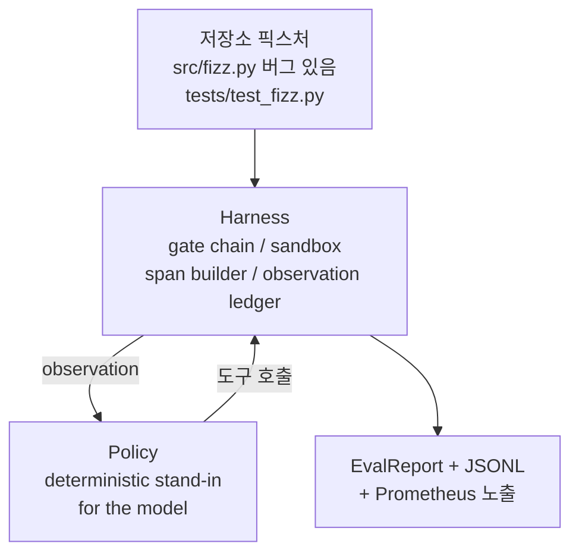
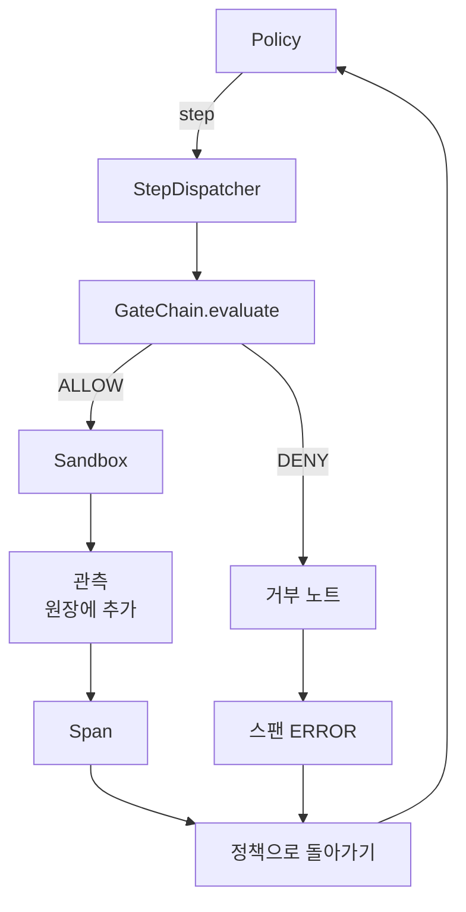

# 캡스톤 29강: 하네스 위에서의 엔드투엔드 코딩 에이전트

> 트랙 A의 결실입니다. 이 강의는 게이트 체인, 샌드박스, 평가 하네스, OTel 스팬을 하나의 동작하는 코딩 에이전트로 결합하여 다중 파일 Python 프로젝트의 실제 (작은, 픽스처 규모) 버그를 수정합니다. 에이전트는 LLM이 아닌 결정론적 정책이며, 이 대체는 강의를 재현 가능하게 만들고 하네스가 본질적으로 흥미로운 부분이었음을 보여줍니다. 계약은 동일합니다: 실제 모델은 정책 접합부(policy seam)에 연결됩니다.

**유형:** Build
**언어:** Python (표준 라이브러리)
**선수 요건:** 19단계 · 25강 (검증 게이트), 19단계 · 26강 (샌드박스), 19단계 · 27강 (평가 하네스), 19단계 · 28강 (관측 가능성), 14단계 · 38강 (검증 게이트), 14단계 · 41강 (실제 저장소용 작업대), 14단계 · 42강 (에이전트 작업대 캡스톤)
**시간:** 약 90분

## 학습 목표

- 게이트 체인, 샌드박스, 평가 하네스, 스팬 빌더를 단일 에이전트 루프로 구성해 보세요.
- read_file, run_tests, write_file를 사용하여 픽스처 버그를 수정하는 결정론적 정책을 구현해 보세요.
- 엔드투엔드 실행 전반에 걸쳐 전역 스텝 예산과 관측 토큰 예산을 강제 적용해 보세요.
- 전체 실행에 대해 완전한 OTel GenAI 추적 및 Prometheus 지표를 방출해 보세요.
- 에이전트가 합법적인 도구에서 게이트 위반 없이 12 스텝 미만으로 픽스처를 해결하는지 검증해 보세요.

## 문제점

대부분의 에이전트 데모는 고립된 상태로 작동합니다: 샌드박스 단독, 평가 하네스 단독, 스팬 방출기 단독. 이들은 잘 작동하는 것처럼 보입니다. 이들을 결합하면 이음새가 드러납니다.

게이트 체인은 ALLOW를 말하지만, 샌드박스는 체인이 예상하지 못한 이유로 거부합니다. 평가 하네스는 통과를 기록하지만, OTel 스팬은 에이전트가 사용했다고 주장하는 도구를 게이트가 거부했다고 말합니다. Prometheus 카운터는 한 번 증가해야 할 때 두 번 증가합니다. 관측 예산이 초과되었지만, 예산이 체인에서 추적되고 샌드박스가 이를 알지 못했기 때문에 에이전트는 계속 진행했습니다.

이 강의는 전체 트랙의 통합 테스트입니다. 에이전트는 순서대로 네 가지 작업을 수행해야 합니다: 프로젝트를 읽고, 테스트를 실행하고, 테스트 실패로부터 버그를 식별하고, 수정을 작성하고, 테스트를 다시 실행하고, 중지합니다. 모든 연산은 게이트 체인을 거칩니다. 모든 도구 실행은 샌드박스를 거칩니다. 모든 단계는 스팬으로 래핑됩니다. 평가 하네스는 최종적으로 전체를 채점합니다.

## 개념



에이전트의 정책은 상태 머신입니다. 5개의 상태가 있습니다.

`SURVEY`: 에이전트가 프로젝트 목록을 읽습니다. 다음 상태는 RUN_TESTS입니다.

`RUN_TESTS`: 에이전트가 테스트 명령을 실행합니다. 테스트가 통과하면 상태 머신은 성공으로 중단됩니다. 그렇지 않으면 다음 상태는 INSPECT입니다.

`INSPECT`: 에이전트가 실패한 소스 파일을 읽습니다. 다음 상태는 FIX입니다.

`FIX`: 에이전트가 수정된 파일을 작성합니다. 다음 상태는 VERIFY입니다.

`VERIFY`: 에이전트가 테스트 명령을 다시 실행합니다. 테스트가 통과하면 성공으로 중단합니다. 그렇지 않으면 실패로 중단합니다.

각 상태는 도구 호출에 해당합니다. 각 도구 호출은 게이트 체인을 통과합니다. 도구 호출이 거부되면 에이전트는 추적(trace)에 거부를 보고하고 중단합니다.

픽스처 버그는 `fizz.py`의 오프-바이-원(off-by-one)입니다. 결정론적 정책은 정규식을 통해 테스트 실패 메시지로부터 버그를 감지하고 수정된 파일을 생성합니다. 정책을 LLM으로 교체해도 하네스 계약은 변하지 않습니다.

```figure
cg-harness-weave
```

## 아키텍처



이 강의는 자기 완결적입니다. 이전 강의의 모든 원시(primitive)는 `main.py`에서 최소한의 규모로 재구현(gate, sandbox, ledger, span)되어, 형제 강의를 가져오지 않고도 실행됩니다. 이름은 25-28강과 정확히 일치하므로 개념적 매핑이 모호하지 않습니다.

## 구현하기

`main.py`는 다음을 제공합니다:

1. 25-28강과 동일한 이름으로 복사된 최소한의 하네스 원시(primitive): `GateChain`, `Sandbox`, `ObservationLedger`, `SpanBuilder`, `MetricsRegistry`.
2. `CodingAgentPolicy` 클래스: 5개 상태를 가진 상태 머신입니다.
3. `Repo` 헬퍼: 번들된 버그가 있는 픽스처가 포함된 임시 작업 디렉터리를 준비합니다.
4. `AgentRun` 클래스: 정책을 실행하고, 하네스를 통해 디스패치하며, `AgentRunReport`을 반환합니다.
5. src/fizz.py, tests/test_fizz.py, 그리고 평가 하네스를 위한 expected/ 트리가 포함된 번들된 픽스처 (`fixture_repo/`)입니다.
6. 데모: 정책을 엔드투엔드로 실행하고, 단계별 추적을 출력하며, 통과를 어서트하고, 메트릭을 출력합니다.

번들된 픽스처는 27강의 작업 구조와 동일한 형태입니다: 버그가 있는 파일과 테스트 파일. 테스트 실패 메시지는 결정론적 정책이 수정 사항을 식별하기에 충분한 정보를 포함하고 있습니다. 실제 LLM은 더 느리고 더 넓은 기억을 가지고 같은 작업을 수행할 수 있지만, 하네스의 기대값을 변경하지는 않을 것입니다.

## 정책이 LLM이 아닌 이유

실제 LLM은 API 키, 네트워크 호출, 그리고 검증 불가능한 확률적 요소를 필요로 합니다. 하네스는 강의가 집중하는 부분입니다. 결정론적 정책을 대체하면 강의는 외부 의존성 없이 모든 개발자 노트북에서 실행할 수 있으며, 테스트 스위트는 정확한 단계 수를 어서트할 수 있습니다.

강의의 정책은 LLM 에이전트가 하는 일의 엄격한 하위 집합입니다. 정책은 저장소를 읽고, 실패한 테스트를 보고, 해당 라인을 식별하고, 수정 사항을 생성합니다. LLM은 동일한 하네스 계약으로 동일한 루프를 거치며, 기록 관리(bookkeeping)는 동일합니다.

## 데모가 어서트하는 내용

엔드투엔드 데모는 종료 시점에 5가지 사항을 어서트하며, 테스트 스위트는 이를 프로그래밍 방식으로 재어서트합니다.

정책이 픽스처를 12단계 미만으로 해결했습니다.

관찰 예산이 초과되지 않았습니다.

합법적인 도구에서 게이트 거부가 발생하지 않았습니다. (에이전트가 거부된 도구 이름을 발명하지 않았습니다.)

모든 단계가 traces.jsonl에 해당하는 스팬을 가지고 있습니다.

Prometheus 익스포지션에 `tools_called_total{tool="read_file"}` 항목과 `tool_latency_ms` 히스토그램이 포함되어 있습니다.

## 트랙 A의 나머지 부분과 어떻게 조합되는가

이 강의는 통합입니다. 25강에서는 게이트 체인을 작성했습니다. 26강에서는 샌드박스를 작성했습니다. 27강에서는 평가 하네스를 작성했습니다. 28강에서는 관측 가능성을 작성했습니다. 29강에서는 이들이 시스템으로서 작동함을 증명합니다. 실제 에이전트 하네스는 여기서 확장됩니다: 결정적 정책을 모델로 교체하고, 번들된 픽스처를 실제 저장소 작업으로 교체하며, JSONL 내보내기 기능을 OTLP로 교체해 보세요.

## 실행하기

```bash
cd phases/19-capstone-projects/29-end-to-end-coding-task-demo
python3 code/main.py
python3 -m pytest code/tests/ -v
```

데모는 단계별 추적, 최종 평가 보고서, Prometheus 노출 지표를 출력합니다. 종료 코드는 0입니다. 테스트는 정책 상태 전환, 합성 도구 호출에 대한 게이트 거부, 번들된 픽스처에서의 엔드투엔드 실행, 단계 예산 불변 조건을 다룹니다.
