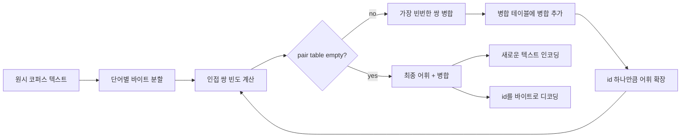
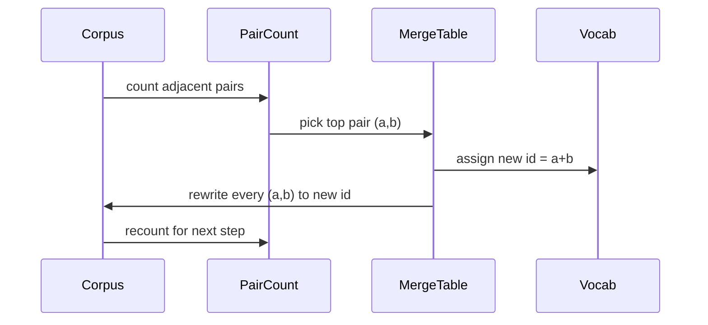

# 처음부터 BPE 토크나이저 만들기

> 바이트가 입력되어 id가 출력되고, id가 다시 동일한 바이트로 복원됩니다. 모든 최신 텍스트 모델이 시작하는 토크나이저를 구축해 보세요.

**유형:** Build
**언어:** Python
**선수 요건:** 04단계 강의, 07단계 트랜스포머 강의
**시간:** 약 90분

## 학습 목표
- 원시 텍스트 코퍼스를 사용하여 가장 빈번한 인접 심볼 쌍을 반복적으로 병합하여 바이트 쌍 인코딩 (BPE)(Byte Pair Encoding (BPE)) 어휘를 학습합니다.
- 결정적인 병합 테이블을 구현하고 새로운 텍스트에 적용하여 하위 단어 id 스트림을 생성합니다.
- 임의의 UTF-8 입력을 id로 변환하고 다시 바이트로 복원하는 왕복 변환을 정보 손실 없이 수행합니다.
- 특수 토큰(`<|endoftext|>`, `<|pad|>`)을 예약하고 보호하여 학습 및 디코딩 과정에서 유지되도록 합니다.
- 바이트 수준 알파벳이 범용 토크나이저의 올바른 기준점인 이유를 추론합니다.

```figure
cap-bpe-merge
```

## 프레임

언어 모델은 텍스트를 보지 않습니다. 정수를 봅니다. 문자열을 정수 목록으로 변환하고 다시 복원하는 맵이 토크나이저입니다. 이 계층을 잘못 구현하면 학습 실행의 모든 손실 곡선이 잘못된 것을 측정하게 됩니다.

범용 텍스트 모델의 지배적인 하위 단어 토크나이저 계열은 바이트 쌍 인코딩 (BPE)(Byte Pair Encoding (BPE))입니다. 아이디어는 간단합니다. 알려진 알파벳에서 시작합니다. 학습 코퍼스에서 가장 자주 나타나는 인접 심볼 쌍을 찾습니다. 이를 새로운 심볼로 병합합니다. 어휘가 목표 크기에 도달할 때까지 반복합니다. 새로운 텍스트를 인코딩할 때 동일한 병합 목록을 동일한 순서로 재사용합니다.

바이트 수준 변형을 구축합니다. 알파벳은 유니코드 코드 포인트가 아닌 256개의 원시 바이트입니다. 이 선택이 토크나이저가 unknown 토큰으로 폴백하지 않고 모든 UTF-8 입력을 처리할 수 있게 합니다.

## 파이프라인



학습 측과 추론 측이 병합 테이블을 공유합니다. 이 공유가 계약입니다. 추론 시 병합 순서를 변경하면 다른 id 스트림이 디코딩됩니다.

## 바이트 알파벳

처음 256개의 id는 원시 바이트 0x00부터 0xFF까지 예약되어 있습니다. 이는 병합이 일어나기 전에 모든 입력 문자열이 어휘로 표현될 수 있음을 보장합니다. 바이트 블록 이후에는 특수 토큰을 위해 작은 범위를 예약합니다. 학습 루프는 이 id들을 병합 대상으로 제안하지 않습니다. 프리토크나이저 스트림에서 완전히 제외하기 때문입니다.

프리토크나이저는 학습이 시작되기 전에 공백 및 구두점 경계에서 코퍼스를 분할합니다. 이 분할이 없으면 BPE 병합 단계가 단어 경계를 넘는 병합을 학습하여 어휘가 일반적인 전체 구문으로 채워집니다. 분할을 적용하면 병합이 단어 내부에 머무르며 결과가 일반화됩니다.

## 학습 루프

각 학습 단계에서 루프는 세 가지를 수행합니다. 코퍼스의 모든 단어를 순회하며 현재 심볼의 인접 쌍이 얼마나 자주 나타나는지, 단어 자체의 출현 빈도에 가중치를 적용하여 계산합니다. 가장 높은 빈도를 가진 쌍을 선택합니다. 해당 쌍의 모든 발생을 어휘의 다음 빈 슬롯에 id가 할당된 단일 새 심볼로 재작성합니다. 그런 다음 병합을 기록합니다.



각 단계의 비용은 심볼 시퀀스 리스트로 표현된 코퍼스의 크기에 선형입니다. 백만 개의 단어와 만 개의 id를 목표로 하는 어휘의 경우, 병합이 진행되면서 심볼 시퀀스가 줄어들기 때문에 루프는 몇 초 안에 완료됩니다.

## 새 텍스트 인코딩

추론은 병합 카운터를 호출하지 않습니다. 학습된 순서대로 병합 테이블을 적용합니다. 새 단어의 경우 인코더는 바이트 분할에서 시작합니다. 현재 시퀀스에서 가장 낮은 순위의 병합(적용 가능한 가장 초기 병합)을 스캔합니다. 그 병합을 수행합니다. 다시 스캔합니다. 테이블의 어떤 병합도 현재 시퀀스에 적용되지 않을 때 루프가 종료됩니다.

순위에 따른 정렬은 인코딩을 결정적으로 만들고 동일한 입력에서 학습된 동작과 일치시키는 속성입니다. 먼저 학습된 병합은 테이블 상위에 위치하며 먼저 적용됩니다. 두 병합이 동일한 위치에서 적용될 수 있다면, 더 낮은 순위의 병합이 우선합니다.

## 특수 토큰

특수 토큰은 바이트 스트림이 절대 생성할 수 없는 ID입니다. 우리가 수동으로 예약합니다. 이 강의에서는 두 개면 충분합니다.

- `<|endoftext|>`는 사전 학습 중 문서를 구분합니다. 모델에게 "새 문서가 여기서 시작하며, 이전 문서의 컨텍스트가 유입되지 않도록 하라"는 것을 알려줍니다.
- `<|pad|>`는 짧은 시퀀스를 채워 배치가 직사각형 텐서가 될 수 있도록 합니다. 손실 마스크는 학습 중 이를 숨깁니다.

인코더는 입력에 특수 토큰을 허용하는 플래그를 받습니다. 플래그가 꺼져 있으면 `<|endoftext|>` 및 `<|pad|>` 문자열은 이를 구성하는 바이트로 토큰화됩니다. 플래그가 켜져 있으면 리터럴 문자열이 예약된 ID로 매핑되며 병합 대상이 되지 않습니다.

## 왕복 보장

인코딩 후 디코딩은 입력 바이트를 정확히 반환해야 합니다. 디코더는 모든 ID의 바이트 확장을 순서대로 연결합니다. 모든 ID는 원시 바이트이거나 이전에 알려진 두 ID의 연결이므로, 재귀적 확장은 항상 원시 바이트로 종료됩니다. 디코딩은 그 바이트들이 구성하는 UTF-8 문자열을 반환합니다.

이 강의의 테스트 스위트는 unseen 문장, 유니코드 이모지가 포함된 문장, 리터럴 `<|endoftext|>` 토큰이 포함된 문장에서 이 속성을 확인합니다.

## 이 강의가 하지 않는 것

가장 큰 프로덕션 토크나이저 스타일의 정규식 기반 프리토크나이저를 구축하지 않습니다. 여기의 프리토크나이저는 공백 및 구두점 분할입니다. 작은 학습 코퍼스에 대해 합리적인 병합을 생성하기에 충분하며, 강의 체인의 나머지 부분과의 계약은 동일하게 유지됩니다. 다음 강의는 토크나이저를 블랙 박스로 취급하고 그 위에 슬라이딩 윈도우 데이터셋을 구축합니다.

페어 카운터를 병렬화하지 않습니다. 몇 천 단어의 코퍼스에 대한 Python 루프는 1초 미만에 완료됩니다. 더 큰 코퍼리의 경우, 명백한 방법은 단어를 병렬로 페어를 세고 리듀싱하는 것입니다.

## 코드를 읽는 방법

`main.py`는 네 개의 객체를 정의합니다. `BPETokenizer`은 어휘(Vocabulary), 병합 테이블, 특수 토큰 테이블을 포함합니다. `train`는 학습 루프입니다. `encode`는 추론 경로입니다. `decode`는 바이트 연결입니다. 하단의 데모는 내장 코퍼스로 작은 토크나이저를 학습하고, 보존된 문장을 인코딩하며, ID를 디코딩하여 두 결과를 출력합니다. `code/tests/test_bpe.py`의 테스트는 왕복(round-trip) 속성, 특수 토큰 예약, 병합 순서를 고정합니다.

데모를 실행해 보세요. 그런 다음 데모에서 목표 어휘(Vocabulary) 크기를 300에서 600으로 변경하고, 보존된 문장의 인코딩 길이가 어떻게 감소하는지 관찰해 보세요. 그 곡선은 BPE (바이트 쌍 인코딩)(Byte Pair Encoding (BPE)) 압축 곡선입니다.
