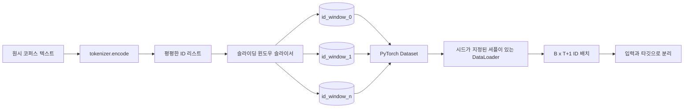
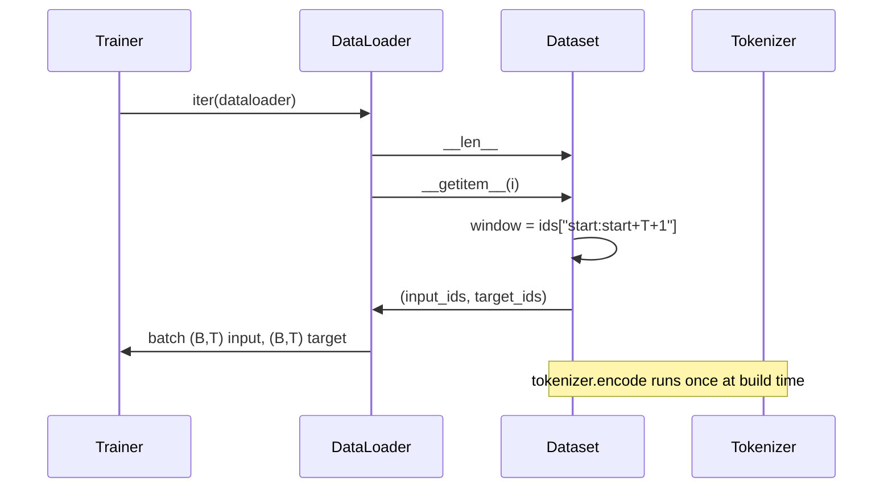

# 슬라이딩 윈도우가 적용된 토큰화 데이터셋

> 사전 학습 실행은 토큰 ID에서 기울기로 가는 함수입니다. 이 강의는 ID를 공급하는 컨베이어를 구축합니다.

**유형:** Build
**언어:** Python
**선수 요건:** 04단계 강의, 07단계 트랜스포머 강의, 이 단계의 30강
**시간:** 약 90분

## 학습 목표
- 토크나이저를 한 번 호출하여 원시 코퍼스를 토큰 ID 스트림으로 변환해 보세요.
- ID 스트림을 설정 가능한 겹침(stride)을 사용하여 고정 길이 윈도우로 슬라이스해 보세요.
- 다음 토큰 예측을 위해 입력 및 대상 텐서를 반환하는 PyTorch Dataset을 구축해 보세요.
- 에포크마다 시드가 지정된 결정적 셔플을 적용하는 DataLoader로 데이터셋을 감싸 보세요.
- 스트라이드, 중복성 및 효과적인 데이터셋 크기 간의 트레이드오프를 고려해 보세요.

```figure
cap-sliding-window
```

## 프레임

사전 학습 실행은 한 번에 토큰 ID 배치를 하나씩 읽고 모델을 업데이트합니다. 각 배치의 모양은 학습 계약에 의해 고정됩니다. 인과적 언어 모델의 경우, 배치는 `(B, T)` 입력 ID와 `(B, T)` 대상 ID를 포함하며, 대상은 입력을 왼쪽으로 한 칸 이동한 것입니다. 데이터 파이프라인의 역할은 수 기가바이트의 원시 텍스트로 이루어진 코퍼스에서 그 계약을 결정적이고 재현 가능한 방식으로 요청 시 생성하는 것입니다.

이 강의는 파이프라인을 구축합니다. 이전 강의의 토크나이저는 텍스트를 긴 평평한 ID 리스트로 변환합니다. 슬라이딩 윈도우는 그 리스트를 학습 예시로 슬라이스합니다. 사용자 정의 Dataset은 예시를 텐서로 노출합니다. DataLoader는 예시를 배치하고 알려진 시드로 셔플합니다.

## 모양 계약

인과적 LM은 `(B, T)` 모양의 ID를 소비합니다. 여기서 `B`는 배치 크기이고 `T`는 컨텍스트 길이입니다. `t` 위치의 대상은 `t+1` 위치의 입력입니다. 즉, 모든 학습 예시는 `T+1` 원시 ID를 포함합니다. 윈도우 스트라이드는 연속된 예시 간의 겹침 정도를 제어합니다.



슬라이서는 코퍼스의 경계와 겹치지 않습니다. 마지막 윈도우가 `T+1` 위치를 채울 만큼의 id가 없으면 슬라이서는 이를 버립니다. 꼬리를 `<|pad|>`으로 패딩하는 것도 유효한 선택이지만 손실 마스크를 복잡하게 만듭니다. 이 강의에서는 버리는 방식을 사용합니다.

## 슬라이딩 윈도우를 사용하는 이유

사전 학습 코퍼스는 긴 id 스트림입니다. 모델이 겹치지 않는 윈도우만 본다면 모든 학습 예제가 동일한 `T` 경계를 가르치게 됩니다. 스트라이드를 조정하면 이러한 경계가 이동하여 모델이 더 다양한 다음 토큰 예측 작업을 보게 됩니다.

스트라이드 `T`은 겹치지 않는 윈도우를 생성합니다. 스트라이드 `T // 2`은 50% 겹침을 생성하고 유효 데이터셋을 두 배로 늘립니다. 스트라이드 `1`은 최대 겹침을 생성하고 데이터셋을 `T`배로 증가시킵니다. 비용은 에포크당 더 많은 연산량입니다. 이점은 더 많은 경계 다양성입니다. 대부분의 사전 학습 실행은 스트라이드를 컨텍스트 길이와 동일하게 설정합니다. 코퍼스가 모델이 한 에포크에 처리할 수 있는 양보다 훨씬 크기 때문에 경계 다양성 논거가 약해지기 때문입니다.

## Dataset 클래스

PyTorch Dataset에는 두 개의 필수 메서드가 있습니다. `__len__`은 예제 수를 반환합니다. `__getitem__`은 예제를 텐서 쌍으로 반환합니다. 우리의 Dataset은 인코딩된 id 스트림과 스트라이드를 저장합니다. 인덱싱 시 윈도우의 시작 위치를 즉시 계산하므로, 스트라이드가 생성하는 예제 수와 관계없이 메모리 비용은 id 스트림의 복사본 하나입니다.



한 칸 이동(shift-by-one)은 `__getitem__` 내부에서 발생합니다. Dataset은 `(input, target)`을 반환하며, 여기서 `input = window[:-1]`이고 `target = window[1:]`입니다. 둘 다 PyTorch long 텐서입니다. 학습 루프는 이를 정답(ground truth)으로 취급합니다.

## 결정적 셔플

`shuffle=True`을 가진 DataLoader는 PyTorch 랜덤 생성기에서 읽습니다. 에포크마다 시드를 지정하여 명시적인 `torch.Generator`을 전달하면, 실행이 재시작될 때마다 동일한 셔플을 얻습니다. 이 속성은 단일 하이퍼파라미터만 다른 두 실행을 비교할 때 중요합니다. 시드가 없으면 두 실행이 데이터를 서로 다른 순서로 보게 되어, 변경과 무관한 이유로 손실 곡선이 갈라집니다.

이 강의의 시드 계약은 단순합니다. `epoch_seed = base_seed + epoch_index`. 기본 시드는 생성 시 전달됩니다. 에포크 인덱스는 트레이너가 각 에포크의 시작 시에 증가시킵니다. 동일한 기본 시드로 재실행하면 모든 에포크에서 항상 동일한 순서를 볼 수 있습니다.

## 배치 샘플러

PyTorch의 기본 샘플러는 복원 없는 균일 무작위 인덱스를 선택합니다. 이는 사전 학습에 원하는 방식입니다. 작은 데이터셋에 대한 미세 조정(fine-tuning)에서도 계약은 동일합니다. DataLoader는 `__getitem__` `B` 번 호출하고 결과를 스택하여 배치를 조립합니다. 모든 예제가 생성 시 동일한 길이로 구성되므로 패딩 로직이 필요하지 않습니다.

이 강의는 단순성을 위해 `num_workers=0`을 유지합니다. 프로덕션 실행에서는 워커가 `__getitem__` 호출을 병렬화합니다. 우리 파이프라인에서는 작업이 메모리 내 텐서의 슬라이스에 불과하므로 대부분 no-op이지만, 동일한 Dataset API는 워커를 깔끔하게 지원합니다.

## 예제 수 계산

길이 `N`의 id 스트림, 컨텍스트 길이 `T`, 스트라이드 `S`에 대해 예제 수는 `max(0, 1 + (N - (T + 1)) // S)`입니다. 이 강의는 해당 계산을 Dataset의 정적 메서드로 노출하여, 트레이너가 반복하지 않고도 에포크당 총 스텝 수를 계산할 수 있도록 합니다.

## 이 강의가 하지 않는 것

디스크에서 스트리밍하지 않습니다. 코퍼스는 완전히 메모리에 인코딩되어 단일 텐서로 보관됩니다. 수백만 개의 id로 구성된 코퍼스는 100MB 미만의 크기로, 이 강의에 적합한 형태입니다. 디스크 스트리밍은 저장을 교체하되 Dataset 계약을 유지하는 방식으로 연결되는 별개의 관심사입니다.

다중 문서를 처리하지 않습니다. 코퍼스는 하나의 연속적인 id 스트림으로 취급됩니다. 다중 문서로 코퍼스를 빌드할 때 `<|endoftext|>` id를 삽입하여 다음 문서의 경계를 인코딩합니다. 모델은 경계 주변을 예측하는 법을 학습합니다.

## 코드 읽는 방법

`main.py`은 두 개의 클래스와 하나의 헬퍼를 정의합니다. `SlidingWindowDataset`은 PyTorch Dataset입니다. `make_dataloader`는 시드된 생성기를 사용하여 설정된 DataLoader를 반환합니다. `_encode_corpus_to_ids`은 일회성 토크나이저 호출입니다. 하단의 데모는 프로세스 내에서 작은 토크나이저를 빌드하고, 내장 코퍼스를 인코딩하며, 데이터셋과 데이터로더를 구성하고, 하나의 배치를 출력하며, 형태 계약(shape contract)을 단언합니다. `code/tests/test_dataset.py`의 테스트는 윈도우 수 공식, 한 칸 이동(shift-by-one) 속성, 결정적 셔플, 그리고 스트라이드 트레이드오프를 고정합니다.

데모를 실행해 보세요. 그런 다음 컨텍스트 길이를 16에서 32로 변경하고 에포크당 예제 수가 어떻게 감소하는지 확인해 보세요. 그 숫자는 에포크당 스텝 예산입니다.
