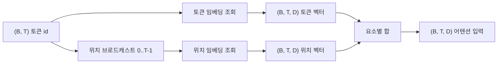
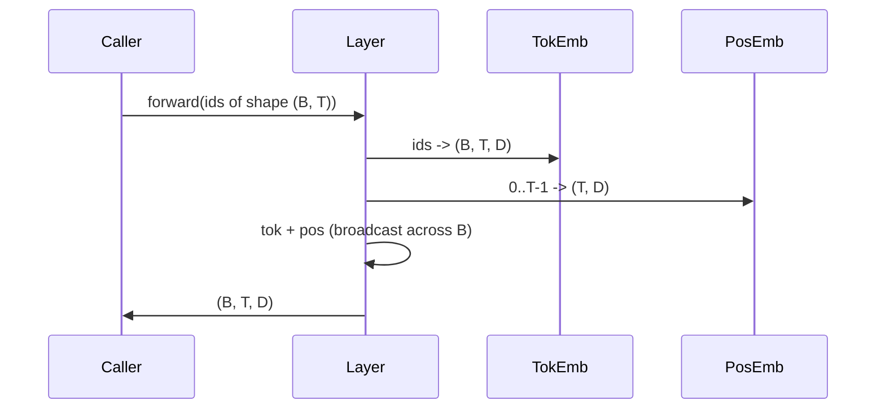

# 토큰 및 위치 임베딩

> ID는 정수입니다. 모델은 벡터를 원합니다. 그 사이에 두 개의 룩업 테이블이 있으며, 위치 임베딩의 선택은 모델이 학습할 수 있는 내용을 결정합니다.

**유형:** Build
**언어:** Python
**선수 요건:** 04단계 강의, 07단계 트랜스포머 강의, 이 단계의 30강 및 31강
**시간:** 약 90분

## 학습 목표
- 어휘 ID를 밀집 벡터에 매핑하는 토큰 임베딩 룩업 테이블을 구축해 보세요.
- 위치에 따라 인덱싱되는 학습된 위치 임베딩 룩업 테이블을 구축해 보세요.
- 매개변수가 없는 고정 사인 위치 임베딩을 위치에 따라 인덱싱하여 구축해 보세요.
- 토큰 및 위치 임베딩을 트랜스포머 블록의 단일 입력으로 구성해 보세요.
- 길이 일반화 및 매개변수 수에 대해 학습된 임베딩과 사인 임베딩을 비교해 보세요.

```figure
cc-embedding-lookup
```

## 프레임

모델이 토큰 ID와 처음 접촉하는 것은 토큰 임베딩 매트릭스에서 행을 룩업하는 것입니다. 이 매트릭스는 어휘 ID당 하나의 행과 모델 차원당 하나의 열을 가집니다. 룩업은 벡터를 반환하며, 모델의 나머지 부분은 이 벡터를 ID의 의미로 취급합니다. 역전파는 순방향 패스에서 사용된 행을 업데이트합니다. 학습 과정에서 이 행들의 기하학적 구조는 방향에서 유사성을 인코딩하도록 학습됩니다.

토큰 ID만으로는 순서가 없습니다. 모델은 위치 1이 위치 17강 다르다는 것을 알려주는 두 번째 신호가 필요합니다. 이 신호에 대한 두 가지 주요 선택지는 학습된 위치 임베딩(두 번째 룩업 테이블, 위치당 하나의 행)과 고정 사인 위치 임베딩(매개변수가 없는 수학 공식)입니다. 이 선택에는 결과가 따릅니다. 학습된 테이블은 매개변수이며 모델이 학습된 최대 컨텍스트 길이에 의해 제한됩니다. 사인 테이블은 이론적으로 매개변수가 없으며 공식은 모든 위치로 확장되지만, 이 강의의 `SinusoidalPositionalEmbedding`는 `max_context_length`에서 고정 테이블을 사전 계산하며 `forward`는 그 한계를 넘어서는 경우를 발생시킵니다. 따라서 두 모듈 모두 여기서 최대 컨텍스트 길이를 강제합니다. 테이블이 인덱싱하기에 충분히 크더라도 모델은 학습된 길이를 넘어서면 여전히 어려움을 겪을 수 있습니다.

이 강의에서는 두 가지를 모두 구축하고, 토큰 임베딩과 결합하여 다음 강의의 어텐션 블록을 위한 단일 입력을 만듭니다.

## 형상 계약

임베딩 단계의 입력은 `(B, T)` 형태의 토큰 id 배치입니다. 출력은 `(B, T, D)` 형태의 텐서이며, 여기서 `D`는 모델 차원입니다. 모든 배치 요소는 동일한 컨텍스트 길이 `T`를 가지며, 모든 위치는 동일한 벡터 차원 `D`를 가집니다.



결합은 합산이며, 연결(concatenation)이 아닙니다. 합산은 `D`를 네트워크 전체에서 일정하게 유지하며, 모델이 각 레이어에서 토큰 의미와 위치 중 어느 것이 지배적인지 기능별로 결정할 수 있게 합니다.

## 토큰 임베딩 매트릭스

토큰 임베딩은 `(V, D)` 형태의 매개변수 텐서이며, 여기서 `V`는 어휘 크기입니다. PyTorch는 이를 `nn.Embedding(V, D)`로 노출합니다. 초기화 시 항목은 작은 가우시안에서 추출되며, 전통적으로 트랜스포머 규모 모델에서는 평균이 0이고 표준 편차가 `0.02` 정도입니다. 정확한 초기값은 실행 간 일관성을 유지하는 것보다 덜 중요합니다.

순방향 전파는 단일 인덱싱 연산입니다. PyTorch는 `(B, T)` int64 id를 `(B, T, D)` floats로 매핑하여 행을 수집(gather)합니다. 역방향 전파는 순방향 전파에서 건드려진 행에만 기울기를 누적합니다. 배치에 한 번도 나타나지 않은 두 행은 해당 단계에서 기울기가 0입니다.

미묘한 세부 사항입니다. 토큰 임베딩과 모델 끝의 출력 투사는 종종 가중치를 공유합니다(가중치 결합, weight tying). 이 경우 모든 역방향 전파는 출력 측을 통해 임베딩의 모든 행을 건드리게 됩니다. 이 강의에서는 두 가지를 별도의 모듈로 노출하지만, 전체 모델에서는 동일한 매트릭스가 두 역할을 모두 수행할 수 있습니다.

## 학습된 위치 임베딩

학습된 위치 임베딩은 `nn.Embedding`이며, 그 형태는 `(max_context_length, D)`입니다. 조회는 위치 ID `0, 1, 2, ..., T-1`를 키로 사용합니다. 순방향 패스는 배치 차원 전체에 그 위치 벡터를 브로드캐스트합니다.

학습된 테이블의 단점은 모델이 위치 `T-1`까지만 학습된 경우 위치 `T`에서 조회할 수 없다는 것입니다. 해당 행이 존재하지 않기 때문입니다. 이 방식을 사용하는 프로덕션 디코더 전용 모델은 최대 컨텍스트 길이를 아키텍처에 고정하며 더 긴 입력을 처리하지 않습니다.

## 사인 위치 임베딩

사인 위치 임베딩은 위치를 벡터로 매핑하는 함수입니다. 위치 `p`과 특징 `i`가 생성하는 값은 다음과 같습니다.

```python
angle = p / (10000 ** (2 * (i // 2) / D))
emb[p, 2k]     = sin(angle)
emb[p, 2k + 1] = cos(angle)
```

이 함수에는 매개변수가 없습니다. 모든 위치는 고유한 벡터를 가집니다. 파장은 특징 차원 전체에 걸쳐 기하급수적으로 변하므로, 낮은 차원은 거친 위치를 인코딩하고 높은 차원은 세밀한 위치를 인코딩합니다.

`sin`과 `cos`의 선택에서 도출되는 속성은 위치 `p + k`의 벡터가 위치 `p`의 벡터에 대한 선형 함수라는 것입니다. 이는 어텐션 레이어가 상대 위치 오프셋을 학습하기 쉬운 경로를 제공합니다. 모델은 "5개 토큰 뒤를 본다"를 표현하기 위해 별도의 매개변수를 필요로 하지 않습니다.

이 강의는 전체 사인 테이블을 생성 시 한 번 계산하고, 순방향 실행 시에 인덱싱합니다.

## 구성

입력 파이프라인은 세 가지를 순서대로 수행합니다. 토큰 ID를 읽습니다. 토큰 벡터를 조회합니다. 위치 벡터를 더합니다. 합을 반환합니다.



합 단계의 브로드캐스트는 `(T, D)` 위치 텐서를 배치 차원을 따라 복제합니다. unsqueeze 후 위치 텐서의 형태가 `(1, T, D)`이므로 PyTorch가 이를 자동으로 처리합니다.

## 대조 분석

이 강의는 두 변형을 동일한 입력에 실행하고 두 가지 진단을 출력합니다.

첫 번째는 매개변수 개수입니다. 학습된 변형은 토큰 임베딩 위에 `max_context_length * D`개의 매개변수를 추가합니다. 사인 변형은 0개를 추가합니다.

두 번째는 인접한 위치의 임베딩(Embedding) 간 코사인 유사도(Cosine Similarity)입니다. 사인 변형은 함수가 연속적이므로 매끄럽고 예측 가능한 감쇠를 보입니다. 학습된 변형은 초기화 시 행이 독립적으로 생성되므로 유사도가 거의 무작위입니다. 학습 후에는 학습된 변형이 일반적으로 유사한 매끄러운 구조를 개발하지만, 그 구조를 데이터로부터 발견해야 합니다.

## 이 강의가 하지 않는 것

회전 위치 인코딩(RoPE)이나 AliBi를 구축하지 않습니다. 이들은 프로덕션 트랜스포머(Transformer)에서의 현대적인 선택입니다. 둘 다这里的 임베딩과 동일한 형태 계약(shape contract)을 따릅니다 (`(B, T, D)` 형태의 벡터에 위치 의존 변환을 적용) 하지만 입력 단계가 아닌 어텐션 투사 단계에서 적용합니다. 다음 강의는 어텐션 블록을 구축하며, 선택적 확장 중 하나는 회전(rotary)을 쿼리-키 투사에 접어 넣는 것입니다.

임베딩을 학습하지 않습니다. 학습은 손실 함수(Loss Function)가 필요하며, 이는 모델 출력이 필요하고, 이는 어텐션과 LM 헤드가 필요합니다. 이는 다음 강의와 그 다음 강의의 주제입니다.

## 코드 읽는 방법

`main.py`는 세 개의 모듈을 정의합니다. `TokenEmbedding`는 `nn.Embedding(V, D)`를 감쌉니다. `LearnedPositionalEmbedding`는 `nn.Embedding(L, D)`를 감쌉니다. `SinusoidalPositionalEmbedding`는 테이블을 사전 계산하고 버퍼로 노출합니다. `EmbeddingComposer`는 토큰 임베딩과 위치 임베딩을 연결합니다. 하단의 데모는 형태, 매개변수(Parameter) 수, 인접 위치 유사도 진단을 출력합니다. `code/tests/test_embeddings.py`의 테스트는 형태, 브로드캐스트 동작, 매개변수 수, 사인 공식을 고정합니다.

데모를 실행하세요. 그런 다음 모델 차원 `D`를 64에서 32로 변경하고 사인 파장 밴드가 어떻게 변하는지 지켜보세요.
