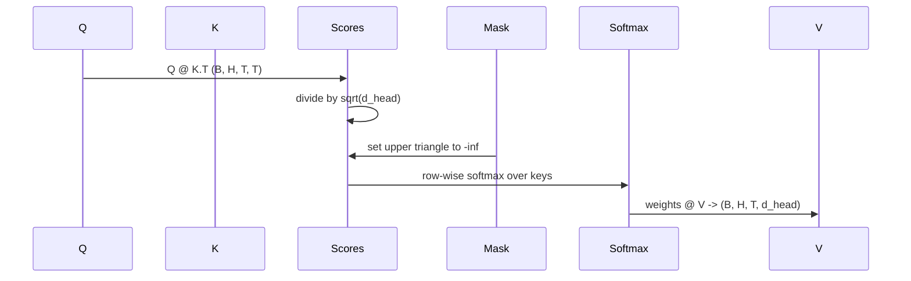

# 멀티 헤드 셀프 어텐션(Multi-Head Self-Attention)

> 하나의 선형 투영, 세 가지 뷰, H개의 병렬 헤드, 하나의 마스크. 모델이 실제로 사용하는 어텐션 블록입니다.

**유형:** Build
**언어:** Python
**선수 요건:** 4단계 강의, 7단계 트랜스포머 강의, 이 단계의 30~32강
**시간:** 약 90분

## 학습 목표
- 단일 선형 레이어로 배치된 쿼리(Query)/키(Key)/값(Value) 투영을 구현하고 H개의 헤드로 분할해 보세요.
- 올바른 정규화 및 dtype 처리로 스케일된 점곱 어텐션을 계산해 보세요.
- 한 위치가 미래의 위치에 어텐션하는 것을 방지하는 인과(causal) 마스크를 적용해 보세요.
- 고정된 입력에 대해 헤드별 어텐션 가중치를 검사하고 각 헤드가 무엇을 보는지 추론해 보세요.
- 장난감(toy) 작업에 작은 어텐션 블록을 학습하고 헤드가 전문화됨에 따라 손실(loss)이 감소하는 것을 관찰해 보세요.

```figure
cap-multihead-attention
```

## 프레임

어텐션은 토큰의 표현이 같은 시퀀스 내의 다른 토큰들로부터 정보를 끌어오는 기능입니다. 셀프 어텐션은 쿼리, 키, 값이 모두 동일한 입력에서 파생됨을 의미합니다. 멀티 헤드(Multi-head)는 투영이 H개의 병렬 어텐션 문제로 분할되고, 그 출력들이 연결(concatenate)되어 다시 투영됨을 의미합니다.

효율적인 구현 패턴은 `D`에서 `3 * D`로 투영하는 하나의 선형 레이어를 사용하여 세 가지 뷰로 슬라이스한 후, 각각 `D // H` 크기의 H개 헤드로 리셰이프하는 것입니다. 행렬 곱(matmul), 소프트맥스(softmax), 가중 합은 배치된 텐서 연산으로 수행되므로 헤드가 가속기에서 병렬로 실행됩니다.

이 강의는 해당 블록을 구축합니다. 또한 인과(causal) 마스크를 추가하여 동일한 코드가 디코더 전용 언어 모델의 어텐션 레이어로 작동하도록 합니다. 다음 강의에서는 이 블록을 쌓아 전체 트랜스포머를 구성하고, 그 다음 강의에서는 이를 학습합니다.

## 형태 계약

입력은 `(B, T, D)`입니다. 출력은 `(B, T, D)`입니다. 마스크는 `(T, T)`이거나 이에 브로드캐스트(broadcast) 가능해야 합니다. 블록 내부의 중간 텐서는 `d_head = D // H`인 `(B, H, T, d_head)` 형태를 가집니다. 제약 조건은 `D % H == 0`입니다.

```mermaid
flowchart LR
    A["(B, T, D) 입력"] --> B["선형 D -> 3D"]
    B --> C["Q, K, V로 분할"]
    C --> D["(B, H, T, d_head)로 리셰이프"]
    D --> E["scores = Q @ K.T / sqrt(d_head)"]
    E --> F["인과 마스크 적용"]
    F --> G["키에 대해 softmax 적용"]
    G --> H["context = weights @ V"]
    H --> I["(B, T, D) 형태로 재형상화"]
    I --> J["출력 Linear D -> D"]
    J --> K["(B, T, D) 출력"]
```



두 선형 레이어(QKV 투영과 출력 투영)는 블록 내의 유일한 매개변수입니다. 마스크, softmax, 행렬 곱, 재형상화는 모두 매개변수가 없습니다.

## QKV 분할

소박한 구현은 Q, K, V 각각에 대해 세 개의 독립적인 선형 레이어를 사용합니다. 효율적인 구현은 `3 * D` 특성을 출력하는 단일 레이어를 사용하여 결과를 분할합니다. `(D, D)` 가중치에 대한 세 개의 독립적인 행렬 곱은 그로부터 쌓아 올린 `(3D, D)` 가중치에 대한 하나의 행렬 곱과 수학적으로 동일하므로, 두 구현은 수학적으로 동등합니다.

효율적인 버전은 가속기가 세 번이 아닌 한 번의 행렬 곱을 실행하므로 더 빠릅니다. 또한 세 개의 하위 행렬이 동일한 매개변수 텐서에 존재하여 함께 초기화할 수 있으므로 초기화도 더 쉽습니다.

## 헤드 재형상화

분할 후 Q, K, V는 각각 `(B, T, D)`입니다. 이를 H개의 병렬 어텐션 문제로 변환하기 위해 `(B, T, H, d_head)`로 재형상화하고 `(B, H, T, d_head)`로 전치합니다. 헤드 차원이 배치 차원 옆에 위치하게 되므로, PyTorch는 헤드별 어텐션을 `B * H`개의 독립적인 인스턴스에 대한 배치 연산으로 처리합니다.

d_head 차원은 마지막에 유지되어 점수 행렬 곱 `Q @ K.transpose(-2, -1)`이 이를 축소합니다. 결과는 `(B, H, T, T)`의 헤드별 어텐션 점수입니다.

## 스케일링

점수는 softmax 전에 `sqrt(d_head)`으로 나눕니다. 이 스케일링이 없으면 `d_head`이 증가함에 따라 내적 값이 커져 softmax가 하나의 항목이 거의 모든 질량을 차지하고 나머지는 거의 사라지는 영역으로 밀려납니다. 그 영역에서는 기울기가 매우 작아 학습이 정체됩니다. `sqrt(d_head)`으로 나누면 헤드 크기에 관계없이 점수의 분산이 대략 일정하게 유지됩니다.

## 인과 마스크

디코더 전용 언어 모델은 다음 토큰을 예측할 때 과거에만 조건을 둘 수 있습니다. 마스크가 이를 강제합니다. 구체적으로, 소프트맥스 이전에 `(T, T)` 점수 행렬의 대각선 위 모든 항목이 음의 무한대로 대체됩니다. 소프트맥스 이후 해당 위치는 가중치가 0이 됩니다.



마스크를 생성 시 버퍼로 등록하여 모델과 같은 장치에 위치하고 그래디언트 그래프의 일부가 되지 않도록 합니다. 마스크는 블록이 볼 수 있는 최대 컨텍스트 길이를 포함합니다. 순전파 시 좌상단 `(T, T)` 코너를 슬라이스합니다.

## 출력 투사

헤드별 컨텍스트 벡터 `(B, H, T, d_head)` 이후, `(B, T, H, d_head)`로 전치하고 `(B, T, D)`로 리셰이프하며 최종 `(D, D)` 선형 투사를 적용합니다. 출력 투사는 모델이 헤드들을 혼합할 수 있게 합니다. 이것이 없으면 H개의 헤드는 이후 레이어를 통해만 재결합되며 블록은 인위적으로 제한됩니다.

## 어텐션 가중치 검사

이 강의는 순전파에 `return_weights=True` 플래그를 노출합니다. 설정 시 블록은 출력과 함께 `(B, H, T, T)` 형태의 헤드별 어텐션 가중치를 반환합니다. 데모는 짧은 입력에 대해 하나의 헤드 가중치 히트맵을 출력하므로 인과 삼각형 구조와 위치별 집중도를 확인할 수 있습니다.

학습된 모델에서는 서로 다른 헤드가 서로 다른 패턴을 학습합니다. 일부 헤드는 바로 이전 토큰에 어텐션하고, 일부 헤드는 시퀀스 시작점에 어텐션하며, 일부 헤드는 어텐션을 거의 균일하게 분산합니다. 검사 훅은 그 해석 가능성 작업의 진입점입니다.

## 학습 데모

`main.py` 하단의 데모는 어텐션 블록을 작은 LM 헤드에 연결하고 반복 작업에 전체를 학습합니다. 입력의 각 행은 컨텍스트에 복제된 단일 랜덤 ID입니다. 타겟은 한 칸 이동한 입력이므로 모델은 다음 토큰이 이전 토큰과 동일하다는 것을 학습해야 합니다. 손실은 교차 엔트로피입니다. H=4, D=32, T=12, 어휘가 64인 경우 CPU에서 3 에포크 동안 손실이 랜덤 (약 `log(64) ~ 4.16`)에서 `1.0` 미만으로 떨어집니다.

데모의 목적은 유용한 모델을 학습하는 것이 아닙니다. 목적은 그래디언트가 블록의 모든 부분을 통해 흐르고 정답이 명확한 문제에서 헤드가 무언가를 학습하는지 확인하는 것입니다.

## 이 강의가 하지 않는 것

피드포워드 블록을 추가하지 않습니다. 실제 모델의 트랜스포머 레이어는 어텐션에 이어 두 레이어 MLP가 있고, 각각에 잔여 연결(residual connection)과 레이어 정규화(layer norm)가 적용됩니다. 다음 강의에서 이를 추가합니다.

로터리(rotary) 또는 AliBi 위치 인코딩을 구현하지 않습니다. 둘 다 QKV 투사 단계에서 같은 블록에 적용되지만, 별도의 교육 단위입니다. 여기서 구축한 블록은 matmul 전에 Q와 K를 변환하면 둘 중 하나와 호환됩니다.

추론을 위한 KV 캐시를 구현하지 않습니다. 순방향 패스(key/value)를 통해 키와 값을 캐싱하는 것은 자기회귀 디코딩을 빠르게 만드는 최적화입니다. K와 V 텐서의 형태 계약(shape contract)을 변경하지만 Q는 변경하지 않습니다. 추론 강의에 속합니다.

## 코드 읽는 방법

`main.py`는 `MultiHeadSelfAttention`를 정의합니다. 이 클래스는 두 개의 선형 레이어와 등록된 마스크 버퍼를 포함합니다. 순방향 패스는 투사, 재형성, 점수 계산, 마스크 적용, 소프트맥스, 가중치 적용, 재형성, 그리고 다시 투사하는 과정을 거칩니다. 하단의 데모는 토큰 및 위치 임베딩과 LM 헤드로 어텐션을 감싼 작은 모델을 구축하고, 복사(copy) 작업에 대해 3에포크 동안 학습하며, 손실 곡선과 헤드별 어텐션 히트맵을 출력합니다. `code/tests/test_attention.py`의 테스트는 형태 계약, 인과성(causality) 속성, 소프트맥스 속성, 헤드 분할(head-split) 속성, 그리고 기울기 흐름을 고정합니다.

데모를 실행하세요. 그런 다음 `n_heads`를 4에서 8로 증가시키세요(`d_model=32`는 유지하므로 `d_head=4`가 됩니다). 히트맵이 변하는 것을 관찰해 보세요.
