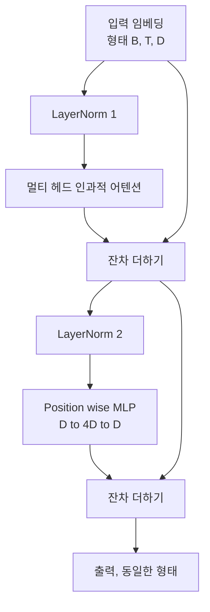
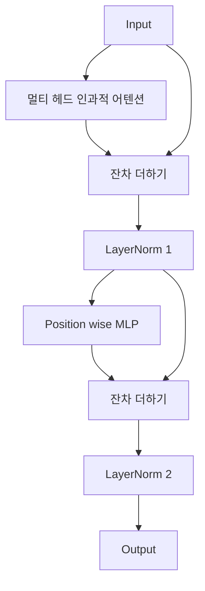

# 처음부터 Transformer 블록 만들기

> 하나의 블록은 모든 현대적 디코더 LLM의 단위입니다. LayerNorm, 멀티 헤드 어텐션, 잔차 연결, MLP, 잔차 연결. pre-LN 변형은 워밍업 없이 안정적으로 학습됩니다. post-LN 변형은 원 논문이 출시한 방식입니다. 이 강의에서는 두 변형을 나란히 구축하고, 일반적인 학습률에서 12층 스택을 견디는 방식이 무엇인지 보여줍니다.

**유형:** Build
**언어:** Python
**선수 요건:** 19단계 30-33강 (토크나이저, 임베딩, 어텐션 수학, 배치 데이터 로더)
**시간:** 약 90분

## 학습 목표

- LayerNorm, 멀티 헤드 인과적 어텐션, 잔차 연결, 위치별 MLP라는 네 가지 핵심 요소를 사용하여 PyTorch에서 Transformer 블록을 구축해 보세요.
- LayerNorm을 두 가지 구성(pre-LN과 post-LN)으로 배치하고, 왜 한쪽이 워밍업 없이 안정적으로 학습되는지 설명해 보세요.
- 멀티 헤드 어텐션 내부에 인과적 마스킹을 구현하여 토큰 `i`이 토큰 `j > i`을 볼 수 없도록 해 보세요.
- 12층 스택에서 두 변형 모두의 기울기 흐름을 추적하고, 모호한 설명 없이 결과를 읽어 보세요.
- 다음 강의에서 1억 2400만 매개변수 GPT를 조립할 때, 이 블록을 즉시 교체 가능한 단위로 재사용해 보세요.

## 문제점

Transformer는 하나의 블록을 반복한 것입니다. 블록을 한 번 잘못 만들고, 이를 12번 반복하면, 첫 에포크에서 발산하는 모델이나 나머지 학습 과정에서 워밍업 해킹이 필요한 모델을 출시하게 됩니다. 이 강의에서 볼 두 가지 실패 모드들은 희귀한 것이 아닙니다. 학습자가 블록을 무비판적으로 쌓을 때 처음 나타납니다. 하나는 어텐션 레이어가 미래를 참조하는 경우이고, 다른 하나는 LayerNorm이 깊어질수록 잔차 신호를 제어할 수 없는 위치에 배치되는 경우입니다.

원리를 이해하면 수정은 기계적입니다. 블록에는 정확히 두 개의 잔차 경로와 정확히 두 개의 정규화 위치가 있습니다. 위치를 올바르게 선택하면 스택의 나머지는 단순한 기록 작업일 뿐입니다.

## 개념

모든 디코더 전용 Transformer 블록은 `(batch, sequence, embedding)` 형태의 텐서를 받아 같은 형태의 텐서를 반환하는 함수입니다. 내부에서는 두 하위 레이어가 작업을 수행합니다.



이것은 pre-LN 변형입니다. LayerNorm은 서브레이어 앞에 위치하며 잔차 브랜치 내부에 있습니다. 잔차 연결은 정규화되지 않은 신호를 앞으로 전달합니다.

post-LN 변형은 LayerNorm을 잔차 더하기 이후로 이동합니다.



형태는 동일하지만, 학습 동작은 다릅니다. post-LN에서는 잔차 경로를 통해 역전파되는 기울기가 LayerNorm을 통과해야 합니다. 깊이가 12이고 학습률이 `3e-4`인 경우, 이 기울기는 워밍업 스케줄이 필요할 정도로 빠르게 축소됩니다. Pre-LN은 잔차 경로를 정규화하지 않으므로, 기울기가 임베딩 레이어까지 깨끗하게 전파됩니다. GPT-2 이후의 모델이 이 구성을 채택한 이유가 바로 이것입니다.

### 인과적 멀티 헤드 어텐션

어텐션 서브레이어는 입력을 세 방향으로 투영하여 쿼리, 키, 값 텐서를 생성합니다. 각각은 `(B, T, D)`에서 `(B, H, T, D/H)`로 재형성되며, 여기서 `H`는 헤드 수입니다. 스케일된 점곱 어텐션은 헤드별로 `softmax(Q K^T / sqrt(d_k))`을 계산하고, 상삼각 행렬을 음의 무한대로 마스킹하며, 마스킹을 소프트맥스를 통해 적용한 후 `V`를 곱합니다. 헤드들은 하나의 `(B, T, D)` 텐서로 다시 연결(concatenate)되어 한 번 더 투영됩니다. 마스킹은 모델을 인과적으로 만드는 유일한 요소입니다. 마스킹을 잊으면 부정행위를 하는 모델을 학습하게 됩니다.

### MLP

Position wise MLP는 모든 토큰에 독립적으로 동일한 2층 네트워크를 적용합니다. 은닉 폭은 임베딩 폭의 4배이며, 활성화 함수는 GELU이고, 두 번째 선형 레이어 뒤에 드롭아웃이 따릅니다. MLP 내부에서는 토큰끼리 상호작용하지 않습니다. 모든 토큰 혼합은 어텐션에서 이루어집니다.

### 잔차 연결은 두 가지 역할을 합니다

잔차 연결은 깊이에 걸쳐 기울기 경로를 가산적으로 만드는데, 이는 12개 레이어를 거치면서 기울기 노름이 스케일 내에 유지되도록 합니다. 또한 각 블록이 전체적인 대체가 아니라 진행 중인 표현에 대한 가산적 업데이트를 학습하도록 합니다. 이러한 두 효과가 블록이 확장 가능한 이유입니다.

```figure
cc-transformer-block
```

## 구현하기

`code/main.py`는 다음을 구현합니다:

- 학습 가능한 스케일과 시프트, 편향된 eps를 포함하며, 토큰 벡터별로 적용되는 `class LayerNorm`입니다.
- `num_heads`, `head_dim = d_model // num_heads`, 융합된 QKV 투영, 등록된 인과 마스크, 어텐션 및 잔차 드롭아웃을 포함하는 `class MultiHeadAttention`입니다.
- 두 개의 선형 레이어, GELU 활성화 함수, 드롭아웃을 포함하는 `class FeedForward`입니다.
- 두 변형 간에 전환하는 `pre_ln` 플래그를 포함하는 `class TransformerBlock`입니다.
- 입력이 동일한 6층 pre-LN 스택과 6층 post-LN 스택을 구축하고, (a) 출력 형상, (b) 한 번의 역전파 후 임베딩에서의 기울기 노름을 출력하는 데모입니다.

실행해 보세요:

```bash
python3 code/main.py
```

출력: 두 스택의 형상 확인 및 나란히 표시된 기울기 노름. 동일한 학습률에서 pre-LN 스택의 임베딩 기울기는 post-LN 스택보다 몇 배 더 크며, 이는 pre-LN이 워밍업 없이 학습된다는 경험적 신호입니다.

## 스택

- 텐서 연산, autograd, `nn.Module` 연결을 위해 `torch`를 사용합니다.
- `transformers`가 없으며, 사전 학습된 가중치도 없습니다. 블록은 기본 요소(primitives)로 구현됩니다.

## 실제 환경에서의 프로덕션 패턴

세 가지 패턴은 교과서식 블록을 배포 가능한 형태로 만듭니다.

**융합된 QKV 투영.** 세 개의 분리된 선형 레이어는 세 번의 커널 실행과 세 번의 행렬 곱셈이 필요합니다. `3 * d_model` 폭을 가진 하나의 선형 레이어는 한 번의 실행으로 동일한 작업을 수행한 후, 마지막 축을 따라 출력을 분할합니다. 융합된 경로는 모든 가속기에서 더 빠르며, GPT-2, LLaMA, Mistral의 참조 구현이 배포하는 방식과 일치합니다.

**등록된 인과 마스크 버퍼.** 마스크는 최대 컨텍스트 길이에만 의존합니다. `register_buffer`를 사용하여 구축 시 한 번만 할당하고, 각 순방향 패스마다 활성 윈도우를 슬라이스하여 호출 시 할당을 생략합니다. 이를 잊으면 긴 컨텍스트에서 마스크가 할당 병목 지점이 됩니다.

**드롭아웃은 세 곳이 아닌 두 곳에 적용합니다.** 드롭아웃은 어텐션 소프트맥스 후(어텐션 드롭아웃)와 MLP의 두 번째 선형 레이어 후(잔차 드롭아웃)에 적용됩니다. 잔차 자체에 드롭아웃을 적용하면 깊은 층에서 기울기가 흐르게 하는 가산 항등성을 깨뜨립니다. 일부 초기 구현은 이를 잘못 적용하여 불안정한 학습으로 대가를 치렀습니다.

## 사용하기

- 이 강의의 블록은 35강의 GPT 조립에 수정 없이 바로 연결됩니다.
- Pre-LN 변형은 모든 최신 오픈 웨이츠 LLM이 사용하는 방식입니다. Post-LN 변형은 2017년 원본 어텐션 논문이 사용한 방식입니다. 두 가지를 모두 알면 encountering하는 모든 디코더 아키텍처를 읽을 수 있습니다.
- GELU를 SiLU로 바꾸면 LLaMA 계열의 활성화 함수가 됩니다. LayerNorm을 RMSNorm으로 바꾸면 LLaMA 계열의 정규화 방식이 됩니다. 골격은 동일합니다.

## 연습 문제

1. 블록 내의 모든 선형 레이어에 `bias=False` 플래그를 추가하세요. 최신 오픈 웨이츠 LLM은 선형 레이어에 편향을 포함하지 않고 출시됩니다. 12층, 768 차원 모델에서 파라미터가 얼마나 절약되는지 측정해 보세요.
2. `nn.LayerNorm`를 직접 만든 RMSNorm으로 교체하고 출력 형상이 변하지 않았는지 확인하세요.
3. 첫 번째 헤드의 어텐션 가중치를 `(B, T, T)` 텐서로 반환하는 플래그를 추가하세요. 상삼각 행렬을 플롯하여 소프트맥스 이후 값이 0인지 확인하세요.
4. `H=6`를 가진 `(2, 16, 384)` 텐서를 두 변형 모두에 입력하고, 가중치가 동일하게 초기화되고 드롭아웃이 0으로 설정된 경우 순방향 출력(예: `not torch.allclose`)이 서로 다르다는 것을 단언하는 무결성 검사를 구축하세요.

## 핵심 용어

| 용어 | 사람들이 말하는 표현 | 실제 의미 |
|------|-----------------|------------------------|
| Pre-LN | "Pre norm" | 각 서브레이어 전에 잔차 브랜치 내부의 LayerNorm; 잔차는 정규화되지 않은 신호를 전달합니다 |
| Post-LN | "Post norm" | 잔차 더하기 이후의 LayerNorm; 2017년 논문이 출시한 방식이며 워밍업이 필요합니다 |
| Causal mask | "Triangle mask" | 어텐션 로짓의 상삼각 행렬을 음의 무한대로 설정하여, 토큰 i가 j가 i보다 클 때 토큰 j를 읽을 수 없게 합니다 |
| Fused QKV | "Combined projection" | 너비 D의 선형 레이어 3개 대신 너비 3D의 선형 레이어 하나; 하나의 커널, 하나의 행렬 곱 |
| Residual stream | "Skip connection" | 모든 블록을 상단에서 하단으로 흐르는 정규화되지 않은 텐서; 각 블록이 더하는 대상 |

## 추가 읽기

- 이 블록의 기반 어텐션 수학을 위해 7단계 02강(처음부터 작성한 셀프 어텐션)을 참고하세요.
- 동일한 골격의 인코더-디코더 버전을 위해 7단계 05강(전체 트랜스포머)을 참고하세요.
- 이 블록이 연결되는 학습 절차는 10단계 04강(미니 GPT 사전 학습)을 참고하세요.
- 이 블록을 12개 쌓아 GPT 모델을 구성하는 내용은 19단계 35강(이 트랙)을 참고하세요.
