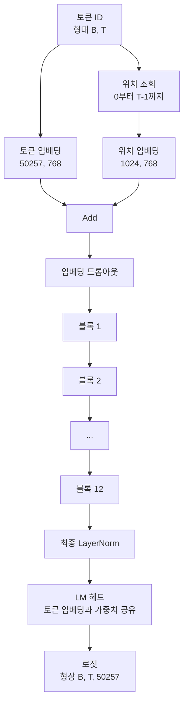

# GPT 모델 조립

> 12개의 블록이 쌓여 있고, 토큰 임베딩, 학습된 위치 임베딩, 최종 LayerNorm, 그리고 가중치가 연결된 언어 모델 헤드가 있습니다. 이것이 전체 1억 2400만 매개변수를 가진 GPT 모델입니다. 이 강의에서는 이러한 요소들을 하나의 동작하는 클래스로 조립하고, 매개변수 개수를 세어 모델이 참조된 124M 형태와 일치하는지 확인하며, 다항 샘플링(multinomial sampling), 온도(temperature), top-k를 사용하여 텍스트를 생성합니다.

**유형:** Build
**언어:** Python
**선수 요건:** 19단계 30강부터 34강
**시간:** 약 90분

## 학습 목표

- 34강의 트랜스포머 블록을 완전한 GPT 모델로 조립합니다: 토큰 임베딩, 위치 임베딩, N개의 블록, 최종 LayerNorm, 언어 모델 헤드.
- 1억 2400만 매개변수 구성을 재현합니다: 어휘 크기 50257, 컨텍스트 길이 1024, 임베딩 크기 768, 12개의 헤드, 12개의 레이어.
- 언어 모델 헤드의 가중치를 토큰 임베딩에 연결(tie)하고, 이 규모에서 약 3800만 매개변수를 절약하는 이유를 설명합니다.
- 프롬프트로부터 다항 샘플링, 온도 스케일링, top-k 절단을 사용하여 텍스트를 생성하며, 슬라이딩 윈도우(sliding window)로 컨텍스트 길이를 유지합니다.
- 124M 목표에 대해 매개변수 개수와 순방향 전파(forward pass) 비용을 측정합니다.

## 문제점

트랜스포머 블록은 그 자체로는 아무것도 하지 않습니다. 토큰 ID를 벡터로 변환하고, 위치 정보를 혼합하고, 스택을 통해 실행하고, 어휘 로짓(logits)으로 다시 투사해야 합니다. 이 네 단계 중 하나라도 잊으면 모델은 순방향 전파에 실패하거나, 위치 정보가 흐트러지거나, 발화할 수 없게 됩니다.

모델의 형태(shape)도 중요합니다. 참조된 GPT-2 small는 위 구성에서 정확히 1억 2400만 매개변수를 가집니다. 이 숫자는 마법이 아닙니다. 어휘 크기 50257 곱하기 임베딩 크기 768은 토큰 테이블입니다. 위치 1024 곱하기 768은 위치 테이블입니다. 대략 각각 700만 매개변수를 가진 12개의 블록은 8400만입니다. 최종 헤드는 가중치 연결(weight tying)을 통해 토큰 테이블을 재사용합니다. 각 부분을 합산하면 1억 2400만이라는 숫자에 도달합니다. 매개변수 개수가 참조 값과 일치하지 않는 모델을 만드는 것은 무언가를 잘못 연결했다는 신호입니다.

## 개념



토큰 ID가 토큰 벡터가 되고, 위치 ID가 위치 벡터가 됩니다. 두 벡터를 더한 후 스택을 통과시킵니다. 최종 LayerNorm은 블록 외부에 있으며 모든 현대적 변형에서 살아남는 유일한 요소입니다. LM 헤드는 토큰 임베딩 행렬을 재사용하는데, 이것이 가중치 공유(weight tying)의 의미입니다.

### 가중치 공유

토큰 임베딩의 형상은 `(vocab, d_model)`입니다. 언어 모델 헤드는 `d_model`에서 `vocab`로 투사해야 합니다. 이 두 형상은 서로 전치(transpose) 관계입니다. 두 가중치를 공유한다는 것은 문자 그대로 동일한 매개변수 텐서를 두 번 사용하는 것을 의미합니다. 어휘 크기 50257, d_model 768인 경우 행렬은 3800만 개의 매개변수를 가집니다. 가중치를 공유하지 않으면 두 번의 비용을 지불해야 합니다. 공유하면 한 번만 비용을 지불하며, 임베딩과 헤드가 함께 업데이트되므로 기울기 신호가 약간 더 깔끔해집니다.

### 위치 임베딩은 학습되며, 사인 함수 기반이 아닙니다

GPT-2는 학습된 위치 임베딩을 제공합니다. 위치 테이블은 형상이 `(1024, 768)`인 하나의 매개변수 텐서입니다. 모델은 모든 순방향 계산에서 위치 0부터 T-1까지 조회하고, 조회 결과를 토큰 임베딩에 더합니다. 이는 가장 단순한 위치 인코딩 방식(RoPE, ALiBi, T5 상대적 편향이 대안입니다)이며, 124M 참조 모델이 사용하는 방식입니다.

### 생성: 온도, top-k, 다항 샘플링

생성은 자기회귀적입니다. 매 단계에서 모델은 모든 위치에서 전체 어휘에 대한 로짓을 반환합니다. 마지막 위치만 취하고, 온도로 나누고, 선택적으로 top-k 로짓을 제외한 모든 로짓을 음의 무한대로 마스킹하고, 소프트맥스를 적용해 확률을 얻고, 결과 분포에서 토큰 하나를 샘플링합니다.


세 가지 조절 변수, 세 가지 다른 동작. 온도가 0에 가까우면 탐욕(greedy) 방식으로 수렴합니다. 온도가 1이면 모델의 자연스러운 분포와 일치합니다. Top-k가 1이면 탐욕 방식입니다. Top-k가 40이면 긴 꼬리를 필터링합니다. 조합이 중요합니다. 다음 강에서는 생성을 정성적 평가 신호로 활용하는 훈련을 다룹니다.

```figure
cc-gpt-assembly
```

## 구현하기

`code/main.py`는 다음을 구현합니다:

- `class GPTConfig` 데이터 클래스는 124M 기본값을 포함합니다: `vocab_size=50257`, `context_length=1024`, `d_model=768`, `num_heads=12`, `num_layers=12`, `mlp_expansion=4`, `dropout=0.1`, `use_bias=True`, `weight_tying=True`.
- 토큰 임베딩, 위치 임베딩, 임베딩 드롭아웃, 12개의 `TransformerBlock`, 최종 LayerNorm, 그리고 플래그가 설정되면 토큰 임베딩과 가중치를 공유하는 `lm_head`를 포함하는 `class GPTModel`.
- 가중치 공유가 계산에 반영되도록 고유 매개변수 수를 반환하는 `count_parameters` 헬퍼.
- 온도, top-k, 다항 샘플링 및 슬라이딩 윈도우 컨텍스트를 처리하는 `generate` 함수.
- 모델을 구축하고, 참조 값인 124M과 함께 매개변수 수를 출력하며, 고정된 프롬프트에서 짧은 시퀀스를 생성하여 전체 파이프라인을 시연하는 데모.

실행해 보세요:

```bash
python3 code/main.py
```

출력: 124M 참조 값과 함께 매개변수 수, 랜덤 프롬프트에서 생성된 토큰 ID, 그리고 가중치 공유가 활성화되었을 때 LM 헤드와 토큰 임베딩이 저장 공간을 공유한다는 확인.

데모를 빠르게 유지하기 위해, 스크립트는 작은 구성(`d_model=64`, `num_layers=2`)을 전체적으로 실행하고 생성된 토큰 시퀀스를 인라인으로 출력합니다. 124M 구성은 구축되지만, 매개변수 수와 한 번의 순방향 전파만 수행됩니다.

## 스택

- 텐서 연산, 오토그라드 및 모듈 연결을 위해 `torch`를 사용합니다.
- `code/main.py`는 34강의 동일한 블록 패턴을 로컬에서 재구현합니다.

## 실전에서의 프로덕션 패턴

세 가지 패턴이 실행되는 모델과 출시되는 모델의 차이를 만듭니다.

**잔여 투영(residual projection)을 작게 초기화하세요.** 어텐션의 출력 투영과 MLP의 두 번째 선형 레이어는 모두 잔여 더하기(residual add)에 직접 입력됩니다. 이 두 레이어를 다른 모든 선형 레이어와 동일한 표준 편차로 초기화하면 깊이가 증가함에 따라 잔여 스트림이 커지고, 최종 LayerNorm이 과열된 상태(hot regime)로 밀어 넣습니다. 이 두 투영의 표준 편차를 `1 / sqrt(2 * num_layers)`로 스케일링하세요. 잔여 스트림은 12개 레이어를 거치는 동안 합리적인 범위를 유지합니다.

**포지션 ID 텐서를 캐싱하고 재계산하지 마세요.** `torch.arange(T)`는 매번 forward 연산마다 새로운 메모리를 할당합니다. `__init__`에서 최대 컨텍스트 길이에 대해 한 번만 할당하고, 매 호출마다 첫 T개 항목을 슬라이싱하여 할당기 왕복(round trip)을 생략하세요.

**가중치를 매개변수 수준에서 연결(tie)하세요. 단순 복사만으로는 안 됩니다.** `lm_head.weight = token_embedding.weight`는 텐서를 공유합니다. 복사하는 것은 공유하지 않습니다. 옵티마이저는 하나의 매개변수를 업데이트해야 하고, 오토그라드 그래프는 하나의 누적만 필요로 합니다. 복사하면 헤드가 임베딩에서 멀어지고 가중치 연결(weight tying)은 아무런 이점을 제공하지 못합니다.

## 사용하기

- 이 강의의 모델 클래스는 다음 강의에서 학습하는 모델과 동일한 형태입니다.
- 학습된 포지션 임베딩을 RoPE로 교체하면 블록이나 헤드를 건드리지 않고도 LLaMA 계열을 얻을 수 있습니다.
- GELU를 SiLU로, LayerNorm을 RMSNorm으로 교체하면 LLaMA 계열의 나머지 변경 사항들을 얻을 수 있습니다.
- 생성 함수는 로짓(logits) 소스에 관계없이 작동하며, 이 모델에만 국한되지 않습니다. 37강의 사전 학습된 GPT-2 파일에서 로짓을 가져와 동일한 생성 루프를 재사용할 수 있습니다.

## 연습 문제

1. LM 헤드를 토큰 임베딩에서 분리하고 매개변수를 다시 세어 보세요. 차이가 50257 × 768 = 3800만임을 확인하세요.
2. 학습된 포지션 임베딩을 생성 시점에 계산된 사인(sinusoidal) 테이블로 교체하세요. 모델이 여전히 forward 연산을 수행하며 매개변수 수가 786,432 감소함을 확인하세요.
3. 생성 함수에 샘플링을 건너뛰고 argmax를 선택하는 `greedy=True` 플래그를 추가하세요. 시퀀스가 실행 간에 결정적(deterministic)임을 확인하세요.
4. softmax 전에 프롬프트나 생성된 히스토리의 모든 토큰 로짓을 상수로 나누는 `repetition_penalty` 조절기를 추가하세요. 고정된 프롬프트에서 값이 1보다 크면 출력의 반복 횟수가 감소함을 보여 주세요.
5. `top_k` 옆에 `top_p` (핵) 샘플링을 추가하세요. 유지된 토큰의 확률 합이 `top_p`를 초과하는지 두 줄로 확인합니다.

## 핵심 용어

| 용어 | 사람들이 말하는 표현 | 실제 의미 |
|------|-----------------|------------------------|
| 가중치 공유 | "Tied embeddings" | LM 헤드와 토큰 임베딩이 동일한 매개변수 텐서를 공유합니다. 어휘 수 × d_model개의 매개변수를 절약하며 GPT-2 참조 구현과 일치합니다 |
| 위치 임베딩 | "Learned positions" | 토큰 벡터에 더해지는 (컨텍스트 길이, d_model) 형태의 별도 테이블로, 엔드투엔드(end-to-end)로 학습됩니다 |
| 슬라이딩 윈도우 컨텍스트 | "Context cap" | 프롬프트와 생성된 토큰이 컨텍스트 길이를 초과할 경우, 가장 오래된 토큰을 버려 활성 윈도우가 fits 하도록 합니다 |
| Top-k 샘플링 | "K truncation" | 가장 높은 값을 가진 K개의 로짓을 유지하고, 나머지는 음의 무한대로 마스크한 후 잔여 부분에 대해 소프트맥스를 적용합니다 |
| 온도 | "Sampling temperature" | 소프트맥스 전에 로짓을 T로 나눕니다. T가 1보다 작으면 날카로워지고, T가 1이면 자연스러운 분포를 유지하며, T가 1보다 크면 평평해집니다 |

## 추가 읽기

- 이 모델이 쌓는 블록에 대해 19단계 34강을 참고하세요.
- 교차 엔트로피 손실로 이 모델을 구동하는 학습 루프에 대해 19단계 36강을 참고하세요.
- 이 정확한 아키텍처에 사전 학습된 GPT-2 가중치를 로드하는 것에 대해 19단계 37강을 참고하세요.
- 다음 토큰 예측의 수학적 원리에 대해 7단계 07강 (GPT 인과적 언어 모델링)을 참고하세요.
- 동일한 아키텍처에 대한 원본 학습 절차에 대해 10단계 04강 (미니 GPT 사전 학습)을 참고하세요.
