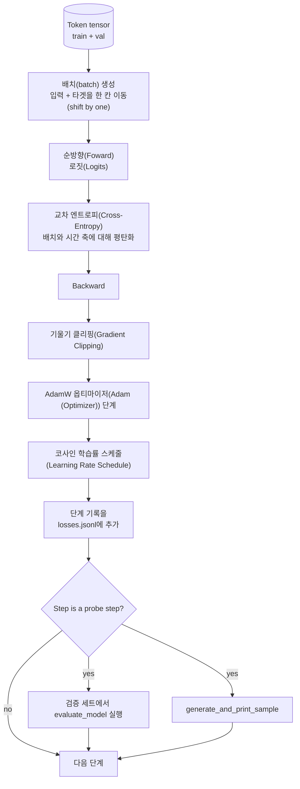

# 학습 루프와 평가

> 측정하지 않는 루프는 거짓말하는 루프입니다. 이 강의에서는 GPT 모델을 구동하는 학습 루프를 구축합니다: 가중치 감쇠 분리가 적용된 AdamW, 워밍업(Warmup) 및 코사인 학습률(Learning Rate) 스케줄, `calc_loss_batch` 헬퍼, 홀드아웃(held out) 데이터에 대한 `evaluate_model` 패스, K 스텝마다 수행하는 `generate_and_print_sample` 정성적 프로브, 그리고 나중에 플롯할 수 있는 손실(loss)의 JSONL 로그가 포함됩니다. 동일한 골격은 여러분이 구축할 모든 디코더 LLM을 학습하는 데 사용됩니다.

**유형:** Build
**언어:** Python
**선수 요건:** 19단계 30강~35강
**시간:** 약 90분

## 학습 목표

- 다음 토큰 예측을 위해 입력과 타겟의 정렬이 올바른 교차 엔트로피(Cross-Entropy) 손실을 계산하는 학습 루프를 구축해 보세요.
- 가중치 텐서에는 가중치 감쇠(Weight Decay)가 적용되지만, LayerNorm 또는 편향(bias) 텐서에는 적용되지 않도록 AdamW를 구성해 보세요.
- 선형 워밍업(Warmup)과 코사인 감쇠(cosine decay)가 포함된 학습률(Learning Rate) 스케줄을 구현하고, 시간에 따른 resulting LR을 읽어 보세요.
- 홀드아웃(held out) 분할에 `evaluate_model`을 사용하여 평가 손실(loss)이 실행 간에 비교 가능하도록 해 보세요.
- K 스텝마다 `generate_and_print_sample`을 사용하여 손실 곡선보다 먼저 발산(divergence)을 포착할 수 있는 정성적 샘플을 생성해 보세요.
- 스텝별 손실(loss)을 JSONL에 저장하여 재로드, 플롯 및 학습 로그를 산출물로 출시(ship)할 수 있도록 해 보세요.

## 문제점

손실(loss)만 출력하고 다른 것은 하지 않는 학습 스크립트는 세 가지 방식으로 실패합니다. 손실이 올바른 이유로 감소하고 있는지 알 수 없습니다(모델이 학습 세트에 과적합(Overfitting)되어 학습하지 못할 수 있습니다). 발산(divergence)이 시작되고 있는지 알 수 없습니다(손실이 한 스텝에서 급증한 후 회복하거나, 한 스텝에서 충돌할 수 있습니다). 모델이 무엇을 학습했는지 알 수 없습니다(손실은 스칼라 값이며, 생성된 샘플은 단락입니다). 루프가 측정하지 않으면 이 세 가지 실패는 모두 숨겨집니다.

이 강의의 루프는 세 가지 방식으로 측정합니다. 매 스텝마다 학습 배치(batch)의 손실(loss), K 스텝마다 홀드아웃(held out) 배치의 손실, K 스텝마다 고정된 프롬프트(prompt)에서 생성된 연속 텍스트입니다. 학습 로그는 JSONL에 저장되어 산출물이 루프의 증언이 됩니다.

## 개념



두 가지 비자명한 요소는 손실 정렬과 AdamW 감쇠 분리입니다.

### 손실 정렬

모델은 모든 위치에서 다음 토큰을 예측합니다. 입력 배치가 토큰 `[t0, t1, t2, t3]`이라면, 대상 배치는 `[t1, t2, t3, t4]`이어야 합니다. 교차 엔트로피(Cross-Entropy)는 평탄화된 형태 `(batch * seq, vocab)`와 평탄화된 대상 `(batch * seq,)`에 대해 계산됩니다. 시프트를 잊으면 모델이 자기 자신을 예측하도록 학습하게 되며, 이는 유용한 것을 학습하지 못한 채 손실이 0으로 수렴합니다.

### AdamW 감쇠 분리

가중치 감쇠(Weight Decay)는 가중치 텐서를 정규화하지만, 정규화 스케일이나 편향은 정규화하지 않습니다. LayerNorm 스케일에 감쇠를 적용하면 스케일이 서서히 0으로 수렴하여 정규화가 깨집니다. 편향에 감쇠를 적용하는 것은 수학적으로 해롭지 않지만, 연산 자원을 낭비합니다. 표준 분리 방식은 다음과 같습니다: 행렬 형태의 텐서(선형 가중치, 임베딩 테이블)는 감쇠를 적용하고, 스케일이나 시프트처럼 보이는 것은 적용하지 않습니다.

### 워밍업(Warmup) 및 코사인 스케줄

워밍업(Warmup)은 학습률을 0에서 목표값까지 몇백 단계에 걸쳐 점진적으로 높여 옵티마이저 상태가 채워질 시간을 확보합니다. 코사인 감쇠는 나머지 단계에 걸쳐 학습률을 0에 가깝게 낮추어, 최종 단계에서 작은 스텝 크기로 가중치를 미세 조정합니다. 이 조합은 오픈 웨이트 LLM (대규모 언어 모델)(LLM (Large Language Model)) 학습에서 가장 일반적인 스케줄이며, 첫 천 단계와 마지막 천 단계의 취약한 순간들을 대부분 제거합니다.

### 홀드아웃(Held out) 평가

`evaluate_model`는 검증 분할에서 고정된 수의 배치를 실행하고, 손실을 누적한 후 배치 수로 나누어 반환합니다. 기울기 계산이 없고, 드롭아웃(Dropout)도 없습니다. 같은 시드와 같은 분할을 사용하면 실행 간에 결과가 재현됩니다. 홀드아웃 손실을 학습 손실 옆에 보고하는 것은 과적합(Overfitting)을 발견하는 방법입니다.

### 조기 신호로서의 정성적 샘플링

학습 손실이 잘 떨어지지만 생성된 샘플이 모두 같은 토큰인 모델은 고장 난 것입니다. 손실 곡선이 평평해 보이지만 생성된 샘플이 일관된 단어로 선명해지는 모델은 학습하고 있는 것입니다. 정성적 탐지(probe)는 전체 곡선을 읽는 것보다 빠르게 실행되며, 스칼라 값이 놓치는 모드(mode)를 포착합니다.

```figure
cap-training-loop
```

## 구현하기

`code/main.py`는 다음을 구현합니다:

- 긴 토큰 텐서를 입력 및 타겟 쌍으로 슬라이싱하는 `make_batches(token_ids, batch_size, context_length)`
- 순전파(forward), 평탄화(flatten) 및 스칼라 교차 엔트로피(cross entropy) 반환을 수행하는 `calc_loss_batch(model, inputs, targets)`
- grad가 없는 상태로 고정된 수의 검증 배치(validation batch)를 반복하고 평균 손실을 반환하는 `evaluate_model(model, val_loader, max_batches)`
- 고정된 프롬프트에 대해 35강의 생성 함수를 실행하고 결과를 출력하는 `generate_and_print_sample(model, prompt, max_new_tokens)`
- 두 그룹의 AdamW 매개변수 목록을 생성하는 `build_param_groups(model, weight_decay)`
- 주어진 스텝(step)에서의 학습률(LR)을 반환하는 `cosine_with_warmup(step, warmup_steps, total_steps, max_lr, min_lr)`
- 루프를 실행하고 `outputs/losses.jsonl`을 저장하며, 매 `eval_every` 스텝마다 평가 손실과 샘플을 출력하는 `train(...)`
- 합성 데이터로 작은 모델을 소량의 스텝 동안 학습하고, JSONL 로그를 기록하며, 탐지 지점(probe point)에서 평가 손실과 샘플을 출력하는 데모입니다. 이 데모는 CPU에서 1분 미만의 시간에 실행됩니다.

실행해 보세요:

```bash
python3 code/main.py
```

출력: 스텝별 손실 라인, 매 탐지 스텝마다 평가 손실, 매 탐지 스텝마다 생성된 샘플, 그리고 `json.loads`을 사용하여 라인별로 로드할 수 있는 최종 `outputs/losses.jsonl`입니다.

## 스택(Stack)

- 오토그라드(Autograd), 옵티마이저 및 모듈을 위한 `torch`
- 35강의 `GPTModel` 및 지원 모듈을 로컬에서 재구현하는 `main.py`

## 실전에서의 프로덕션 패턴

세 가지 패턴은 교과서식 루프를 밤새 실행할 수 있는 형태로 만듭니다.

**기울기 노름 클리핑(gradient norm clipping)은 타협할 수 없습니다.** 나쁜 배치(이상한 데이터, 학습률 급증, 수치적 엣지 케이스)는 수 시간의 학습을 무너뜨리는 거대한 기울기를 생성합니다. `backward` 이후 `step` 전에 `torch.nn.utils.clip_grad_norm_(params, max_norm=1.0)`를 적용하면 옵티마이저가 안전한 범위에 유지됩니다. 클리핑 값은 자유 매개변수이며, 1은 대부분의 설정에서 살아남는 기본값입니다.

**피클링된 상태가 아닌 재개 가능한 JSONL 로깅.** 각 단계의 손실 기록은 `{"step": int, "train_loss": float, "lr": float}` 줄로 JSONL에 저장되며 내구성이 있습니다. 크래시가 발생해도 읽을 수 있는 아티팩트가 남고, grep으로 검색할 수 있으며, Python 30줄로 플롯을 그릴 수 있고, 마지막 단계를 읽어 훈련을 재개할 수 있습니다. 피클링된 상태는 파일을 생성한 정확한 모듈 레이아웃에 종속되므로 리팩토링에 취약합니다.

**고정된 슬라이스에서 추출한 평가 배치.** 검증 토큰은 스크립트 시작 시 배치로 슬라이스되며, 실시간으로 생성되지 않습니다. 재현성은 실행 간에 평가 배치가 동일해야 성립합니다. 그렇지 않으면 두 실행 간의 평가 손실 비교는 모델뿐만 아니라 배치 셔플까지 측정하게 됩니다.

## 사용하기

- 이 강의의 루프는 실제 데이터로 124M 모델을 훈련하는 동일한 골격입니다. 합성 토큰 텐서를 `datasets` 스타일의 로더로 교체하면 루프는 변경되지 않고 실행됩니다.
- JSONL 로그는 훈련 실행을 증거로 변환하는 산출물입니다. 다음 강의에서는 이를 사용하여 새로 훈련된 체크포인트와 사전 훈련된 체크포인트를 비교합니다.
- 정성적 샘플 프로브는 스칼라 손실이 대체할 수 없는 만능 검사입니다.

## 연습 문제

1. 스케일 및 편향 매개변수가 감쇠 없는 그룹에 포함되고, 선형 및 임베딩 가중치가 감쇠 그룹에 포함됨을 확인하는 `weight_decay_groups()` 단위 테스트를 추가해 보세요.
2. 합성 랜덤 토큰을 작은 텍스트 파일의 바이트로 교체하여 데모가 읽을 수 있는 내용으로 훈련되도록 해 보세요. 생성된 샘플이 파일에 존재하는 문자를 사용하는지 확인하세요.
3. 코사인 스케줄에 `max_lr`의 10퍼센트를 `min_lr` 하한으로 추가하고 다시 플롯해 보세요.
4. JSONL 로그 외에도 `eval_every` 단계마다 체크포인트를 저장하세요. 모델 상태와 옵티마이저 상태를 다시 로드하는 `resume_from` 플래그를 추가하세요.
5. 손실 옆에 단계별 처리량(초당 토큰 수)을 기록하고, 처리량이 일정한 범위 내에 유지되는지 확인하세요.

## 핵심 용어

| 용어 | 사람들이 말하는 표현 | 실제 의미 |
|------|-----------------|------------------------|
| 손실 정렬 | "한 칸 이동" | 위치 0..T-1의 입력 토큰, 위치 1..T의 대상 토큰; 교차 엔트로피는 평탄화된 형태에서 계산됨 |
| 감쇠 분리 | "두 그룹" | AdamW는 가중치 감쇠가 적용된 매트릭스 형태의 텐서와 가중치 감쇠가 없는 스케일 또는 편향 텐서를 받음 |
| 워밍업(Warmup) | "램프(Ramp)" | 옵티마이저 상태가 채워지도록 학습률이 고정된 단계 수에 걸쳐 0에서 목표값까지 상승합니다 |
| 평가 배치(Eval batches) | "홀드아웃 배치(Held out batches)" | 스크립트 시작 시 한 번 잘라낸 검증 토큰 텐서의 고정된 조각으로, 모든 프로브에서 동일하게 사용됩니다 |
| 정성적 프로브(Qualitative probe) | "샘플 출력(Sample print)" | 손실만으로는 드러나지 않는 실패 모드들을 포착하기 위해, 고정된 프롬프트에서 짧은 생성물을 K 단계마다 출력합니다 |

## 추가 읽기

- 루프가 구동하는 모델에 대해 19단계 35강을 참고하세요.
- 동일한 모델에 사전 학습된 가중치를 로드하는 것에 대해 19단계 37강을 참고하세요.
- 실제 데이터에 대한 절차에 대해 10단계 04강 (미니 GPT 사전 학습)을 참고하세요.
- 교차 엔트로피 손실(Cross-Entropy Loss)을 넘어선 더 넓은 평가 표면(Eval Surface)에 대해 10단계 10강 (평가)을 참고하세요.
