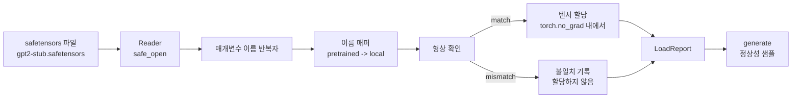

# 사전 학습된 가중치 로드하기

> 1억 2,400만 매개변수 모델을 처음부터 학습하는 것은 예산 결정입니다. 공개된 체크포인트를 로드하는 것은 화요일의 일상적인 작업입니다. 이 강의에서는 safetensors 파일에서 사전 학습된 GPT-2 스타일 가중치를 35강의 정확한 아키텍처로 로드하고, 매개변수 이름 매핑을 하나씩 살펴보며, 로드가 성공했음을 증명하기 위해 간단한 연속 생성을 수행합니다. 네트워크, 서드파티 로더, 불투명한 마법 같은 처리는 없습니다.

**유형:** Build
**언어:** Python
**선수 요건:** 19단계 30-36강
**시간:** 약 90분

## 학습 목표

- `safetensors` Python 라이브러리를 사용하여 safetensors 파일을 읽고 텐서 이름과 형태를 확인해 보세요.
- 사전 학습된 각 매개변수 이름을 35강의 GPT 모델 내부의 매개변수에 매핑해 보세요.
- 공개된 GPT-2 가중치와 이 트랙의 모델 간에 다른 두 가지 이름 규칙을 처리해 보세요. `wte/wpe/h.N.attn.c_attn/c_proj` 및 `mlp.c_fc/c_proj`는 로컬 명명된 `tok_embed/pos_embed/blocks.N.attn.qkv/out_proj` 및 `mlp.fc1/fc2`와 다릅니다.
- 가중치 할당이 일어나기 전에 형태 불일치를 감지하고 명확한 오류로 거부해 보세요.
- 로드된 가중치를 사용하여 짧은 연속 생성을 수행하고, 토큰이 랜덤 초기화된 분포가 아닌 로드된 분포에서 나왔음을 확인해 보세요.

## 문제점

공개된 가중치는 사용자의 아키텍처에 맞춰 패키징되지 않았습니다. 원본 구현에서 사용된 이름을 담고 있습니다. 사전 학습된 파일에는 `(2304, 768)` 형태의 `transformer.h.0.attn.c_attn.weight`이 있으며, 모델은 `(2304, 768)` 형태의 `blocks.0.attn.qkv.weight`를 기대합니다(서로 다른 레이아웃 규칙을 가진 동일한 매트릭스) 또는 모델이 매트릭스를 전치(transposed)하여 저장하는 `nn.Linear`를 사용합니다. 동일한 매개변수가 세 가지 미묘하게 다른 정체성(이름, 형태, 바이트 레이아웃)으로 나타나며, 로더는 이 세 가지를 모두 조정해야 합니다.

맹목적으로 복사하는 로더는 올바른 텐서를 잘못된 위치에 배치하여 의미 없는 내용을 생성하는 모델을 만들어냅니다. 형태가 다르면 복사를 거부하지만 아무것도 기록하지 않는 로더는 어떤 텐서가 로드되지 않았는지 추측하게 만듭니다. 이 강의의 로더는 명시적입니다. 모든 할당이 기록되고, 모든 형태가 확인되며, `LoadReport`가 성공, 실패, 형태 불일치를 요약하여 발생한 일을 읽을 수 있게 해줍니다.

## 개념



이름 매퍼는 단순한 문자열에서 문자열로의 함수입니다. 형상 확인은 하나의 if 문입니다. 할당은 `torch.no_grad()` 내에서 이루어지므로 오토그라드(Autograd)가 로드를 추적하지 않습니다. 보고서는 모든 이름의 결과를 포함합니다.

### GPT-2 명명 규칙

공개된 GPT-2 가중치는 다음과 같은 이름으로 저장되어 있습니다:

| 사전 학습된 이름 | 형상 | 의미 |
|-----------------|-------|---------|
| `wte.weight` | (50257, 768) | 토큰 임베딩 |
| `wpe.weight` | (1024, 768) | 위치 임베딩 |
| `h.N.ln_1.weight` | (768,) | 블록 N의 LayerNorm 1 스케일 |
| `h.N.ln_1.bias` | (768,) | 블록 N의 LayerNorm 1 시프트 |
| `h.N.attn.c_attn.weight` | (768, 2304) | 융합된 QKV 선형 가중치 |
| `h.N.attn.c_attn.bias` | (2304,) | 융합된 QKV 선형 편향 |
| `h.N.attn.c_proj.weight` | (768, 768) | 어텐션 출력 투영 |
| `h.N.attn.c_proj.bias` | (768,) | 어텐션 출력 투영 편향 |
| `h.N.ln_2.weight` | (768,) | LayerNorm 2 스케일 |
| `h.N.ln_2.bias` | (768,) | LayerNorm 2 시프트 |
| `h.N.mlp.c_fc.weight` | (768, 3072) | MLP fc1 가중치 |
| `h.N.mlp.c_fc.bias` | (3072,) | MLP fc1 편향 |
| `h.N.mlp.c_proj.weight` | (3072, 768) | MLP fc2 가중치 |
| `h.N.mlp.c_proj.bias` | (768,) | MLP fc2 편향 |
| `ln_f.weight` | (768,) | 최종 LayerNorm 스케일 |
| `ln_f.bias` | (768,) | 최종 LayerNorm 시프트 |

두 가지 예상치 못한 점을 대비해야 합니다. `c_attn`, `c_proj`, `c_fc` 선형 행렬은 `nn.Linear.weight`이 기대하는 것과 비교해 전치된 상태로 저장되어 있습니다. 로더는 할당 중에 전치합니다. LM 헤드는 파일에 전혀 포함되어 있지 않습니다. 모델은 `wte`과의 가중치 결합(weight tying)에 의존하므로, 헤드는 `wte`이 도착했을 때 별칭(aliasing)을 통해 설정됩니다.

### 로컬 명명 규칙

이 트랙의 모델은 서술적인 이름을 사용합니다:

| 로컬 이름 | 의미 |
|------------|---------|
| `tok_embed.weight` | 토큰 임베딩 |
| `pos_embed.weight` | 위치 임베딩 |
| `blocks.N.ln1.scale` | 블록 N의 LayerNorm 1 스케일 |
| `blocks.N.ln1.shift` | LayerNorm 1 시프트 |
| `blocks.N.attn.qkv.weight` | 융합된 QKV |
| `blocks.N.attn.qkv.bias` | 융합된 QKV 편향 |
| `blocks.N.attn.out_proj.weight` | 어텐션 출력 투영 |
| `blocks.N.attn.out_proj.bias` | 출력 투영 편향 |
| `blocks.N.ln2.scale` | LayerNorm 2 스케일 |
| `blocks.N.ln2.shift` | LayerNorm 2 시프트 |
| `blocks.N.mlp.fc1.weight` | MLP fc1 |
| `blocks.N.mlp.fc1.bias` | MLP fc1 편향 |
| `blocks.N.mlp.fc2.weight` | MLP fc2 |
| `blocks.N.mlp.fc2.bias` | MLP fc2 편향 |
| `final_ln.scale` | 최종 LayerNorm 스케일 |
| `final_ln.shift` | 최종 LayerNorm 시프트 |

이 매핑은 고정된 함수입니다. 이 강의에서는 로더가 반복하는 dict로 이를 제공합니다.

### 스텁 픽스처

실제 GPT-2 가중치는 0.5 GB입니다. 데모는 이를 다운로드하지 않으며, 첫 실행 시 d_model이 768가 아닌 192인 12블록 모델에 적합한 정확한 GPT-2 명명 규칙과 형태를 가진 작은 safetensors 픽스처를 생성합니다. 이 픽스처는 로더의 모든 코드 경로를 테스트할 수 있는 올바른 구조를 가지고 있습니다. 픽스처를 실제 파일로 교체하면 로더는 수정 없이 작동합니다.

```figure
cc-weight-remap
```

## 구현하기

`code/main.py`는 다음을 구현합니다:

- 이 강의가 자체 완결되도록 35강의 `GPTModel`를 작은 복제본으로 포함합니다.
- 레이어별 항목을 확장하는 `make_pretrained_to_local(num_layers)`.
- 이름을 반복하고, 매핑하며, 형태를 확인하고, conv1d 스타일 가중치를 전치(transpose)하여 `torch.no_grad()` 아래에 할당하는 `load_safetensors(model, path)`. `LoadReport`를 반환합니다.
- 정확한 사전 학습된 명명 규칙으로 픽스처 파일을 생성하는 `make_stub_safetensors(path, cfg)`.
- 첫 실행 시 `outputs/gpt2-stub.safetensors`를 생성하고, 새로운 모델을 빌드하며, 랜덤 초기화에서 생성된 연속성을 캡처하고, 스텁을 로드한 후 다른 연속성을 캡처하여 두 결과를 출력하고, 두 결과가 서로 다름(로드가 실제로 모델을 변경함)을 검증하는 데모입니다.

실행해 보세요:

```bash
python3 code/main.py
```

출력: 픽스처 경로, 이름별 로드 로그, `LoadReport` 요약, 로드 전 연속성, 로드 후 연속성, 그리고 실패 경로를 테스트하기 위해 픽스처에 의도적으로 삽입한 단일 텐서의 모양 불일치입니다.

## 스택

- 디스크 형식과 스트리밍 리더를 위한 `safetensors`입니다.
- 모델과 할당 연산을 위한 `torch`입니다.
- `transformers` 없음, `huggingface_hub` 없음, 네트워크 호출 없음입니다.

## 실전에서의 프로덕션 패턴

세 가지 패턴이 직접 생성하지 않은 가중치와 접촉해도 로더가 살아남게 합니다.

**할당 전에 항상 파일을 검증하세요.** 파일을 열고 모든 텐서 이름과 dtype, 모양을 나열한 후 모양 검사를 포함한 전체 매핑을 실행하고, 성공한 경우에만 할당을 시작하세요. 반만 로드된 모델은 조용히 실패하는 기계입니다.

**소스 이름과 대상 이름을 포함하여 모든 할당을 로그에 기록하세요.** 문제가 발생하면 로그가 어떤 텐서가 어디에 배치되었는지 알려주며, 대안은 hexdump를 읽는 것입니다. 이 강의의 `LoadReport` 데이터 클래스는 `loaded`, `missing`, `unexpected`, `shape_mismatch` 목록을 추적하고 끝에 요약을 출력합니다.

**LM 헤드는 가중치 공유(tying) 별칭이며, 별도 사본이 아닙니다.** `tok_embed`을 로드한 후 `model.lm_head.weight = model.tok_embed.weight`을 설정하는 것이 표준 패턴입니다. 임베딩 행렬을 새로운 `lm_head.weight` 매개변수에 복사하면 가중치 공유가 깨지고 매개변수 수가 조용히 두 배가 됩니다.

## 사용하기

- 이 로더는 사전 학습된 명명 규칙을 사용하는 모든 safetensors 파일에 작동합니다. 실제 GPT-2 파일(small / medium / large / xl)은 코드 변경 없이 작동하며, 모델 구성만 다릅니다.
- 이름 맵을 업데이트하면 동일한 패턴이 LLaMA, Mistral, Qwen 가중치에도 확장됩니다. 모양 검사와 보고서는 동일하게 유지됩니다.
- 로드 후 정상성(sanity) 생성은 빠른 게이트입니다. 로드 후 샘플이 로드 전 샘플과 유사하다면, 로드가 모델을 변경하지 않았다는 의미이며, 이는 매핑이 모든 텐서를 조용히 놓쳤다는 뜻입니다.

## 연습 문제

1. 로더에 `dtype` 인수를 추가하여 할당 중 각 텐서를 대상 dtype(`bfloat16`, `float16`, `float32`)으로 캐스팅하세요. `float32` 모델을 `bfloat16`로 다운캐스트해도 여전히 생성이 가능한지 확인하세요.
2. `h.N` 인덱스가 모델의 `num_layers`와 일치하지 않는 체크포인트를 로드하지 않도록 `expected_layers` 인자를 추가하세요.
3. 로더를 35강의 생성 함수에 연결하고, 랜덤 초기화와 로드된 픽스처에서 각각 생성한 두 샘플을 나란히 출력하세요.
4. 내보내기 경로를 추가하세요: 현재 모델 상태를 사전 학습된 명명 규칙을 사용하여 새로운 safetensors 파일에 기록하세요. 로더를 왕복(round trip)하여 보고서에 모양(shape) 불일치가 0건임을 확인하세요.
5. `NAME_MAP`를 확장하여 LLaMA 명명 규칙(편향 없음, RMSNorm, 융합된 qkv 레이아웃)을 처리하고, 직접 생성한 LLaMA 스텁(stub) 픽스처에 로더를 다시 실행하세요.

## 핵심 용어

| 용어 | 사람들이 말하는 표현 | 실제 의미 |
|------|-----------------|------------------------|
| 이름 맵 | "키 재매핑" | 사전 학습된 텐서 이름에서 로컬 매개변수 이름으로 변환하는 함수; 보통 레이어 인덱스마다 항목이 하나씩 있으며 루프를 통해 확장되는 리터럴 dict |
| 모양 불일치 | "나쁜 모양" | 매핑된 이름으로 사전 학습된 텐서가 존재하지만 그 차원이 로컬 매개변수와 일치하지 않는 경우; 로더는 할당을 거부하고 해당 쌍을 기록합니다 |
| 로드 시 전치 | "Conv1d 레이아웃" | 공개된 GPT-2는 어텐션 및 MLP 투영을 nn.Linear가 기대하는 것과 전치(transpose)된 형태로 저장합니다; 로더는 할당 중에 전치합니다 |
| 가중치 결합 별칭 | "공유 LM 헤드" | model.lm_head.weight = model.tok_embed.weight로 설정하여 헤드와 임베딩이 저장 공간을 공유하는 것; 이 때문에 헤드는 파일에 없습니다 |
| 로드 보고서 | "커버리지 요약" | 로드됨, 누락됨, 예상치 못함, shape_mismatch 목록을 추적하는 작은 dataclass; 이를 출력하는 것이 로드가 성공했는지 확인하는 방법입니다 |

## 추가 읽기

- 가중치를 받는 아키텍처에 대해 19단계 35강을 참고하세요.
- 동일한 모양의 체크포인트를 생성하는 학습 루프에 대해 19단계 36강을 참고하세요.
- 메모리가 부족할 때 로드된 가중치를 어떻게 처리해야 하는지에 대해 10단계 11강(양자화)을 참고하세요.
- 로드 및 추론을 둘러싼 전체 수명 주기에 대해 10단계 13강(완전한 LLM 파이프라인 구축)을 참고하세요.
