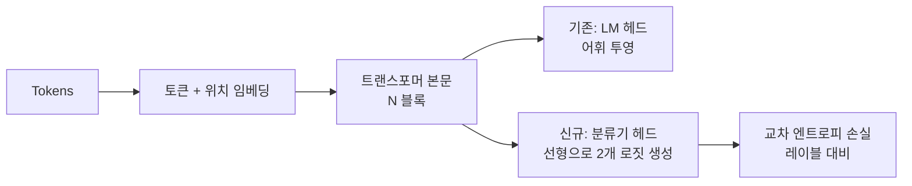
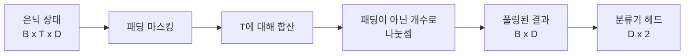
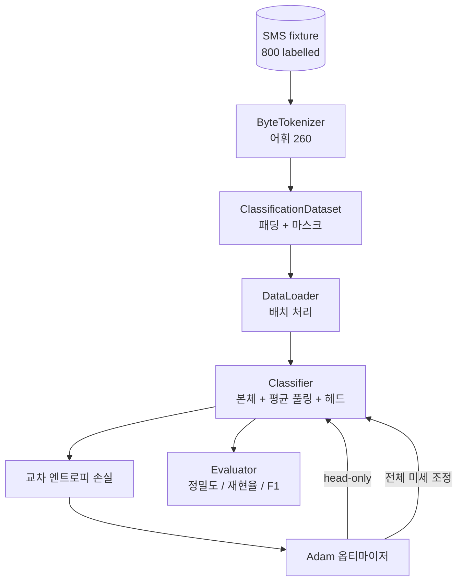

# 캡스톤 38강: 헤드 스왑을 통한 분류기 미세 조정

> 트랙 B의 첫 번째 캡스톤입니다. 사전 학습된 언어 모델은 토큰 예측 헤드로 끝나는 셀프 어텐션 블록의 스택입니다. 스팸 대 정상(spam vs ham) 분류를 원할 때, 헤드는 틀렸지만 몸통(body)은 대부분 맞습니다. 이 강의에서는 헤드를 떼어내고, 풀링된 표현(pooled representation)에 두 클래스 선형 레이어를 붙인 후, 분류기를 두 가지 방식으로 훈련합니다: 최종 레이어만 훈련하는 방식과 전체 미세 조정 방식입니다. 평가는 홀드아웃(held-out) 분할에 대한 정밀도, 재현율, F1입니다. 각 전략이 무엇을 가져다주는지, 그리고 그 비용이 무엇인지 학습합니다.

**유형:** Build
**언어:** Python (torch, numpy)
**선수 요건:** 19단계 30-37강 (NLP LLM 트랙: 토크나이저, 임베딩 테이블, 어텐션 블록, 트랜스포머 몸통, 사전 학습 루프, 체크포인팅, 생성, 퍼플렉시티)
**시간:** 약 90분

## 학습 목표

- 몸통을 재초기화하지 않고 언어 모델 헤드를 분류 헤드로 교체합니다.
- 두 가지 훈련 체제를 구현합니다: 몸통 고정(헤드 전용) 및 전체 미세 조정이며, 하나의 훈련 루프를 공유합니다.
- 패딩, 패딩 마스킹, 어텐션 출력 풀링을 수행하는 토크나이저 인식 데이터 파이프라인을 구축합니다.
- 원시 로짓(raw logits)에서 정밀도, 재현율, F1 및 혼동 행렬(confusion matrix)을 계산합니다.
- 매개변수 수, 훈련 시간, 헤드룸(head-room) 간의 트레이드오프(trade-off)에 대해 추론합니다.

## 문제점

소규모 트랜스포머를 범용 코퍼스에 대해 사전 학습했습니다. 출력 헤드는 마지막 은닉 상태를 1000개 토큰 어휘로 투영합니다. 이제 스팸 또는 정상으로 라벨링된 800개의 SMS 메시지가 있으며, 이진 분류기를 원합니다. 세 가지 옵션이 있습니다.

잘못된 옵션은 800개 예제에 대해 분류기를 처음부터 새로 훈련하는 것입니다. 사전 학습된 모델의 몸통은 이미 유용한 구조를 인코딩하고 있습니다: 단어 식별, 위치, 단순한 동시 출현(co-occurrence) 등입니다. 이를 버리는 것은 이를 구축하는 데 사용된 연산 자원을 낭비합니다.

두 가지 올바른 옵션은 몸통을 고정하고 헤드를 교체하는 방식과, 몸통을 학습 가능하게 하고 헤드를 교체하는 방식입니다. 헤드 전용 훈련은 빠르고, 메모리 비용이 거의 없으며, 이 정도의 작은 데이터에서는 거의 과적합되지 않습니다. 전체 미세 조정은 더 느리고, 작은 데이터에서는 과적합될 수 있지만, 다운스트림 도메인이 사전 학습 코퍼스와 멀어질 때 더 높은 정확도에 도달합니다.

이 강의는 두 가지를 모두 구축하므로, 동일한 픽스처에서 비교할 수 있습니다.

## 개념



모델은 함수 `f_theta(tokens) -> hidden_states`입니다. 헤드는 함수 `g_phi(hidden) -> logits`입니다. 헤드를 교체한다는 것은 `theta`를 유지하고 `g_phi`를 교체하는 것을 의미합니다. 본문의 매개변수가 비용이 많이 드는 부분입니다. 헤드는 단일 선형 레이어입니다.

두 개의 학습 가능한 매개변수 세트가 중요합니다:

- `theta` (본문): 각 어텐션 블록당 수만 개의 가중치.
- `phi` (헤드): `hidden_dim * num_classes` 가중치와 편향(bias).

헤드 전용 학습에서는 `phi`에 대해 기울기를 계산하고 `theta`에 대해서는 기울기를 0으로 설정합니다. PyTorch에서는 본문 매개변수에 `requires_grad=False`를 설정하여 이를 수행할 수 있습니다. 그러면 옵티마이저는 헤드만 보고 본문은 동결된 상태로 유지됩니다.

전체 미세 조정에서는 기울기가 전체 스택을 통해 역전파되도록 허용합니다. 본문의 가중치는 분류 목적에 맞추기 위해 이동합니다. 작은 데이터에서의 위험은 catastrophic forgetting입니다: 본문의 사전 학습이 과적합 잡음에 의해 씻겨 나갑니다.

## 풀링(Pooling) 질문

분류기는 시퀀스당 하나의 벡터가 필요하며, 토큰당 하나의 벡터가 필요하지는 않습니다. 세 가지 일반적인 선택지:

- **평균 풀링(Mean pool)**: 어텐션 마스크로 가중치를 적용하여 시퀀스 전체의 은닉 상태를 평균냅니다.
- **CLS 풀링(CLS pool)**: 특수 토큰을 앞에 붙이고 그 출력만 사용합니다. BERT가 하는 방식입니다.
- **마지막 토큰 풀링(Last-token pool)**: 마지막 패딩이 아닌 토큰을 사용합니다. GPT 계열 분류기가 하는 방식입니다.

이 강의는 명시적인 어텐션 마스크 가중치를 적용한 평균 풀링을 사용합니다. 가장 단순하며, 시퀀스 길이에 걸쳐 안정적인 신호를 제공하고, CLS 토큰을 사전 학습할 필요가 없습니다.



## 데이터

800개의 SMS 메시지는 `code/main.py`에서 결정적으로 생성됩니다. 400개는 스팸, 400개는 정상(ham)으로 균형을 이루며, 생성기는 고정된 시드를 사용하여 템플릿을 선택하고 슬롯 필러를 대체하며, 5~25 토큰 길이의 메시지를 생성합니다. 실제 데이터셋에는 잡음이 존재하지만 이 픽스처에는 없습니다. 이 픽스처의 목적은 재현성입니다.

데이터는 80/20으로 분할됩니다: 훈련 640개, 테스트 160개. 분할은 층화(stratified)되어 테스트 세트가 50/50 균형을 유지합니다. 알려진 균형을 가진 홀드아웃 세트는 정밀도와 재현율을 신뢰할 수 있는 수치로 읽을 수 있게 해줍니다.

## 메트릭

클래스 1을 양성 클래스(스팸)로 하는 이진 분류입니다. 집계는 다음과 같습니다:

- `TP`: 스팸으로 예측, 실제로 스팸.
- `FP`: 스팸으로 예측, 실제로 정상(ham).
- `FN`: 정상(ham)으로 예측, 실제로 스팸.
- `TN`: 정상(ham)으로 예측, 실제로 정상(ham).

세 가지 주요 메트릭:

- `precision = TP / (TP + FP)`. 스팸으로 플래그된 메시지 중 실제로 스팸인 비율은?
- `recall = TP / (TP + FN)`. 실제 스팸 중 모델이 플래그한 비율은?
- `F1 = 2 * P * R / (P + R)`. 두 메트릭의 조화 평균.

혼동 행렬(confusion matrix)은 네 가지 집계 값을 2x2 그리드로 출력합니다. 데모는 두 훈련 레짐 모두에 대해 이를 stdout에 기록합니다.

```figure
cap-classifier-head-swap
```

## 아키텍처



본체는 의도적으로 매우 작은 트랜스포머입니다: 어휘 260, 은닉 크기 64, 헤드 4개, 블록 2개, 최대 시퀀스 32. CPU에서 90초 이내에 두 레짐 모두를 수렴까지 훈련할 수 있을 만큼 작습니다. 이 강의에서는 사전 훈련되지 않으며, 대신 `pretrain_quick` 헬퍼가 동일한 픽스처의 텍스트로 5 에포크의 LM 훈련을 수행하여 본체에 비자명한 시작점을 제공합니다. 이는 강의를 자기 완결적으로 유지합니다.

## 구현할 내용

구현은 `main.py` 하나와 테스트 모듈(`code/tests/test_main.py`) 하나입니다.

1. `ByteTokenizer`: 바이트를 ID로 매핑하며, 패딩 ID를 예약합니다.
2. `Block`: 멀티 헤드 어텐션과 피드포워드 레이어를 포함하는 트랜스포머 블록. 사전 정규화(pre-norm) 방식입니다.
3. `LMBody`: 토큰 임베딩과 위치 임베딩에 블록 스택을 더한 구조. 은닉 상태(hidden states)를 반환합니다.
4. `MeanPool`: 시퀀스 축에 대해 마스크 가중 평균을 계산합니다.
5. `Classifier`: 바디(body), 풀(pool), 선형 헤드(linear head). 바디는 모든 레짐(regime)에서 동일한 인스턴스를 사용합니다.
6. `freeze_body` 및 `unfreeze_body`: 바디 매개변수에서 `requires_grad`를 토글합니다.
7. `train_classifier`: 하나의 공유 루프. 모델과 학습 가능한 매개변수 그룹에 맞춰 설정된 옵티마이저를 받습니다.
8. `evaluate`: 테스트셋을 실행하고 `Metrics(precision, recall, f1, confusion)`를 반환합니다.
9. `run_demo`: 바디를 간단히 사전 학습한 후, 헤드 전용 학습 및 평가를 수행하고, 전체 학습을 수행하며, 두 보고서를 모두 출력하고 종료 코드 0으로 종료합니다.

## 비교가 중요한 이유

헤드 전용 레짐은 보통 더 빠르게 학습되며, 과소 적합(underfitting)이 더 부드럽게 발생합니다. 이 고정된 테스트 환경(fixtures)에서는 헤드 전용 학습을 20 에포크 수행하면 정밀도가 약 0.9, 재현율이 약 0.85 근처에 도달하는 것을 일반적으로 확인할 수 있습니다. 전체 미세 조정(full fine-tuning)은 약 3배 더 오래 걸리며, 랜덤 시드에 따라 어느 쪽이든 몇 포인트 이내의 성능 차이를 보입니다.

이 교시는 승자를 선택하지 않습니다. 수치와 비용을 읽는 법을 가르쳐 줍니다. 800개의 예제와 작은 바디에서는 헤드 전용 학습이 옳은 선택입니다. 80,000개의 예제와 더 큰 바디에서는 전체 미세 조정이 이점을 가져오기 시작합니다. 이 교시에서 가져가야 할 계약(contract)은 API입니다: 동일한 `train_classifier` 함수가 두 경우를 모두 처리하며, 토글은 단 한 번의 호출로 수행됩니다.

## 스트레치 목표

- 마지막 블록만 언프리즈(unfreeze)하는 세 번째 레짐을 추가해 보세요. 이를 부분 미세 조정(partial fine-tuning)이라고 부르기도 합니다. 전체 미세 조정보다 비용이 적게 들며, 헤드 전용 학습보다 더 많이 학습합니다.
- 학습률 스케줄러를 추가해 보세요. 헤드에는 코사인 스케줄을 적용하고 바디에는 더 작은 상수 학습률을 사용하는 것은 일반적인 프로덕션 설정입니다.
- 평균 풀링(mean pooling)을 학습된 어텐션 풀로 대체해 보세요: 하나의 학습된 쿼리를 가진 작은 어텐션 레이어입니다. 이는 긴 시퀀스에서 평균 풀보다 성능이 좋은 경우가 많습니다.

구현은 훅(hooks)을 제공합니다. 테스트는 계약을 고정합니다. 수치는 여러분이 직접 개선해 보세요.
