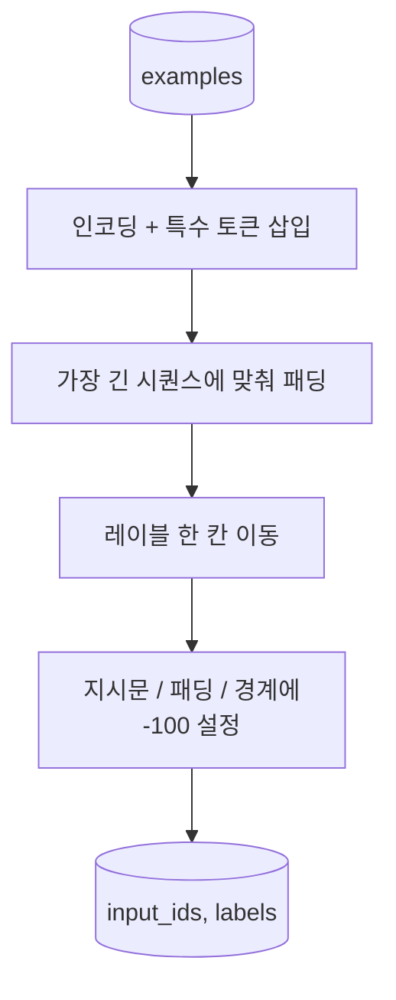
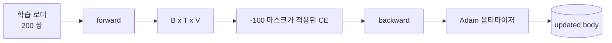

# 캡스톤 39강: 지도 미세 조정(SFT)을 통한 지시문 튜닝

> 사전 학습된 기본 모델은 시퀀스를 확장할 수 있지만 지시문을 따를 수 없습니다. 지도 미세 조정(SFT)은 이를 해결하는 가장 작은 변경입니다: 지시문과 원하는 응답이 쌍을 이루는 예제를 모델에 공급하고, 모델이 응답 토큰을 예측하도록 학습합니다. 핵심은 손실(loss)이 지시문이 아닌 응답만 계산하도록 하는 것입니다. 이 강의에서는 `ignore_index=-100`로 지시문 토큰을 마스킹하는 커스텀 collate 함수를 사용하여 Alpaca 스타일의 SFT 루프를 구축하고, 200개의 지시문-응답 쌍으로 학습하며, 홀드아웃(held-out) 분할에서 정확 일치(exact-match)를 사용하여 평가합니다.

**유형:** Build
**언어:** Python (torch, numpy)
**선수 요건:** 19단계 30-37강 (NLP LLM 트랙: 토크나이저, 임베딩 테이블, 어텐션 블록, 트랜스포머 바디, 사전 학습 루프, 체크포인팅, 생성, 퍼플렉시티)
**시간:** 약 90분

## 학습 목표

- 명시적인 경계 토큰을 포함하여 지시문-응답 쌍 데이터를 단일 인과(causal) 시퀀스로 포맷합니다.
- 지시문 토큰을 마스킹하여 교차 엔트로피(Cross-Entropy)가 응답 토큰만 계산하도록 collate 함수를 구축합니다.
- SFT 목적 함수(SFT objective) 아래에서 작은 트랜스포머 바디를 학습하고 평가 지표가 변하는 것을 관찰합니다.
- 응답 시작 경계(response-start boundary)를 준수하는 그리디(greedy) 및 온도 샘플링(temperature-sampled) 생성을 구현합니다.
- 생성된 완성(completions)에 대해 홀드아웃(held-out) 정확 일치(exact-match)를 계산합니다.

## 문제점

다음 토큰 예측(next-token prediction)으로 학습된 기본 모델은 지시문이 무엇인지 알지 못합니다. `"What is the capital of France?"` 문자열을 보여주면 질문을 계속하거나 새로운 문장을 만들어냅니다. 모델은 언어를 가지고 있지만 형식 계약(format contract)을 가지고 있지 않습니다.

SFT 계약은 문자열 템플릿입니다. 모든 학습 예제는 세 개의 영역을 가진 단일 시퀀스가 됩니다:

```text
<INST> What is the capital of France? <RESP> The capital of France is Paris.
```

경계 토큰은 학습 시점에 예약된 특수 토큰입니다. 모델은 `<RESP>` 이후의 모든 내용이 응답이며, 응답이 채점 대상임을 학습합니다. 기본 모델의 다음 토큰 목적 함수는 여전히 적용되며, 모든 예제가 이 형태를 가진 코퍼스로 학습될 뿐입니다.

하지만 한 가지 문제가 있습니다. 전체 시퀀스를 일반 교차 엔트로피 손실(Cross-Entropy Loss)에 입력하면, 모델은 지시문 토큰도 예측하도록 학습됩니다. 지시문은 이미 주어져 있습니다. 해당 위치에서는 기울기가 0이어야 합니다. 해결책은 마스크입니다.

## 개념


`ignore_index`는 `torch.nn.functional.cross_entropy`의 기능입니다. `ignore_index`과 동일한 모든 대상 위치는 손실과 기울기에 기여하지 않습니다. PyTorch의 관례는 `-100`입니다. 콜레이트 함수는 각 예제에 대해 두 개의 텐서를 생성합니다: `input_ids` (전체 시퀀스)와 `input_ids`의 사본으로, 지시문 위치가 `-100`로 덮어쓰기된 `labels`.

모델은 순방향 패스 동안 전체 시퀀스를 보며, 어텐션은 지시문을 참조할 수 있습니다. 손실은 응답 토큰만 계산합니다. 이것이 바로 원하는 동작입니다: 지시문을 조건으로 삼아 응답을 예측하는 것입니다.

## 데이터

200개의 지시문-응답 쌍이 `main.py`에서 결정적으로 생성됩니다. 이들은 6가지 작업 유형을 포함합니다:

- 사실적 단일 샷 (X의 수도)
- 산술 연산
- 리스트 추출
- 한 문장 요약
- 코드 (print, sort)
- 정의

각 작업은 템플릿화된 지시문과 결정적인 응답을 가집니다. 이는 의도적으로 단순합니다. 정확 일치(exact-match)는 취약하며, 이 강의는 정답이 특정 문자열 하나인 픽스처를 사용합니다. 실제 SFT 데이터셋은 퍼지(fuzzy) 지표가 필요하지만, 원리는 동일합니다.

분할은 훈련 160개, 테스트 40개입니다. 테스트 세트는 모든 6가지 작업 유형을 포함하므로 카테고리별 정확 일치를 보고할 수 있습니다.

## 토큰화 및 패딩

토크나이저는 바이트 수준이며 세 개의 예약 특수 토큰을 사용합니다:

- `INST_ID = 256`: 지시문 영역의 시작을 표시합니다.
- `RESP_ID = 257`: 지시문과 응답 사이의 경계를 표시합니다.
- `PAD_ID = 258`: 가변 길이 배치의 패딩입니다.

순서는 `[INST] inst_bytes [RESP] resp_bytes [PAD]*`입니다. collate 함수는 다음과 같습니다:

1. 각 예제를 토큰화합니다.
2. 배치 내의 모든 예제를 배치 내 가장 긴 시퀀스에 맞춰 패딩합니다.
3. `labels` = `input_ids`을 한 칸 이동하여(causal LM target) 구성하며, 다음과 같습니다:
   - 지시문(instruction) 영역은 `-100`로 대체됩니다.
   - 패딩(padding) 영역은 `-100`로 대체됩니다.
   - `RESP_ID` 경계 위치 자체는 `-100`로 대체됩니다(모델이 경계 토큰을 예측하도록 학습하지 않으며, 그 뒤의 내용을 예측합니다).



이 이동은 표준적인 causalLM 기법입니다. `input_ids`의 `i` 위치가 `i+1` 위치를 예측하므로, `labels[i] = input_ids[i+1]`가 됩니다(입력에서 마지막 위치는 제외하고, 타겟에서 첫 위치는 제외합니다). 마스크는 이동 후에 적용되어 올바른 위치에 적용됩니다.

## 학습



루프는 표준적인 PyTorch SFT 루프입니다. Adam, 학습률은 약 3e-4에서 1e-3 사이, 이 예제에서는 10~20 에포크, 스케줄러는 없습니다. 모델이 충분히 작으므로(hidden 96, 2 블록, 최대 길이 64) CPU에서 2분 이내에 수렴까지 학습할 수 있습니다.

5 에포크마다 루프는 홀드아웃 세트에 대해 작은 평가 패스를 실행하고 정확 일치(exact-match)를 출력합니다. 에포크 1에서 0.0이던 정확 일치가 에포크 15에서 0.85 정도로 올라가는 것을 보는 것이 이 강의의 핵심입니다: 모델이 형식과 정답을 동시에 학습하는 것을 볼 수 있습니다.

## 생성

평가 시 모델은 지시문 접두어 `[INST] inst_bytes [RESP]`를 받고, 다음 중 하나가 될 때까지 토큰을 생성합니다:

- 시퀀스가 `max_len`에 도달하거나,
- 모델이 특수한 정지 휴리스틱을 방출합니다: 연속된 두 개의 문장 종료 바이트(`.`, `!`, `?`).

이 강의는 탐욕(greedy) 디코딩과 선택적인 온도 샘플러를 제공합니다. 정확 일치는 온도가 지표를 확률적으로 만들기 때문에 탐욕 디코딩을 사용합니다. 실제 시스템은 보통 샘플링한 후 모호하게 판정합니다; 그 파이프라인은 41강입니다.

## 정확 일치 평가

정확 일치는 가장 엄격한 텍스트 지표입니다. 예측된 응답 문자열을 정규화(소문자화, 공백 제거, 이중 공백 병합)하고, 동일하게 정규화된 참조 응답과 비교합니다. 지표는 각 예제에 대해 1 또는 0이며, 집계는 평균입니다.

실제 SFT 파이프라인은 정확 일치에 토큰 수준 F1(41강)과 판정 모델을 보완합니다. 정확 일치는 모호하지 않기 때문에 유용합니다. 0.7이라면, 테스트 지시문의 정확히 70퍼센트가 문자 단위로 골드 응답을 생성했습니다.

```figure
cc-sft-loss-mask
```

## 구현할 내용

구현은 `main.py` 하나와 테스트로 구성됩니다.

1. `InstructionTokenizer`: 예약된 특수 토큰을 포함하는 바이트 수준 인코더. 지시문 접두어 또는 전체 쌍을 인코딩합니다.
2. `make_dataset`: 고정된 시드로 6가지 작업 유형에 걸쳐 200개 쌍을 생성합니다.
3. `SFTDataset`: 각 예제에 대해 `(input_ids, labels)`을 반환하며, 이미 마스크가 준비되어 있습니다.
4. `sft_collate`: 동적 패딩을 수행하고, 배치 텐서를 구축하며, 지시문 및 패딩 위치에 `-100`을 설정합니다.
5. `TinyGPT`: 트랜스포머 본문과 결합되거나 분리된 LM 헤드를 포함합니다.
6. `train_sft`: 에포크별 평가 훅을 포함하는 SFT 루프입니다.
7. `generate`: 접두어로부터 인과적 디코딩을 수행하며, 탐욕적(greedy) 또는 샘플링 방식으로 중단 휴리스틱을 적용합니다.
8. `exact_match`: 정규화된 문자열 비교를 수행하며, `[0, 1]` 범위의 float를 반환합니다.
9. `run_demo`: 데이터를 구축하고, 20 에포크 동안 학습하며, 평가하고, 카테고리별 세부 내역을 출력하며, 성공 시 0으로 종료합니다.

## 마스크가 중요한 이유

마스크가 없으면 손실 함수가 지시문 토큰을 타깃으로 취급합니다. 모델은 지시문을 예측하는 법을 학습합니다. 이는 다른 목적 함수이며 두 가지 측면에서 더 나쁜 모델을 생성합니다. 첫째, 사용자가 항상 제공하는 입력을 재구성하는 데 모델 용량이 낭비됩니다. 둘째, 대부분의 배치에서 지시문 토큰이 응답 토큰보다 많으므로 기울기 합에서 응답 손실이 작아집니다. 따라서 관심 있는 부분에 대한 옵티마이저의 유효 학습률이 의도보다 낮아집니다. 마스크는 다듬기(polish)가 아니라 목적 함수 그 자체입니다.

## 추가 목표

- 학습률 워밍업에 이어 코사인 감쇠를 추가하세요. SFT는 사전 학습보다 학습률(LR)에 더 민감합니다.
- 토큰별 손실 로깅을 추가하고 학습 중 손실 곡선을 플롯해 보세요. 초기 에포크는 템플릿 토큰(`<RESP>`, 공통 접두어)이 지배하며, 이후 에포크는 실제 답변 토큰이 지배한다는 점을 확인해 보세요.
- 평가를 BLEU-1 또는 chrF로 확장해 보세요. 정확 일치(exact-match)는 동일한 답변을 패러프레이즈로 생성하는 모델의 성능을 과소평가합니다.
- 멀티턴 형식화(chat template)를 추가하고 후속 질문(follow-ups)을 포함하는 픽스처(fixture)로 학습해 보세요.

구현을 통해 형식 계약(format contract), 마스크(mask), 루프(loop)를 얻을 수 있습니다. 기본 모델에서 지시문 따르기(instruction follower)로 목적을 변경하는 것은 하나의 collate 함수로 이루어집니다.
