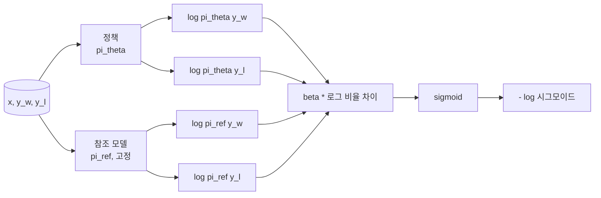
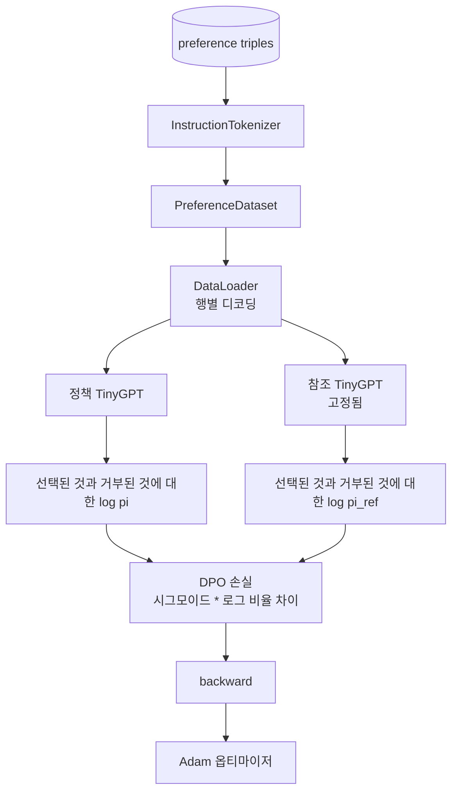

# 캡스톤 40강: 직접 선호 최적화(DPO)를 처음부터 구현하기

> 보상 모델과 PPO는 고전적인 RLHF 스택입니다. DPO는 이 스택을 선호 쌍에 대해 정책을 직접 피팅하는 단일 지도 학습 손실로 압축합니다. 이 강의에서는 보상 차이 항등식으로부터 DPO 손실을 유도하고, 작동하는 참조 모델과 정책 모델을 제공하며, 토큰별 로그 확률을 계산하고, 선택된 완료와 거부된 완료로 구성된 선호 고정 데이터에 작은 트랜스포머를 학습합니다. 테스트는 손실 수식과 기울기 방향을 고정하여 구현이 논문과 일치함을 보장합니다.

**유형:** Build
**언어:** Python (torch, numpy)
**선수 요건:** 19단계 30-37강 (NLP LLM 트랙: 토크나이저, 임베딩 테이블, 어텐션 블록, 트랜스포머 본문, 사전 학습 루프, 체크포인팅, 생성, 퍼플렉시티)
**시간:** 약 90분

## 학습 목표

- 스케일된 로그 비율 차이에 대한 시그모이드로 DPO 손실을 유도하고, 이를 암시적 보상과 연결해 보세요.
- 동결된 참조 모델과 학습 가능한 정책 모델을 쌍으로 구성해 보세요.
- 두 모델 모두에서 시퀀스 레벨 로그 확률을 계산하고, 프롬프트 토큰을 마스킹해 보세요.
- `(prompt, chosen, rejected)` 삼중항(triples)에 대해 정책을 학습하고, 선택된 로그 확률이 거부된 로그 확률에 비해 상승하는지 확인해 보세요.
- 손실 수식, 기울기 부호, 참조 불변성에 대한 테스트로 동작을 고정해 보세요.

## 문제점

SFT 모델이 있습니다. 이 모델은 지시문을 따르지만, 출력은 고르지 않습니다. 어떤 완료는 명확한 반면, 어떤 완료는 장황하거나 잘못되었습니다. 또한 선호 쌍으로 구성된 작은 데이터셋이 있습니다. 동일한 프롬프트에 대해 인간이 하나의 완료를 선택(chosen)으로, 다른 완료를 거부(rejected)로 표시했습니다.

고전적인 RLHF 답변은 2단계 파이프라인입니다. 선호도에 대해 보상 모델을 학습합니다. PPO를 사용하여 보상에 대해 정책을 최적화합니다. 이 방법은 작동하지만 비용이 많이 듭니다. PPO 동안 메모리에 두 모델이 필요하고, 정책을 참조 모델 근처에 유지하기 위해 KL 제어(KL control)가 필요하며, 보상 모델가 취약할 경우 보상 해킹(reward hacking)이 발생합니다.

DPO는 두 단계를 하나의 지도 학습 손실로 대체합니다. 보상 모델은 명시적으로 존재하지 않습니다. 정책은 선호 쌍에 직접 학습되며, SFT 참조 모델에 대한 명시적인 KL 페널티가 적용됩니다. Bradley-Terry 선호 모델 하에서 동일한 최적 해를 구하며, 코드는 훨씬 간결합니다.

## 개념

Bradley-Terry 모델에서 시작합니다. 프롬프트 `x`와 두 완성 `y_w` (선택됨) 및 `y_l` (거절됨)가 주어졌을 때, 인간이 `y_w`를 선호할 확률은 다음과 같습니다.

```text
P(y_w > y_l | x) = sigmoid( r(x, y_w) - r(x, y_l) )
```

여기서 `r`는 잠재적 보상 함수입니다. RLHF는 먼저 선호도로부터 `r`를 적합화한 후, KL 앵커를 사용하여 `r`를 최대화하는 정책 `pi`를 학습합니다.

```text
max_pi   E_{x, y~pi} [ r(x, y) ] - beta * KL(pi || pi_ref)
```

DPO 유도 과정은 이 목적 함수 하에서 최적 정책 `pi*`가 `r`에 대한 닫힌 형태(closed form)를 가진다는 것을 관찰합니다.

```text
pi*(y | x) = (1/Z(x)) * pi_ref(y | x) * exp( r(x, y) / beta )
```

`r`에 대해 재배열합니다.

```text
r(x, y) = beta * ( log pi*(y | x) - log pi_ref(y | x) ) + beta * log Z(x)
```

`log Z(x)` 항은 `y_w`과 `y_l` 모두에 대해 동일합니다(`x`에 의존하며 `y`에는 의존하지 않으므로). 따라서 선호도 차이를 계산할 때 상쇄됩니다.

```text
r(x, y_w) - r(x, y_l) = beta * ( log pi_theta(y_w|x) - log pi_ref(y_w|x)
                                - log pi_theta(y_l|x) + log pi_ref(y_l|x) )
```

Bradley-Terry 시그모이드에 대입하고 선호 쌍에 대해 음의 로그 우도를 취합니다.

```text
L_DPO(theta) = - E_{(x, y_w, y_l)} [
  log sigmoid( beta * ( log pi_theta(y_w|x) - log pi_ref(y_w|x)
                       - log pi_theta(y_l|x) + log pi_ref(y_l|x) ) )
]
```

이것이 손실 함수입니다. 각 예제에 대해 네 개의 로그 확률로부터 계산된 단일 스칼라 값에 대한 시그모이드입니다. 별도의 보상 모델이 없습니다. PPO가 없습니다. 손실 함수에 KL 항이 없습니다. KL 제약 조건은 닫힌 형태 유도 과정에 내장되어 있습니다.



## 기울기의 부호

학습 실행 전 유용한 Sanity Check입니다. `log pi_theta(y_w | x)`에 대한 기울기를 취합니다.

```text
d L_DPO / d log pi_theta(y_w | x) = - beta * (1 - sigmoid(z))
```

여기서 `z`는 시그모이드의 인자입니다. 모든 `z`에 대해 음수이며, 이는 다음을 의미합니다: 선택된 완성의 정책 로그 확률을 높이면 손실이 감소합니다. 대칭적으로, `log pi_theta(y_l | x)`에 대한 기울기는 양수입니다: 거절된 로그 확률을 높이면 손실이 증가합니다. 학습은 선택된 것을 높이고 거절된 것을 낮추도록 유도합니다. 참조 모델은 고정되어 있으며 이동하지 않습니다.

## 데이터

12개의 선호 삼중 세트가 강에 포함되어 있습니다. 각각은 `(prompt, chosen, rejected)`입니다. 선택된 완성은 짧고 정확합니다. 거부된 완성은 장황하거나, 주제에서 벗어났거나, 잘못되었습니다. 이 쌍들은 39강과 동일한 작업 유형(대문자, 산술, 목록)을 다루므로, SFT 기반에서 시작한 정책이 합리적인 시작점을 가집니다.

픽스처는 의도적으로 작습니다. DPO는 프로덕션 환경에서 수만 개의 쌍으로 작동합니다. 여기서는 손실 계산과 루프가 작은 데이터셋에서 끝-to-끝으로 실행되며, 선택된 것과 거부된 것의 로그 확률 차이가 눈에 띄게 커진다는 점이 핵심입니다.

## 참조 불변성

DPO 구현은 참조 모델을 신중하게 처리해야 합니다. 참조 모델은 고정된 SFT 모델입니다. 세 가지 속성이 유지되어야 합니다:

- 참조 매개변수는 절대 기울기를 받지 않습니다.
- 참조 로그 확률은 에포크 간에 절대 변하지 않습니다.
- 정책은 참조 모델과 동일한 가중치로 시작합니다. (최적의 `theta`은 참조 모델에 학습된 업데이트를 더한 값입니다. 정책을 참조 모델의 복사본으로 초기화하는 것이 잘 정의된 시작점입니다.)

구현은 다음을 통해 이를 강제합니다:

- 순방향 전달 동안 참조 모델을 `torch.no_grad()`으로 감쌉니다.
- 모든 참조 매개변수에 `requires_grad=False`을 설정합니다.
- 참조 모델이 구축된 후 `policy.load_state_dict(reference.state_dict())`을 통해 정책을 구성합니다.

```figure
cap-dpo-preference
```

## 아키텍처



모델은 39강에서 사용된 것과 동일한 TinyGPT입니다 (디코더 전용, 인과적, 바이트 토크나이저). 참조 모델과 정책은 아키텍처를 공유합니다. 정책의 가중치는 학습 동안 참조 모델로부터 멀어지지만, 참조 모델은 고정된 상태로 유지됩니다.

## 구현할 내용

구현은 하나의 `main.py`과 테스트로 구성됩니다.

1. `InstructionTokenizer`: `INST` 및 `RESP` 특수 토큰을 포함하는 바이트 토크나이저. 39강과 동일한 형태입니다.
2. `TinyGPT`: 디코더 전용 트랜스포머. 39강과 동일한 형태이므로, 39강을 건너뛰었더라도 이 강의는 독립적으로 완결됩니다.
3. `make_preferences`: 12개의 `(prompt, chosen, rejected)` 삼중항(triples)을 반환합니다.
4. `sequence_log_prob`: 모델, 프롬프트 접두어, 완성을 입력받아 완성 부분에 대한 다음 토큰 로그 확률의 합을 반환합니다 (프롬프트 위치 기여도는 포함되지 않습니다).
5. `dpo_loss`: 네 개의 로그 확률과 `beta`을 입력받아 예제별 손실 텐서와 로깅용 암시적 보상 델타를 반환합니다.
6. `train_dpo`: 에포크별 루프로 정책(policy)과 참조(reference) 모델에서 선택(chosen) 및 거부(rejected) 로그 확률을 계산하고, 손실을 적용하며, Adam 옵티마이저로 스텝합니다.
7. `evaluate_margins`: 정책 모델에서 선택-거부 로그 확률 마진의 평균을 반환합니다.
8. `run_demo`: 작은 워밍업 사전 학습으로 참조 및 정책 모델을 구축하고, 가중치를 복사하며, 30 스텝 동안 학습하고, 스텝별 손실과 마진을 출력하며, 성공 시 0으로 종료합니다.

## DPO가 작동하는 이유

DPO는 보상 매개변수화(parameterisation)를 제외하면, Bradley-Terry 선호 모델 하에서 RLHF와 수학적으로 동등합니다. 암시적 보상 `r(x, y) = beta * (log pi(y|x) - log pi_ref(y|x))`는 `x`의 함수까지 선호로부터 식별 가능하며, 이 함수는 차이에서 상쇄됩니다. 폐형(closed-form) 정책은 명시적 보상 모델을 생략할 수 있게 해줍니다. KL 제약은 구조적으로 강제됩니다: `pi`가 `pi_ref`에서 벗어날수록 로그 비율이 커지고, 시그모이드가 포화(saturate)되어 정책이 너무 멀리 이동할 때 기울기를 감쇠(damp)시킵니다. 참조 모델은 안전망입니다.

## 스트레치 목표

- 로그 확률 합에 길이 정규화를 추가하세요: 완성 길이로 나누세요. 길이 편향(length bias)은 모델이 절대값이 더 큰 로그 확률을 가진 더 짧은 완성을 선호하는 DPO의 알려진 실패 모드입니다.
- 손실의 IPO 변형을 추가하세요: 시그모이드 + 로그를 `(z - 1)^2`으로 대체하세요. 픽스처(fixture)에서 수렴을 비교하세요.
- 하드 선택-거부 레이블과 균일한 0.5 사이를 보간하는 레이블 스무딩 매개변수를 추가하세요.
- 참조 모델을 더 작고 저렴한 모델로 교체하세요 (지식 증류 스타일).

구현은 손실, 참조 불변성, 그리고 학습 루프를 제공합니다. 수학이 강의의 핵심입니다. 코드가 수학을 구체적으로 만들어 줍니다.
