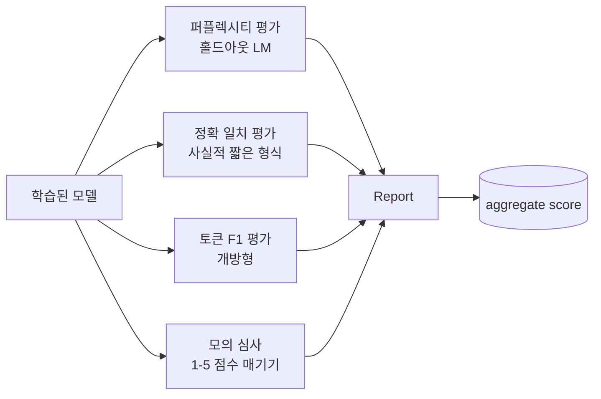
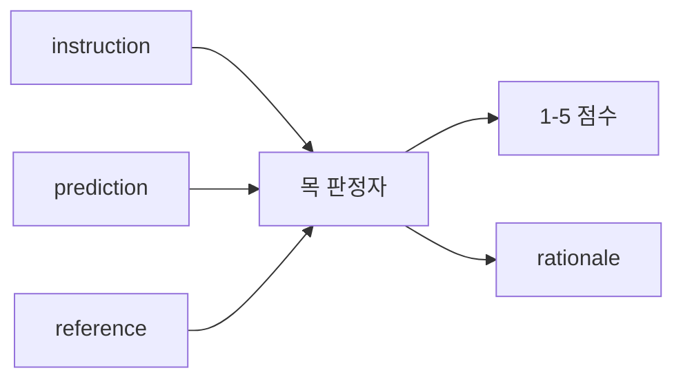
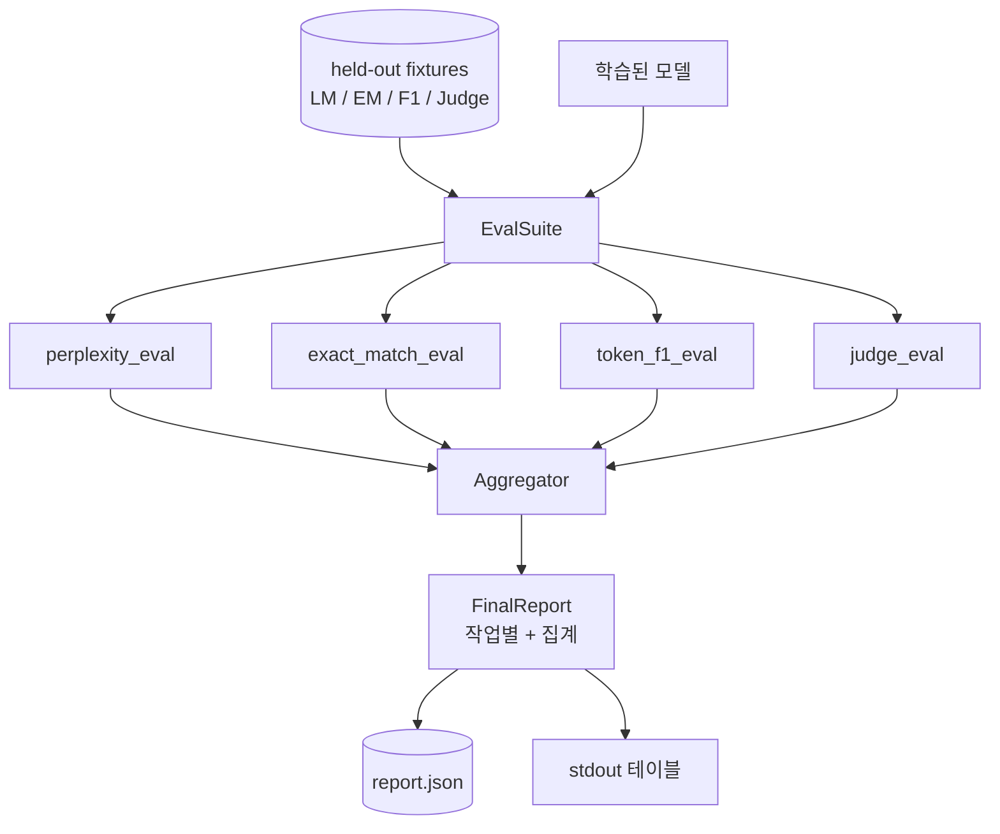

# 캡스톤 41강: 전체 평가 파이프라인

> 학습은 손실 곡선으로 모니터링할 수 있는 부분입니다. 평가는 설계해야 하는 부분입니다. 이 강의에서는 학습된 언어 모델을 받아 네 가지 이질적인 평가를 실행하고, 결과를 작업별 보고서로 집계하며, 네트워크 없이 루프가 실행되도록 로컬 모의 LLM-as-judge를 출시하는 통합 평가 파이프라인을 구축합니다. 네 가지 평가는 출시 모델에 필요한 모든 차원을 포함합니다: 언어 모델링(퍼플렉시티), 짧은 형식 정확성(정확 일치), 개방형 유사성(토큰 F1), 정성적 점수화(판정자).

**유형:** Build
**언어:** Python (torch, numpy)
**선수 요건:** 19단계 30-37강 (NLP LLM 트랙: 토크나이저, 임베딩 테이블, 어텐션 블록, 트랜스포머 본문, 사전 학습 루프, 체크포인팅, 생성, 퍼플렉시티)
**시간:** 약 90분

## 학습 목표

- 작은 트랜스포머에서 마스킹된 토큰 회계를 사용하여 홀드아웃 퍼플렉시티를 계산해 보세요.
- 짧은 형식 사실적 프롬프트에 대해 정확 일치 평가를 실행해 보세요.
- 정규화를 통해 예측 문자열과 참조 문자열 간의 토큰 수준 F1을 계산해 보세요.
- 모델 출력에 1-5 점수 척도로 점수를 매기는 로컬 모의 LLM-as-judge를 구축해 보세요.
- 네 가지 평가를 작업별 세부 항목이 포함된 단일 가중 보고서로 집계해 보세요.

## 문제점

단일 지표는 언어 모델을 설명하지 못합니다. 퍼플렉시티는 모델이 언어 분포에 얼마나 잘 맞는지 알려주지만, 질문에 답하는지 여부에 대해서는 아무것도 말하지 않습니다. 정확 일치는 모델이 정답 문자열을 생성하는지 알려주지만, 올바른 패러프레이즈를 처벌합니다. 토큰 F1은 패러프레이즈를 허용하지만, 잘못된 내용과의 어휘적 중복에 속습니다. LLM-as-judge는 정성적 차원을 포착하지만, 비용이 많이 들고 확률적입니다.

실제로 원하는 파이프라인은 네 가지를 모두 포함합니다. 각 평가는 다른 평가가 놓친 차원을 다루며, 각 평가는 해당 지표에 맞춰 형성된 홀드아웃 데이터의 서로 다른 하위 집합에서 실행됩니다. 최종 보고서는 작업별 수치를 나란히 표시하고 집계된 수치를 보여주므로, 리뷰어는 모델이 어떤 트레이드오프를 하고 있는지 한눈에 볼 수 있습니다.

이 강의는 그 파이프라인을 하나의 파일에서 처음부터 끝까지 구축합니다.

## 개념



각 평가는 `(model, dataset) -> EvalResult`로부터의 함수입니다. 결과는 지표 값, 검사를 위한 예제별 세부 정보, 그리고 집계용 이름을 담고 있습니다. 파이프라인은 어떤 평가를 실행하고 어떻게 가중치를 부여하는지 지정하는 설정으로 이들을 조합합니다.

## 제대로 계산된 퍼플렉시티

퍼플렉시티는 `exp(mean negative log-likelihood per token)`입니다. 구현에는 두 가지 함정이 있습니다:

- 평균은 배치 * 시퀀스가 아닌 실제 토큰 위치에 대해 계산해야 합니다. 패딩 토큰은 분모에서 제외해야 하며, 그렇지 않으면 퍼플렉시티가 실제보다 더 좋아 보일 것입니다.
- 모델은 다음 토큰을 예측하므로, 위치 `i`의 로짓은 위치 `i+1`의 토큰을 예측합니다. 여기서 오프-바이-원(off-by-one) 실수는 조용히 발생합니다: 손실은 여전히 학습되지만, 지표는 무의미해집니다.

평가는 패딩이 아닌 위치에 대해 `-log p(token)`의 배치별 합과 배치별 토큰 수를 계산한 후, 마지막에 나눕니다. 이는 배치별 퍼플렉시티를 평균내는 것(짧은 시퀀스의 가중치가 낮아짐)보다 수치적으로 안전하며, 교과서적 정의와 일치합니다.

## 정확 일치, 정규화 포함

하네스는 비교 전에 예측과 참조를 모두 정규화합니다:

- 소문자로 변환합니다.
- 주변 공백을 제거합니다.
- 내부 공백 연속을 단일 공백으로 축약합니다.
- 양쪽이 구두점만 다른 경우, 끝 구두점(`.`, `!`, `?`)을 제거합니다.

정규화 덕분에 정확 일치는 실용적으로 유용해집니다. `"Paris"`이라고 말하는 모델은 정답입니다; `"Paris."`이라고 말하는 모델도 정답입니다; `"  paris  "`이라고 말하는 모델도 정답입니다. 지표는 정규화 후 답이 동일한 문자열일 것을 여전히 요구합니다.

## 토큰 F1, 올바른 방법

토큰 F1은 토큰 다중집합(bag-of-tokens)에 대해 계산된 정밀도와 재현율의 조화 평균입니다. 단계는 다음과 같습니다:

1. 예측과 참조를 정규화합니다 (정확 일치와 동일한 규칙).
2. 각각을 토큰 목록으로 분할합니다 (공백 기반 토큰화).
3. 다중집합 교집합을 세어 보세요.
4. 정밀도(Precision) = `intersection_count / len(pred_tokens)`. 재현율(Recall) = `intersection_count / len(ref_tokens)`. F1 = 조화 평균.

예측과 참조가 모두 비어 있으면 F1은 1입니다 (공허한 일치). 하나만 비어 있으면 F1은 0입니다. 이 패턴은 SQuAD 평가 참조와 일치하며, 패러프레이즈(paraphrase)에 걸쳐 안정적인 수치를 생성합니다.

## 로컬 목(mock) LLM-as-Judge

실제 판정자는 API 뒤에 있는 프론티어 모델입니다. 이 강의에서는 판정자가 오프라인으로 실행되어야 합니다. 목 판정자는 지시문, 모델의 예측, 참조를 받아 `{1, 2, 3, 4, 5}` 범위의 점수와 한 줄 근거를 반환하는 결정론적 스코어러입니다. 채점 규칙은 명시적입니다:

- 정규화된 예측이 정규화된 참조와 같으면 5점.
- 예측과 참조 간의 토큰 F1이 0.8 이상이면 4점.
- 토큰 F1이 `[0.5, 0.8)` 범위 내에 있으면 3점.
- 토큰 F1이 `[0.2, 0.5)` 범위 내에 있으면 2점.
- 그 외의 경우 1점.

이것은 실제 판정자가 아니지만, 올바른 인터페이스를 갖추고 있습니다. 함수 하나를 변경하여 나중에 실제 모델로 교체할 수 있습니다. 파이프라인은 이에 대해 신경 쓰지 않습니다.



## 집계

집계는 정규화된 평가 점수의 가중 평균입니다. 각 평가는 `[0, 1]` 범위의 자체 수치를 보고합니다:

- 퍼플렉시티(Perplexity): `1 / (1 + log(perplexity))`으로 정규화합니다. 퍼플렉시티가 1이면 1로 매핑되고, 무한대(infinity)는 0으로 매핑됩니다.
- 정확 일치(Exact-match): 이미 `[0, 1]` 범위에 있습니다.
- 토큰 F1: 이미 `[0, 1]` 범위에 있습니다.
- 판정자: 5로 나눕니다.

가중치는 설정 가능합니다. 기본 조합은 퍼플렉시티 0.2, 정확 일치 0.3, 토큰 F1 0.3, 판정자 0.2입니다. 가중치 선택은 제품 결정 사항입니다. 강의에서는 실험을 위해 이 조절 노브(knob)를 노출합니다.

```figure
cg-eval-quadrant
```

## 아키텍처



`EvalSuite`는 얇은 오케스트레이터입니다. 각 개별 평가는 `(model, tokenizer, dataset, config)`을 받아 `EvalResult`을 반환하는 자유 함수입니다. `Aggregator`은 결과를 수집하여 최종 보고서를 생성합니다. 데모는 테이블을 출력하고, 다운스트림 CI가 흡수할 수 있는 JSON 사본을 작성합니다.

## 구현할 내용

구현은 하나의 `main.py`과 테스트로 구성됩니다.

1. `TinyGPT`: 38-40강에서 사용된 decoder-only 아키텍처와 동일하며, 이 강의를 독립적으로 수행할 수 있도록 포함되었습니다.
2. `InstructionTokenizer`: INST / RESP / PAD 특수 토큰을 포함하는 바이트 토크나이저입니다.
3. 네 가지 픽스처: LM 코퍼스, EM 세트, F1 세트, 판정 세트. 각각 20개 예제이며 결정적입니다.
4. `perplexity_eval`: 퍼플렉시티 값과 토큰별 손실 히스토그램을 포함하여 `EvalResult`를 반환합니다.
5. `exact_match_eval`: 평균 EM과 예제별 기록을 반환합니다.
6. `token_f1_eval`: 평균 토큰 F01강 예제별 기록을 반환합니다.
7. `mock_judge` 및 `judge_eval`: 예제별 점수와 근거, 세트 전체의 평균 점수입니다.
8. `Aggregator.normalise`: 평가별 정규화 규칙입니다.
9. `Aggregator.aggregate`: 가중 평균과 조립된 보고서입니다.
10. `run_demo`: 작은 모델을 간단히 학습하고 네 가지 평가를 모두 실행하며, 보고서 테이블을 출력하고 JSON을 작성하고 성공 시 0으로 종료합니다.

## 보고서 읽기

보고서는 세 가지 계층으로 구성됩니다. 상단은 집계 점수입니다. 그 아래에는 네 가지 평가별 수치가 있습니다. 그 아래에는 진단을 위한 예제별 세부 분석이 있습니다. 실패한 CI 실행은 일반적으로 집계 점수를 원하지만, 회귀를 추적하는 리뷰어는 모델이 어떤 입력을 잘못 처리했는지 확인하기 위해 예제별 세부 분석을 원합니다.

JSON 덤프는 안정적인 키를 사용하므로 CI 대시보드가 버전 간 추세선을 플롯할 수 있습니다. 예쁘게 출력된 테이블은 학습 실행 후 터미널을 바라보는 사람을 위한 것입니다.

## 스트레치 목표

- 보정 평가를 추가하세요: 모델의 소프트맥스 확률이 정확도와 일치합니까? 신뢰도에 따라 예측을 버킷화하고 버킷별 경험적 정확도를 보고하세요.
- 강건성 평가를 추가하세요: 각 예제에 교란(오타, 패러프레이즈, 방해 요소)을 태그하고 교란별 지표 감소량을 보고하세요.
- 모의 판정자를 HTTP 호출 뒤에 있는 실제 모델로 교체하세요. 함수 시그니처는 변경되지 않습니다.
- 태스크별 가중치 학습을 추가하세요: 고정 가중치 대신 모델에 대한 목표 선호 순서에 가중치를 맞추세요.

구현은 네 가지 평가, 집계기, 보고서를 제공합니다. 실제 평가 파이프라인은 그 위에 더 많은 차원을 겹쳐 쌓습니다. 패턴은 동일합니다: 평가당 하나의 함수, 하나의 집계기, 하나의 보고서.
