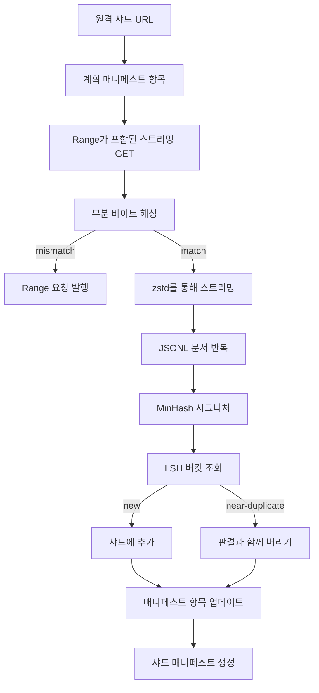

# 대용량 코퍼스 다운로더

> 언어 모델 학습은 첫 번째 순방향 패스보다 훨씬 일찍 시작됩니다. 코퍼스는 디스크에 저장되고, 압축 해제되며, 중복 제거되고, 참조 가능해야 하며, 네트워크가 4퍼센트 지점에서 끊어지기 전에 재개(story) 전략이 이미 마련되어 있어야 합니다. 이 강의에서는 압축된 샤드를 가져오고, Zstandard로 실시간 압축 해제하며, MinHash와 지역 민감 해시를 통해 근사 중복을 지문화하고, 파이프라인의 나머지 부분이 신뢰할 수 있는 샤드 매니페스트를 작성하는 스트리밍 다운로더를 구축합니다.

**유형:** Build
**언어:** Python
**선수 요건:** 19단계 30-37강
**시간:** 약 90분

## 학습 목표

- `urllib`로 원격 샤드를 스트리밍하고 `zstandard`로 압축 해제하며 전체 파일을 메모리에 버퍼링하지 않습니다.
- 검증된 바이트 오프셋에 대해 HTTP `Range` 요청을 발행하여 부분 다운로드를 재개합니다.
- 문서별로 MinHash 서명(signature)을 구축하고 LSH로 버킷화하여 근사 중복이 충돌하도록 합니다.
- 콘텐츠 해시, 바이트 크기, 문서 수 및 중복 제거 판정을 포함하는 샤드 매니페스트를 생성합니다.

## 문제점

200 GB 코퍼스로 처음 학습할 때 네트워크가 41퍼센트 지점에서 끊어지고 스크립트가 `urllib` 예외로 종료됩니다. 두 번째로 학습할 때는 78퍼센트 지점에서 끊어집니다. 99퍼센트 지점까지 도달하는 동안 루프를 세 번 다시 작성했습니다. 첫 번째 분부터 설계해야 하는 두 가지 실패는 부분 다운로드 재개와 중복 문서 제거입니다. 둘 다 잘 알려진 해결책이 있지만, 파이프라인이 이빨(teeth)이 자라난 한 줄 `requests.get` 호출로 시작하기 때문에 둘 다 일상적으로 건너뛰게 됩니다.

재개는 HTTP 문제입니다. 서버는 `Range`를 준수해야 하고, 클라이언트는 디스크 기록에 대한 검증된 오프셋을 추적해야 하며, 검증된 오프셋은 프로세스 종료(process death)를 견뎌야 합니다. 오프셋과 파일이 단 한 바이트만 어긋나도 재개된 다운로드가 쓰레기 데이터를 기록하고, 코퍼스는 토큰화 중에만 드러나는 방식으로 손상됩니다.

중복 제거는 시그니처 문제입니다. 정확한 해시 기반 중복 제거는 유사 중복을 놓칩니다. 동일한 위키백과 문서가 세 가지 다른 표준 꼬리말과 함께 나타나거나, 동일한 코드 파일이 다른 라이선스 헤더와 함께 나타나거나, 동일한 블로그 게시물이 모든 링크에 추적 매개변수를 포함하는 경우입니다. MinHash와 LSH는 이러한 유사 중복을 준선형 비용으로 포착합니다. 비용은 문서당 시그니처 하나와 시그니처당 버킷 조회 하나입니다.

## 개념



### `urllib`를 사용한 스트리밍

표준 라이브러리 `urllib.request.urlopen`는 파일 유사 객체를 반환합니다. 이를 `zstandard.ZstdDecompressor().stream_reader`로 감싸면 압축된 샤드나 압축 해제된 샤드가 메모리에 완전히 로드되지 않고, 네트워크에서 압축 해제기를 거쳐 문서 반복자로 바이트가 흐릅니다. 메모리 비용은 줄 버퍼, 현재 문서의 MinHash 시그니처, LSH 인덱스뿐입니다.

### `Range`를 사용하여 재개

다운로더는 샤드당 두 개의 파일을 씁니다. 샤드 자체와 `.partial.json` 체크포인트입니다. 체크포인트는 `verified_bytes`, `expected_size`, `sha256_prefix` (첫 `verified_bytes` 바이트에 대해 계산됨) 및 소스 URL을 기록합니다. 시작 시 다운로더는 체크포인트를 읽고, 디스크에 있는 바이트에 대해 `sha256_prefix`를 재계산하며, 재계산된 해시가 일치할 때만 재개합니다. 해시가 일치하지 않으면 부분 파일은 버려지고 다운로드가 바이트 0부터 다시 시작됩니다. 검증된 바이트가 가정되는 것이 아니라 확인되므로 조용한 손상(silent corruption)은 불가능합니다.

### MinHash 및 LSH

MinHash는 두 집합의 Jaccard 유사도를 고정된 공간에서 추정합니다. 문서의 경우 집합은 텍스트의 싱글(shingles, 겹치는 n-gram)입니다. 시그니처는 `k`개의 최소 해시 값으로 구성되며, 각 값은 독립적인 해시 함수에 해당합니다. Jaccard 유사도가 `s`인 두 문서는 시그니처의 단일 구성 요소가 일치할 확률이 `s`입니다.

LSH는 `k` 구성 요소를 `b` 밴드로 그룹화하며, 각 밴드는 `r` 행으로 구성되고 `k = b * r`입니다. 두 문서는 `1 - (1 - s^r)^b` 확률로 적어도 하나의 밴드에서 충돌하며, 이는 `(b, r)`을 조정하는 `s` 값 주변에 날카로운 임계값이 됩니다. 일반적인 코퍼스 중복 제거의 임계값은 `s = 0.8`이며, LSH 연구 문헌에서는 `k = 128`, `b = 32`, `r = 4`을 통해 이 값에 도달합니다.

### 계약으로서의 샤드 매니페스트

다운로더의 유일한 영구 출력은 매니페스트입니다. 매니페스트는 샤드별로 URL, 압축 해제된 바이트 수, 문서 수, 중복 제거 후의 고유 문서 수, 최종 샤드 파일의 sha256을 포함합니다. 다운스트림 토큰화는 디렉터리 목록이 아닌 매니페스트를 읽습니다. 샤드가 누락되었거나 sha256이 일치하지 않으면, 매니페스트는 다음 단계가 시작을 거부하도록 지시합니다. 매니페스트는 "데이터가 다운로드되었다"와 "데이터가 다운로드되고 검증 가능하다"를 결정하는 경계선입니다.

```figure
cap-corpus-downloader
```

## 구현하기

`code/main.py`는 다음을 구현합니다:

- `ShardPlanner` - 샤드 URL 목록을 읽고 계획된 매니페스트 항목을 생성합니다.
- `StreamingDownloader` - 선택적 `Range`가 포함된 `urllib` 스트림을 열고, 임시 파일에 기록하며, 모든 청크마다 `.partial.json` 체크포인트를 업데이트하고, 재개 시 sha256 접두어를 검증합니다.
- `ZstdDocIterator` - 파일 유사 스트림을 `zstandard.ZstdDecompressor`로 감싸고 한 줄당 하나의 문서를 생성합니다.
- `MinHasher` - 고정된 해시 시드 계열을 사용하여 문자열에 대한 `k` 구성 요소 서명을 생성합니다.
- `LSHIndex` - 밴드별로 서명을 버킷화하고 충돌을 보고합니다.
- `Dedup` - 해셔와 인덱스를 결합하여 각 문서를 `keep` 또는 `near_duplicate`으로 매칭된 샤드 ID와 함께 라벨링합니다.
- `ManifestWriter` - 샤드별 통계를 수집하고 `manifest.json`을 기록합니다.

파일 하단의 데모는 디스크에 작은 합성 코퍼스를 구축하고, `zstandard`으로 압축하며, `file://` URL을 통해 다운로드하고, 중복을 제거한 후 매니페스트를 출력합니다.

실행해 보세요:

```bash
python3 code/main.py
```

스크립트는 0으로 종료되며 매니페스트 요약이 출력됩니다.

## 프로덕션 패턴

네 가지 패턴이 이 강의를 실제 코퍼스로 확장합니다.

**쓰기 전 체크포인트.** `.partial.json`은 바이트가 샤드에 추가되기 전에 `fsync`되어야 합니다. 그렇지 않으면 전원 손실로 순서가 역전됩니다: 디스크에 샤드 바이트가 있고, 체크포인트에는 바이트가 없으며, 다음 재개 시 검증된 바이트가 실제보다 적다고 믿게 되어 중복된 접미사 바이트가 파일을 손상시킵니다. 먼저 체크포인트를 저장한 후 쓰세요. 이는 선쓰기 로그(write-ahead log)와 동일한 원칙입니다.

**샤드화된 LSH 인덱스.** 전체 코퍼스에 대한 단일 LSH 인덱스는 200 GB 규모에서 RAM에 맞지 않습니다. LSH 인덱스를 첫 번째 밴드 해시로 파티셔닝하고, 파티션을 디스크에 저장하며, 새 서명이 들어갈 파티션만 참조하세요. 비용은 문서당 추가 디스크 읽기 한 번이며, 이점은 LSH 인덱스가 더 이상 하드 메모리 상한이 아니라는 것입니다.

**삭제가 아닌 톰스톤.** 제거된 중복은 매니페스트에 판정 `near_duplicate`과 충돌한 문서의 샤드 ID로 기록됩니다. 삭제하면 중복과 유지된 문서 간의 연결이 사라집니다. 톰스톤(tombstone)은 감사 추적(audit trail)을 보존하며, 후속 단계에서 임계값에 대한 판단을 변경할 수 있게 합니다.

**매니페스트에 샤드별 sha256, 그리고 매니페스트 sha256.** 매니페스트 자체에 콘텐츠 해시를 부여합니다. 후속 단계는 샤드별 항목을 신뢰하기 전에 매니페스트 해시를 검증합니다. 이것이 없으면 매니페스트는 조용한 공격 표면이 됩니다. 단일 파일을 편집할 수 있는 공격자는 전체 파이프라인을 손상시킬 수 있습니다.

## 사용하기

프로덕션 패턴:

- **모든 CI 실행에서 재개.** CI 러너는 임시적입니다. 다운로더는 매 실행마다 새로운 디스크를 가정하고 캐시나 원격 저장소에서 복구해야 합니다. `--cache-dir`은 일급(first-class) 플래그입니다.
- **토큰화 전에 중복 제거.** 토큰화는 비용이 많이 듭니다. 같은 문서에 대해 두 번 실행하면 같은 손실 곡선(same loss curve)에 대해 두 배의 비용이 발생합니다. 중복 제거는 토큰화의 상류(upstream)에 위치해야 하며, 하류(downstream)에 위치하지 않아야 합니다.
- **매니페스트를 병합 게이트로 사용.** 훈련 실행은 고정된 커밋(pinned commit)에서 매니페스트 sha256을 읽습니다. 새 데이터셋 버전은 새 매니페스트 커밋을 요구합니다. 코드와 데이터의 연결은 구전(folklore)이 아니라 git입니다.

## 출시하기

실제 프로젝트에서 `outputs/skill-corpus-downloader.md`은 다운로더에 공급되는 URL, 체크포인트 디렉토리의 구성, 중복 제거가 사용하는 shingle width와 `(k, b, r)` triple, 그리고 매니페스트가 버전 관리에 위치하는 곳을 설명합니다. 이 강의는 엔진을 출시합니다.

## 연습 문제

1. `--shingle-width` 플래그를 추가하고, 너비 3, 5, 9에서 중복 제거 판정이 어떻게 변하는지 측정해 보세요. 선택한 기본값을 방어해 보세요.
2. 매직 바이트를 스니핑하여 zstd 옆에 gzip 지원을 추가하세요. 다운로더는 호출자가 코덱을 지정할 필요가 없어야 합니다.
3. 체크포인트가 발견되지 않으면 새로운 다운로드 시작을 거부하는 `--resume-only` 모드를 추가하세요. CI에서 한 실행이 실수로 200 GB를 다시 가져오는 것을 방지하는 데 유용합니다.
4. LSH 인덱스를 선반(shelf)이나 sqlite 파일로 이동하고, 메모리 내 변형 대비 처리량(throughput)을 측정해 보세요.
5. 시작 시 manifest의 sha256 검사를 추가하세요. 디스크의 manifest가 `manifest.lock`의 manifest 해시와 일치하지 않으면 다운로더는 fail closed로 실패해야 합니다.

## 핵심 용어

| 용어 | 사람들이 말하는 것 | 실제 의미 |
|------|-----------------|------------------------|
| Shard | "파일" | 자체 sha256을 가진 코퍼스의 자기 완결적 슬라이스로, 재개(resume) 및 중복 제거의 단위로서 사용됨 |
| MinHash signature | "지문(Fingerprint)" | 집합에 대한 `k`개 컴포넌트 스케치로, 각 컴포넌트는 집합에 대한 독립적인 해시의 최솟값임 |
| LSH band | "버킷(Bucket)" | 충돌 감지를 위한 단일 버킷 키로 사용되는 `r`개 시그니처 컴포넌트 그룹 |
| Verified bytes | "재개 오프셋(Resume offset)" | sha256 접두어가 체크포인트와 일치하는 디스크 상의 바이트로, 재개할 수 있는 유일한 안전한 오프셋 |
| Manifest | "인덱스(Index)" | 다운로더가 생성한 내용(콘텐츠 해시 포함)에 대한 단일 내구성(durable) 기록 |

## 추가 읽기

- [RFC 7233](https://datatracker.ietf.org/doc/html/rfc7233) - HTTP Range 요청, 재개 프로토콜
- [Zstandard format specification](https://datatracker.ietf.org/doc/html/rfc8478) - 스트리밍 압축 해제를 안전하게 만드는 프레임 형식
- [MinHash](https://en.wikipedia.org/wiki/MinHash) - 이 강의가 사용하는 시그니처 계열
- [Locality-sensitive hashing](https://en.wikipedia.org/wiki/Locality-sensitive_hashing) - 중복 제거 임계값 뒤의 밴딩(banding) 방식
- 19단계 · 43강 - 다운로더가 공급하는 HDF5 토큰화 코퍼스
- 19단계 · 44강 - 코퍼스를 학습하는 코사인 스케줄
- 19단계 · 45강 - 스케줄을 소비하는 AMP 루프
