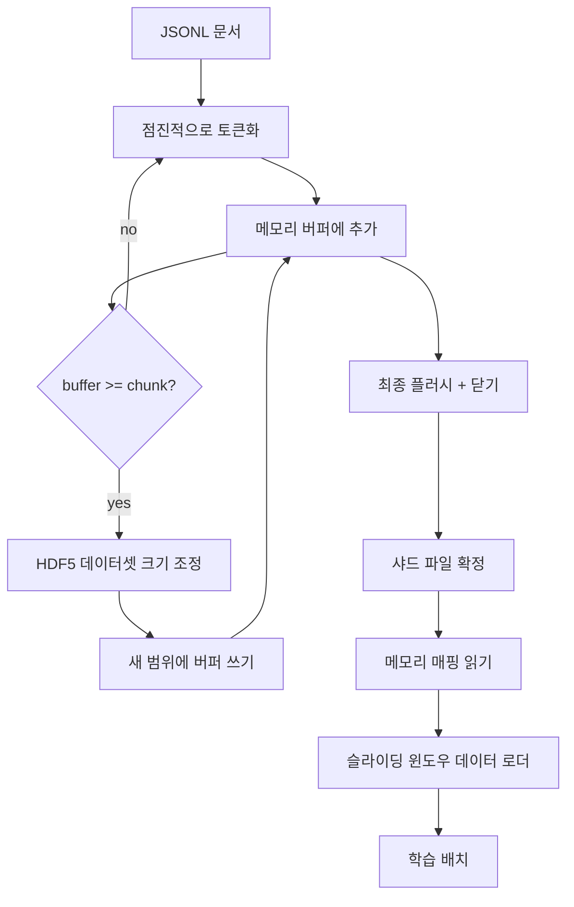

# HDF5 토큰화 코퍼스

> 다운로드한 코퍼스는 트레이너가 라인 속도로 스트리밍할 수 있는 레이아웃에 저장되어야 합니다. 디스크의 JSONL은 16개의 데이터 로더 워커를 버티지 못합니다. 크기가 조절 가능한(resizable) 청크 기반 정수 데이터셋을 사용하는 HDF5는 가능합니다. 이 강의에서는 크기가 조절 가능한 HDF5 데이터셋으로의 스트리밍 토큰화, 여러 파일에 걸친 샤드(shard) 쓰기, 학습 시 메모리 매핑 읽기, 그리고 올바른 패킹으로 고정 길이 시퀀스를 생성하는 슬라이딩 윈도우 데이터 로더를 구축합니다.

**유형:** Build
**언어:** Python
**선수 요건:** 19단계 30-37강
**시간:** 약 90분

## 학습 목표

- 결정적인 청킹으로 크기가 조절 가능한 HDF5 정수 데이터셋에 문서를 스트리밍합니다.
- 실패 범위를 제한하고 병렬 처리를 가능하게 하도록 여러 HDF5 파일에 걸쳐 쓰기를 샤드합니다.
- HDF5의 페이지 캐시 기반 청크 레이아웃을 통해 토큰을 다시 읽으므로, 데이터 로더는 배치 시에만 배치 버퍼로 복사합니다.
- 명시적인 패킹 규칙으로 고정 길이 학습 시퀀스를 방출하는 슬라이딩 윈도우 데이터 로더를 구현합니다.

## 문제점

현대적인 언어 모델 학습 실행은 수십 개의 워커를 통해 초당 수십만 샘플의 토큰을 읽습니다. 디스크의 JSONL은 첫 번째 콜드 캐시 페이지 폴트에서 죽습니다. JSON 파서는 느리고, 문서 경계는 주소 지정이 불가능하며, "샘플 4,217,884"로 이동하려면 파일을 스캔해야 합니다. 잘 압축되는 Parquet조차 적합하지 않은데, 트레이너는 컬럼을 원하지 않기 때문입니다. O(1) 랜덤 접근이 가능한 평평한 토큰 스트림을 원합니다.

HDF5는 읽기 시 페이지 캐시에 친화적인 청크 기반의 크기가 조절 가능한 정수 전용 데이터셋을 제공하므로 적합합니다. 트레이너가 `tokens[3,200,000 : 3,200,8192]`의 슬라이스를 요청하면 HDF5는 페이지 캐시에서 요청된 하이퍼슬랩(hyperslab)을 새로 할당된 NumPy 배열로 복사합니다. 비용은 워커당 파일 핸들 하나와 청크 크기의 페이지 캐시 발자취이며, JSONL 디코딩 비용에 비해 무시할 수 있습니다.

빌드 문제는 쓰기 측을 정직하게 만드는 것입니다. 크기 조정 가능한 데이터셋은 오용하기 쉽습니다. 한 번에 하나의 문서를 쓰면 HDF5 파일이 조각나서 사용할 수 없게 됩니다. 한 번의 크기 조정으로 모든 문서를 쓰면 프로세스가 죽을 때 전체 샤드를 잃게 됩니다. 올바른 규율은 버퍼링 후 확장(buffer-then-extend)이며, 버퍼 크기는 청크 크기와 일치해야 하고, 샤드 단위 쓰기는 작업 부하를 파일 간에 분할하여 크래시가 발생하면 최대 하나의 샤드만 잃도록 해야 합니다.

## 개념



### 제대로 된 크기 조정 가능한 HDF5

토큰 데이터셋은 `maxshape=(None,)`와 고정된 `chunks=(chunk_size,)`로 생성됩니다. 쓰기는 `chunk_size` 길이의 NumPy 배열에 토큰을 버퍼링하여 진행됩니다. 버퍼가 가득 차면 데이터셋은 정확히 `chunk_size`만큼 크기 조정되고 버퍼는 새 범위에 기록됩니다. 샤드 종료 시 잔여 버퍼는 최종 부분 범위에 기록됩니다. 모든 쓰기는 마지막 하나를 제외하고 연속적이고 청크 정렬되어 있으며, 마지막 쓰기는 샤드의 HDF5 속성에 기록된 `token_count`에서 잘라내야 한다고 읽기 측에 알려집니다.

### 샤드 단위 쓰기

단일 HDF5 파일은 단일 장애 지점입니다. 파이프라인은 샤드를 병렬로 씁니다: 19단계 42강의 각 입력 샤드는 하나의 HDF5 출력 샤드를 생성합니다. `shards.json` 인덱스는 샤드별로 파일 경로, 토큰 수, 문서 수, 토큰에 대한 sha256을 기록합니다. 학습자는 `shards.json`을 읽어 전역 오프셋을 계산하고 코퍼스를 검증합니다.

### 메모리 매핑 읽기

학습 시 각 워커는 `swmr=True` 모드로 HDF5 파일의 할당량을 열고 `tokens[start:stop]`을 요청합니다. HDF5의 청크 레이아웃은 청크가 핫(hot) 상태가 되면 페이지 캐시 기반 읽기를 가능하게 합니다. 워커는 전체 파일을 메모리에 로드하지 않습니다: 슬라이스는 데이터 로더의 배치 버퍼로 복사되며, 데이터 로더는 배치 시에 이를 고정 메모리(pinned-memory) 학습 텐서로 복사합니다. 핫 경로에는 청크 전환당 시스템 콜이 하나만 있으며, 나머지는 모두 RAM 접근입니다.

### 슬라이딩 윈도우 데이터 로더

데이터 로더는 학습 시퀀스 길이를 아는 유일한 단계입니다. 전역 토큰 스트림에서 랜덤 시작 인덱스를 선택하고 `window_size + 1` 토큰을 읽은 후 `(input, target) = (tokens[:-1], tokens[1:])`를 반환합니다. 문서 경계는 강제되지 않습니다: 하나의 윈도우가 두 문서를 걸칠 수 있으며, 그 사이에 명시적인 `boundary_token_id`가 존재하므로 모델은 구분자를 사용하는 법을 학습합니다. 이는 표준 패킹 규칙입니다. 또한 초보자가 잊기 쉬운 규칙이기도 한데, 이 경우 코퍼스의 8퍼센트가 학습 경계 토큰이고 92퍼센트가 자연 텍스트가 됩니다.

```figure
cc-hdf5-corpus
```

## 구현하기

`code/main.py`는 다음을 구현합니다:

- `Tokenizer` - 데모에 충분한 수준의 바이트 단위 결정적 토크나이저입니다. 인터페이스는 `encode(text) -> list[int]` 및 `vocab_size`입니다.
- `HDF5ShardWriter` - 크기 조정 가능한 정수 데이터셋을 열고, 토큰을 청크 크기로 버퍼링하며, 고정 크기 스트라이드로 크기를 조정하고 기록하며, 종료 시 `token_count` 및 `sha256`를 HDF5 속성으로 기록합니다.
- `ShardedTokenizationPipeline` - 입력 문서를 반복 처리하고, 이를 작성자에게 라우팅하며, `shards.json` 인덱스를 생성합니다.
- `MmapTokenStore` - 메모리 매핑 읽기를 위해 샤드 파일을 열고, 전역 오프셋을 계산하며, 단일 `get_slice(start, stop)` API를 노출합니다.
- `SlidingWindowDataloader` - 전역 스트림에서 랜덤 윈도우를 선택하고 `(input_ids, target_ids)` NumPy 배열을 생성합니다.

파일 하단의 데모는 작은 메모리 내 코퍼스를 구축하고, 두 샤드로 토큰화하며, 메모리 매핑으로 이를 열고, 데이터 로더를 10배치 동안 실행하며, 배치별 모양과 체크섬을 출력합니다.

실행해 보세요:

```bash
python3 code/main.py
```

스크립트는 0으로 종료하며 배치 체크섬을 출력합니다.

## 프로덕션 패턴

네 가지 패턴이 이 강의를 실제 학습 실행으로 확장합니다.

**청크 크기는 일반적인 읽기와 동일해야 합니다.** 트레이너는 샘플당 `window_size + 1` 토큰을 읽습니다. HDF5 청크를 `window_size`의 배수로 설정하면 읽기가 페이지 캐시에 정렬됩니다. 청크가 일치하지 않으면 모든 샘플이 두 청크에 접근하므로 처리량이 절반으로 줄어듭니다.

**토큰 개수는 데이터셋이 아닌 속성에 저장합니다.** 청크 크기가 문서 경계를 나누지 못하므로 데이터셋의 마지막 슬라이스가 부분적으로 채워질 수 있습니다. 실제 `token_count`를 데이터셋의 HDF5 속성으로 저장하고, 리더가 그 값에서 잘라내도록 하세요. 이렇게 하지 않으면 리더가 끝을 지나 제로 패딩된 토큰으로 이동하며, 모델은 제로를 예측하는 법을 학습하게 됩니다.

**병렬 검증을 위한 분할된 sha256.** 각 샤드는 토큰 바이트에 대한 자체 sha256을 가집니다. 트레이너는 학습 시작 전에 모든 샤드를 병렬로 검증할 수 있습니다. sha256이 일치하지 않으면 16시간 후 에포크 3에서 실패하는 것이 아니라, 실행이 초기에 실패합니다.

**양쪽 모두에 `swmr=True`, 작성자 측에 `libver="latest"`.** 단일 작성자-다중 읽기(SWMR) 모드에서는 작성자가 `libver="latest"`로 열어야 하며, 모든 데이터셋을 미리 생성한 후 `file.swmr_mode = True`을 설정해야 합니다. 이후 작성자는 각 크기 조정(resize) 후 `dataset.flush()`을 호출해야 읽기 워커(`swmr=True`로 열림)가 일관된 데이터를 볼 수 있습니다. `libver="latest"`을 건너뛰거나 구조 변경 후 SWMR을 활성화하는 것은 "파일이 잠겨 있음(file is locked)" 오류의 흔한 원인입니다.

## 사용하기

프로덕션 패턴:

- **소스 샤드당 HDF5 하나.** 다운로더(42강)는 URL당 하나의 샤드를 생성하며, 토큰화(이 강의)는 소스 샤드당 HDF5 하나를 생성합니다. 1:1 매핑은 재개 및 부분 실패 복구를 단순하게 만듭니다.
- **경계 토큰 ID.** 경계 토큰은 토크나이저 어휘의 일부이며, 데이터 로더가 주입하는 유일한 토큰입니다. 모델이 이를 무시해야 한다면 학습 손실은 경계 토큰을 마스킹합니다. 그렇지 않으면 시퀀스 구분자로 사용하도록 학습합니다.
- **`shards.json`를 진실의 원천으로 사용.** 새로운 샤드를 추가한다는 것은 HDF5를 작성하고, 그 sha256을 계산하며, 항목을 추가하는 것을 의미합니다. 트레이너는 시작 시 파일을 한 번만 읽으며, 디렉토리 목록에는 절대 접근하지 않습니다.

## 출시하기

실제 프로젝트에서 `outputs/skill-hdf5-tokenized-corpus.md`는 파이프라인에 공급하는 토크나이저, 트레이너의 윈도우와 일치하는 청크 크기, `shards.json`이 버전 관리에 위치하는 방법, 그리고 데이터 로더 워커가 파일에 걸쳐 샤드되는 방식을 설명해야 합니다. 이 강의는 엔진을 출시합니다.

## 연습 문제

1. HDF5 작성자에 `--compression gzip` 플래그를 추가하고 데모 코퍼스에 대한 처리량 비용을 측정하세요. 선택한 기본값을 방어하세요.
2. 슬라이딩 윈도우 데이터 로더에 결정론적 시드(seed)를 추가하고, 동일한 시드로 두 번 실행했을 때 동일한 배치가 생성되는지 검증하세요.
3. 모든 샤드를 읽고, 토큰에 대한 sha256을 재계산하며, `shards.json`과 비교하는 `--validate` 모드를 추가하세요. CI는 학습 시작 전에 이를 실행해야 합니다.
4. 청크 크기를 윈도우 크기와 같게, 절반으로, 두 배로 설정하여 데이터로더 처리량을 비교해 보세요. 페이지 캐시 효과를 보고하세요.
5. 매우 긴 문서를 쓰기 시점에 잘라내는 `--max-document-tokens` 플래그를 추가하세요. 읽기 시점에 결정하는 방식에 대한 트레이드오프를 방어해 보세요.

## 핵심 용어

| 용어 | 사람들이 말하는 것 | 실제 의미 |
|------|-----------------|------------------------|
| 크기 조절 가능한 데이터셋 | "추적 전용" | `resize` 호출을 통해 청크 크기의 스트라이드로 확장되는 `maxshape=(None,)`을 가진 HDF5 데이터셋 |
| 청크 레이아웃 | "HDF5가 저장하는 방식" | 커널이 메모리 매핑할 수 있고 데이터로더가 연속적으로 읽을 수 있는 고정 크기의 디스크 페이지 |
| `swmr` 모드 | "쓰기 중 읽기" | 데이터로더 워커가 파일을 안전하게 공유할 수 있는 단일 작성자 다중 읽기 모드 |
| 샤드 인덱스 | "shards.json" | 오프셋과 콘텐츠 해시를 포함하는 모든 토큰 샤드의 영구 인덱스 |
| 슬라이딩 윈도우 | "학습 샘플" | 전역 토큰 스트림의 고정 길이 슬라이스로, 학습기가 shift-by-one 타겟과 짝을 이루는 것 |

## 추가 읽기

- [HDF5 chunking documentation](https://support.hdfgroup.org/documentation/hdf5/latest/hdf5_chunking.html) - 이 강의가 사용하는 청크화되고 크기 조절 가능한 데이터셋 레이아웃
- [h5py user guide](https://docs.h5py.org/en/stable/) - HDF5용 Python 바인딩
- [NumPy memory mapping](https://numpy.org/doc/stable/reference/generated/numpy.memmap.html) - h5py를 통해 HDF5가 노출하는 읽기 측 프리미티브
- 19단계 · 42강 - 이 강의가 토큰화하는 출력의 다운로더
- 19단계 · 44강 - 이 데이터로더를 소비하는 코사인 스케줄
- 19단계 · 45강 - 학습 스텝을 래핑하는 AMP 루프
