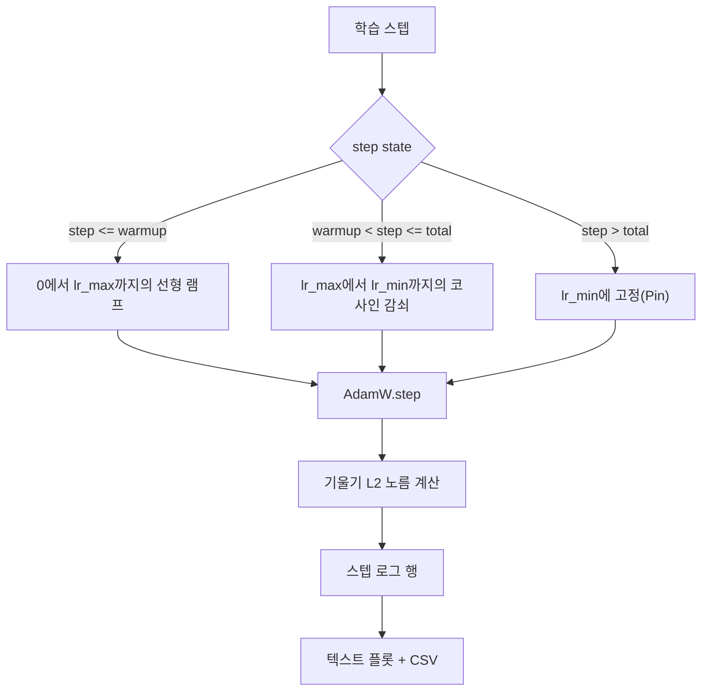

# 선형 워밍업이 포함된 코사인 학습률

> 학습률 스케줄은 손실 함수 다음으로 중요한 결정입니다. AdamW 옵티마이저에 코사인 감쇠와 선형 워밍업을 적용하는 것은 언어 모델 학습의 현대적 기본 설정입니다. 이는 모델이 취약한 첫 1,000번의 업데이트 동안 작은 유효 스텝 크기를 경험하게 하고, 설정된 피크까지 상승한 후, 0으로 부드럽게 감쇠하도록 합니다. 이 강의에서는 해당 스케줄을 구축하고, 학습 스텝에 따른 곡선을 플롯하며, 스케줄 옆에 기울기 노름을 기록하고, 스케줄이 워밍업, 피크, 감쇠 경계를 준수함을 증명합니다.

**유형:** Build
**언어:** Python
**선수 요건:** 19단계 30-37강
**시간:** 약 90분

## 학습 목표

- 선형 워밍업이 포함된 코사인 학습률 스케줄에 연결된 AdamW 옵티마이저를 구현합니다.
- 실행 간에 부동 소수점 드리프트 없이 임의의 스텝에서 스케줄의 정확한 값을 계산합니다.
- 학습률과 나란히 기울기 L2 노름을 기록하여 학습 상태를 관측할 수 있게 합니다.
- 스케줄을 사람이 읽을 수 있는 텍스트 플롯과 도구가 소비할 수 있는 CSV로 렌더링합니다.

## 문제점

첫 1,000번의 학습 업데이트가 가장 시끄럽습니다. 모델의 가중치는 초기화 상태에 가깝습니다. 옵티마이저의 실행 중 second-moment 추정치가 안정화되지 않았습니다. 기울기 노름이 크고 잡음이 많습니다. 이 업데이트 동안 학습률이 피크에 있다면 모델은 발산하거나, 절대 벗어나지 못하는 손실 평탄 지점에 정착합니다. 잘 알려진 두 가지 해결책은 19단계 45강에서 다루는 기울기 클리핑과, 작게 시작하여 상승하는 학습률 스케줄입니다.

코사인 워밍업 스케줄은 세 영역을 가집니다. 스텝 0부터 스텝 `warmup_steps`까지 학습률은 0에서 설정된 피크 `lr_max`까지 선형으로 스케일링됩니다. 스텝 `warmup_steps`부터 스텝 `total_steps`까지 학습률은 코사인 곡선의 상반분을 따르며, `lr_max`에서 `lr_min`로 감쇠합니다. `total_steps` 이후에는 학습률이 `lr_min`에 고정되어, 오버슈트하는 오구성된 트레이너가 스케줄을 조용히 벗어나지 않도록 합니다.

빌드 문제는 스케줄이 오프-바이-원(off-by-one) 오류가 발생하기 쉽다는 점입니다. 오프-바이-원 오류는 학습 실행 6시간 후, 모델이 과적합(Overfitting)을 시작하는 순간에 학습률이 1퍼센트 너무 높거나 낮게 나타납니다. 이는 스케줄이 경계 포인트(경계 포인트)에서 철저히 테스트되지 않는 한 발견하기 어렵습니다.

## 개념



### 워밍업 공식

`step`가 `[0, warmup_steps]`이고 `warmup_steps > 0`일 때, 학습률은 `lr_max * step / warmup_steps`입니다. `warmup_steps = 0`의 퇴화(degenerate)된 경우를 "워밍업 없음"으로 처리합니다: 스케줄은 스텝 0에서 `lr_max`로 바로 시작하여 즉시 코사인 감쇠로 진입합니다. 일부 테스트 하네스는 스케줄이 여전히 사용 가능한 곡선을 생성하는지 확인하기 위해 `warmup_steps = 0`을 전달합니다.

### 코사인 공식

`step`가 `(warmup_steps, total_steps]`일 때, 학습률은 `progress = (step - warmup_steps) / max(1, total_steps - warmup_steps)`인 `lr_min + 0.5 * (lr_max - lr_min) * (1 + cos(pi * progress))`입니다. `step = warmup_steps`에서 코사인은 `cos(0) = 1`로 평가되며, 이는 `lr_max`을 주어 워밍업 끝점과 정확히 일치합니다. `step = total_steps`에서 코사인은 `cos(pi) = -1`로 평가되며, 이는 `lr_min`을 주어 감쇠 끝점과 정확히 일치합니다.

양쪽 끝점에서의 연속성은 우연이 아닙니다. 스케줄이 세 개의 서로 다른 함수를 붙여 만든 것이 아니라 `step`에 대한 단일 함수로 구현되는 이유입니다. 붙여 만든 스케줄은 `lr_max`이 변경될 때마다 경계 포인트(경계 포인트) 하나를 잃습니다.

### 총 스텝 이후의 하한(Floor)

`step > total_steps`일 때, 학습률은 `lr_min`에 유지됩니다. 계약은 명확합니다: 스케줄은 오류를 발생시키지 않고 외삽(extrapolate)하지 않으며, 하한에 고정(pin)하고 트레이너가 경고 로그를 남기도록 허용합니다. 학습을 연장해야 하는 트레이너는 루프가 아니라 스케줄의 `total_steps`을 변경합니다.

### 학습률과 함께 기울기 노름 로깅

스케줄은 훈련 상태의 절반을 차지합니다. 나머지 절반은 기울기 노름입니다. 훈련 루프는 매 단계마다 두 값을 모두 기록합니다. 발산하는 훈련 실행에서는 손실이 증가하기 전에 기울기 노름이 급증하는 현상이 나타나며, 잘 튜닝된 워밍업은 학습률과 함께 노름이 선형적으로 증가하도록 유지합니다. 너무 공격적인 피크는 워밍업 이후에도 노름이 높게 유지되는 형태로 나타납니다. 디스크에 있는 데이터셋은 `step, lr, grad_l2_norm, loss`입니다. CSV는 유일한 영구 기록입니다.

```figure
cap-cosine-warmup
```

## 구현하기

`code/main.py`는 다음을 구현합니다:

- `CosineWithWarmup` - 설정된 스케줄에 대한 상태 비저장 함수 `lr(step) -> float`입니다.
- `TrainState` - 모델, `AdamW` 옵티마이저, 스케줄을 단일 단계 함수로 래핑합니다.
- `TrainState.step` - 한 번의 순전파, 한 번의 역전파를 실행하고, 기울기 L2 노름을 기록하며, 옵티마이저에 `lr(step)`을 적용합니다.
- `plot_schedule_ascii` - 스케줄을 눈으로 읽을 수 있는 텍스트 플롯으로 렌더링합니다.
- `write_schedule_csv` - 학습률을 포함하여 단계별로 한 행을 출력합니다.

파일 하단의 데모는 작은 `nn.Linear` 모델을 구축하고, 고정된 입력 배치에 대해 20단계 동안 훈련하며, 단계별 학습률, 기울기 노름, 손실을 출력합니다. 스케줄은 시각적 무결성 검사를 위해 텍스트 플롯으로도 렌더링됩니다.

실행해 보세요:

```bash
python3 code/main.py
```

스크립트는 0으로 종료되며 단계별 훈련 로그와 스케줄 플롯을 출력합니다.

## 프로덕션 패턴

네 가지 패턴이 스케줄을 프로덕션 산출물로 격상시킵니다.

**스케줄은 코드가 아닌 설정에 있습니다.** 트레이너는 git에 커밋된 YAML 또는 JSON 설정에서 `warmup_steps`, `total_steps`, `lr_max`, `lr_min`을 읽습니다. 설정이 내용 주소 지정(content-addressed)되어 있으므로 스케줄은 재현 가능하며, 설정이 PR diff의 일부이므로 스케줄은 감사 가능합니다.

**단계 카운터는 단조 증가하며 에포크와 분리되어 있습니다.** 일부 프레임워크는 데이터셋이 샤딩(sharding)되거나 데이터 로더가 재시작될 때 단계와 에포크를 혼동합니다. 스케줄은 로컬 카운터가 아닌 트레이너의 체크포인트에서 `global_step`을 읽습니다. 재개된 실행은 단계 카운터가 영구적인 축(axis)이므로 올바른 스케줄 위치에서 계속됩니다.

**실행 디렉토리에 학습률 스케줄(Learning Rate Schedule) 플롯 저장하기.** 모든 학습 실행은 `outputs/lr_schedule.png` (이 강의에서는 텍스트 플롯)를 실행 디렉토리에 기록합니다. 리뷰어가 디렉토리를 훑어보며 재실행 없이 스케줄을 Sanity Check할 수 있습니다. 이는 PR 시점에 잘못된 스케줄 설정 버그를 잡아냅니다.

**로그 행 스키마는 고정되어 있습니다.** `step, lr, grad_l2_norm, loss` 순서대로 기록합니다. 다운스트림 노트북이나 대시보드가 스키마를 읽습니다. 버전을 올리지 않고 열 이름을 변경하면 모든 기존 대시보드가 무효화됩니다.

## 사용하기

프로덕션 패턴:

- **다른 것들을 스윕하기 전에 피크 값을 먼저 스윕하세요.** `lr_max`는 가장 민감한 조절 변수입니다. 작은 모델에서 먼저 스윕하세요. 최적의 `lr_max`는 모델 크기에 따라 약하게 스케일되므로, 작은 모델에서의 스윕은 강력한 사전 정보(prior)가 됩니다.
- **워밍업(Warmup)은 총 스텝의 비율이지, 절대 개수가 아닙니다.** 2억 스텝 실행에서 2,000 스텝 워밍업은 거의 즉시 피크에 도달합니다. 20,000 스텝 실행에서 같은 개수를 사용하면 10퍼센트 동안 워밍업합니다. 워밍업은 비율로 설정하세요 (일반적으로 1-3퍼센트). 이렇게 하면 스케줄이 학습 기간에 따라 스케일됩니다.
- **`lr_min`는 의도적으로 0이 아닙니다.** `lr_max`의 10퍼센트인 하한값은 긴 꼬리(long tail) 동안 옵티마이저가 학습을 계속하도록 합니다. `lr_min = 0` 스케줄은 플롯에서는 훌륭한 학습 곡선을 만들지만, 실제로는 학습이 끝나지 않은 모델을 만듭니다.

## 출시하기

`outputs/skill-cosine-warmup.md`는 실제 프로젝트에서 어떤 설정이 스케줄을 담고 있는지, 전역 카운터가 어느 트레이너 스텝에서 읽히는지, 그리고 어떤 `lr_max` 스윕이 배포된 값을 만들어냈는지 설명합니다. 이 강의는 엔진을 출시합니다.

## 연습 문제

1. 스케줄의 역제곱근(inverse-square-root) 변형을 추가하고 200 스텝 토이 학습 실행에서 비교해 보세요. 어떤 곡선이 더 낮은 최종 손실(Loss)을 만드나요?
2. `total_steps / 2`에서 두 번째 워밍업(Warmup)을 추가하는 `--restart` 플래그를 추가하세요. 토이 실행에서 워밍업 재시작(warm restarts)이 개선되는지, 악화되는지 논증해 보세요.
3. 스케줄이 연속적임을 검증하는 단위 테스트를 추가하세요. `[0, total_steps]`의 모든 스텝에서 `|lr(step+1) - lr(step)|`의 차이가 `lr_max / warmup_steps`로 제한되어야 합니다.
4. 스케줄을 `torch.optim.lr_scheduler.LambdaLR`에 연결하여 프레임워크 코드와 합성되도록 하세요. 이 강의는 단순한 스텝 함수를 사용합니다. 래퍼(wrapper)는 무엇을 변경하나요?
5. `matplotlib`로 실제 플롯을 작성하는 `--plot-png` 플래그를 추가하세요. CI 실행 시 강의 텍스트의 플롯과 PNG 중 어느 것이 더 나은 기본값인지 논증해 보세요.

## 핵심 용어

| 용어 | 사람들이 말하는 표현 | 실제 의미 |
|------|-----------------|------------------------|
| 워밍업 | "느린 시작" | 첫 `warmup_steps` 업데이트 동안 0에서 `lr_max`까지 선형으로 상승하는 램프 |
| 코사인 감쇠 | "부드러운 감소" | 나머지 단계 동안 `lr_max`에서 `lr_min`까지 상반 코사인 곡선 |
| 하한 | "학습 후" | `total_steps` 이후 스케줄이 고정하는 `lr_min` 값 |
| 기울기 노름 | "기울기의 L2" | 연결된 기울기 벡터의 유클리드 노름으로, 매 단계 기록됨 |
| 전역 단계 | "스케줄 축" | 재시작을 견디며 스케줄을 구동하는 단조 증가 단계 카운터 |

## 추가 읽기

- [Loshchilov and Hutter, SGDR: Stochastic Gradient Descent with Warm Restarts (arXiv 1608.03983)](https://arxiv.org/abs/1608.03983) - 코사인 스케줄의 참고 논문
- [Loshchilov and Hutter, Decoupled Weight Decay Regularization (arXiv 1711.05101)](https://arxiv.org/abs/1711.05101) - AdamW의 참고 논문
- [PyTorch torch.optim.lr_scheduler](https://docs.pytorch.org/docs/stable/optim.html#how-to-adjust-learning-rate) - 단계 함수가 프레임워크 스케줄러와 결합되는 방식
- 19단계 · 42강 - 이 스케줄이 소비하는 코퍼스의 다운로더
- 19단계 · 43강 - 스케줄과 함께 진화하는 데이터 로더
- 19단계 · 45강 - 기울기 클리핑 및 AMP, 루프의 다음 계층
