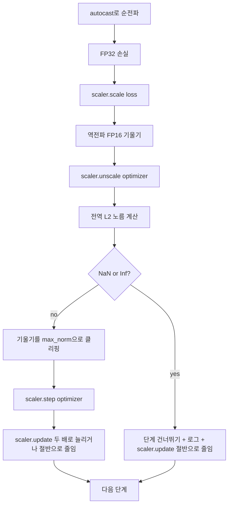

# 기울기 클리핑과 혼합 정밀도

> 이전 강의에서 다룬 옵티마이저와 스케줄은 기울기가 정상적이라고 가정합니다. 하지만 보통은 그렇지 않습니다. 하나의 나쁜 배치(batch)가 기울기 노름(norm)을 세 자리 수 크기로 급증시킬 수 있습니다. 혼합 정밀도(mixed-precision) 학습은 손실(loss) 쪽에서 FP16 오버플로우를 발생시켜 이 문제를 더욱 악화시킵니다. 이 강의에서는 프로덕션 환경의 학습이 없이 출시할 수 없는 두 가지 안전장치, 즉 설정된 전역(global) L2 노름으로 기울기를 클리핑하는 것과, autocast와 GradScaler를 사용하여 NaN과 Inf를 감지하고 스텝을 깔끔하게 건너뛰며 포렌식(forensics)을 위해 스케일링 계수를 기록하는 혼합 정밀도 루프를 구축합니다.

**유형:** Build
**언어:** Python
**선수 요건:** 19단계 30-37강
**시간:** 약 90분

## 학습 목표

- 모든 매개변수(parameter)의 기울기에 대해 전역 L2 노름을 계산하고, 설정된 임계값을 초과하면 제자리(in-place)에서 클리핑합니다.
- FP16 순전파(forward)와 역전파(backward)가 오버플로우를 견딜 수 있도록 autocast와 GradScaler로 학습 스텝을 감싸세요.
- 손실(loss)이나 기울기에서 NaN과 Inf를 감지하고, 옵티마이저 스텝을 건너뛰며, 건너뛰기를 기록하세요.
- GradScaler의 스케일링 계수를 매 스텝마다 보고하여, 긴 건너뛰기 시퀀스가 즉시 보이도록 하세요.

## 문제점

어제 깔끔하게 실행된 학습 런(run)이 8,217 스텝에서 손실 곡선이 수직으로 치솟는 결과를 낳습니다. 범인은 기울기 노름이 이전 최고점의 20배인 4,200인 단일 배치입니다. 클리핑이 없으면 옵티마이저는 모델이 지난 한 시간 동안 학습한 모든 것을 리셋하는 스텝을 적용합니다. 노름 1.0으로 전역 L2 클리핑을 적용하면, 같은 배치가 단위 노름(unit-norm) 업데이트를 기여하게 되며, 손실은 추세선(trend line)에 머물고, 런은 살아남습니다.

혼합 정밀도(Mixed Precision) 학습은 순전파와 역전파의 대부분을 FP16으로 계산하여 처리량을 2-3배 높입니다. FP16의 지수 범위가 좁다는 것이 비용입니다. FP16에서 오버플로우가 발생하는 일반적인 기울기는 Inf로 평가되며, 이는 후속 레이어를 통해 NaN으로 전파되어 다음 옵티마이저 단계에서 모든 가중치를 NaN으로 설정합니다. PyTorch의 GradScaler는 역전파 전에 손실을 큰 스케일링 계수로 곱하고, 옵티마이저 단계 전에 기울기를 동일한 계수로 나누는 방식으로 이를 해결합니다. unscale 시점에 기울기가 Inf 또는 NaN이면, 스케일러는 단계를 건너뛰고 스케일링 계수를 절반으로 줄입니다. 이전 N단계가 깨끗하면 스케일러는 계수를 두 배로 늘립니다. 학습 과정에서 계수는 FP16 범위가 허용하는 가장 높은 값을 찾습니다.

빌드(Build) 문제는 두 가지를 올바르게 연결하는 것입니다. unscale 전에 클리핑하면 임계값이 스케일된 기울기에 적용되고, unscale 후에 클리핑하면 GradScaler의 연산 순서가 중요합니다. 올바른 순서는 `scaler.scale(loss).backward()`, 그 다음 `scaler.unscale_(optimizer)`, 그 다음 `clip_grad_norm_`, 그 다음 `scaler.step(optimizer)`, 그 다음 `scaler.update()`입니다. 다른 순서는 조용히 깨진 루프를 생성합니다.

## 개념



### 전역 L2 노름

전역 L2 노름은 연결된 기울기 벡터의 유클리드 노름이며, 매개변수별 노름이 아닙니다. PyTorch는 이를 `torch.nn.utils.clip_grad_norm_(parameters, max_norm)`로 구현합니다. 이 함수는 클리핑 전 노름을 반환하므로, 강의에서는 자연스러운 값과 클리핑된 값 모두를 기록할 수 있으며, 이는 "매 단계에서 클리핑하고 있다"는 진단에 필요합니다.

### autocast와 GradScaler

`torch.amp.autocast(device_type)`는 선택적으로 대상 연산(대부분의 matmul 계열 연산)을 FP16으로 실행하는 컨텍스트 관리자입니다. `torch.amp.GradScaler(device_type)`는 역전파 전에 손실을 스케일링하고, 옵티마이저 단계 전에 기울기를 역스케일링하는 헬퍼입니다. 이 둘은 함께 설계되었습니다. 하나만 사용하는 것은 테스트가 잡아야 할 구성 오류입니다.

이 강의는 CI에서 실행되는 방식이므로 CPU autocast를 사용합니다. `device_type="cpu"`을 `device_type="cuda"`으로 변경하면 동일한 패턴을 CUDA에 그대로 적용할 수 있습니다. CPU의 GradScaler는 스텁(stub)입니다(CPU autocast는 기본적으로 BF16으로 동작하며 손실 스케일링이 필요하지 않습니다). 하지만 강의에서는 GPU 루프와 배선이 동일하도록 호출 지점을 포함하고 있습니다.

### NaN 및 Inf 감지

감지는 두 곳에서 이루어집니다. 먼저, backward 전에 `torch.isfinite`을 사용하여 손실 자체를 확인합니다. Inf 또는 NaN 손실은 유용한 기울기를 생성하지 않으므로 옵티마이저에 진입하지 않고 건너뛰게 됩니다. 두 번째로, `scaler.unscale_(optimizer)` 이후 강의는 `has_non_finite_grad(...)`을 사용하여 스케일링되지 않은 기울기를 스캔하며, Inf 또는 NaN을 건너뛰기로 처리합니다. 이 두 가지 검사를 통해 순방향 패스 및 역방향 패스의 실패 모드 모두를 커버합니다.

### 스케일링 팩터 진단

스케일링 팩터는 GradScaler의 내부 상태입니다. 매 단계마다 강의는 `scaler.get_scale()`을 읽고 학습률 및 기울기 노름 옆에 기록합니다. 정상적인 실행에서는 스케일링 팩터가 `2^17` 또는 `2^18` 근처에서 포화될 때까지 2의 거듭제곱으로 상승하는 모습을 보입니다. 문제가 있는 실행에서는 팩터가 높은 값과 낮은 값 사이에서 진동하는 모습을 보이며, 이는 모델의 기울기가 때로는 범위 내에 있고 때로는 범위 밖에 있다는 신호입니다. 로깅 없이는 이러한 진단을 볼 수 없습니다.

```figure
grad-clip-monitor
```

## 구현하기

`code/main.py`은 다음을 구현합니다:

- `clip_global_l2_norm` - 클리핑 전 및 클리핑 후 노름을 모두 반환하는 `torch.nn.utils.clip_grad_norm_` 래퍼입니다.
- `has_non_finite_grad` - 기울기에서 NaN 및 Inf를 스캔하는 헬퍼입니다.
- `AmpTrainState` - 모델, `AdamW` 옵티마이저, GradScaler 및 autocast 장치를 래핑합니다. 전체 클리핑, 스케일링 및 NaN 건너뛰기 파이프라인을 실행하는 `step(inputs, targets)`를 노출합니다.
- `StepLog` 및 `SkipLog` - 단계별 구조화된 레코드입니다.
- 작은 `nn.Linear` 모델을 20단계 동안 학습하고, 5단계에서 기울기에 Inf를 주입하여 건너뛰기 경로를 테스트하며, resulting log를 출력하는 데모입니다.

실행해 보세요:

```bash
python3 code/main.py
```

스크립트는 0으로 종료되며, 각 행이 `STEP` 또는 `SKIP`으로 태그된 단계별 로그를 출력합니다. 적어도 한 행은 `SKIP`입니다.

## 프로덕션 패턴

네 가지 패턴이 루프를 프로덕션 학습 단계로 격상시킵니다.

**스킵 카운터를 로그 라인이 아닌 알람으로 취급하세요.** 훈련 실행당 몇 번의 스킵은 정상입니다. 에포크당 수백 번의 스킵은 심각한 알람입니다: 모델이 FP16이 유지할 수 없는 영역에 있으며 루프가 조용히 실패하고 있습니다. 이 강의는 1,000 스텝 롤링 스킵률을 추적하며, 프로덕션에서는 5% 이상의 스킵률에서 페이지 알림을 보내야 합니다.

**클립 임계값은 설정(config)에 있습니다.** `max_norm = 1.0`는 언어 모델 훈련의 현대적 기본값입니다. 먼저 작은 모델에서 스윕(sweep)해 보세요. 더 큰 임계값은 모델이 진정으로 어려운 배치에서 회복할 수 있게 하며, 더 작은 임계값은 더 노이즈가 많은 손실 곡선을 대가로 최악의 경우를 제한합니다. 임계값은 44강의 스케줄과 같은 YAML 또는 JSON 설정에 속합니다.

**노름(norm) 로그는 스케줄과 함께 CSV로 저장하세요.** CSV 열은 `step, lr, grad_l2_pre_clip, grad_l2_post_clip, loss, skipped, skip_reason, scaler_scale`입니다. 파일을 열면 리뷰어는 한 행에서 스케줄, 기울기 스토리, 스케일링 팩터, 스킵 결과(그 이유 포함)를 볼 수 있습니다. 열을 여러 파일로 나누는 것은 정렬이 맞지 않는 분석을 초래하는 레시피입니다.

**`scaler.update()`는 스킵 시에도 매 스텝 실행됩니다.** 깨끗한 스텝에서는 스케일러가 no-inf 카운터를 읽고, 증가시키며, 팩터를 두 배로 늘릴 수 있습니다. 스킵된 스텝에서는 스케일러가 팩터를 절반으로 줄이고 카운터를 리셋합니다. 스킵 경로에서 `update()`을 잊는 것은 "스케일링 팩터가 변하지 않았다"를 생성하는 버그입니다.

## 사용하기

프로덕션 패턴:

- **오토캐스트 장치는 옵티마이저 장치와 일치해야 합니다.** GPU 훈련에는 `torch.amp.autocast(device_type="cuda")`, CPU에는 `torch.amp.autocast(device_type="cpu")`를 사용하세요. 장치를 섞으면 조용한 타입 오류가 발생하며, 손실 곡선은 정상처럼 보이지만 모델이 학습되지 않는 상태로 표면화됩니다.
- **역전파(backward) 전에 손실 체크를 하세요.** `torch.isfinite(loss).all()`는 하나의 텐서 감소(reduction)이며, 비용은 무시할 수 있고 NaN 손실에서의 절약은 훈련 스텝 전체입니다. 항상 실행하세요.
- **`zero_grad`에서 `set_to_none=True`.** 기울기를 0이 아닌 `None`로 설정하여, 옵티마이저가 영향을 받지 않는 매개변수 그룹에 대한 연산을 건너뛰게 합니다. 이 설정은 무료 처리량 개선이며, 버그 발생 가능성을 약간 줄여줍니다.

## 출시하기

`outputs/skill-clip-amp.md`는 실제 프로젝트에서 훈련 스텝이 사용하는 클립 임계값과 오토캐스트 장치, 스텝별 CSV가 버전 관리에 어디에 위치하는지, 프로덕션 스킵률 알람 임계값이 무엇인지 설명해야 합니다. 이 강의는 엔진을 출시합니다.

## 연습 문제

1. 합성 Inf 주입을 실제 손실 급증(한 배치의 타깃에 1e8을 곱함)으로 대체하고 스킵 경로가 트리거되는지 확인해 보세요.
2. autocast를 FP16 대신 BF16으로 전환하는 `--bf16` 모드를 추가해 보세요. BF16은 FP16보다 지수 범위가 넓어 손실 스케일링이 거의 필요하지 않으며, 동일한 데모에서 스킵률이 0으로 떨어지는지 확인해 보세요.
3. 클리핑이 발생하지 않을 때 기울기 클리핑 래퍼가 클리핑 전 및 클리핑 후 노름을 올바르게 반환하는지 확인하는 단위 테스트를 추가해 보세요.
4. 롤링 윈도우 스킵률 계산과, 설정된 임계값을 100 연속 스텝 동안 초과하면 실행이 실패하도록 하는 CLI 플래그를 추가해 보세요.
5. 루프가 표준 CSV(`step, lr, grad_l2_pre_clip, grad_l2_post_clip, loss, skipped, skip_reason, scaler_scale`)를 기록하도록 연결하고, 모든 행을 기록한 후 플러싱하여 Ctrl-C를 통해 파일이 살아남는지 확인해 보세요.

## 핵심 용어

| 용어 | 사람들이 말하는 것 | 실제 의미 |
|------|-----------------|------------------------|
| 전역 L2 노름 | "클리핑 타깃" | 모든 학습 가능한 매개변수에 걸쳐 연결된 기울기 벡터의 유클리드 노름 |
| autocast | "혼합 정밀도" | `with` 블록 내에서 자격 있는 연산의 선택적 FP16(또는 BF16) 실행 |
| GradScaler | "손실 스케일러" | 역전파(backward) 전에 손실에 곱하고 옵티마이저 스텝 전에 기울기를 역스케일링하는 헬퍼 |
| 스킵 | "나쁜 스텝" | 기울기나 손실이 비유한(non-finite) 값이어서 거부된 옵티마이저 스텝; 스케일러는 팩터를 절반으로 줄임 |
| 스케일링 팩터 | "스케일러 상태" | GradScaler의 현재 곱셈 인자; 깨끗한 구간이 끝나면 두 배가 되고 스킵이 발생할 때마다 절반으로 줄임 |

## 추가 읽기

- [Micikevicius et al., Mixed Precision Training (arXiv 1710.03740)](https://arxiv.org/abs/1710.03740) - 원본 손실 스케일링 제안
- [Pascanu, Mikolov, Bengio, On the difficulty of training recurrent neural networks (arXiv 1211.5063)](https://arxiv.org/abs/1211.5063) - 기울기 클리핑 참고 논문
- [PyTorch torch.amp.GradScaler](https://docs.pytorch.org/docs/stable/amp.html) - 이 강의가 래핑하는 스케일러 API
- [PyTorch torch.nn.utils.clip_grad_norm_](https://docs.pytorch.org/docs/stable/generated/torch.nn.utils.clip_grad_norm_.html) - 이 강의가 사용하는 클리핑 원시(primitive)
- 19단계 · 42강 - 루프에 코퍼스를 공급하는 다운로더
- 19단계 · 43강 - 루프가 소비하는 데이터 로더
- 19단계 · 44강 - 이 루프가 구성하는 스케줄
