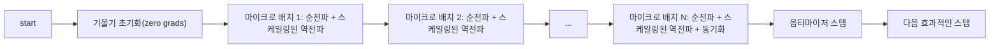
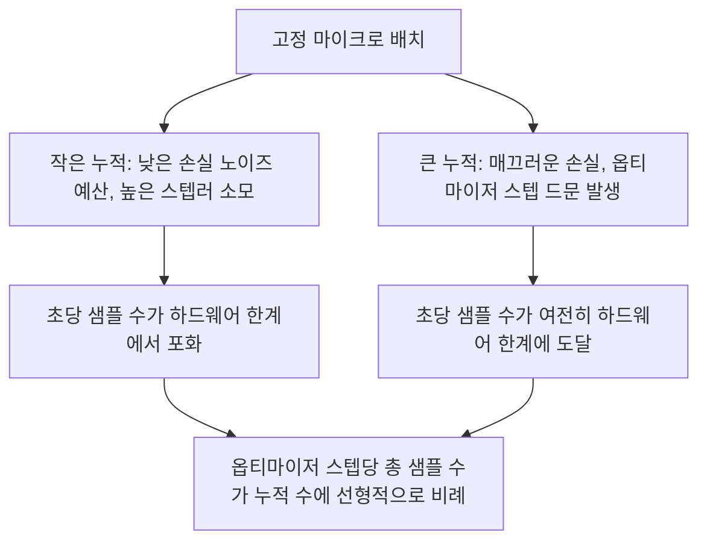

# 기울기 누적(Gradient Accumulation)

> 감당할 수 없는 효과적인 배치 크기로 학습하는 방법: 한 번에 하나의 마이크로 배치를 처리합니다. 손실을 스케일링하고, 옵티마이저 스텝을 지연시키며, 기울기가 쌓이도록 하세요.

**유형:** Build
**언어:** Python
**선수 요건:** 19단계 42-45강
**시간:** 약 90분

## 학습 목표

- 효과적인 배치 항등식 `effective_batch = micro_batch * accum_steps`을 유도해 보세요.
- 누적된 기울기가 단일 전체 배치의 역전파와 일치하도록 마이크로 배치별 손실 스케일링을 구현해 보세요.
- 마지막 마이크로 배치까지 옵티마이저 동기화를 건너뛰세요 (마지막 스텝에서 동기화(sync-on-last-step)).
- 효과적인 배치에 대한 처리량 곡선을 읽고, 수익 체감 현상을 설명해 보세요.

## 문제점

손실 곡선이 더 매끄럽고 옵티마이저 스텝이 그 규모에서 더 의미 있기 때문에, 효과적인 배치 크기를 512로 설정해 학습하고 싶다고 가정해 보세요. 책상에 있는 가속기는 메모리가 고갈되기 전에 32개 예제만 처리할 수 있습니다. 배치 크기를 두 배로 늘리는 것은 불가능하고, 모델을 절반으로 줄이는 것도 불가능합니다. 2017년 이후 이 분야가 채택하여 계속 사용해 온 방법은 16번의 역전파를 실행하고, 매개변수 버퍼 내에서 기울기가 누적되도록 허용하며, 목표 개수에 도달했을 때만 옵티마이저를 스텝하는 것입니다.

위험 요소는 손실 값이 더 큰 배치에서의 값과 동일하지 않게 된다는 점입니다. 16개 미니 배치의 교차 엔트로피를 단순 합산하면 전체 배치 하나의 손실의 16배가 됩니다. 스케일링을 하지 않으면 기울기 방향은 정확하지만 크기가 잘못되어, 옵티마이저 스텝이 16배 너무 커집니다. 해결책은 한 번의 나눗셈입니다. 이 해결책은 또한 잊기 쉽습니다.

## 개념



계약은 간단합니다:

- 각 마이크로 배치의 손실은 `backward()` 전에 `accum_steps`으로 나눕니다. PyTorch는 기본적으로 기울기를 `param.grad`에 합산합니다; 나눗셈은 누적 합을 올바른 스케일로 되돌립니다.
- 옵티마이저 스텝은 마지막 마이크로 배치의 역전파가 완료된 후, 유효 배치당 한 번 실행됩니다. 누적 중 스텝을 실행하면 나머지 실행이 의존하는 모든 매개변수가 왜곡됩니다.
- 옵티마이저의 상태(모멘텀 버퍼, Adam 모멘트)는 유효 스텝당 한 번, 마이크로 배치당 한 번이 아니라 한 번씩 진행됩니다. 그렇지 않으면 지수 이동 평균이 잘못된 빈도를 보고 스케줄을 소진하게 됩니다.
- 단일 디바이스에서는 단순한 기록 관리입니다. 다중 랭크 클러스터에서는 동일한 패턴이 `no_sync` 컨텍스트로 최종 마이크로 배치가 아닌 마이크로 배치를 감싸 기울기 올-리듀스를 건너뛰게 합니다. 마지막 마이크로 배치에서는 네트워크 비용을 N번 지불하는 대신, 한 번의 패스로 완전히 누적된 기울기를 리듀스합니다.

### 코드에서의 등가성 증명

```python
loss = criterion(model(x_full), y_full)
loss.backward()
opt.step()
```

는 과 등가입니다

```python
for x, y in chunks(x_full, y_full, n):
    scaled = criterion(model(x), y) / n
    scaled.backward()
opt.step()
```

는 부동 소수점 합산 순서를 제외하면 등가입니다. 루프 종료 시의 누적 기울기 버퍼는 단일 전체 배치 역전파가 생성하는 것과 동일한 텐서입니다. 강의 코드는 `equivalence_check`에서 최대 절대 차이가 1e-4 미만임을 확인합니다.

### 비용이 발생하는 위치

각 마이크로 배치는 한 번의 순전파와 한 번의 역전파가 필요합니다. 누적 기법을 사용하면 메모리를 시간과 교환합니다. `outputs/accum-curve.json`의 처리량 곡선은 고정된 마이크로 배치에서 유효 배치가 커짐에 따라 일어나는 일을 보여줍니다:



공짜 점심은 없습니다. `accum_steps`를 두 배로 늘리면 옵티마이저 스텝당 벽 시간도 두 배가 됩니다. 변하는 것은 기울기 추정치의 분산입니다. 동일한 벽 시간 예산에서 옵티마이저 스텝 수는 적지만, 각 스텝은 더 많은 샘플에 대해 평균화됩니다. 문헌에서는 큰 배치와 작은 배치를 서로 다른 최적화 문제로 취급합니다. 여기서의 강의는 통계적이지 않고 기계적입니다.

```figure
cc-grad-accumulation
```

## 구현하기

`code/main.py`는 실행 가능한 산출물입니다. 세 가지를 수행합니다.

### 1단계: 등가성 확인

`equivalence_check()`는 동일한 시드를 사용하여 동일한 네트워크의 두 사본을 구축합니다. 하나는 한 번의 순전파에서 16개 샘플 배치를 보고, 다른 하나는 손실을 4로 나눈 네 개의 4개 샘플 청크를 봅니다. 이 함수는 옵티마이저 스텝 전의 기울기 버퍼와 스텝 후의 매개변수를 비교합니다. 단정문은 `max_abs_diff < 1e-4`입니다.

### 2단계: 마지막 스텝 동기화 패턴

`train_one_optimizer_step`는 마이크로 배치를 순회합니다. 마지막 마이크로 배치를 제외하고 매번 `no_sync_context(model)`에 진입합니다. 단일 프로세스에서는 이 컨텍스트가 노오프(no-op)이며, DDP에서는 여기서 기울기 올-리듀스(all-reduce)가 건너뛰어집니다. 기록 방식은 동일합니다. `sync_counter`는 no_sync 범위에서 벗어난 횟수를 기록하며, N개의 마이크로 배치에 대해 카운트는 유효 스텝당 1이며 N이 아닙니다.

### 3단계: 처리량 곡선

`sweep_effective_batches`는 고정된 마이크로 배치와 누적 스텝 목록으로 동일한 모델을 실행합니다. 각 설정에 대해 다음을 기록합니다:

- `samples_per_sec`: 총 샘플 수를 벽 시간(wall time)으로 나눈 값
- `median_step_ms`: 유효 스텝당 50퍼센타일
- `sync_calls`: 실행된 콜렉티브 포인트
- `avg_loss`: 스윕의 옵티마이저 스텝 평균

출력은 `outputs/accum-curve.json`에 저장되며 노트북에서 재사용할 수 있습니다.

실행해 보세요:

```bash
python3 code/main.py
```

스크립트는 동등성 차이, 스윕 테이블, JSON 경로를 순서대로 출력합니다. 종료 코드는 0입니다.

## 사용하기

프로덕션 훈련에서 기울기 누적은 하나의 조절 변수 뒤에 있습니다. PyTorch의 패턴은 `accumulation_steps = effective_batch // (micro_batch * world_size)`입니다. 여기서 사용이 허용되지 않는 프레임워크들은 동일한 루프를 래핑하지만, 스텝은 동일합니다: 손실을 스케일링하고, 최종 마이크로 배치가 아닌 경우 동기화를 건너뛰고, 누적한 후 한 번 스텝합니다.

야생(wild)의 세 가지 패턴:

- 마이크로 배치 크기는 장치 메모리를 포화(saturate)하도록 선택됩니다. 더 작으면 가속기 사이클을 낭비하고, 더 크면 충돌합니다.
- 유효 배치는 학습률 스케줄에서 선택됩니다. 큰 유효 배치는 스케일링된 학습률과 워밍업이 필요하며, 이는 2017년부터 논의된 선형 스케일링 규칙입니다.
- 누적 횟수는 두 요소 사이의 다리이며, 데이터 로더를 다시 작성하지 않고 런타임에 자유롭게 조정할 수 있는 유일한 조절 변수입니다.

## 출시하기

`outputs/skill-gradient-accumulation.md`은 레시피를 포착하여 동료들이 새 저장소에 이를 도입할 수 있도록 합니다. 손실 값을 `accum_steps`로 스케일링하고, 최종 마이크로 배치(micro-batch)가 아닌 경우 옵티마이저 동기화를 건너뛰며, 유효 배치(effective batch)당 옵티마이저를 한 번만 스텝(step)하고, 유효 배치 대비 처리량(throughput)을 JSON으로 기록하여 트레이드오프(trade-off)가 명확히 보이도록 해 보세요.

## 연습 문제

1. `--num-steps 100`을 사용하여 스윕(sweep)를 다시 실행하고, 유효 배치 대비 초당 샘플 수를 플롯(plot)해 보세요. 곡선이 평평해지는 지점은 어디인가요?
2. 잘못된 스케일링 변형(나눗셈 없음)을 추가하고, 참조(reference) 대비 스텝 1에서의 매개변수 차이를 확인해 보세요.
3. SGD를 AdamW로 교체하고, 옵티마이저 상태가 마이크로 배치(micro-batch)마다 한 번이 아니라 유효 스텝(effective step)마다 한 번씩 진행됨을 확인해 보세요.
4. 실제 `DistributedDataParallel` 래퍼(wrapper)를 도입하고 `no_sync_context`을 해당 메서드로 라우팅(routing)하세요. 유효 배치당 sync_calls가 N-1만큼 감소하는지 확인해 보세요.
5. 동등성(equivalence) 검사를 수정하여 두 가지 다른 마이크로 분할(micro split) (2x8 vs 4x4)을 비교하고, 완화해야 하는 허용 오차(tolerance)를 설명해 보세요.

## 핵심 용어

| 용어 | 사람들이 말하는 것 | 실제 의미 |
|------|-----------------|------------------------|
| 마이크로 배치(micro batch) | 전달(forward)하는 배치 | 단일 forward pass에서 메모리에 Fits하는 슬라이스 |
| 누적 스텝(accum steps) | 스텝당 backward pass 수 | 하나의 옵티마이저 스텝 전에 합산되는 backward pass의 수 |
| 유효 배치(effective batch) | 배치 | 마이크로 배치 x 누적 스텝 x 데이터 병렬화(world size) |
| 손실 스케일링(loss scaling) | N으로 나누기 | 합산된 기울기가 전체 배치와 일치하도록 마이크로 배치별로 나누는 것 |
| 마지막 동기화(sync on last) | 나머지는 건너뛰기 | 윈도우 내 마지막 backward pass에서만 기울기 collective를 실행 |

## 추가 읽기

- sync-on-last-step 트릭의 프로덕션 버전인 `DistributedDataParallel.no_sync`에 대한 PyTorch 문서.
- Goyal et al., 2017, 대규모 배치 학습을 위한 선형 스케일링에 관한 논문. 유효 배치(effective batch)에 신경 써야 하는 표준적인 이유입니다.
- 기울기 누적(gradient accumulation)과 혼합 정밀도(mixed precision) 언스케일링(unscaling)의 상호작용에 관한 PyTorch 이슈 트래커.
- 19단계의 42~45강은 이 강의가 가정하는 모델, 데이터 로더, 옵티마이저 및 트레이너 스캐폴딩(scaffolding)을 다룹니다.
- 19단계의 47강은 체크포인트 및 재개(resume)를 다루며, 긴 누적 실행이 wallclock 제한을 극복하도록 돕습니다.
