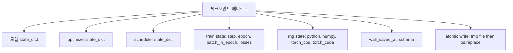
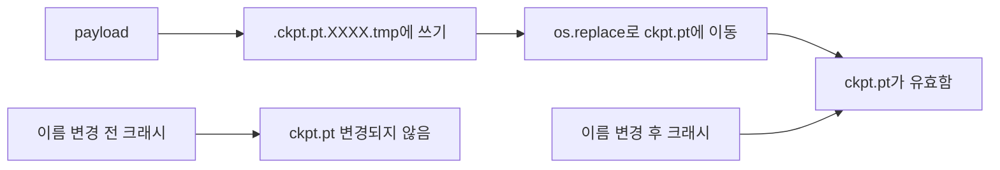
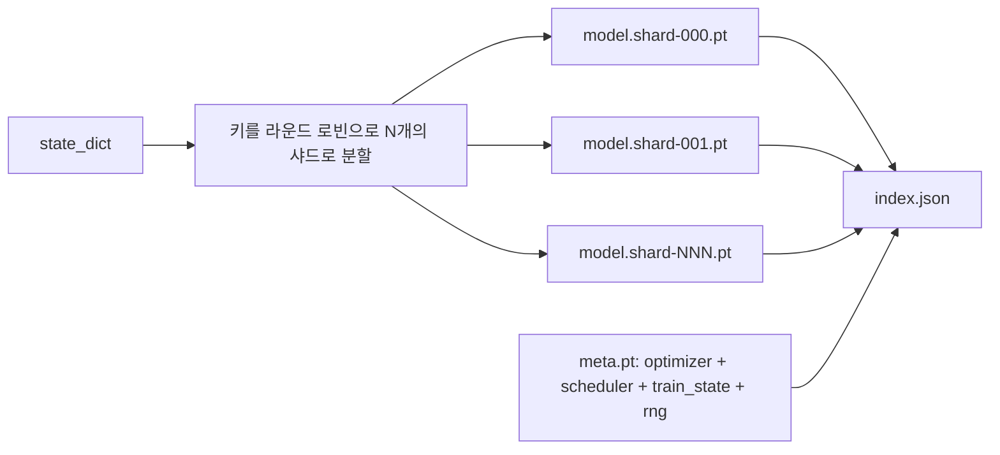

# 체크포인트 저장 및 재개

> 훈련 중단은 실행을 죽입니다. 체크포인트는 이를 계속 진행할 수 있게 해줍니다. 모델, 옵티마이저, 스케줄러, 손실 기록, 스텝 카운터, RNG 상태를 원자적으로 저장하여, 언제 중단되더라도 디스크에 유효한 파일이 남도록 합니다.

**유형:** Build
**언어:** Python
**선수 요건:** 19단계 42-45강
**시간:** 약 90분

## 학습 목표

- 새로운 프로세스에 다시 로드할 수 있는 단일 페이로드에 전체 훈련 상태를 캡처합니다.
- 임시 파일에 쓴 후 이름을 변경하는 원자적 저장을 구현하여, 크래시가 반쯤 작성된 파일을 남기지 않도록 합니다.
- Python, NumPy, PyTorch의 RNG 상태를 복원하여, 재개 후 손실이 중단 없는 기준선과 일치하도록 합니다.
- 단일 파일에 더 이상 맞지 않는 모델을 위해 해시로 검증된 샤드와 JSON 인덱스를 갖춘 샤드 체크포인트 레이아웃을 구축합니다.

## 문제점

18시간짜리 훈련 작업을 설정했습니다. 월클락 상한은 4시간입니다. 상급자가 커널 업그레이드를 승인했기 때문에 클러스터가 11시간에 재부팅됩니다. 체크포인트가 없으면 처음부터 다시 시작해야 합니다. 재개가 없으면 첫 11시간 동안 학습된 옵티마이저 상태도 잃게 되므로, 모델 가중치가 살아남았더라도 AdamW 모멘트는 사라지고 다음 스텝은 훈련 궤적이 이미 지나간 방향으로 비틀거립니다.

올바른 아티팩트는 계속 진행하는 데 필요한 모든 것을 담고 있는 단일 파일입니다: 모델 매개변수, 옵티마이저 상태, 스케줄러 상태, 플롯용 손실 기록, 현재 스텝 및 에포크 및 에포크 내 배치 카운터, 그리고 모든 랜덤성 소스의 RNG 상태. RNG 상태가 없으면 재개된 손실 곡선은 다른 곡선이 됩니다. 같은 모델, 같은 데이터, 다른 셔플, 다른 드롭아웃 마스크, 대시보드에 다른 숫자가 나타납니다.

원자적 저장은 계약의 나머지 절반입니다. 최종 파일명에 쓰면 쓰기 중 크래시가 손상된 파일을 남기게 되며, 재개는 쓰레기를 읽게 됩니다. 같은 디렉토리의 임시 파일에 쓴 후 이름을 변경하면 쓰기 중 크래시가 이전의 좋은 파일을 건드리지 않은 상태로 남깁니다. POSIX 파일 시스템에서 이름 변경은 원자적입니다.

## 개념



### 5개의 상태 버킷

| 버킷 | 중요성 |
|--------|----------------|
| 모델 | 가중치와 버퍼; 모델의 정체성. |
| 옵티마이저 | 모멘텀 및 적응형 모멘트; 이것이 없으면 다음 단계는 다른 최적화 문제가 됩니다. |
| 스케줄러 | 학습률이 곡선 상의 어디에 위치하는지; 특히 코사인 스케줄이 중요합니다. |
| 학습 카운터 | Step, epoch, batch-in-epoch, 그리고 대시보드를 그리는 손실 기록. |
| RNG 상태 | 드롭아웃, 데이터 셔플링, 모델 내부의 모든 샘플링에 대한 결정성. |

### 원자적 저장



두 가지 규칙. 첫째, 임시 파일은 대상 파일과 같은 디렉토리에 위치해야 하며, 이는 이름 변경이 같은 파일 시스템 내에서 원자적으로 수행되도록 보장합니다. 크로스 디바이스 이름 변경은 원자적이지 않습니다. 둘째, 임시 파일 이름은 시도마다 고유해야 하며, 두 작성자가 서로 겹치지 않도록 보장합니다.

### 샤드 체크포인트

모델이 커지면 단일 파일 페이로드가 너무 커져서 빠르게 로드하기 어렵고, 검사하기 어려우며, 네트워크 공유가 읽기 중 끊길 때 매우 고통스럽습니다. 해결책은 매개변수 상태를 샤드로 분할하고, 이를 연결하는 작은 인덱스를 작성하는 것입니다.



인덱스는 샤드 개수, 각 샤드의 sha256, 그리고 meta 파일의 sha256을 기록합니다. 로더는 해시가 불일치하면 큰 소리로 실패합니다. 샤드는 서로 다른 물리적 디스크에 저장될 수 있으며, meta는 작고 먼저 읽힙니다.

### 재개는 에포크 중간에서 계속됩니다

다음 에포크의 시작점으로 점프하는 체크포인트는 몇 분에서 하루까지의 시간을 낭비합니다. 해결 방법은 `(epoch, batch_in_epoch)`과 RNG 상태입니다. 로드 후, 학습 루프는 현재 에포크에서 이미 소비된 배치를 넘겨 랜덤 넘버 생성기를 빠르게 진행한 후 `batch_in_epoch`부터 계속합니다. 강의 코드는 이를 정확히 수행하며, 재개 후의 손실 궤적이 중단 없는 기준선과 1e-4 이내로 일치한다는 것이 검증 조건입니다.

```figure
cc-atomic-checkpoint
```

## 구현하기

`code/main.py`은 네 가지 기본 요소와 데모 드라이버를 제공합니다.

### 1단계: RNG 상태 캡처 및 복원

`capture_rng_state`은 Python의 `random.getstate`, NumPy의 `np.random.get_state`, 그리고 PyTorch CPU 및 CUDA RNG 바이트를 포함하는 dict를 반환합니다. 모든 요소는 순수한 Python 숫자, 튜플, 리스트로 저장되며 (NumPy의 key array는 `tolist()`을 거침), 3단계의 로더가 임의의 객체를 언피클링하지 않고도 이를 다시 읽을 수 있습니다. `restore_rng_state`는 이를 역순으로 처리합니다. CPU 텐서는 PyTorch RNG가 소비할 수 있는 uint8 바이트 버퍼입니다.

### 2단계: 원자적 저장

`atomic_save`은 페이로드를 대상 디렉토리의 임시 파일에 쓴 후, `os.replace`로 이를 최종 이름으로 교체합니다. `atomic_write_json`는 샤드 인덱스에 대해 동일한 작업을 수행합니다.

### 3단계: 전체 체크포인트 왕복

`save_checkpoint`은 모델, 옵티마이저, 스케줄러, 학습 상태, RNG를 하나의 dict로 패키징합니다. `load_checkpoint`은 이를 역순으로 처리하여 `TrainState`를 반환합니다. schema 필드는 업그레이드 훅입니다: 미래의 형식 변경은 버전 문자열을 올리고 로더가 이를 분기 처리합니다.

`load_checkpoint`은 `torch.load(..., weights_only=True)`을 호출합니다. `.pt` 파일은 pickle이며, `weights_only=False`로 신뢰할 수 없는 파일을 언피클링하면 파일이 지정한 코드가 실행됩니다. 가중치 전용 로더는 텐서와 기본 컨테이너만 허용하고 나머지는 거부하므로, 1단계에서는 RNG 상태를 순수한 리스트로 유지합니다. 무결성 검사는 `ValueError`를 발생시키며 `assert`를 사용하지는 않는데, `python -O`는 assert를 제거하기 때문입니다. torch 2.6 이상을 사용하세요: 그 이전 릴리스에서는 `weights_only=True`에 알려진 우회 경로(CVE-2025-32434)가 있었으므로, 이 강의가 의존하는 보장은 2.6부터만 성립합니다.

### 4단계: 샤드 변형

`save_sharded_checkpoint`은 매개변수 키를 N개의 샤드(shard)에 라운드 로빈 방식으로 분배하고, 각 샤드를 자체 원자적 저장(atomic save)으로 기록하며, 옵티마이저, 스케줄러, 학습 상태를 담은 메타 파일을 기록하고, 샤드의 sha256 해시를 포함한 JSON 인덱스를 기록합니다. `load_sharded_checkpoint`은 병합 전에 모든 샤드를 검증하며, 체크포인트 디렉터리 밖으로 해석되는 샤드 경로를 거부합니다.

### 5단계: 재개 데모

`run_resume_demo`은 `total_steps` 동안 작은 모델을 학습하고, `interrupt_at`에서 체크포인트를 저장한 후 계속 진행합니다. 두 번째 프로세스는 체크포인트를 복원하여 남은 단계를 실행합니다. 이 함수는 중단 지점 이후 두 손실 궤적의 최대 절대 차이를 반환합니다. RNG가 복원되면 차이는 0 또는 부동 소수점 노이즈입니다.

실행해 보세요:

```bash
python3 code/main.py
```

단일 파일 및 샤드 데모 모두 최대 차이가 1e-4 미만임을 단언(assert)합니다. 요약은 `outputs/resume-demo.json`에 저장됩니다.

## 사용하기

프로덕션 학습 스택은 체크포인팅을 트레이너의 일부로 제공합니다. 형태는 동일합니다: 모델 + 옵티마이저 + 스케줄러 + 카운터 + RNG를 원자적으로 기록하고, 단계(step) 이름으로 명명하여 최신 체크포인트를 쉽게 찾을 수 있습니다. 샤드 레이아웃은 병렬 읽기를 통해 대규모 모델 로딩을 지원하며, index.json이 이를 가능하게 합니다.

강제해야 할 네 가지 패턴:

- **`weights_only=True`으로 로드하세요.** 공유 드라이브나 다운로드에서 가져온 체크포인트는 신뢰할 수 없는 입력입니다. 가중치 전용 로더는 악성 파일이 재개하는 머신에서 코드를 실행하는 것을 방지합니다.
- **스키마는 페이로드 내의 문자열입니다.** 마이그레이션은 이를 기반으로 분기합니다. 스키마가 없으면 이전 실행을 깨뜨리지 않고 형식을 진화시킬 수 없습니다.
- **모든 샤드에 Sha256을 적용하세요.** 조용히 잘린 다운로드는 최악의 버그입니다. 로더는 즉시 실패하거나 늦게 실패합니다.
- **체크포인트 주기(cadence)를 정직하게 유지하세요.** N단계마다 그리고 매 벽시계(wallclock) 분마다 저장하되, 더 짧은 주기를 따르세요. 그렇지 않으면 크래시를 일으키는 긴 단계는 전체 작업 윈도우를 낭비합니다.

## 출시하기

`outputs/skill-checkpoint-save-resume.md`은 새로운 학습 스크립트를 위한 레시피입니다: 페이로드 형태, 원자적 쓰기, RNG 캡처, 샤드 인덱스. 스킬을 저장소에 넣고, 주기적 저장 지점에서 `save_checkpoint`을 연결하고, 시작 시 `load_checkpoint`을 연결하면, 실행은 강제 종료(kill)에도 생존합니다.

## 연습 문제

1. 파라미터 그룹 기반 샤딩(레이어가 `.weight`로 끝나는지 `.bias`로 끝나는지)으로 라운드 로빈 샤딩을 교체해 보세요. 어떤 레이아웃이 각각 더 유리한가요?
2. 저장 루프를 확장하여 마지막 K개 체크포인트를 유지하고 이전 것을 제거해 보세요. 디스크 용량이 작을 때 적절한 K 값은 무엇인가요?
3. 단계 수뿐만 아니라 벽시계 간격에 따라 저장을 트리거하는 `--ckpt-every-seconds` 플래그를 추가해 보세요.
4. 시작 시 실행되어 디렉토리의 모든 체크포인트를 스캔하고 손상된 것을 보고하는 체크섬 검증 경로를 추가해 보세요.
5. 페이로드에 새 필드를 추가하고 스키마 문자열을 올리는 `migrate_v1_to_v2` 함수를 구현해 보세요. 로드가 두 버전을 모두 허용하도록 해 보세요.

## 핵심 용어

| 용어 | 사람들이 말하는 것 | 실제 의미 |
|------|-----------------|------------------------|
| 원자적 저장 | "쓰고 기도하기" | 같은 디렉토리의 임시 파일에 쓴 후, os.replace로 대상 이름으로 교체 |
| 상태 사전 | "가중치" | 파라미터 이름을 키로 하는 모델 파라미터 및 버퍼 |
| 샤드 체크포인트 | "거대한 모델 파일" | 샤드당 하나의 파일, 메타 파일, sha256을 포함한 JSON 인덱스 |
| RNG 상태 | "난수 시드" | python random, numpy, torch CPU, torch CUDA의 캡처된 상태; 시드만 있는 것이 아님 |
| 에포크 중 재개 | "재시작" | RNG를 순조롭게 진행하여 같은 에포크의 다음 배치부터 계속 |

## 추가 읽기

- `os.replace`이 의존하는 원자성 주장에 대한 POSIX `rename` 의미론.
- `torch.save` 및 `torch.load`에 대한 PyTorch 문서, 기기 간 복원용 `map_location` 및 신뢰할 수 없는 파일 로딩용 `weights_only` 포함.
- 19단계 46강은 이 강의의 체크포인트 페이로드가 유지하는 기울기 누적을 다룹니다.
- 19단계 48강은 이 방식이 수용하는 분산 래퍼의 상태 사전 형식을 다룹니다.
- 원자적 이름 변경 뒤의 내구성 보장에 대한 Linux 커널 `fsync` 문서.
