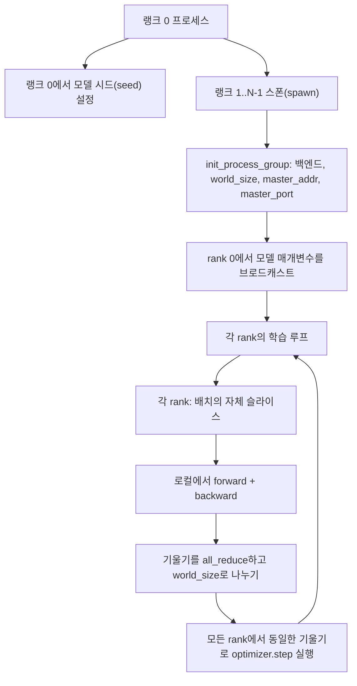
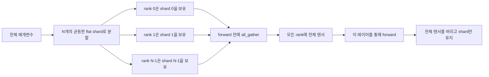

# 분산 데이터 병렬 및 FSDP를 처음부터 구현하기

> 다중 랭크 훈련은 두 개의 콜렉티브와 하나의 규칙으로 구성됩니다. 시작 시 매개변수를 브로드캐스트하고, 역전파 후 기울기를 평균 내며, 각 랭크가 현재 스텝에 대해 의견 불일치를 겪지 않도록 해야 합니다.

**유형:** Build
**언어:** Python
**선수 요건:** 19단계 42강~45강
**시간:** 약 90분

## 학습 목표

- `gloo` 백엔드를 사용하여 N개의 랭크에 걸쳐 프로세스 그룹을 설정해 보세요. 특수 하드웨어는 필요하지 않습니다.
- 생성 시 매개변수를 브로드캐스트하고 역전파 후 기울기를 올-리듀스하는 최소한의 DDP 래퍼를 구현해 보세요.
- 랭크별 기울기의 올-리듀스가 연결된 입력에 대한 단일 프로세스 기울기와 일치함을 증명해 보세요.
- FSDP 매개변수 샤딩을 간략히 설명해 보세요. 각 랭크는 슬라이스를 보유하며, 전체 텐서는 순방향 패스를 위해 수집(gather)된 후 폐기됩니다.

## 문제점

모델은 하나의 장치에 fits합니다. 데이터셋은 fits하지 않습니다. 최적화 예산은 벽시계 시간당 N배의 예제를 처리하는 것을 요구합니다. 첫 번째 레버는 데이터 병렬입니다. 각 랭크는 배치의 서로 다른 슬라이스에 동일한 모델을 실행하고, 옵티마이저 스텝 전에 기울기를 평균냅니다. 두 번째 레버는 FSDP입니다. 모델도 하나의 장치에 fits하지 않으므로, 각 랭크는 모든 매개변수의 일부만 보유하며 순방향 패스 동안 레이어별로 전체 텐서를 재구성합니다.

고통은 장부 관리(bookkeeping)에 있습니다. 매개변수가 랭크 간에 드리프트(drift)되면 실행은 조용히 손상됩니다. 기울기를 평균내더라도 손실(loss)을 평균내지 않으면 대시보드가 거짓말을 합니다. 콜렉티브 백엔드가 토폴로지에 대해 합의하지 못하면 실행은 영원히 멈춥니다. 해결책은 콜렉티브를 한 번 직접 작성하고, 재현할 수 없는 래퍼를 절대 신뢰하지 않는 것입니다.

이 강은 CPU에서 실행됩니다. CUDA는 가정하지 않습니다. `gloo` 백엔드는 모든 PyTorch 빌드에 포함되어 있으며 `torch.multiprocessing` 워커를 허용합니다. 같은 코드는 구조를 변경하지 않고 멀티 GPU 노드에서 `nccl`로 전환됩니다.

## 개념



### 중요한 두 개의 collective

| Collective | 기능 | 사용 시점 |
|------------|--------------|------|
| `broadcast` | 한 rank의 텐서를 다른 모든 rank로 복사 | 매개변수 초기화, 스케줄러 상태, 일대다 동기화 |
| `all_reduce` | 모든 rank에 걸쳐 텐서를 합산(또는 평균, 최대)하고 모든 rank가 결과를 받음 | backward 후 기울기 평균화 |
| `all_gather` | 각 rank가 텐서를 기여하고 모든 rank가 연결(concatenation)된 결과를 받음 | 로짓 수집, FSDP 매개변수 언샤드 |

DDP 계약은 생성 시 `broadcast`이고, backward 후 `all_reduce`입니다. FSDP 스케치는 각 레이어의 forward 패스 전에 `all_gather`을 추가합니다.

### 기울기 평균화가 단일 프로세스 기울기와 일치

N개의 rank에 걸쳐 B개의 예제 배치를 사용하여 학습한 모델은 단일 프로세스가 N*B 배치를 사용하여 학습했을 때와 동일한 기울기를 산출해야 합니다. 핵심은 각 rank의 기울기를 합산하고 N으로 나누면 평균 손실 기울기가 되며, 이는 전체 배치에 대해 mean reduction을 적용한 교차 엔트로피가 산출하는 값과 동일하다는 점입니다. 교재 코드는 `max-abs-diff < 1e-3`을 사용하여 수동 all-reduce 기울기와 참조 단일 프로세스 기울기가 일치함을 검증합니다.

### FSDP 스케치



메모리 절감은 정확합니다: 매개변수에 대한 rank별 메모리가 1/N으로 감소합니다. 비용은 gather이며, 이는 매 forward 패스마다 발생합니다. 프로덕션 FSDP는 gather를 이전 레이어의 연산과 겹치게 하여 wallclock 비용이 단순 계산이 예측하는 것보다 훨씬 작습니다. 교재는 모든 매개변수에 대해 왕복(round-trip)을 수행하고 재구성된 결과가 원본과 비트 단위로 동일함을 검증합니다.

### CPU와 gloo 백엔드

CUDA는 프로덕션 대상이지만, 동일한 코드 경로가 CPU에도 존재합니다. `gloo`는 CPU 집합 통신 백엔드입니다. GPU의 `nccl`보다 몇 배수(order of magnitude) 더 느리지만, API 표면은 동일합니다. 이 강의의 프로세스 그룹은 `backend="gloo"`로 초기화되며, 랭크는 `torchrun`가 아닌 `torch.multiprocessing`로 생성됩니다. 두 경우 모두 동일한 `torch.distributed` 호출로 이어집니다. 다중 GPU 노드에서는 `backend="nccl"`, 디바이스 텐서, 그리고 실행을 위한 `torchrun`만 변경됩니다.

```figure
cg-allreduce-ring
```

## 구현하기

`code/main.py`는 실행 가능한 산출물입니다.

### 1단계: 프로세스 그룹 시작하기

```python
os.environ["MASTER_ADDR"] = "127.0.0.1"
os.environ["MASTER_PORT"] = str(port)
dist.init_process_group(backend="gloo", rank=rank, world_size=world_size)
```

`MASTER_ADDR`와 `MASTER_PORT`는 렌데부(rendezvous)입니다. 모든 랭크가 동일한 호스트의 동일한 포트로 연결합니다. 이 강의는 여러 실행이 하나의 머신을 공유할 때 충돌을 피하기 위해 바인드 후 즉시 닫는(bind-and-close) 기법을 통해 빈 포트를 선택합니다.

### 2단계: 생성 시 브로드캐스트

`MinimalDDP.__init__`는 모든 매개변수와 버퍼를 순회하며 `dist.broadcast(tensor, src=0)`를 호출합니다. 랭크 0의 값이 표준 초기화 값이 됩니다. 이 과정이 없으면 각 랭크는 자체 시드로 초기화되어 첫 단계부터 랭크 간에 차이가 발생합니다.

### 3단계: 역전파 후 기울기 올-리듀스(all-reduce)

```python
def all_reduce_grads_(module, world_size):
    for p in module.parameters():
        if p.grad is None:
            p.grad = torch.zeros_like(p.data)
        dist.all_reduce(p.grad.data, op=dist.ReduceOp.SUM)
        p.grad.data.div_(world_size)
```

모든 랭크는 동일한 평균 기울기를 얻습니다. 옵티마이저 단계는 이제 모든 랭크에서 동일한 입력에 대한 함수가 되므로, 실행 동안 매개변수가 동기화 상태를 유지합니다.

### 4단계: 등가성 증명하기

`manual_all_reduce_matches_single_process`는 랭크 0에서 동일한 모델을 구축하고, 올-리듀스(all-reduce) 후의 기울기를 단일 프로세스가 연결된 입력(concatenated input)에 대해 계산하는 기울기와 비교합니다. 최대 절대 차이는 약 1e-8입니다.

### 5단계: FSDP 왕복

`fsdp_round_trip_sketch`는 각 매개변수를 평탄화(flatten)하고, `world_size`의 배수로 패딩(pad)하며, 슬라이스(slice)하고, 올-개더(all-gather)하며, 패딩을 제거(unpad)합니다. 모든 랭크의 재구성 결과가 원본과 동일합니다. 이는 언샤드(unshard) 단계이며, 그 역(순방향 전파 후 재샤드(re-shard))는 개더된 텐서에서 한 번 슬라이스하는 것입니다.

실행해 보세요:

```bash
python3 code/main.py
```

기본 월드(world) 크기는 2입니다. 두 개의 CPU 프로세스가 생성되어 `gloo`를 통해 서로 통신하며, 종료 코드는 0입니다. 출력 `outputs/ddp-demo.json`는 랭크별 매개변수 합계, 올-리듀스(all-reduce) 후의 기울기 노름(norm), FSDP 왕복 결과, 그리고 수동 계산과 참조 기울기의 차이를 포착합니다.

## 사용하기

프로덕션 훈련 스택은 동일한 프리미티브를 호출합니다. PyTorch의 `DistributedDataParallel`은 다음을 추가합니다: 백워드 후 기울기 훅으로 올-리듀스(all-reduce)를 백워드와 겹치게 하고, 버킷화된 올-리듀스로 여러 작은 기울기를 하나의 콜렉티브로 결합하며, 46강에서 사용된 `no_sync` 컨텍스트를 제공합니다.

PyTorch의 FSDP는 다음을 추가합니다: 각 레이어에 대해 평평한 매개변수 뷰를 사용하여 각 랭크가 하나의 연속 버퍼를 보유하도록 하고, 다음 레이어의 언샤드(unshard)를 현재 레이어의 연산과 겹치게 하며, 샤드(shard)에 대해 선택적으로 CPU 오프로드를 수행합니다.

구조는 동일하게 유지됩니다: 시작 시 브로드캐스트하고, 백워드 후 리듀스하며, 매개변수가 더 이상 맞지 않을 때 샤드합니다.

## 출시하기

`outputs/skill-distributed-fsdp-ddp.md`은 새로운 훈련 스크립트용 레시피를 담고 있습니다: CPU용 `gloo`과 GPU용 `nccl`로 프로세스 그룹을 시작하고, 생성 시 브로드캐스트하고 백워드 후 리듀스하는 DDP 셸로 모델을 래핑하며, FSDP 스케치에서 제시된 all_gather 패턴으로 선택적으로 매개변수를 샤드합니다.

## 연습 문제

1. `--world-size 4`으로 실행하여 전체 실행 동안 매개변수 분산이 1e-3 미만으로 유지되는지 확인해 보세요.
2. 수동 평균화를 `dist.all_reduce(op=dist.ReduceOp.AVG)`으로 대체하고 시간 차이를 측정해 보세요.
3. DDP 래퍼에 백워드 후 훅을 추가하여 올-리듀스가 백워드의 나머지 부분과 겹치도록 하고, 월클록(wallclock) 개선량을 측정해 보세요.
4. FSDP 재샤드(re-shard) 단계를 구현해 보세요: 순방향 전달 후 전체 텐서를 다시 로컬 샤드로 대체합니다. 랭크별 메모리가 감소하는지 확인해 보세요.
5. CUDA 머신에서 백엔드를 `nccl`으로 전환해 보세요. 어떤 환경 변수가 변경되고 어떤 것이 그대로 유지되는지 기록해 보세요.

## 핵심 용어

| 용어 | 사람들이 말하는 표현 | 실제 의미 |
|------|-----------------|------------------------|
| 백엔드 | "gloo 또는 nccl" | 콜렉티브 연산을 구현하는 라이브러리; gloo는 CPU, nccl은 GPU |
| 월드 크기 | "총 랭크 수" | 그룹 내 프로세스의 수; 그룹은 콜렉티브가 작동하는 단위 |
| 랭크 | "워커 ID" | 그룹 내 프로세스 식별자, 0부터 시작 |
| 올-리듀스 | "기울기 합산" | 모든 랭크에 걸쳐 텐서를 합산하며, 모든 랭크가 동일한 결과를 얻음 |
| 언샤드 | "매개변수 수집" | all_gather를 통해 랭크별 슬라이스로부터 전체 텐서를 재구성 |

## 추가 읽기

- 이 강의가 의존하는 집합 연산(collective semantics)에 대한 PyTorch `torch.distributed` 문서입니다.
- CUDA 기반 `nccl` 원시 연산과 동일한 형태를 가진 `gloo` 라이브러리의 집합 연산 목록입니다.
- `no_sync`에서 DDP all-reduce를 감싸는 기울기 누적 패턴에 대해 19단계 46강을 참고하세요.
- DDP 및 FSDP 실행을 견디는 체크포인트 레이아웃에 대해 19단계 47강을 참고하세요.
- 여기서 설명한 매개변수 분할(parameter sharding)의 프로덕션 구현에 대한 PyTorch FSDP 문서입니다.
