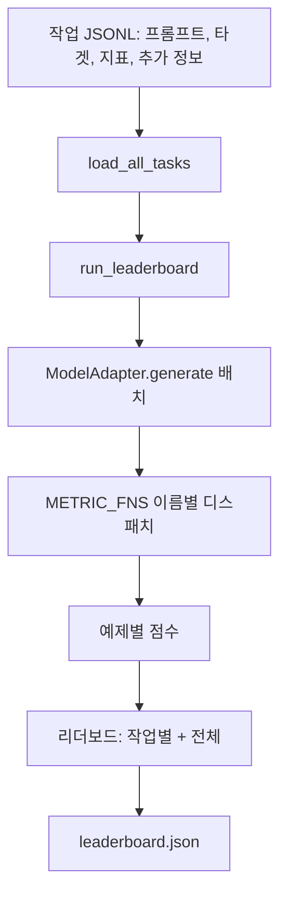

# 언어 모델 평가 하네스

> 정의할 수 없는 작업에서 잘 작동하는 모델은 우연히 잘 작동하는 모델입니다. 하네스는 작업 정의, 지표, 실행기, 리더보드를 짧고 교체 가능한 형태로 통합한 것입니다.

**유형:** Build
**언어:** Python
**선수 요건:** 19단계 42-45강
**시간:** 약 90분

## 학습 목표

- 각 예제에 `prompt`, `targets`, `metric` 및 선택적 `extras`을 포함하는 JSONL 파일로 작업을 정의해 보세요.
- 정확 일치, rouge-l F1, 실행 가능성 검사, 객관식, 부분 문자열 포함의 5가지 지표를 구현해 보세요.
- 작업별로 예제를 배치 처리하고 교체 가능한 모델 어댑터로 전달하는 실행기를 구축해 보세요.
- 작업별 점수, 지연 시간, 재현 가능한 전체 평균을 포함하는 리더보드 JSON을 생성해 보세요.

## 문제점

매주 새로운 언어 모델이 등장합니다. 마케팅에서는 잘 작동한다고 주장합니다. 정직한 질문은 '무엇에 대해 잘 작동하는가?'입니다. 정직한 답은 직접 작성한 리더보드입니다. 벤더의 리더보드는 벤더가 조정된 것이기 때문입니다.

저장소에 하네스가 없으면 두 모델을 직관으로 비교합니다. 하네스가 있으면 고정된 작업 세트와 고정된 지표로 점수를 비교하고, diff할 수 있는 JSON 출력으로 비교합니다. 하네스는 어제 실행과 오늘 실행 사이의 계약입니다. 하네스가 없으면 회귀가 배포됩니다.

함정은 하네스를 단일 모델에 과적합하는 것입니다. 해결책은 같은 함정을 거꾸로 적용하는 것입니다. 하네스는 15분 안에 읽을 수 있을 만큼 작고, 작업은 저장소에 배포할 수 있을 만큼 작으며, 지표는 동료의 감사(audit)가 가능하도록 처음부터 작성되고, 어댑터는 모델별 코드가 있는 유일한 위치입니다. 어댑터를 교체하면 리더보드가 변하고, 작업을 교체하면 리더보드가 변합니다. 그 외의 것은 변하지 않아야 합니다.

## 개념



### 작업 사양

각 예제는 한 줄의 JSONL입니다:

```json
{"id": "arith-00", "prompt": "compute: 2 + 2", "targets": ["4"], "metric": "exact_match"}
```

점수 계산 헬퍼가 필요한 지표의 경우, `extras`이 사이드 페이로드를 전달합니다:

```json
{
  "id": "code-00",
  "prompt": "python: write a function f that doubles its input",
  "targets": ["ok"],
  "metric": "code_exec",
  "extras": {"io_pairs": [[1, 2], [3, 6]]}
}
```

작업은 `outputs/tasks/` 아래에 있는 `.jsonl` 파일입니다. 파일 이름이 작업 이름입니다. 파일 내의 모든 예시는 하나의 지표를 공유합니다.

### 5개의 픽스처 작업

| 작업 | 지표 | 테스트 내용 |
|------|--------|---------------|
| arithmetic | exact_match | 결정적인 정답에 대한 토큰 수준 정확성 |
| summary | rouge_l | 한 줄 참조 요약에 대한 최장 공통 부분 수열 F1 |
| code-exec | code_exec | 실행 가능한 테스트: 예측된 함수가 입력-출력 쌍 목록을 충족해야 합니다 |
| multiple-choice | multiple_choice | 예측의 첫 글자가 허용된 글자와 일치해야 합니다 |
| generation | substring_contains | 자유 형식 텍스트가 최소한 하나의 대상 부분 문자열을 포함해야 합니다 |

### 지표 계약

모든 지표는 `(prediction, targets, extras) -> float in [0.0, 1.0]`로부터의 함수입니다. 하네스는 예시별 점수를 평균 내어 작업 점수를 얻고, 작업 점수를 평균 내어 전체 점수를 얻습니다. 지표 함수는 매우 작습니다:

- `exact_match`: 소문자화, 공백 축약, 일치.
- `substring_contains`: 동일한 정규화, 부분 문자열 테스트.
- `multiple_choice`: 첫 문자를 대문자로 변환.
- `rouge_l`: LCS 길이를 예측 및 참조 길이로 나눈 값, 정밀도와 재현율의 F1.
- `code_exec`: 예측을 제한된 네임스페이스에서 실행하고, 모든 입력-출력 쌍에 대해 `f(x)`을 호출하며 일치 횟수를 세습니다.

code_exec 지표는 예측을 빌트인이 제거된 네임스페이스에서 실행합니다. 이 강의의 테스트는 `os`이 네임스페이스에 없으므로 `import os`이 실패한다고 주장합니다. 코드 예측을 통해 파일 시스템에 접근할 수 없습니다.

### 모델 어댑터

```python
class ModelAdapter(Protocol):
    def generate(self, prompts: Sequence[str]) -> List[str]: ...
    @property
    def name(self) -> str: ...
```

어댑터는 접합점(seam)입니다. 이 강의는 `ToyAdapter`를 제공합니다. 이는 5개의 픽스처 작업 내 모든 프롬프트에 대해 정답을 반환하는 결정적인 패턴 매처입니다. 실제 어댑터는 모델을 호출하고 그 출력을 반환합니다. 하네스는 어느 것을 사용하는지 신경 쓰지 않습니다.

### 러너

`run_task`는 한 번에 `batch_size` 프롬프트를 배치로 처리하고 메트릭 함수로 전달합니다. `run_leaderboard`는 모든 작업을 순회하며 평균을 계산합니다. `write_leaderboard`는 스키마 문자열을 포함하는 JSON을 생성하므로, 향후 형식 변경이 대시보드를 조용히 깨뜨리지 않습니다.


```figure
eval-harness-matrix
```

## 구현하기

`code/main.py`는 실행 가능한 산출물입니다.

### 1단계: 픽스처 작업 시드 생성

`seed_fixture_tasks(target_dir)`는 다섯 개의 `.jsonl` 파일을 작성합니다. `main.py`의 첫 실행 시 디렉터리가 비어 있으면 파일들을 시드합니다.

### 2단계: 작업 로드

`load_all_tasks(task_dir)`는 모든 `.jsonl`을 읽고 작업 이름에서 `Example` 레코드 목록으로 이어지는 dict를 반환합니다. `#`으로 시작하는 주석 줄과 빈 줄은 건너뛰므로, 기여자가 파일에 주석을 달 수 있습니다.

### 3단계: 메트릭 구현

각 메트릭은 단위 테스트가 있는 작은 함수입니다. 이 강의의 테스트 스위트는 정규화, 부분 겹침, 코드 실행, 안전하지 않은 코드 거부를 포함하는 13개 케이스를 다룹니다.

### 4단계: 러너 작성

`run_task`는 배치를 반복하며 점수, 정답 수, 총 수, 지연 시간을 포함하는 `TaskResult`를 생성합니다. `run_leaderboard`는 모든 작업을 순회하며 전체 평균을 포함하는 `Leaderboard`를 생성합니다.

### 5단계: JSON 출력

`write_leaderboard`는 리더보드를 직렬화합니다. `--include-per-example` 플래그는 예제별 레코드를 덤프하므로, 점수가 변할 때 이전 실행 결과와 예측을 비교할 수 있습니다.

실행해 보세요:

```bash
python3 code/main.py
```

스크립트는 첫 실행 시 픽스처를 시드하고, 토이 어댑터(모든 픽스처를 정답으로 처리)로 점수를 매기며 `outputs/leaderboard.json`를 작성합니다. 토이 어댑터를 사용하면 전체 점수는 1.0입니다. `test_main.py`의 스텁 어댑터 테스트는 어댑터가 답변할 수 없을 때 동일한 하네스가 0.0을 산출함을 보여줍니다.

## 사용하기

실제 모델을 연결하려면 어댑터를 작성하세요. 형태는 다음과 같습니다:

```python
class HttpAdapter:
    name = "vendor.v1"

    def __init__(self, endpoint, api_key):
        self.endpoint = endpoint
        self.api_key = api_key

    def generate(self, prompts):
        out = []
        for prompt in prompts:
            response = http_post(self.endpoint, prompt, self.api_key)
            out.append(response["text"])
        return out
```

`main()`의 상단에서 `ToyAdapter`를 `HttpAdapter`로 교체하세요. 하네스, 작업, 메트릭, 리더보드는 그대로 유지됩니다.

실제 프로젝트에서 하네스를 출시할 때 준수해야 할 세 가지 패턴:

- **작업 파일을 고정하세요.** leaderboard.json은 해시로 고정된 작업 내용을 담고 있거나, JSONL을 함께 담고 있습니다. 그렇지 않으면 작업 파일이 변경될 때 점수가 변하고, 어떤 변경이 점수를 바꿨는지 알 수 없습니다.
- **점수만 아니라 예측을 비교하세요.** `--include-per-example` 플래그를 사용하면 점수가 떨어진 날 모델이 무엇을 출력했는지 확인할 수 있습니다.
- **배치 크기를 제한하세요.** 실제 어댑터에는 속도 제한이 있습니다. 작은 배치 크기를 유지하면 벤더 간에 하네스가 호환됩니다.

## 출시하기

`outputs/skill-lm-eval-harness.md`는 레시피를 담고 있습니다: JSONL 작업 사양, 5가지 지표, 교체 가능한 어댑터, 배치 실행기, 스키마 문자열이 포함된 리더보드 JSON. `outputs/tasks/`의 작업 파일은 픽스처입니다. 실제 프로젝트의 시작점으로 복사하세요.

## 연습 문제

1. 직접 작성한 커스텀 지표(BLEU 유사 겹침, BLEURT 유사 참조 점수, 명확한 계약이 있는 것 등)를 가진 여섯 번째 작업을 추가하세요.
2. `code_exec`를 확장하여 stdout을 캡처하고, 예상 stdout 목록을 타겟으로 허용하세요.
3. 리더보드 diff 명령을 추가하세요: 두 `leaderboard.json` 파일이 주어지면, 어떤 작업이 얼마나 이동했는지 출력합니다.
4. 예제별 지연 시간을 제한하세요. 어댑터 호출을 타임아웃으로 감싸고, 리더보드에 별도의 `timeouts` 열을 표시하세요.
5. 리더보드에 sha256으로 작업 내용을 고정하여, 미래의 독자가 동일한 작업에 점수를 매겼는지 검증할 수 있도록 하세요.

## 핵심 용어

| 용어 | 사람들이 말하는 것 | 실제 의미 |
|------|-----------------|------------------------|
| 작업 사양 | "평가 형식" | 예제별로 프롬프트, 타겟, 지표, 선택적 추가 항목을 포함하는 JSONL 파일 |
| 지표 | "점수 매기는 방법" | (예측, 타겟, 추가 항목)을 [0, 1] 범위의 float로 변환하는 함수 |
| 어댑터 | "모델 클라이언트" | generate(prompts) -> list[str] 메서드를 가진 객체; 모델 전용 코드는 이것뿐 |
| 리더보드 | "점수판" | 작업별 점수, 총 개수, 지연 시간, 전체 평균을 포함하는 JSON |
| 코드 실행 지표 | "실행하고 확인" | 예측을 제한된 네임스페이스에서 실행하고, 입력-출력 쌍과 비교 |

## 추가 읽기

- 프로덕션 참조용 원본 lm-evaluation-harness는 훨씬 크지만, 동일한 형태를 따릅니다.
- 동일한 계약에 대한 대안 구현으로 HuggingFace의 lighteval을 사용해 보세요.
- 19단계 46강에서는 하네스가 점수를 매기는 훈련 스택에서 사용되는 기울기 누적 패턴을 다룹니다.
- 19단계 47강에서는 점수를 매기는 체크포인트 형식을 다루며, 리더보드에 체크포인트 해시를 고정하세요.
- 19단계 48강에서는 테스트 대상 모델을 생성한 분산 훈련 스택을 다룹니다.
