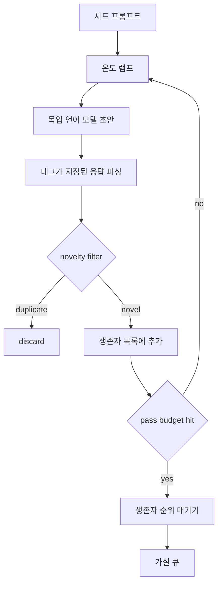

# 가설 생성기

> 연구 에이전트가 같은 질문을 두 번 하는 것은 토큰 낭비입니다. 핵심은 각 초안이 새로운 지점에 도달하도록 강제하는 것입니다.

**유형:** Build
**언어:** Python
**선수 요건:** 19단계 트랙 A 20-29강
**시간:** 약 90분

## 학습 목표
- 시드 프롬프트로 샘플러를 구동하고, 그 출력물을 타입이 지정된 가설 레코드로 변환해 보세요.
- 각 패스마다 샘플러의 온도를 높여 다음 초안이 이전 초안에서 더 멀리 벗어나도록 해 보세요.
- 작은 임베딩 모델과 코사인 거리 임계값을 사용해 유사한 중복을 필터링해 보세요.
- 신뢰성, 구체성, 테스트 가능성을 결합한 점수 함수로 생존한 항목들을 순위 매겨 보세요.
- 모든 단계를 결정적으로 유지하여, 동일한 시드가 항상 동일한 큐를 생성하도록 해 보세요.

## 왜 생성한 후 필터링하는가

플래너가 하나의 모델에 한 번만 요청하면 하나의 가설만 얻습니다. 이는 예제에는 적합하지만, 연구 루프에는 잘못된 형태입니다. 루프는 깊이 있는 순위 매겨진 큐를 원합니다. 첫 번째 가설이 실패했을 때, 런너는 추가 샘플링 패스를 지불하지 않고도 다음 가설을 즉시 준비할 수 있어야 합니다.

두 가지 아이디어가 결합되어 그 큐를 생성합니다. 첫 번째는 온도 램핑입니다. 샘플러를 통과할 때마다 온도를 한 단계 높여, 이후 초안이 더 자유롭게 방황하도록 장려합니다. 두 번째는 신뢰성 필터링입니다. 각 초안 이후, 생성기는 모든 이전 생존 항목과의 임베딩 거리를 측정하고, 클러스터 내부에 있는 항목을 거부합니다.

이 강의는 고정된 프롬프트에 대해 스크립트된 토큰 시퀀스를 반환하는 목(mock) 언어 모델을 제공합니다. 이 목은 전체 경로를 연습하기에 충분합니다. 시드 프롬프트 입력, 온도 램핑 적용, 후보 파싱, 신뢰성 필터 실행, 순위 매겨진 큐 출력.

## 가설의 형태

```text
Hypothesis
  id             : int           (monotonic within a run)
  text           : str           (the claim)
  variables      : list[str]     (what changes between conditions)
  metric         : str           (what the runner will measure)
  baseline_ref   : str | None    (which paper or run the comparison cites)
  draft_pass     : int           (which sampler pass produced this)
  temperature    : float         (the sampler setting at draft time)
  novelty_score  : float         (distance from prior survivors, 0..1)
  rank_score     : float         (weighted sum used for ordering)
```

`variables`와 `metric`은 자유 텍스트가 아닙니다. 파서는 태그가 지정된 응답에서 이들을 추출합니다. 52강의 런너는 실험 구성을 빌드할 때 이 필드를 직접 읽습니다.

`baseline_ref`은 선택 사항이지만 권장됩니다. 53강의 평가기는 비교 기준이 필요합니다. 가설이 이를 생략하면, 평가기는 동일한 지표에서의 이전 실행으로 폴백합니다.

```figure
cg-novelty-ramp
```

## 아키텍처



루프는 단순합니다. 흥미로운 부분은 각 상자가 엄격한 계약을 가진다는 점입니다.

## 온도 램프

`t_min`에서 시작하여 `t_max`에서 끝나며, 단계는 `(t_max - t_min) / (n_passes - 1)`입니다. 각 패스는 현재 온도에서 샘플러를 호출하여 `GeneratorConfig.schedule()`부터 `n_passes`개의 균등 간격 값을 생성합니다. 목업 모델은 `(prompt, temp_bucket)`를 기준으로 스크립트된 응답 집합 사이를 전환하여 온도를 반영합니다. 버킷은 열린 구간이므로 온도가 조금만 변해도 다른 버킷을 선택하고 다른 초안을 생성합니다. 프로덕션 환경에서는 `temperature=t`를 전달받은 실제 모델이 샘플러가 될 것입니다.

기본 스케줄은 `0.2`에서 `1.2`까지의 6회 패스입니다. 6회는 큐를 채우기에 충분하며, 신규성 필터가 어차피 거부할 샘플에 비용을 지불하지 않습니다. `0.2` 미만에서는 모델이 시드를 그대로 반복합니다. `1.2` 초과에서는 응답이 주제에서 벗어나 파서에 실패하는 경향이 있습니다.

## 신규성 필터

각 초안이 파싱된 후, 생성기는 텍스트를 임베딩하고 모든 승인된 가설과 비교합니다. 임베딩은 단어 토큰의 작은 해시드 백(bag)이며, 단위 길이로 정규화됩니다. 두 단위 벡터 간의 코사인 거리는 `1 - dot(a, b)`입니다. 초안은 이전 생존자들과의 최소 거리가 `novelty_threshold`보다 높으면 통과합니다. 기본값은 `0.25`입니다.

해시드 임베딩은 복잡하지 않습니다. 결정론적이며, 의존성이 없으며, 명백한 경우를 잡기에 충분합니다: 대부분의 명사를 공유하는 두 초안. 프로덕션 배포에서는 작은 문장 모델을 도입할 것입니다. 인터페이스는 동일하게 유지됩니다.

## 순위 점수

```text
rank_score = w_novelty * novelty_score
           + w_specificity * specificity_score
           + w_testability * testability_score
```

세 개의 하위 점수. `novelty_score`는 이전 생존자로부터의 최소 임베딩 거리입니다. `specificity_score`는 가설 내 구체적 변수의 개수를 목표 개수로 나눈 값입니다. `testability_score`는 가설이 지표와 기준선을 모두 지정하면 1, 지표만 지정하면 0.5, 그 외에는 0입니다.

기본 가중치는 `0.4`, `0.3`, `0.3`입니다. 가중치는 생성기 설정에 저장되므로, 이후 강에서 코드를 포크하지 않고도 가중치를 조정할 수 있습니다.

## 모의 언어 모델

```python
class MockLLM:
    def sample(self, prompt: str, temperature: float, seed: int) -> str:
        ...
```

샘플러는 `(prompt, temperature, seed)` 삼중항(triple)이 주어지면 결정적입니다. 모의 모델은 `(prompt_signature, temperature_bucket)`을 키로 하는 스크립트된 응답 테이블을 유지합니다. 테이블에 해당 키의 항목이 없으면, 샘플러는 파서(parser)가 실패하는 폴백(fallback)을 반환합니다. 폴백 경로는 테스트 중 하나에서 실행됩니다.

시드(seed)는 응답에 혼합되므로, 동일한 `(prompt, temperature)` 쌍이라도 시드가 다르면 다른 초안이 생성됩니다. 테스트에서는 결과를 재현 가능하게 유지하기 위해 시드를 고정합니다. 실제 배포 환경에서는 시드가 시스템 시계나 카운터에서 가져올 것입니다.

## 출력 큐

출력은 `rank_score` 내림차순으로 정렬된 `Hypothesis` 레코드 목록입니다. 52강의 러너(runner)는 큐의 맨 앞 항목을 꺼내 실험을 수행하고, 53강의 평가자(evaluator)는 판정(verdict)을 다시 기록합니다. 판정이 가설이 틀렸다고 나오면, 러너는 다음 항목을 꺼냅니다.

큐는 유한합니다. 큐가 비면 오케스트레이터(orchestrator)는 시드 프롬프트를 확장하여 생성기를 다시 실행하거나, 중단하고 예산(budget)이 소진되었음을 보고할 수 있습니다.

## 코드 읽는 방법

`code/main.py`는 `Hypothesis`, `MockLLM`, `HypothesisGenerator` 및 결정적인 데모를 정의합니다. 생성기는 정렬된 큐를 반환하는 단일 `run(seed_prompt)` 메서드를 노출하며, 통과(pass) 횟수는 인자로 전달되지 않고 `GeneratorConfig.n_passes`에서 읽습니다. 임베딩(embedding)은 토큰의 해시드 백(bag)입니다. 신규성 필터(novelty filter)는 단일 함수입니다. 랭킹 점수(rank score)는 단일 함수입니다. `numpy`에 의존하는 것은 없으며, 임베딩 연산은 순수한 표준 라이브러리(stdlib)를 사용하므로 강이 이식성(portable)을 유지합니다.

`code/tests/test_generator.py`는 선형 경로, 중복 거부 경로, 파서 실패 경로, 온도 상승(ramp) 경계 및 랭킹 순서를 다룹니다.

## 이 요소가 위치하는 곳

50강은 큐를 생성합니다. 51강은 큐의 맨 앞 항목을 가져와 문헌 검색을 수행하여 이를 확인하거나 반증합니다. 52강은 동일한 맨 앞 항목을 가져와 실제 실험을 수행합니다. 53강은 두 출력 모두를 읽고 판정을 기록합니다. 네 개의 강은 인간이 개입하지 않는 연구 루프(research loop)로 구성되며, 인간은 모든 경계에서 개입할 수 있습니다.
