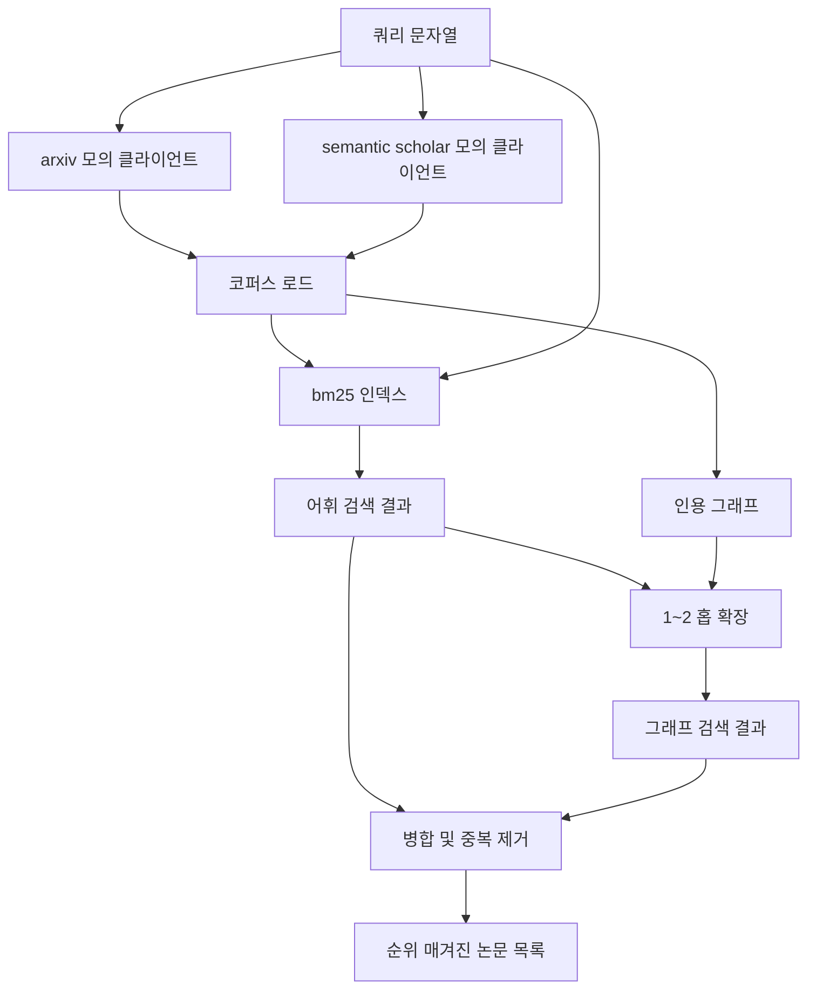

# 문헌 검색

> 가설은 저렴합니다. 누군가가 이미 이를 증명했는지 아는 것이 비싼 부분입니다. 러너가 샌드박스를 시작하기 전에 그 질문에 답하는 검색 계층을 구축해 보세요.

**유형:** Build
**언어:** Python
**선수 요건:** 19단계 A트랙 20-29강
**시간:** 약 90분

## 학습 목표
- 루프가 하류에서 읽는 필드를 포함하는 작은 논문 레코드를 모델링해 보세요.
- 표준 라이브러리 데이터 구조만 사용하여 초록에 대한 BM25 인덱스를 구축해 보세요.
- 인용 그래프를 탐색하여 어휘 검색이 놓친 논문을 찾아보세요.
- 어휘 및 그래프 패스에서의 검색 결과를 안정적인 논문 id로 중복 제거해 보세요.
- 두 개의 모의 외부 API를 단일 클라이언트 뒤에 래핑하여 실제 엔드포인트가 도입될 때 상류 호출 지점이 동일하게 유지되도록 해 보세요.

## 두 개의 검색 패스를 사용하는 이유

초록에 대한 키워드 검색은 쿼리와 어휘를 공유하는 논문을 반환합니다. 이는 대부분의 표면을 커버합니다. 두 가지 경우를 놓칩니다. 첫 번째는 기초 논문이 다른 어휘를 사용하는 경우입니다. 예를 들어 "sparse attention"에 대한 쿼리는 "block selection in transformer routing"이라는 제목의 논문을 놓칩니다. 두 번째는 관련 논문이 알려진 앵커를 인용하는 후속 논문인 경우입니다. 앵커를 찾아 앞으로 탐색하는 것이 초록 풀을 브루트 포스하는 것보다 효율적입니다.

이 강의는 두 패스를 모두 구축합니다. 초록에 대한 BM25는 어휘 검색을 잡습니다. 인용 그래프 탐색은 시드 집합을 한두 홉만큼 앞뒤로 확장합니다. 합집합은 논문 id로 중복 제거되며 작은 결합 점수에 따라 순위가 매겨집니다.

## 논문(Paper)의 형태

```text
Paper
  id          : str           (stable identifier, "p001" for the mock corpus)
  title       : str
  abstract    : str
  year        : int
  authors     : list[str]
  references  : list[str]     (paper ids this paper cites)
  citations   : list[str]     (paper ids that cite this paper)
  source      : str           (which mock api supplied it, "arxiv" or "s2")
```

references 및 citations 필드는 방향성 인용 그래프를 형성합니다. 두 모의 API는 겹치지만 동일하지 않은 필드를 반환하므로 코퍼스 로더는 `id`에서 이를 합집합합니다.

```figure
cg-citation-hops
```

## 아키텍처



검색 클라이언트는 두 단계와 병합을 모두 담당합니다. 호출자는 쿼리를 전달하고, 각 항목이 논문별 점수 필드 (`bm25_score`, `graph_distance`, `recency_score`, `final_score`)를 포함하여 순위를 설명하는 순위 매겨진 목록을 반환받습니다.

## BM25를 처음부터 구현하기

구현은 기본 매개변수 `k1=1.5`, `b=0.75`를 사용하는 표준 Okapi BM25입니다. 인덱스는 `term -> doc_frequency`와 `term -> list of (doc_id, term_count)` 두 개의 사전으로 구성됩니다. 문서 길이는 초록의 토큰 수입니다. 평균 문서 길이는 인덱스 빌드 시 한 번 계산됩니다. 쿼리 포인트수는 쿼리 용어에 대한 `idf * tf_norm`의 합이며, 여기서 `tf_norm`는 표준 BM25 길이 정규화 용어 빈도입니다.

토크나이저는 `lower`을 수행한 후 비알파뉴메릭 문자로 분할합니다. 어간 추출(stemming)은 하지 않습니다. 프로덕션 시스템에서는 작은 어간 추출기를 도입할 수 있습니다. 인터페이스는 동일하게 유지됩니다.

```text
idf(t)      = log((N - df + 0.5) / (df + 0.5) + 1.0)
tf_norm(t)  = (f * (k1 + 1)) / (f + k1 * (1 - b + b * dl / avgdl))
score(d, q) = sum over t in q of idf(t) * tf_norm(t)
```

## 인용 그래프 순회

그래프는 코퍼스에서 한 번 빌드됩니다. 순방향 간선은 논문에서 그 참조로 이어집니다. 역방향 간선은 논문에서 그 인용으로 이어집니다. 순회는 상위 BM25 검색 결과를 시드로 하는 너비 우선 탐색이며, 최대 2홉으로 제한됩니다.

2홉은 의도적으로 설정된 상한입니다. 1홉은 너무 얕으며, 에이전트는 종종 즉각적인 조상이나 후손을 원합니다. 3홉은 연결된 그래프에서 결과 크기를 폭발적으로 증가시키며 주제에서 벗어날 경향이 있습니다. 이 강의에서는 홉 제한을 설정 값으로 노출하여 하위 루프가 이를 조정할 수 있도록 합니다.

## 중복 제거 및 순위 매기기

두 단계는 겹치는 집합을 반환합니다. 병합은 논문 ID를 키로 사용합니다. 각 논문의 최종 점수는 가중치 혼합입니다.

```text
final_score = w_bm25 * bm25_score_norm
            + w_graph * graph_score
            + w_recency * recency_score
```

`bm25_score_norm`는 병합된 집합 내 최대 BM25 점수로 나눈 BM25 점수입니다 (따라서 필드 값은 0에서 1 사이입니다). `graph_score`는 직접적인 어휘 검색인 경우 1, 1홉인 경우 `0.6`, 2홉인 경우 `0.3`이며, 그 외에는 0입니다. `recency_score`는 코퍼스 최소 연도에서 0, 최대 연도에서 1로 선형적으로 증가하는 값입니다.

기본 가중치는 `0.5`, `0.3`, `0.2`입니다. 가중치는 설정 값입니다; 오래된 주제는 최신성 가중치를 낮추고, 빠르게 변화하는 주제는 이를 높일 수 있습니다.

## 목업 코퍼스

코퍼pus는 `build_corpus()`이 생성한 100편의 논문으로 구성됩니다. 각 논문은 어텐션 희소성, 검색 증강, 저랭크 어댑터, 데이터셋 증류, 평가 하네스 중 하나의 주제에 대해 손으로 작성된 제목과 초록을 가지고 있습니다. 참고 문헌과 인용은 각 주제가 몇 개의 주제 간 연결 변을 가진 연결된 하위 그래프를 형성하도록 연결되어 있습니다.

두 개의 모의 API 클라이언트 (`ArxivMockClient`, `SemanticScholarMockClient`)는 동일한 코퍼pus를 읽지만 서로 다른 필드를 노출합니다. Arxiv는 제목, 초록, 연도, 저자를 반환합니다. Semantic Scholar는 참고 문헌과 인용을 추가합니다. 검색 클라이언트는 id에 대해 합집합을 수행하며, 클라이언트 간 필드 불일치 처리는 후속 강의로 미루어집니다.

## 52강과 53강이 읽는 내용

52강의 러너는 실험을 위한 컨텍스트로 `paper.id`, `paper.title` 및 초록의 상위 세 문장을 읽습니다. 53강의 평가기는 `paper.year`와 `paper.references`를 읽어 특정 논문에 대한 기준선을 할당합니다.

검색 클라이언트는 순위 목록과 쿼리별 지표(히트 수, 평균 점수, 최고 점수, 총 벽 시간)를 포함하는 `RetrievalResult`를 반환합니다. 러너는 이를 기록하므로, 후속 관측 가능성 패스에서 시간에 따른 품질을 플롯할 수 있습니다.

## 코드를 읽는 방법

`code/main.py`는 `Paper`, `ArxivMockClient`, `SemanticScholarMockClient`, `BM25Index`, `CitationGraph`, `RetrievalClient` 및 결정론적 데모를 정의합니다. 모의 클라이언트와 코퍼pus는 동일한 파일에 있으므로 강의는 이식성이 유지됩니다. BM25 구현은 하나의 클래스, 60줄입니다. 그래프 순회는 하나의 메서드입니다.

`code/tests/test_retrieval.py`는 어휘 경로, 그래프 경로, 병합, 중복 제거 및 빈 쿼리를 다룹니다.

## 이 내용이 위치하는 곳

50강은 가설을 생성합니다. 51강은 그 가설이 이미 정해져 있는지 확인하기 위해 문헌을 검색합니다. 52강은 정해져 있지 않다면 실험을 실행합니다. 53강은 검색 결과와 실험 지표 모두를 읽어 판정을 작성합니다. 검색 클라이언트는 네 단계 중 가장 저렴하며 오케스트레이터에서 먼저 실행됩니다.
