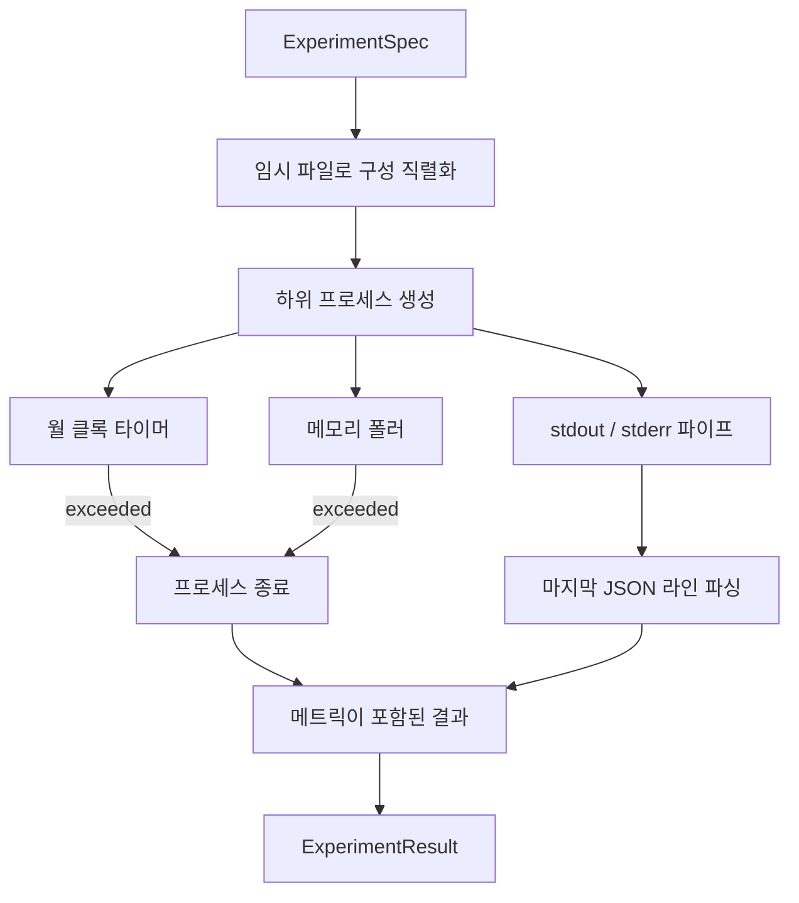

# 실험 실행기

> 루프는 측정의 정확성만큼만 신뢰할 수 있습니다. 스펙을 받아 샌드박스화된 하위 프로세스에서 실행하고, 평가자가 신뢰할 수 있는 json 메트릭 블롭을 방출하는 실행기를 구축해 보세요.

**유형:** Build
**언어:** Python
**선수 요건:** 19단계 트랙 A 20-29강
**시간:** 약 90분

## 학습 목표
- 실행기가 하위 프로세스로 직렬화할 수 있는 타입 지정된 스펙으로 실험을 인코딩하세요.
- 하드 월 클록 타임아웃과 소프트 메모리 상한을 설정하여 하위 프로세스를 실행하고, 두 조건을 모두 종료 조건으로 노출하세요.
- stdout, stderr 및 구조화된 메트릭 블롭을 단일 결과 레코드로 캡처하세요.
- 고정된 기본 스펙에 대해 하나의 구성 매개변수를 한 번에 하나씩 스윕하는 어블레이션 테이블을 구축하세요.
- 시드를 지정하면 모든 결과가 결정적으로 유지되도록 하여, 평가자가 실행 간에 동일한 숫자를 볼 수 있도록 하세요.

## 하위 프로세스를 사용하는 이유

연구 루프는 신뢰할 수 없는 코드를 실행합니다. 가설은 샘플러에서 나왔고, 실험 스크립트도 동일한 경로에서 나왔습니다. 둘 중 하나라도 프로세스 내에서 안전하다고 취급하는 것은 오케스트레이터를 다운시키는 크래시를 자초하는 것입니다. 하위 프로세스는 언어가 제공하는 가장 단순한 격리입니다. 독립적인 프로세스, 독립적인 주소 공간, 부모 측의 시그널 핸들.

여기 있는 실행기는 완전한 샌드박싱을 구현하지 않습니다. cgroup, seccomp 필터, 네임스페이스 재매핑이 없습니다. 있는 것은 월 클록 타임아웃, 메모리 증가를 위한 폴링 루프, 그리고 두 한계 중 하나에 도달하면 프로세스를 종료하는 kill 경로입니다. 이것이 더 정교한 샌드박스가 확장하는 런타임 계약입니다. 이 강의는 한 번에 읽을 수 있을 만큼 계약을 작게 유지합니다.

## ExperimentSpec 형태

```text
ExperimentSpec
  spec_id        : str            (stable id, "exp_001")
  hypothesis_id  : int            (link back to the queue from 50강)
  script_path    : str            (path to the python script to run)
  config         : dict           (passed to the script as one json arg)
  seed           : int            (deterministic seed for the experiment)
  wall_timeout_s : float          (hard timeout, killed on exceed)
  memory_cap_mb  : int            (soft cap, polled; killed on exceed)
  metric_keys    : list[str]      (which fields the evaluator will read)
```

스크립트는 디스크에 있습니다. 실행기는 스크립트가 읽는 임시 파일 경로에 구성을 씁니다. 스크립트는 stdout에 단일 json 라인을 출력해야 하며, 그 키는 `metric_keys`의 상위 집합이어야 합니다. stdout의 다른 내용은 캡처되지만 메트릭 파서에서는 무시됩니다.

```figure
cg-runner-limits
```

## 아키텍처



러너는 하나의 클래스와 하나의 main 메서드로 구성됩니다. 폴러는 폴링 간격마다 한 번 깨어나는 작은 스레드이며, `psutil`에 해당하는 값을 proc 파일 시스템에서 가용할 때 읽고, 플랫폼이 이를 노출하지 않는 경우 no op로 대체합니다.

## 소프트 메모리 상한을 사용하는 이유

하드 메모리 상한은 `resource.setrlimit`이 필요하며 POSIX에서만 작동합니다. 이 강의는 이식성 있는 접근법을 제공합니다: 플랫폼에서 resident set size를 폴링하고, 상한을 초과하면 하위 프로세스를 종료합니다. 상한이 소프트인 이유는 폴러의 간격이 0이 아니기 때문입니다; 프로세스는 폴링 사이에 상한을 초과했다가 다시 떨어질 수 있습니다. 러너는 최대 관측 RSS를 기록하므로 평가자는 실행이 한도에 얼마나 근접했는지 확인할 수 있습니다.

프로세스 검사 지원이 없는 시스템에서는 폴러가 한 번만 경고 로그를 남기고 스스로 비활성화됩니다. 월 클록 타임아웃은 여전히 적용됩니다. 강의 테스트는 두 경로 모두를 커버합니다.

## stdout와 stderr 캡처

러너는 완료 시 배수된 두 파이프를 모두 읽습니다. stdout는 라인별로 스캔되며, 모든 필수 `metric_keys`을 포함하여 JSON으로 파싱되는 마지막 라인이 메트릭 블롭으로 채택됩니다. 이전 JSON 라인은 `intermediate_metrics`으로 결과에 유지되며, 평가자는 이를 학습 곡선에 사용할 수 있습니다.

stderr는 그대로 결과에 캡처됩니다. 러너는 비 0 종료 코드에서 예외를 발생시키지 않으며, 대신 코드를 결과에 기록합니다. 스크립트가 메트릭을 출력했더라도 모든 비 0 종료는 `"crash"`으로 표시되므로, 평가자는 부분 실행을 기본적으로 실패로 취급합니다.

## 애블레이션 표

```python
def ablate(base: ExperimentSpec, knob: str, values: list[Any]) -> list[ExperimentSpec]:
    ...
```

기본 사양과 노브 이름이 주어지면, 헬퍼는 `config[knob]`이 재정의된 사양을 값마다 하나씩 반환합니다. 각 사양은 파생된 `spec_id` (`f"{base.spec_id}_{knob}_{value}"`)를 가집니다. 러너는 이를 순서대로 실행하고 노브 값을 키로 하는 `AblationTable`를 반환하는 `AblationRunner`을 제공합니다.

한 번에 하나의 노브만 변경하는 이유. 전체 팩토리얼 스윕는 지수적으로 폭발하며 평가자가 해석할 수 없는 결과를 생성합니다. 한 번에 하나의 노브만 변경하면 평가자가 플롯할 수 있는 깔끔한 축이 생성됩니다. 이 강의는 다중 노브 스윕을 호출자가 구성하는 반복적인 단일 노브 애블레이션으로만 지원합니다.

## 결정성

모든 스펙은 시드(seed)를 포함합니다. 러너는 시드를 config dict (`config["__seed"] = spec.seed`)를 통해 스크립트로 전달합니다. `code/experiments/`의 목(mock) 실험 스크립트는 시드를 존중하며 실행 간에 동일한 메트릭을 생성합니다. 53강의 평가자는 이 결정성에 의존합니다. 결정성이 없다면 "회귀(regression)"는 단순한 다른 랜덤 초기화일 수 있습니다.

## 목(mock) 실험 스크립트

이 강의는 하나의 실험 스크립트를 제공합니다: `code/experiments/sparsity_experiment.py`. 이는 config 파일을 읽고, numpy 랜덤 패스를 통해 작은 훈련 실행을 시뮬레이션하며, json 메트릭 블록을 출력하는 실제 스크립트입니다. 이 스크립트는 시간 초과(timeout) 테스트를 위한 `sleep_s` 옵션과 메모리 폴러(memory poller) 테스트를 위한 `allocate_mb` 옵션을 존중합니다.

시뮬레이션은 실제 훈련을 수행하지 않습니다. 훈련 루프의 형태를 모방하는 수치 계산일 뿐입니다: 손실 곡선, 최종 퍼플렉시티(perplexity), 벽 시간(wall time) 등입니다. 강의의 핵심은 러너이지 시뮬레이션이 아닙니다. 실제 실험 스크립트라면 모델을 import할 것입니다.

## 결과 형태

```text
ExperimentResult
  spec_id              : str
  hypothesis_id        : int
  exit_code            : int
  terminal             : "ok" | "timeout" | "oom" | "crash"
  wall_time_s          : float
  peak_rss_mb          : float | None
  metrics              : dict
  intermediate_metrics : list[dict]
  stdout_tail          : str
  stderr_tail          : str
```

평가자는 먼저 `metrics`과 `terminal`을 읽습니다. terminal이 `"ok"`가 아닌 경우, 실험은 실패한 실행으로 간주되며 평가자의 판정은 자동입니다. 그렇지 않으면 메트릭은 유의성 테스트(significance test)를 통과합니다.

## 코드 읽는 방법

`code/main.py`는 `ExperimentSpec`, `ExperimentResult`, `ExperimentRunner`, `AblationRunner` 및 결정적인 데모를 정의합니다. 서브프로세스(subprocess) 관리는 하나의 클래스입니다. 메모리 폴러는 작은 스레드입니다. 어블레이션(ablation) 헬퍼는 단일 함수입니다.

`code/experiments/sparsity_experiment.py`는 테스트에서 사용되는 목(mock) 실험입니다. argv에서 config 파일 경로를 읽고, 완료 시 단일 json 메트릭 라인을 작성합니다.

`code/tests/test_runner.py`는 성공 경로, 시간 초과 경로, 크래시 경로, 어블레이션(ablation) 표, 그리고 두 실행에 걸친 결정성 체크를 다룹니다.

## 이 강의의 위치

50강은 가설을 생성합니다. 51강은 문헌에서 이미 해결된 모든 것을 필터링합니다. 52강은 남은 것에 대해 실험을 실행합니다. 53강은 결과를 읽고, 유의성 테스트를 실행하며, 오케스트레이터(orchestrator)가 가설 id에 저장하는 판정을 작성합니다.
