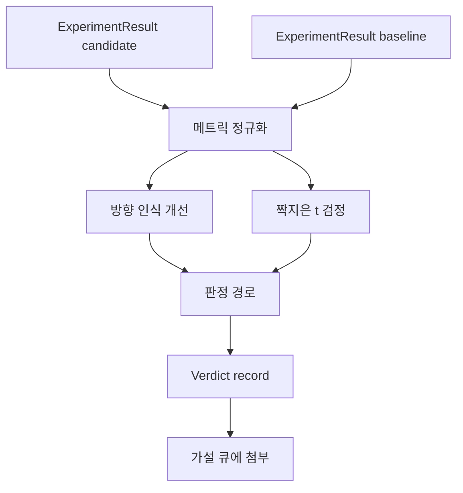

# 결과 평가기

> 러너가 숫자를 생성했습니다. 평가기는 그 숫자가 개선인지, 퇴보인지, 아니면 잡음인지 결정합니다. 메트릭을 한 줄 결론으로 변환하는 판정 경로를 구축해 보세요.

**유형:** Build
**언어:** Python
**선수 요건:** 19단계 트랙 A 20-29강
**시간:** 약 90분

## 학습 목표
- 방향 인식 개선 및 고정 임계값을 사용하여 후보 실행을 기준선과 비교합니다.
- 시드별 메트릭에 대해 처음부터 짝을 이룬 t 검정을 실행하고 resulting p 값(결과 p 값)을 읽어 보세요.
- 로그 스케일 메트릭을 정규화하여 downstream report(후속 보고서)가 이를 선형 메트릭과 혼합할 수 있도록 합니다.
- 50강의 큐에 첨부할 수 있는 가설별 판정을 출력합니다.
- 모든 단계를 순수하게 유지하여 동일한 입력이 항상 동일한 판정을 생성하도록 합니다.

## 왜 짝을 이룬 검정인가

러너가 생성한 단일 숫자만으로는 변경이 실제인지 알 수 없습니다. 동일한 구성에서 다른 시드를 사용하면 다른 퍼플렉시티(perplexity)가 나옵니다. 변경이 잡음일 수도 있습니다. 올바른 비교는 짝을 이루는 것입니다. 동일한 시드와 동일한 데이터를 사용하여 후보와 기준선으로 각각 한 번씩 실행합니다. 각 시드는 차이를 기여합니다. 이러한 차이의 평균이 효과입니다. 이러한 차이의 표준 오차가 잡음 바닥입니다.

이 강의는 검정을 처음부터 구현합니다. `scipy.stats`는 없습니다. 수학은 한 화면으로 읽을 수 있을 만큼 작습니다.

```text
diffs    = [a_i - b_i for i in seeds]
mean     = sum(diffs) / n
variance = sum((d - mean) ** 2 for d in diffs) / (n - 1)
t_stat   = mean / sqrt(variance / n)
df       = n - 1
p_value  = two_sided_p(t_stat, df)
```

양측 p 값은 정규화된 불완전 베타 함수를 사용합니다. 강의는 Lentz 연속 분수를 사용하는 작은 구현을 제공합니다. 전체는 stdlib math의 60줄입니다.

## 방향 인식 개선

일부 메트릭은 상승할 때 개선됩니다(정확도, 처리량). 다른 메트릭은 하락할 때 개선됩니다(손실, 퍼플렉시티, 벽 시간). 평가기는 각 메트릭에 `direction` 필드를 포함합니다.

```text
if direction == "higher_is_better":
    improvement = (candidate - baseline) / abs(baseline)
elif direction == "lower_is_better":
    improvement = (baseline - candidate) / abs(baseline)
```

개선은 부호화됩니다. 높을수록 좋은 메트릭에 대한 음의 개선은 후보가 더 나쁘다는 의미입니다. 판정 경로는 부호와 크기를 함께 읽습니다.

평탄한 임계값(`improvement_threshold=0.02`, 2퍼센트)은 변경 사항이 호출할 만큼 큰지 결정합니다. 그 아래에서는 p 값에 관계없이 판정이 "잡음"입니다. 루프는 사용자가 측정할 수 없는 변경 사항에는 관심이 없습니다.

```figure
cg-paired-verdict
```

## 아키텍처



평가기는 세 개의 독립적인 연산을 실행하고 판정 경로에서 이를 결합합니다. 각 연산은 공유 상태가 없는 순수 함수입니다.

## 로그 정규화

퍼플렉시티는 손실의 지수 함수입니다. 손실이 0.1 감소하면 퍼플렉시티는 훨씬 더 크게 감소합니다. 두 구성 간 퍼플렉시티를 직접 비교하는 것은 문제없지만, 단일 보고서에서 선형 메트릭과 혼합하려면 정규화가 필요합니다.

이 강의는 `scale` 필드가 `"log"`인 모든 메트릭에 대해 개선 값을 계산하기 전에 자연 로그를 취하여 정규화합니다. 임계값은 로그 공간에서 적용됩니다. 퍼플렉시티가 32에서 28로 감소하는 것은 lower is better 메트릭에서 `log(28) - log(32) = -0.133`이며, 이는 2퍼센트 임계값보다 훨씬 높습니다.

```text
if scale == "log":
    a = log(candidate)
    b = log(baseline)
else:
    a = candidate
    b = baseline
```

`scale="linear"` (기본값)인 메트릭은 변환을 건너뜁니다. 동일한 코드 경로가 두 경우 모두를 처리합니다.

## 시드별 짝지은 검정

52강의 러너는 실행당 하나의 최종 메트릭 블롭을 방출합니다. 짝지은 검정을 위해 평가기는 후보에 대해 시드당 하나의 블롭과 기준선에 대해 시드당 하나의 블롭이 필요합니다. 오케스트레이터는 시드 목록에 걸쳐 두 구성 모두에서 동일한 실험을 실행하고, 평가기에 `ExperimentResult` 레코드 두 목록을 전달합니다.

평가기는 시드(시드는 `result.metrics["seed"]`에 위치)에 따라 이를 짝지우고 요청된 메트릭을 순회합니다. 두 목록에서 시드가 일치하지 않으면 평가기는 `PairingError`을 발생시킵니다. 오케스트레이터는 재실행해야 합니다.

## Verdict 형식

```text
Verdict
  hypothesis_id          : int
  metric                 : str
  direction              : "higher_is_better" | "lower_is_better"
  scale                  : "linear" | "log"
  candidate_mean         : float
  baseline_mean          : float
  improvement            : float       (signed, fraction; see direction rules)
  p_value                : float | None  (None if n < 2)
  significance_threshold : float
  improvement_threshold  : float
  verdict                : "improved" | "regressed" | "noise" | "failed"
  rationale              : str
```

판정 경로는 작은 의사결정 표입니다:

```text
1. If any candidate result has terminal != "ok": verdict = "failed"
2. else if |improvement| < improvement_threshold:  verdict = "noise"
3. else if p_value is None or p_value > significance: verdict = "noise"
4. else if improvement > 0:                          verdict = "improved"
5. else:                                             verdict = "regressed"
```

Rationale은 오케스트레이터가 가설 id에 대해 기록할 수 있는 한 줄의 사람이 읽기 쉬운 문장입니다.

## 코드를 읽는 방법

`code/main.py`는 `MetricSpec`, `Verdict`, `Evaluator`, t 통계량 및 불완전 베타 헬퍼, 그리고 결정론적 데모를 정의합니다. t 검정은 순수 stdlib math로 구현되어 있으며, numpy는 지표 목록을 읽고 평균과 분산을 계산하는 데만 사용됩니다.

`code/tests/test_evaluator.py`는 개선된 경로, 후퇴한 경로, 잡음 경로(소폭 개선), 잡음 경로(낮은 n), 실패한 종단 경로, 로그 정규화 경로, 알려진 참조 값에 대한 t 검정, 그리고 페어링 오류를 다룹니다.

## 이 내용이 위치하는 곳

50강은 가설 큐를 생성했습니다. 51강은 문헌에서 이미 결론이 난 항목들을 필터링했습니다. 52강은 후보 및 기본 구성을 시드별로 실험했습니다. 53강은 이러한 실행 결과를 읽고 판정을 작성합니다. 오케스트레이터는 이 네 가지를 연결합니다:

```text
for hypothesis in queue:
    literature = retrieval.search(hypothesis.text)
    if literature_settles(hypothesis, literature):
        attach(hypothesis, verdict="settled")
        continue
    candidates = runner.run_all(specs_for(hypothesis))
    baselines  = runner.run_all(baseline_specs_for(hypothesis))
    metric_spec = MetricSpec("perplexity", direction=LOWER, scale=LOG)
    verdict = evaluator.evaluate(hypothesis.id, metric_spec, candidates, baselines)
    attach(hypothesis, verdict)
```

이 오케스트레이터는 이 강에 포함되어 있지 않으며, 네 개의 강의는 각자가 정의한 데이터 클래스(dataclass) 외에는 추가적인 연결 요소 없이 서로 결합됩니다.
