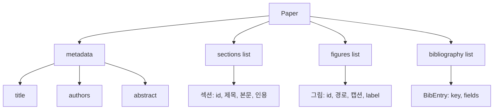
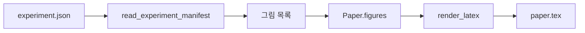
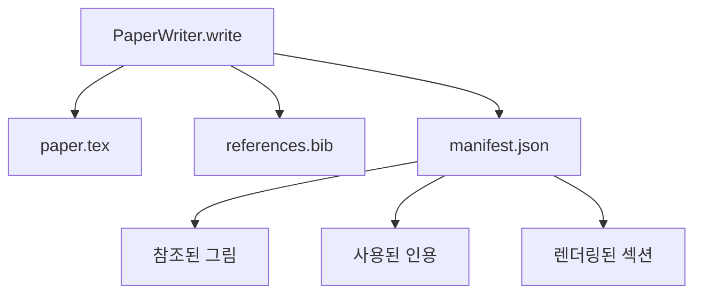

# 논문 작성자

> LaTeX 골격은 연구자와 조판자 간의 계약입니다. 계약이 깨지면 문서가 컴파일되지 않으며, 실패는 명확하게 드러납니다. 먼저 골격을 구축한 후 내용을 채워 넣으세요.

**유형:** Build
**언어:** Python
**선수 요건:** 19단계 50-53강
**시간:** 약 90분

## 학습 목표

- 연구 논문을 자유 형식 문서가 아닌, 알려진 섹션 그래프를 가진 구조화된 산출물로 취급하세요.
- 문장을 작성하기 전에 초록, 섹션, 그림 슬롯, 참고문헌 키를 선언하는 LaTeX 골격을 생성하세요.
- 실험 출력(경로 및 캡션)에서 그림을 골격에 결정적인 슬롯 메커니즘을 통해 주입하세요.
- 구조화된 개요에서 각 섹션을 채우는 목(mocked) 문장 생성기를 연결하여, 모델 없이도 하네스를 테스트할 수 있도록 하세요.
- 참조된 모든 그림과 사용된 모든 인용을 나열한 매니페스트와 함께 `paper.tex` 및 `references.bib`을 방출하세요.

```figure
ch-paper-skeleton
```

## 왜 골격을 먼저 구축해야 하는가

문장으로 시작하는 초안은 구조적 부채를 누적합니다. 도입부에 관련 연구에 속해야 할 세 단락이 자라납니다. 그림이 정의되기 전에 참조됩니다. 참고문헌은 같은 논문에 대해 세 개의 키를 갖게 됩니다. 저자가 알아챌 때쯤에는, 재작성 비용이 작성 비용보다 높아집니다.

골격은 이를 뒤집습니다. 구조는 데이터로 미리 선언됩니다. 섹션은 이름과 순서를 가진 슬롯입니다. 그림은 id와 캡션을 가진 슬롯입니다. 참고문헌 키는 가리키는 항목과 함께 상단에 선언됩니다. 문장은 그 슬롯에 하나씩 생성됩니다. 하네스는 문장이 작성되기 전에, 모든 그림이 슬롯을 가지고, 모든 인용이 항목을 가지고, 모든 섹션이 목차에 나타남을 검증할 수 있습니다.

이것은 이전 강의에서 계획, 도구 호출, 추적에 적용한 것과 동일한 규율입니다. 구조가 계약입니다.

## 논문(Paper)의 형태



모든 필드는 순수한 Python 데이터입니다. 렌더러는 `Paper`에서 LaTeX 문자열로 변환하는 순수 함수입니다. 하네스는 렌더링 전에 논문을 내장 검사할 수 있습니다: 섹션 수를 세고, 누락된 그림 파일을 나열하며, 모든 `\cite{key}`에 대응하는 `BibEntry`가 있는지 확인합니다.

## 렌더링 계약

렌더러는 세 가지 속성을 보장합니다. 첫째, 스켈레톤의 모든 그림 슬롯은 `fig:<id>` 형태의 안정적 라벨을 가진 `\begin{figure}` 블록을 생성합니다. 둘째, 모든 섹션은 `sec:<id>` 형태의 안정적 라벨을 가진 `\section{}`를 생성하여 상호 참조가 작동하도록 합니다. 셋째, 참고 문헌은 `references.bib`가 논문에 선언된 항목을 정확히 포함하는 `\bibliography` 블록을 생성합니다. 더 많지도, 더 적지도 않습니다.

이 중 하나라도 위반하면 경고가 아닌 렌더링 오류입니다. 스켈레톤이 계약이며, 그림을 조용히 삭제하는 렌더링은 계약 위반입니다.

## 실험에서의 그림 주입

이 트랙의 이전 강의에서는 실험 출력물을 JSON 매니페스트로 생성했습니다. 각 매니페스트는 경로와 짧은 캡션을 가진 아티팩트 목록을 포함합니다. 논문 작성자는 그 매니페스트를 읽고 `Figure` 레코드를 생성합니다.



주입은 결정적입니다. 그림 ID는 실험 이름과 단조 증가하는 카운터에서 파생됩니다. 캡션은 매니페스트에서 가져옵니다. 경로는 논문의 출력 디렉터리에 대해 정규화되므로, 실험 출력물이 디스크의 다른 위치에 있더라도 LaTeX가 컴파일됩니다.

## 모의 산문 생성기

이 강의는 모델을 호출하지 않습니다. `MockProseGenerator`이 아웃라인 형태를 읽고 산문을 결정적으로 생성합니다. 아웃라인 형태는 섹션당 짧은 문자열 하나입니다. 생성기는 그 문자열을 섹션 제목이 포함된 두 개의 짧은 단락으로 확장합니다. 생성된 산문은 아웃라인이 선언한 그림과 인용을 정확히 언급합니다.

이것은 작성자의 모든 동작을 테스트하기에 충분합니다. 실제 구현에서는 생성기를 모델 호출로 교체할 것입니다. 주변 하네스는 변하지 않습니다. 산문 생성기를 호출 가능한 객체로 선언하는 것의 가치입니다. 테스트는 결정적인 생성기를 사용하며, 프로덕션은 모델 생성기를 사용하며, 파이프라인의 나머지는 동일합니다.

## 매니페스트 출력

writer는 출력 디렉토리에 세 개의 파일을 생성합니다.



매니페스트는 다운스트림 평가자나 비평 루프가 읽는 대상입니다. LaTeX를 파싱하지 않고 매니페스트를 읽습니다. 다음 강의인 비평 루프는 이 매니페스트를 입력으로 받아 피드백 목록을 생성합니다. 그래서 매니페스트는 계약의 일부이며 LaTeX는 계약의 일부가 아닙니다.

## 검증 게이트

writer는 파일을 쓰기 전에 네 개의 게이트를 실행합니다.

1. 모든 그림 id는 논문 내에서 고유해야 합니다.
2. 각 섹션의 `cites` 필드는 논문에서 선언된 참고문헌 키를 참조해야 합니다.
3. 초록은 비어 있지 않아야 합니다.
4. 제목은 비어 있지 않아야 합니다.

게이트가 실패하면 `PaperValidationError`가 정확한 이유와 함께 발생합니다. 하네스는 이 이유를 실패 모드로서 표시합니다. 부분적인 쓰기는 없습니다. 세 개의 파일이 모두 생성되거나, 하나도 생성되지 않습니다.

## 코드 읽는 방법

`code/main.py`는 `Paper`, `Section`, `Figure`, `BibEntry`, `PaperValidationError`, `MockProseGenerator`, `PaperWriter` 및 `render_latex` 함수를 정의합니다. `write` 메서드는 출력 디렉토리를 받아 `paper.tex`, `references.bib`, `manifest.json`를 생성합니다. `read_experiment_manifest` 헬퍼는 실험 매니페스트 목록을 `Figure` 레코드로 변환합니다.

`code/tests/test_paper_writer.py`는 다음을 포함합니다: 섹션이 없는 스켈레톤 렌더링, 두 개의 섹션과 두 개의 그림을 포함한 전체 렌더링, 인용 누락 게이트, 그림 id 중복 게이트, 매니페스트 내용, 그리고 LaTeX 문자열 계약 (각 섹션은 `\section{}`를, 각 그림은 `\begin{figure}`를 생성합니다).

## 더 나아가기

실제 구현에서 원하는 두 가지 확장. 첫째, 다중 형식 렌더링: 동일한 `Paper` 형태는 블로그용 Markdown과 미리보기용 HTML로 컴파일됩니다. 렌더러는 `Paper`에 대한 전략이 됩니다. 둘째, 인용 보강: writer는 DOI의 로컬 캐시를 받아 인용 키에서 BibTeX 항목을 가져옵니다. 둘 다 가치를 더하며, 둘 다 스켈레톤 계약을 건드리지 않고 추가할 수 있습니다.

스켈레톤은 베팅입니다. 섹션, 그림, 인용은 데이터로 선언되고, 산문은 슬롯에 생성되며, 매니페스트는 LaTeX와 함께 생성됩니다. 모든 다른 개선은 그 위에 조합됩니다.
