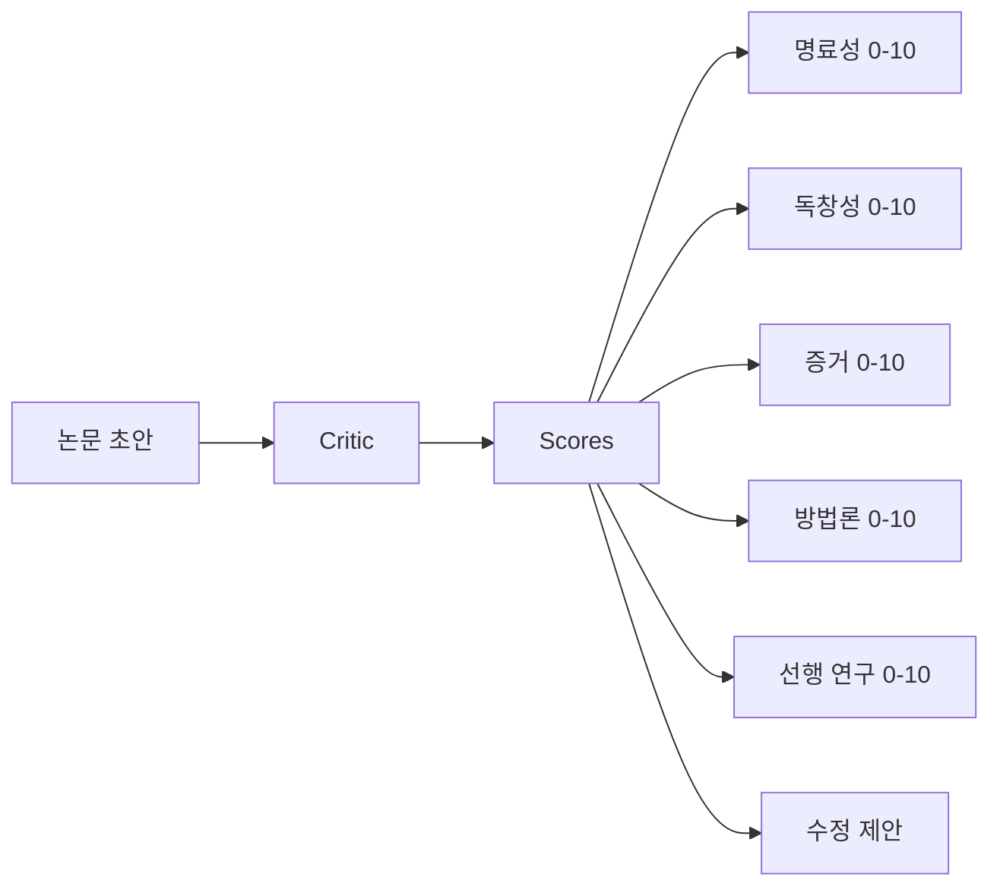
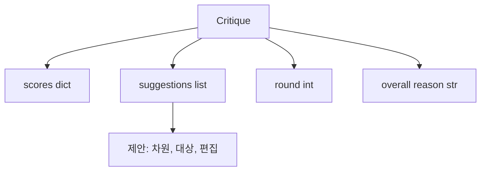
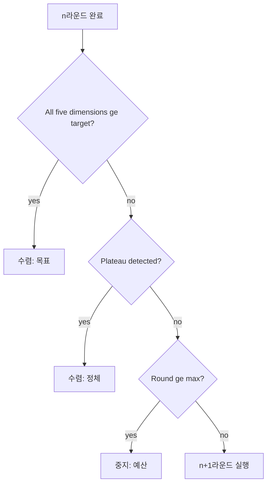
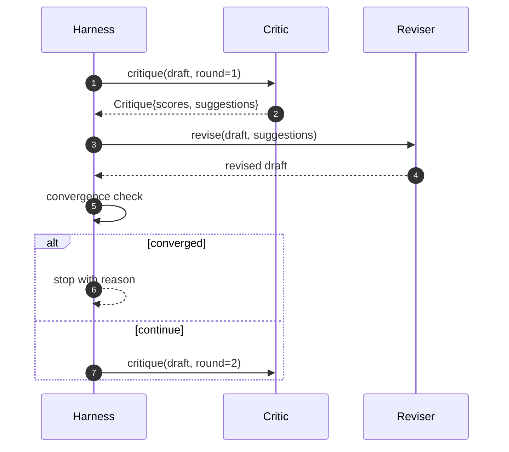

# 비평 루프

> 첫 번째 시도에서 "괜찮다"를 반환하는 비평가는 고장 난 것입니다. 항상 "작업이 필요하다"를 반환하는 비평가도 고장 난 것입니다. 흥미로운 비평가는 수렴하는 비평가이며, 수렴을 설계해야 합니다.

**유형:** Build
**언어:** Python
**선수 요건:** 19단계 50-53강
**시간:** 약 90분

## 학습 목표

- 명료성, 독창성, 증거, 방법론, 선행 연구의 다섯 가지 고정된 차원에서 논문 초안을 채점합니다.
- 각 라운드의 비평을 자유 형식의 재작성이 아닌 구조화된 수정 차이(diff)로 적용합니다.
- 라운드를 비교하여 점수를 통해 수렴을 감지합니다. 평탄화, 목표 달성, 예산 소진 시에 중지합니다.
- 수렴하지 않는 비평가가 무한히 실행되지 않도록 최대 반복 횟수 예산으로 라운드를 제한합니다.
- 대시보드나 다음 단계가 점수 궤적을 렌더링할 수 있도록 라운드별 추적을 방출합니다.

```figure
ch-critic-converge
```

## 다섯 가지 고정 차원을 사용하는 이유

자유 형식 비평가는 제안 문단을 반환하는 모델입니다. 다음 라운드의 수정은 이 문단을 주변 컨텍스트로 취급합니다. 비평이 구조를 갖지 않았기 때문에 재작성이 비평을 다루는지 검증할 수 없습니다.

다섯 가지 차원은 하네스에 계약을 제공합니다.



점수는 벡터입니다. 하네스는 라운드 전체에서 각 차원을 모니터링합니다. 명료성을 높이지만 증거를 떨어뜨리는 수정은 증거에 대한 후퇴이며, 수렴 체크가 이를 감지합니다. 모델 전용 비평가는 이러한 보장을 제공할 수 없습니다.

## 비평(Critique)의 형태



각 제안은 개선하는 차원, 대상 섹션, 그리고 수정자가 적용할 `edit` 지침을 포함합니다. 수정자도 호출 가능한 객체입니다. 이 강의는 편집 지침을 섹션에 추가하는 연산으로 해석하는 결정론적 수정자를 제공합니다. 모델 기반 수정자는 동일한 필드를 프롬프트로 해석할 것입니다. 계약은 변하지 않습니다.

## 수렴 규칙, 순서대로

비평가 루프는 세 가지 조건 중 하나가 발생하면 종료됩니다.



목표는 가장 엄격한 경우입니다: 다섯 가지 차원(명확성, 독창성, 증거, 방법론, 관련 연구) 모두 루프가 성공을 반환하기 전에 `>= target_score` (기본값 `8.0`)에 도달해야 합니다. 평균 점수가 높더라도 한 차원이 약하면 충분하지 않습니다. 정체 감지는 현재 라운드의 평균을 이전 라운드의 평균과 비교합니다. 개선 폭이 `plateau_epsilon` (기본값 `0.1`) 미만인 상태가 두 라운드 연속으로 지속되면, 루프는 `plateau`로 종료합니다. 예산은 라운드 수의 상한선(기본값 `5`)이며 `budget`로 종료합니다.

순서가 중요합니다. 목표가 정체보다 우선하고, 정체가 예산보다 우선합니다. 세 번째 라운드가 정체 조건을 충족하는 것과 동시에 목표에 도달하면, 결과는 `target`가 되며 `plateau`가 아닙니다.

## 정체 감지가 두 라운드에 걸쳐 실행되는 이유

한 라운드의 정체는 잡음입니다. 결정론적 점수 매기는 적용된 제안과 순서에 따라 달라지므로, 고정된 초안에서도 매 반복마다 비평가는 약간 다른 점수를 반환합니다. 두 라운드 연속으로 정체를 요구하면 이러한 잡음을 걸러낼 수 있습니다. 하네스가 정체를 보고하면 초안은 실제로 개선이 멈춘 것입니다.

## 이 강의의 결정론적 비평가

이 강의는 모델을 호출하지 않습니다. 제공된 비평가는 세 가지 신호를 바탕으로 초안을 점수 매기는 호출 가능한 객체입니다: 평균 섹션 본문 길이(명확성), 그림 수 및 인용 수(증거), 그리고 논문 메타데이터의 `originality_tag` 필드(독창성). 수정자는 각 점수를 높이는 방법을 알고 있습니다.

```text
clarity      grows when the average section body length increases
novelty      grows when originality_tag is set to "high"
evidence     grows when a section's figure_refs is non-empty
methodology  grows when a section titled "Method" exists with body
related-work grows when a section titled "Related Work" exists with body
```

수정자는 각 제안을 targeted append로 해석합니다. 1라운드 이후 하네스는 점수가 상승하는 것을 관찰할 수 있습니다. 테스트는 이 속성을 사용하여 루프가 격차를 줄인다고 주장합니다.

## 전체 루프 계약



하네스는 라운드 카운터, 추적(trace), 수렴 검사를 소유합니다. 비평가(critic)는 점수를 소유합니다. 수정자(reviser)는 diff를 소유합니다. 세 구성 요소 중 어느 것도 다른 구성 요소의 상태에 접근하지 않습니다.

## 추적(trace) 출력

각 라운드는 라운드 번호, 점수 벡터, 제안 수, 수렴 판정을 포함하는 하나의 추적 이벤트를 방출합니다. 전체 추적은 최종 초안과 함께 반환됩니다. 다운스트림 대시보드는 라운드별 점수 차트를 렌더링할 수 있습니다. 다음 강의인 반복 스케줄러는 추적을 읽어 해당 브랜치를 유지할 가치가 있는지 결정합니다.

## 나쁜 비평가로부터 보호하는 예산

점수를 개선하지 않는 제안을 생성하는 비평가는 루프를 최대 반복 상한에 고정시킵니다. 추적은 이를 가시화합니다: 5라운드, 점수 평평(flat), 판정 `budget`. 사용자는 이를 초안 버그가 아닌 비평가 버그로 읽습니다. 최종 초안만 노출하는 대안은 진단을 숨깁니다. 추적 우선 설계는 이를 드러냅니다.

## 코드 읽는 방법

`code/main.py`는 `Critique`, `Suggestion` 프로토콜, `Critic` 프로토콜, `Reviser`, `CriticLoop` 및 결정적 비평가와 일치하는 수정자를 반환하는 `make_deterministic_critic_pair` 팩토리를 정의합니다. 강의가 독립적으로 서도록 최소한의 `Paper` 형태가 포함되어 있습니다.

`code/tests/test_critic_loop.py`는 다음을 포함합니다: 1라운드 이후의 단조(monotone) 개선, 조정된 초안에서의 목표 수렴, 두 라운드 평평(flat) 후의 플래토(plateau) 감지, 제안이 개선되지 않을 때의 예산 고갈, 수정자에 의한 제안 적용, 추적(trace) 형태.

## 더 나아가기

실제 구현이 원할 두 가지 확장. 첫째, 차원 가중치: 워크숍용 논문은 방법론보다 독창성(novelty)에 더 높은 가중치를 부여하며, 저널은 그 역순으로 가중치를 부여합니다. 수렴 검사는 가중 평균이 됩니다. 둘째, 쌍을 이루는 비평가: 한 비평가가 점수를 매기고, 두 번째 비평가가 수정자가 보기 전에 제안을 판정합니다. 둘 다 가치를 더하며, 둘 다 동일한 `Critique` 형태 위에서 구성(compose)됩니다.

베팅은 점수 벡터입니다. 비평이 구조화되면, 수렴 규칙, 대시보드, 쌍을 이루는 비평가 등 다른 모든 개선 사항이 루프를 변경하지 않고 추가됩니다.
