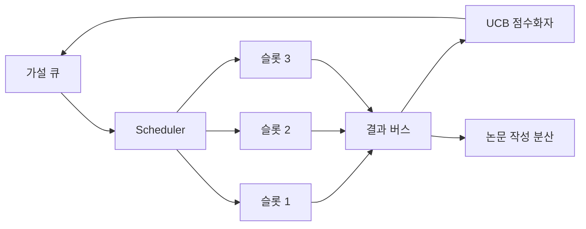
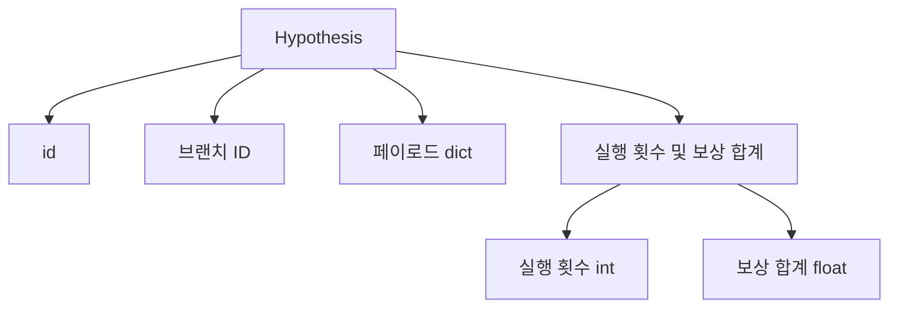
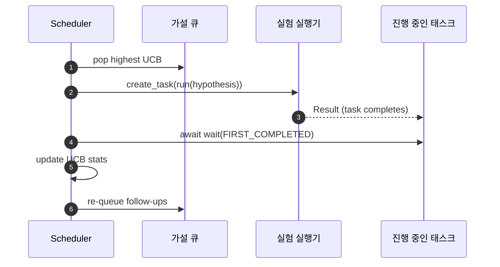

# 반복 스케줄러

> 스케줄러가 없는 연구 루프는 환상에 빠진 큐일 뿐입니다. 스케줄러는 루프가 탐색을 어디에서 멈출지 결정하는 곳이며, 그 결정이 게임의 전부입니다.

**유형:** Build
**언어:** Python
**선수 요건:** 19단계 50-53강
**시간:** 약 90분

## 학습 목표

- 연구 워크플로우를 병렬 실험 슬롯에 공급되며 결과가 다시 유입되는 가설 큐로 모델링해 보세요.
- asyncio를 사용하여 여러 실험을 동시에 실행해 모든 슬롯이 바쁘게 유지되도록 스케줄러가 관리할 수 있게 해 보세요.
- UCB로 각 가설 분기를 점수화하여, 탐색을 포기하지 않으면서 저수익 분기를 가지치기할 수 있도록 해 보세요.
- 완료된 결과를 논문 작성 단계와 재큐잉 단계로 분산하여, 고수익 분기가 후속 가설을 생성하도록 해 보세요.
- 분기 점수, 슬롯 점유율, 가지치기 결정을 포함한 반복별 추적을 표시해 보세요.

```figure
ch-ucb-scheduler
```

## 왜 작업 목록이 아닌 스케줄러인가

평면 작업 목록은 제출 순서대로 작업을 실행합니다. 각 작업이 독립적일 때는 이것이 적합합니다. 연구는 독립적이지 않습니다: 세 번째 실험의 발견이 네 번째와 다섯 번째 실험의 우선순위를 변경합니다. 결과 유입을 읽고 큐를 재순서화하는 스케줄러는 단위 컴퓨팅당 더 유용한 작업을 수행합니다.

흥미로운 설계 선택은 점수화 규칙입니다. 탐욕적 점수화자는 항상 현재 선두를 선택하며 탐색하지 않습니다. 균일 점수화자는 절대 활용하지 않습니다. UCB (상한 신뢰 구간)는 중간 경로입니다: 선두를 활용하면서 덜 시도된 분기를 위해 용량을 예약합니다.

## 시스템 형태



큐는 가설을 보관합니다. 스케줄러는 슬롯이 비면 가장 높은 UCB 가설을 선택합니다. 각 슬롯은 실험을 비동기적으로 실행합니다. 완료된 실험은 결과를 버스에 분산합니다. 버스는 원천 분기의 UCB 통계를 업데이트하고, 분기의 수익이 임계값을 넘으면 논문 작성 단계로 분산합니다.

## 가설의 형태



`branch`는 UCB 통계의 키입니다. 여러 가설이 하나의 브랜치를 공유할 수 있습니다 (브랜치는 연구 방향이며, 가설은 그 안의 한 번의 시도입니다). `runs`는 해당 브랜치에 대해 완료된 실험의 횟수이며, `reward_sum`는 누적된 보상입니다. UCB는 이 두 값을 모두 읽습니다.

## UCB 점수 매기기

이 강의에서 사용된 UCB 공식은 고전적인 UCB1입니다.

```text
ucb(branch) = mean_reward(branch) + c * sqrt( ln(total_runs) / runs(branch) )
```

`total_runs`는 모든 브랜치에 걸쳐 완료된 모든 실험의 횟수입니다. `c`는 탐색 가중치이며, 강의의 기본값은 `sqrt(2)`입니다. 실행 횟수가 0인 브랜치는 `+inf`을 받으므로, 시도되지 않은 브랜치는 항상 먼저 스케줄링됩니다. 평균 보상이 높은 브랜치는 다른 브랜치들이 따라잡을 때까지 높은 점수를 유지합니다. 많은 횟수를 실행했지만 보상이 낮은 브랜치는 실행 횟수가 적은 대안들에 의해 가려집니다.

가지치기 게이트는 선택기와 분리되어 있습니다. 가지치기는 평균 보상이 절대 하한선 (기본값 `0.2`) 아래로 떨어지고 최소 `prune_after_runs`번의 시도 (기본값 `3`)를 거친 후 브랜치를 미래 스케줄링에서 제거합니다. 이는 큐의 크기를 제한합니다.

## asyncio를 사용한 병렬 슬롯

스케줄러는 `asyncio.create_task`를 사용하여 실험을 진행합니다. 각 태스크는 `Result`를 반환하는 실험 실행기 (`async def` 호출 가능한 객체)를 실행합니다. 메인 루프는 `asyncio.wait(..., return_when=asyncio.FIRST_COMPLETED)`를 사용하여 진행 중인 태스크 집합을 기다리고, 각 완료 시점마다 점수 업데이트를 실행합니다.



세 개의 슬롯이 동시에 실행됩니다. 메인 루프는 단일 실험에서 블로킹되지 않습니다. 스케줄러는 슬롯이 자유로워지는 즉시 새 태스크를 시작하며, 큐가 비어 있고 진행 중인 태스크가 없을 때까지 계속합니다.

## 팬아웃: 논문 트리거

브랜치의 평균 보상이 `paper_threshold` (기본값 `0.7`)를 넘고 해당 브랜치가 아직 논문을 생성하지 않은 경우, 스케줄러는 `paper.trigger` 이벤트를 출력 리스트에 팬아웃합니다. 하류에서는 54강의 논문 작성기가 이를 처리합니다. 이 강의에서는 트리거가 리스트로 캡처되어 테스트가 이를 어서트(assert)할 수 있습니다.

## 팬아웃: 후속 가설

높은 수확 결과가 도착하면, 스케줄러는 사용자가 제공한 `expander`를 호출하여 같은 분기에서 하나 이상의 후속 가설을 생성할 수 있습니다. expander는 `Result`에서 `list[Hypothesis]`로 가는 순수 함수입니다. 이 강의는 보상이 논문 임계값을 초과하는 모든 결과에 대해 두 개의 후속 작업을 생성하는 결정론적 expander를 제공합니다.

## 예산

두 개의 예산이 스케줄러의 무한 루프를 방지합니다.

```text
max_experiments    : total count of experiments run across all branches
max_seconds        : wall-clock cap (asyncio time)
```

둘 중 하나가 발동하면, 스케줄러는 새 작업 스케줄링을 중단하고 진행 중인 작업을 기다린 후 최종 추적을 반환합니다. 추적에는 `stop_reason`이 포함됩니다.

## 추적 및 최종 보고서

각 스케줄링 결정(선택, 배포, 결과, 가지치기, 팬아웃)은 하나의 이벤트를 방출합니다. 최종 보고서는 분기별 통계, 총 실행 횟수, 총 실제 시간(wall-clock), 발동된 논문 트리거를 요약합니다. 다음 강의인 엔드투엔드 데모는 이 보고서를 읽어 논문 작성기를 구동합니다.

## 코드 읽는 방법

`code/main.py`는 `Hypothesis`, `Result`, `BranchStats`, `IterationScheduler`, 그리고 예측 가능한 보상을 가진 asyncio 실험 러너를 반환하는 `make_deterministic_runner` 팩토리를 정의합니다. 러너는 고정된 `delay_ms` (기본값 `5ms`) 동안 sleep하므로 동시성을 관찰할 수 있습니다.

`code/tests/test_scheduler.py`는 다음을 다룹니다: UCB가 시도되지 않은 분기를 먼저 선택하는 것, 병렬 슬롯 점유, 임계값 초과 시 논문 트리거 발동, 낮은 수확 시도 후 분기 가지치기, 팬아웃 후속 가설, 그리고 예산 종료(실험 횟수와 실제 시간 모두).

## 더 깊이 들어가기

실제 구현이 원할 세 가지 확장. 첫째, 세션 간에 지속되는 UCB 통계: 현재 통계는 메모리에 있으며, 실제 스케줄러는 재시작 시 이미 사용된 탐색 예산을 보존하기 위해 체크포인트를 저장할 것입니다. 둘째, 다목적 점수화: 스칼라 보상 대신 각 결과가 벡터를 방출하고 UCB는 파레토 스타일 선택기가 됩니다. 셋째, 컨텍스트 밴디트: 선택기가 가설 특성(길이, 복잡도)에 따라 조건을 설정하여 유사한 가설이 탐색을 공유합니다.

스케줄러는 연구가 단순한 작업 목록 그 이상이 되는 곳입니다. UCB가 연결되고 슬롯이 병렬로 실행되면, 모든 다른 개선은 그 위에 조합됩니다.
