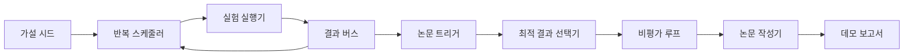
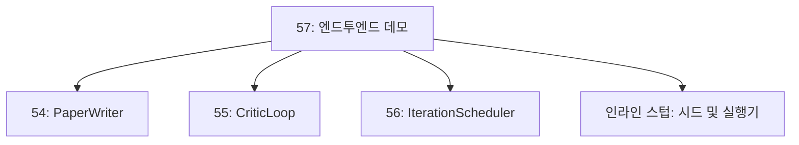
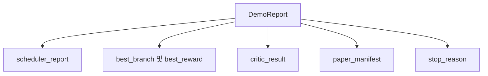

# 엔드투엔드 연구 데모

> 데모는 이전에 작성한 모든 계약이 결합되는 곳입니다. 그중 하나라도 누수가 발생하면, 데모가 이를 포착하는 수업이 됩니다.

**유형:** Build
**언어:** Python
**선수 요건:** 19단계 50-53강
**시간:** 약 90분

## 학습 목표

- 자동 연구 루프를 엔드투엔드로 연결하세요: 가설 시드, 실험 실행기, 스케줄러, 비평가 루프, 논문 작성기.
- 이전 Track D의 네 수업에서 만든 프리미티브를 프레임워크가 아닌 순수 Python import로 결합하세요.
- 루프가 스스로 종료될 때까지 실행하고, 모든 단계의 출력을 나열하는 단일 데모 보고서를 생성하세요.
- 데모가 결정적(deterministic)이 되도록 유지하여 테스트 스위트가 최종 형태를 검증할 수 있게 하세요.
- 어떤 단계의 계약이 깨졌을 때 명확한 실패 모드를 드러내어, 다음 단계가 깨진 입력으로 실행되지 않도록 하세요.

```figure
ch-research-pipeline
```

## 여기서 결합되는 요소



5단계. 시드는 세 개의 가설 목록입니다. 스케줄러는 세 개의 병렬 슬롯을 사용하여 이 가설들에 대해 여섯 번의 실험을 실행합니다. 버스는 하나 이상의 논문 트리거를 보고합니다. 선택기는 단일 최적 결과를 선택합니다. 비평가 루프는 그 결과로 작성된 초안을 반복하여 개선합니다. 논문 작성기는 최종 LaTeX, BibTeX 및 매니페스트를 생성합니다.

## 복사하지 않고 import하는 이유

이전 각 수업은 `main.py`를 공개 데이터클래스와 함수와 함께 제공합니다. 데모는 `sys.path`를 각 수업의 부모 디렉토리로 조정하여 이를 import합니다. 이는 프레임워크 연결이 아니며, 이전 수업의 테스트 파일들이 이미 사용하는 것과 동일한 import입니다.



인라인 스텁은 50강부터 53강까지를 대체합니다: 시드 가설을 생성하는 작은 생성기와 동기식 보상 함수입니다. 사용자는 두 개의 import를 조정하여 인라인 스텁을 해당 강의의 실제 프리미티브로 교체할 수 있습니다.

## 결정성 보장

데모는 구조적으로 결정적입니다. 실험 러너는 시드된 numpy를 사용합니다. 비평가 루프의 수정자는 고정된 차원을 고정된 순서로 순회합니다. 논문 작성자의 산문 생성기는 54강의 목(mocked)된 생성기입니다. 스케줄러의 UCB 선택자는 무작위 선택이 아닌 반복 순서로 동점을 처리합니다.

동일한 시드가 주어지면 데모는 동일한 보고서를 생성합니다. 테스트는 데모를 두 번 실행하고 매니페스트를 비교하여 이 속성을 검증합니다.

## 데모 보고서의 형태



각 필드는 상류 단계에서 그대로 가져옵니다. 데모는 출력에 변환을 가하지 않으며, 이를 조합합니다. 이것이 데모가 수행하는 테스트입니다.

## 실패 모드 처리

각 단계는 성공하거나 타입이 지정된 오류를 발생시킵니다.

```text
Scheduler ........ returns SchedulerReport with stop_reason
                   in {queue_empty, max_experiments, deadline}
Best-result pick . raises NoTriggerError if no paper trigger fired
Critic loop ...... returns LoopResult with status converged or stopped
Paper writer ..... raises PaperValidationError on contract break
```

어떤 단계에서 실패가 발생하면 데모는 타입이 지정된 예외로 중단됩니다. 테스트는 이 계약을 고정합니다: `test_no_triggers_raises_typed_error` 및 `test_best_picker_raises_when_no_triggers`는 트리거가 발동되지 않은 브랜치에 대해 선택자가 `NoTriggerError` / `BestResultError`를 발생시키며, 작성자는 호출되지 않음을 검증합니다.

## 최고 결과 선택자

스케줄러는 브랜치별로 논문 트리거를 생성합니다. 선택자는 모든 트리거에 걸쳐 평균 보상이 가장 높은 브랜치를 선택합니다. 동점은 브랜치 id의 알파벳 순서로 처리되어 데모의 결정성이 보장됩니다. 선택자는 작은 순수 함수이며, 테스트는 고정된 스케줄러 보고서에 대해 이를 고정합니다.

## 비평가 루프 연결

55강의 비평가 루프는 `MiniPaper`에서 작동합니다. 데모는 선택된 브랜치로부터 `MiniPaper`을 구축합니다. 추상문에 브랜치 id를 채우고, 두 섹션(Introduction 및 Results)을 시드하며, `originality_tag`를 브랜치의 평균 보상(`>= 0.8`이면 높음, `>= 0.6`이면 중간, 그 외에는 낮음)으로 설정합니다.

수정자는 초안을 수렴할 때까지 반복합니다. 출력은 논문 작성자로 전달됩니다.

## 논문 작성자 연결

54강의 논문 작성자는 그림과 참고문헌을 포함한 전체 `Paper` 형태를 다룹니다. 데모는 `mini_to_full_paper`를 통해 수렴된 `MiniPaper`을 업그레이드하며, 선택된 분기에 대한 그림 하나와 비평가가 제안한 인용 키의 합집합으로 구성된 작은 합성 참고문헌을 첨부합니다. 데모가 추가하는 모든 인용은 참고문헌 목록에도 추가되므로 검증이 통과됩니다.

## 코드 읽는 방법

`code/main.py`는 `BestResultError`, `NoTriggerError`, `DemoReport`, `pick_best_branch`, `build_mini_paper`, `mini_to_full_paper`, `run_demo`를 정의합니다. 상단의 import는 `sys.path`을 한 번 조정하고 `PaperWriter`, `CriticLoop`, `IterationScheduler`를 각 강의에서 가져옵니다.

`code/tests/test_e2e.py`는 다음을 다룹니다: 데모가 처음부터 끝까지 실행되어 모든 다섯 필드가 채워진 보고서를 생성하는지, 두 번의 실행에서 결정성이 유지되는지, 임계값을 넘지 않는 분기가 있을 때 NoTriggerError가 발생하는지, 작성자의 계약이 깨질 때 PaperValidationError가 발생하는지, 논문 매니페스트가 선택된 분기의 그림을 포함하는지, 스케줄러의 중단 이유가 예상된 값 중 하나인지 확인합니다.

## 더 깊이 들어가기

데모가 정상적으로 작동하면 연결해 볼 가치가 있는 세 가지 확장 기능이 있습니다. 첫째, 영속적 상태: 각 단계의 결과를 작은 JSON 저장소에 기록하여 재시작 시 저렴한 단계를 다시 실행하지 않고도 이어갈 수 있습니다. 둘째, 대시보드: 스케줄러와 비평가 루프의 추적(tracing) 이벤트가 단일 타임라인으로 렌더링됩니다. 셋째, 실제 모델 호출: 목(mocked)된 산문 생성기와 결정론적 비평가 대신 모델 기반의 것으로 교체합니다. 연결(wiring) 방식은 변하지 않습니다.

데모의 역할은 구성(composition)이 아키텍처임을 증명하는 것입니다. 다섯 개의 강의, 네 개의 import, 하나의 보고서. 다음에 단계를 추가할 때 연결(wiring)은 정확히 한 줄만 늘어납니다.
