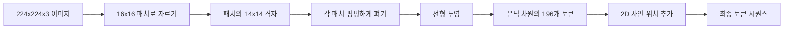

# 비전 인코더 패치

> 픽셀을 읽는 비전 모델은 픽셀용 토크나이저가 필요합니다. 패치 임베딩(Patch Embedding)이 바로 그 토크나이저입니다. 이미지를 정사각형 격자로 잘라 각 정사각형을 평평하게 펴고, 하나의 선형 레이어를 통해 투영한 뒤, 2D 위치 신호를 추가하여 트랜스포머가 원본 이미지에서 각 정사각형이 어디에 있었는지 알 수 있게 해 주세요.

**유형:** Build
**언어:** Python
**선수 요건:** 19단계 30-37강 (트랙 B 기초)
**시간:** 약 90분

## 학습 목표

- 이미지를 고정 길이의 패치 임베딩 시퀀스로 토큰화해 보세요.
- unfold 후 선형 변환의 수학적 연산과 일치하는 `Conv2d` 기반 패치 투영을 구현해 보세요.
- 토큰 순서가 공간적 위치를 인코딩하도록 결정적인 2D 사인 위치 임베딩을 구축해 보세요.
- 합성 픽스처에서 패치 개수, 임베딩 형상, `Conv2d`/unfold 동등성을 검증해 보세요.

## 문제점

트랜스포머는 벡터 시퀀스를 입력으로 받습니다. 이미지는 3채널 격자입니다. 모든 픽셀을 토큰으로 읽으면 시퀀스 길이가 폭발합니다. 224x224 RGB 이미지는 150,528개의 토큰이며, 이는 12층 트랜스포머가 어텐션 연산으로 감당할 수 없습니다. 이미지를 하나의 거대한 평평한 벡터로 읽으면 지역성이 사라지며, 어텐션 레이어는 이를 복원할 수 없습니다. 인코더 프런트 엔드의 역할은 픽셀 격자를 각각 정사각형 영역을 요약하는 몇백 개의 토큰으로 압축하는 것입니다.

패치 임베딩은 하나의 선형 투영으로 이 문제를 해결합니다. 224x224 이미지를 16x16 패치로 자르면 14x14 격자의 196개 패치가 생성됩니다. 각 패치는 `(3, 16, 16) = 768` 픽셀 값에서 하나의 벡터로 평평하게 펴진 뒤, 선형 레이어가 이를 모델의 은닉 차원으로 매핑합니다. 트랜스포머는 `hidden` 차원(일반적으로 768)의 196개 토큰과 CLS 토큰을 봅니다. 이는 네트워크의 나머지 부분이 처리할 수 있는 시퀀스입니다.

## 개념



### 왜 픽셀이 아닌 패치인가

어텐션은 시퀀스 길이에 대해 2차 함수입니다. 196토큰 시퀀스는 레이어당 헤드당 `196 * 196 = 38,416` 어텐션 점수를 계산하는 비용이 들며, 150,528토큰 시퀀스는 `150,528 * 150,528 = 22.6 billion` 비용이 듭니다. 패치화는 어텐션 연산에서 590,000배의 감소 효과를 가져오며, 단일 16x16 영역은 고수준 비전 작업에 충분한 신호를 담고 있습니다. 비용은 하나의 패치 내부에서 세밀한 공간적 세부 사항이 손실되는 것이며, 정밀한 위치 파악이 중요한 경우 다운스트림 멀티모달 스택이 두 번째 고해상도 브랜치를 실행하는 이유입니다.

### 선형 투영이 충분한 이유

각 패치는 독립적인 벡터로 취급됩니다. 투영은 가장자리 검출기, 색상 필터, 단순한 텍스처 같은 기저를 학습합니다. 단일 선형 레이어는 작으며(ViT-Base의 경우 `768 * 768 = 589,824` 매개변수), 빠르게 학습됩니다. 더 깊은 합성곱 스템("하이브리드" ViT)도 존재하지만, 평평한 선형 투영이 표준이며, 대부분의 최신 오픈 웨이트 인코더는 이 형태를 그대로 채택하고 있습니다.

### `Conv2d` 트릭

패딩이 없는 `Conv2d(in_channels=3, out_channels=hidden, kernel_size=patch_size, stride=patch_size)`는 unfold 후 선형 투영을 수행한 것과 동일한 수치 결과를 제공합니다. 각 출력 위치는 패치 픽셀을 하나의 필터와 점곱하기 때문입니다. 합성곱이 패치 투영이며, 대부분의 프로덕션 코드베이스는 GPU에서 더 빠르고 reshape를 한 번 덜 사용하므로 이 방식으로 구현합니다.

### 위치 임베딩

투영을 거친 토큰은 순서를 포함하지 않습니다. 2D 사인 임베딩은 각 토큰에 `(row, col)` 위치를 인코딩하는 고정된 신호를 부여합니다. 임베딩 차원의 절반은 여러 주파수의 sin/cos를 사용하여 행 위치를 인코딩하고, 나머지 절반은 열 위치를 인코딩합니다. 인코딩은 결정적이므로 재학습 없이 해상도를 바꿀 수 있으며, 학습 시 모델이 본 적 없는 격자에도 깔끔하게 보간됩니다.

| 구성 요소 | 형태 | 매개변수 |
|-----------|-------|------------|
| 패치 투영 (`Conv2d`) | `(hidden, 3, patch, patch)` | `3 * P * P * hidden + hidden` |
| 위치 임베딩 (고정) | `(num_patches, hidden)` | 0 (계산됨, 학습되지 않음) |
| CLS 토큰 (학습됨) | `(1, hidden)` | `hidden` |

224 해상도의 ViT-Base/16의 경우: 투영에 590,592개의 매개변수, CLS 토큰에 768개, 사인 위치 임베딩에 0개가 있습니다. 다음 강(59강)에서는 이 프런트 엔드 위에 12층 트랜스포머를 쌓습니다.

### 정합성 확인으로서의 동등성

패치 단계에는 두 가지 표기가 있습니다: `Conv2d` 투영과 명시적인 언폴드 후 선형 연산. 동일한 가중치에 대해 동일한 출력을 생성해야 합니다. 그렇지 않으면 언폴드 연산이 잘못된 것이며, 인코더의 나머지 부분은 모래 위에 지어진 셈입니다. 이 강의의 테스트는 그 동등성을 검증합니다.

```figure
ch-patch-tokenizer
```

## 구현하기

`code/main.py`는 다음을 구현합니다:

- `PatchEmbed`, 패치 투영을 위해 `Conv2d`를 감싸는 `nn.Module`.
- `sinusoidal_2d(grid_h, grid_w, dim)`, 2D 위치 테이블을 구축하는 상태 비저장 함수.
- `VisionFrontEnd`, 패치 임베딩, CLS 선행 추가, 위치 더하기를 하나의 순전파로 구성합니다.
- `numpy.random`에서 결정적인 224x224x3 픽스처를 구축하는 `synthesize_image(seed)` 헬퍼.
- 하나의 픽스처 이미지를 프런트 엔드를 통해 실행하고 출력 형상, CLS 토큰 노름, 위치 임베딩의 한 행을 출력하는 데모.

실행해 보세요:

```bash
python3 code/main.py
```

출력: 224x224 픽스처는 `(1, 197, 768)` 형상의 시퀀스로 토큰화됩니다. 첫 번째 토큰은 CLS이며, 다음 196개는 패치 토큰입니다. 위치 임베딩 노름은 행 내에서 균일하며, 이는 사인 곡선적 특징입니다.

## 사용하기

동일한 패치 프런트 엔드는 모든 최신 비전-언어 모델에 나타납니다: CLIP ViT-L/14, SigLIP, DINOv2, Qwen-VL 계열, InternVL 스택은 모두 `Conv2d` 패치 투영과 위치 신호에서 시작합니다. 계열 간 차이는 하류에 있습니다(CLS 대 CLS 없는 풀링, 레지스터 토큰, 패치 크기 14 대 16, 보간된 위치를 통한 동적 해상도). 이 강의의 프런트 엔드는 이러한 모든 모델이 서 있는 기반입니다.

## 테스트

`code/test_main.py`는 다음을 다룹니다:

- 패치 개수가 `(image_size / patch_size) ** 2`와 일치
- 출력 형상이 `(batch, num_patches + 1, hidden)`와 일치
- `Conv2d` 투영이 작은 픽스처에서 수동 언폴드 후 선형 연산과 동일
- 사인 곡선적 위치 테이블이 호출 간에 결정적
- CLS 토큰이 배치 차원 전체로 누수 없이 브로드캐스트

실행해 보세요:

```bash
python3 -m unittest code/test_main.py
```

## 연습 문제

1. sinusoidal 위치를 학습된 `nn.Parameter`으로 교체하고, 작은 합성 분류 작업에서 첫 에포크 손실을 비교해 보세요. 고정된 해상도에서는 학습된 위치가 더 잘 작동하며, 학습 후 해상도를 변경할 때는 sinusoidal 위치가 더 잘 작동합니다.

2. `Conv2d`을 명시적인 `nn.Unfold`과 `nn.Linear`으로 교체하고, 출력값이 부동 소수점 허용 오차 범위 내에서 일치하는지 확인해 보세요. 동일한 수식을 두 가지 방식으로 표현한 것입니다.

3. 정사각형이 아닌 패치 크기(예: 가로 비율이 큰 입력에 대해 32x16)를 지원하도록 추가하고, 위치 테이블이 정사각형이 아닌 격자를 처리하는지 검증해 보세요.

4. 배치 크기 1, 8, 64에서 패치 단계의 성능을 프로파일링해 보세요. 패치 투영은 거의 병목 현상을 일으키지 않으며, 하류의 어텐션 레이어가 지배적입니다.

5. 4개 클래스의 합성 도형 데이터셋(원, 사각형, 삼각형, 별)에서 프론트 엔드를 고정된 특징 추출기로 학습해 보세요. CLS 토큰 출력은 선형적으로 분리되어야 합니다.

## 핵심 용어

| 용어 | 의미 |
|------|---------------|
| 패치(Patch) | 이미지의 정사각형 하위 영역으로, 일반적으로 14x14 또는 16x16 |
| 패치 임베딩(Patch embedding) | 하나의 평탄화된 패치를 은닉 차원으로 선형 투영한 것 |
| 시퀀스 길이(Sequence length) | 패치 토큰화 후의 토큰 수로, 보통 CLS가 추가됨 |
| Sinusoidal 위치(Sinusoidal position) | 2D 격자 좌표를 인코딩하는 고정된 sin/cos 신호 |
| CLS 토큰(CLS token) | 풀링 헤드로서 시퀀스 앞에 추가되는 학습된 벡터 |

## 추가 읽기

- 원래의 패치 임베딩 구성을 위해 'An Image is Worth 16x16 Words (ViT, 2021)'를 읽어 보세요.
- 여기서 2D에 맞게 적용된 sinusoidal 위치 공식을 위해 'Attention Is All You Need (2017)'를 읽어 보세요.
- register 토큰에 대해 'DINOv2 paper'를 읽어 보세요. 이는 연습 문제 6으로 추가할 수 있는 확장입니다.
