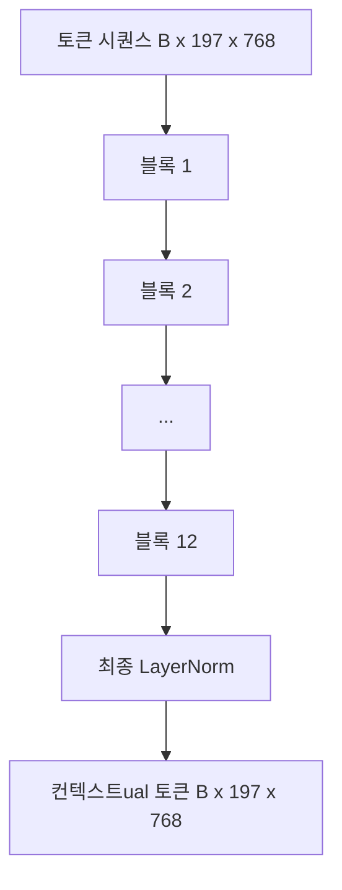
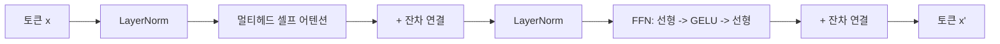

# 비전 트랜스포머 (ViT) 인코더

> 패치만으로는 볼 수 없습니다. 12층의 pre-LN 트랜스포머와 12개의 어텐션 헤드가 패치 토큰 시퀀스를 컨텍스트ual 토큰 시퀀스로 변환하며, CLS 토큰은 최종 은닉 상태에서 전체 이미지 특성을 풀링합니다. 이 강의는 모든 현대 비전-언어 모델의 엔진룸입니다.

**유형:** Build
**언어:** Python
**선수 요건:** 19단계 30-37강 (Track B 기초)
**시간:** 약 90분

## 학습 목표

- 멀티헤드 셀프 어텐션과 피드포워드 서브 레이어를 갖춘 pre-LN 트랜스포머 블록을 구현해 보세요.
- 12개의 블록을 쌓아 ViT-Base 인코더를 구성해 보세요.
- 58강의 패치 프론트엔드를 인코더에 연결하고 순방향 패스를 실행해 보세요.
- CLS 토큰이 모든 패치로부터 정보를 집계하는지 검증해 보세요.

## 문제점

패치 임베딩은 197개의 토큰 시퀀스를 생성하며, 각 토큰은 다른 패치에 대한 인식이 없는 벡터입니다. 고양이 사진은 모든 패치가 수염, 배경, 눈을 포함하는 패치를 파악해야 합니다. 트랜스포머는 어텐션 레이어를 통해 이러한 인식을 구축하는 메커니즘입니다. 이것이 없으면 패치 프론트엔드는 이해력이 없는 똑똑한 토크나이저일 뿐입니다.

표준 레시피는 12층 깊이, 12헤드 너비, pre-LayerNorm 배치, GELU 활성화, 4배 피드포워드 확장으로 구성됩니다. 이 레시피는 CLIP ViT-L, SigLIP, DINOv2, Qwen-VL 계열, InternVL 및 2025-2026년 모든 오픈 웨이트 비전 인코더의 핵심입니다. 이 레시피는 충분히 안정적이므로, 해당 논문들을 읽을 때 명시적으로 다른 내용이 언급되지 않는 한 이 블록 형태를 가정할 수 있습니다.

## 개념





### Pre-LN vs post-LN

원래 트랜스포머는 잔차 연결(residual) 이후에 LayerNorm을 배치했습니다. Pre-LN(각 서브 레이어 앞에 LayerNorm을 배치하는 방식)은 모든 최신 비전-언어 모델이 사용하는 버전입니다. 학습률 워밍업 트릭 없이 안정적으로 학습할 수 있기 때문입니다. 차이점은 forward pass에서 한 줄뿐이지만, 깊이 12 이상에서의 기울기 흐름은 하늘과 땅 차이입니다.

### 멀티 헤드 셀프 어텐션

각 헤드는 토큰 벡터를 차원 `head_dim = hidden / num_heads`인 자체 `(query, key, value)` 삼중항(triple)으로 투영합니다. `hidden = 768`와 `heads = 12`을 사용하면 각 헤드는 `dim = 64`를 가집니다. 12개의 헤드가 병렬로 어텐션하며, 그 출력은 차원 768로 다시 연결(concat)되어 출력 투영(output projection)을 통과합니다. 멀티 헤드의 요점은 한 헤드가 "고양이 눈에 어텐션"을 학습하는 동안 다른 헤드가 "배경 그라디언트에 어텐션"을 간섭 없이 학습할 수 있다는 점입니다.

### 4배 피드포워드 확장 이유

FFN은 `hidden -> 4 * hidden -> hidden`로 진행되며 중간에 GELU가 있습니다. 4배 팩터는 경험적으로 결정된 값이며, 2017년 이후 언어 및 비전 트랜스포머 전반에 걸쳐 유지되어 왔습니다. 더 작은(2배) 구성은 과소 적합(underfit)되고, 더 큰(8배) 구성은 고정된 데이터 예산에서 과적합(overfit)됩니다. MLP는 모델이 학습한 사실의 대부분을 저장하는 곳이며, 더 넓은 중간층이 그 사실들이 위치하는 곳입니다.

| 구성 요소 | ViT-Base 규모에서의 매개변수 |
|-----------|------------------------------|
| 블록당 qkv 투영 | `3 * 768 * 768 = 1.77M` |
| 블록당 출력 투영 | `768 * 768 = 590K` |
| 블록당 FFN (4배 확장) | `2 * 768 * 4 * 768 = 4.72M` |
| 블록당 LayerNorm | `4 * 768 = 3K` |
| 블록당 총합 | 약 7.1M |
| 12개 블록 | 약 85M |
| 프런트 엔드 포함 | 총 약 86M |

ViT-Base는 86M 매개변수를 가진 인코더입니다. 2026년 기준으로는 작은 편입니다(SigLIP-So400M은 400M, Qwen-VL ViT는 675M)하지만, 아키텍처는 너비와 깊이를 제외하면 동일합니다.

### 코잘(causal) 마스크 사용 여부?

비전 트랜스포머는 인코더 전용이며 양방향입니다: 토큰 `i`는 임의의 쌍에 대해 토큰 `j`에 어텐션할 수 있습니다. 마스크가 없습니다. 61강의 디코더 측 교차 어텐션은 코잘 마스크를 사용하지만, 비전 인코더 내부에서는 어텐션이 완전히 연결되어 있습니다.

### CLS 토큰이 학습하는 내용

CLS 토큰은 학습된 매개변수로 시작하며 자체적인 패치 내용이 없고, 모든 블록에 걸친 어텐션을 통해 정보를 누적합니다. 최종 레이어에서는 CLS 행이 전체 이미지의 벡터 요약이 되며, 다운스트림 헤드는 이 단일 벡터를 클래스 로짓, 대조 임베딩, 또는 텍스트 디코더용 교차 어텐션 키로 투사합니다.

```figure
ch-cls-funnel
```

## 구현하기

`code/main.py`는 다음을 구현합니다:

- `MultiHeadSelfAttention`, `qkv` 및 출력 투사, 스케일된 점곱 어텐션 연산, 그리고 형태(shape) 어서션을 포함합니다.
- `FeedForward`, 4배 확장 GELU MLP입니다.
- `Block`, 어텐션 및 피드포워드 서브레이어를 잔차(residual)와 함께 구성하는 pre-LN 블록입니다.
- `ViT`, 최종 LayerNorm을 포함하는 12개 블록의 스택입니다.
- `VisionEncoder`, 58강의 `VisionFrontEnd`을 `ViT` 스택에 연결하고 컨텍스트 시퀀스와 풀링된 CLS 벡터를 반환하는 `forward()`를 노출합니다.
- 합성된 224x224 픽스처 이미지를 전체 인코더로 실행하고 입력 형태, 출력 형태, 매개변수 수, 그리고 모든 레이어에서의 CLS 노름을 출력하는 데모입니다.

실행해 보세요:

```bash
python3 code/main.py
```

출력: 픽스처는 `(1, 197, 768)` 텐서로 인코딩됩니다. 레이어가 구성됨에 따라 CLS 노름이 상승하다가 최종 LayerNorm에서 안정화됩니다. 총 매개변수는 약 86M으로 보고됩니다.

## 사용하기

여기서 정의된 인코더는 너비와 깊이를 제외하면, 2025-2026년 모든 오픈 웨이트 VLM 내부에 탑재된 동일한 블록 스택입니다. 차이점은 다음과 같습니다:

- **너비와 깊이.** ViT-Large는 `hidden=1024, depth=24, heads=16`입니다. SigLIP So400M은 `hidden=1152, depth=27, heads=16`입니다. 블록은 동일합니다.
- **풀링 헤드.** CLS 풀링(이 강) vs 평균 풀링(SigLIP) vs 어텐션 풀링(후기 VLM).
- **위치 처리.** 고정 사인 함수(58강) vs 학습된 1D vs ALiBi vs 2D RoPE. 블록 연산은 변하지 않습니다.
- **Register 토큰.** DINOv2는 4개의 추가 학습된 토큰을 앞에 붙입니다. 한 줄의 코드입니다.

이 블록 스택은 기반입니다. 다음 강(60-63강)은 이 위에 서 있습니다.

## 테스트

`code/test_main.py`는 다음을 커버합니다:

- 단일 블록은 형태를 보존하며 입력 배치 크기에 대해 불변입니다
- 어텐션 점수는 키 축을 따라 합이 1입니다(softmax 정상성)
- 잔여 경로가 연결되어 있습니다 (CLS 토큰을 통해 입력이 0이어도 비-0 출력이 생성됩니다)
- 4층 스택 순전파가 올바른 형태를 생성합니다
- CLS 출력에서 패치 투사(projection)로 기울기가 전달됩니다

실행해 보세요:

```bash
python3 -m unittest code/test_main.py
```

## 연습 문제

1. register 토큰(CLS 뒤에 추가되는 4개의 학습된 벡터)을 추가하고 다시 실행해 보세요. 마지막 층의 softmax 분포 엔트로피를 통해 attention 맵의 매끄러움을 비교해 보세요.

2. pre-LN을 post-LN으로 교체하고 합성 shape 분류기에 대해 1에포크 동안 학습해 보세요. LR 워밍업 없이 안정적으로 학습되는 쪽이 어느 쪽인지 관찰해 보세요.

3. causal masking을 `attn_mask` 인자로 구현하여 같은 블록을 decoder 블록으로 재사용할 수 있도록 해 보세요. mask의 형태는 `(seq, seq)`이며 하삼각(lower-triangular)입니다.

4. `torch.profiler`를 사용하여 batch size가 1, 8, 64인 순전파를 프로파일링해 보세요. attention이 아니라 MLP 층이 wall time을 지배합니다.

5. attention head 중 하나의 q-k-v 투사(projection)를 low-rank LoRA 어댑터로 교체하고 나머지는 동결(freeze)한 후, 기대한 위치에서만 기울기가 전달되는지 검증해 보세요.

## 핵심 용어

| 용어 | 의미 |
|------|---------------|
| Pre-LN | 각 서브-층(sub-layer) 뒤에가 아니라 앞에 LayerNorm을 적용하는 방식 |
| 셀프 어텐션(Self-Attention) | 각 토큰이 같은 시퀀스 내의 모든 다른 토큰에 어텐션하는 방식 |
| 멀티 헤드(Multi-head) | hidden dim이 `H`개의 독립적인 attention head로 분할됨 |
| FFN 확장 | feed-forward 층이 `4 * hidden`까지 확장된 후 축소됨 |
| CLS 풀링(pooling) | 첫 번째 토큰의 최종 hidden state를 이미지 요약으로 사용 |

## 추가 읽기

- 인코더 레시피에 대해 An Image is Worth 16x16 Words (ViT, 2021)를 참고해 보세요.
- register 토큰과 자기 지도(self-supervised) 사전 학습 목적 함수에 대해 DINOv2 (2023)를 참고해 보세요.
- 평균 풀링(avg-pooling) 변형과 62강에서 사용된 sigmoid contrastive loss에 대해 SigLIP (2023)를 참고해 보세요.
