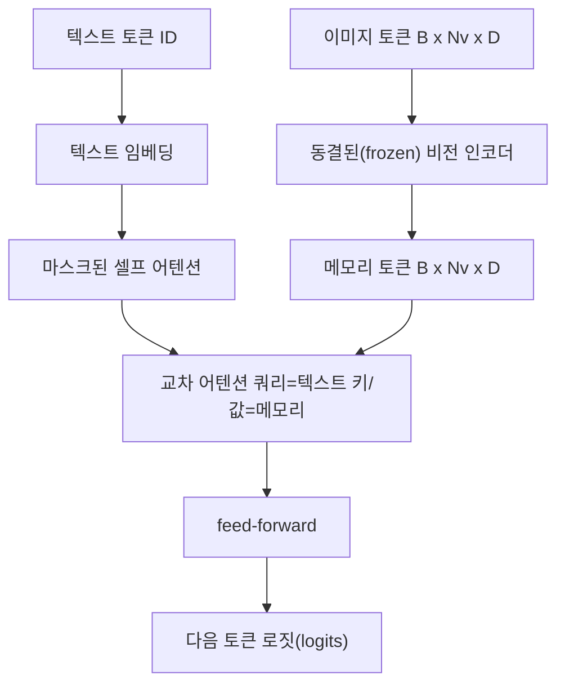
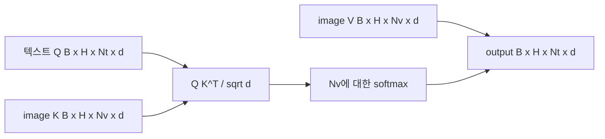

# 교차 어텐션 융합(Cross-Attention Fusion)

> 투영 레이어는 하나의 이미지 벡터를 하나의 캡션 벡터와 정렬합니다. 실제 비전-언어 모델(Vision-Language Model) 디코더는 모든 텍스트 토큰이 모든 패치 토큰에 어텐션해야 하므로, 모델은 각 단어를 특정 영역에 접지(grounding)할 수 있습니다. 교차 어텐션은 이러한 접지가 일어나는 방식입니다. 텍스트가 쿼리(query)가 되고, 비전 키(key)와 값(value)이 응답합니다. 이 강의에서는 교차 어텐션 블록, 인과적(causal) 텍스트 셀프 어텐션, 그리고 두 어텐션이 모두 유효하도록 유지하는 마스크(mask) 형태를 구현합니다.

**유형:** Build
**언어:** Python
**선수 요건:** 19단계 30-37강 (Track B 기초)
**시간:** 약 90분

## 학습 목표

- 쿼리 스트림은 텍스트이고 키/값 스트림은 비전인 멀티헤드 교차 어텐션을 구현합니다.
- 디코더 블록을 구성합니다: 인과적 셀프 어텐션 + 교차 어텐션 + 피드포워드(feed-forward).
- 마스크 형태를 정확히 설정합니다: 셀프 어텐션에는 인과적(causal) 마스크를, 교차 어텐션에는 마스크를 사용하지 않습니다.
- 배치된 텍스트 토큰과 고정된 이미지 토큰 풀(pool)을 사용하여 순방향(forward) 패스를 실행합니다.

## 문제점

이미지 토큰과 텍스트 토큰을 하나의 시퀀스로 연결(concatenate)하는 것은 하나의 융합 옵션입니다 (초기 융합(Early Fusion), Chameleon과 Emu3가 채택한 경로). 교차 어텐션은 다른 옵션입니다 (후기 융합(Late Fusion), Flamingo가 도입했으며 이후 모든 Flamingo형 디코더가 채택한 경로). 후기 융합에서는 텍스트 디코더가 텍스트 전용 토큰만 처리하며, 모든 레이어에서 교차 어텐션을 통해 이미지 스트림으로 접근합니다.

후기 융합에는 두 가지 장점이 있습니다. 첫째, 텍스트 스트림이 깨끗하게 유지되어 모델이 텍스트 전용 기능을 보존합니다. 둘째, 이미지 스트림은 이미지당 한 번만 계산되며 모든 디코딩 단계에서 재사용되므로, 긴 캡션에 대해서도 생성 비용이 저렴합니다. 단점은 블록당 추가 어텐션 서브 레이어가 하나 필요하다는 것입니다.

## 개념





### Mask shapes

디코더 블록 내부의 두 어텐션은 서로 다른 마스크가 필요합니다:

| 어텐션 | 쿼리 길이 | 키 길이 | 마스크 | 이유 |
|-----------|--------------|------------|------|-----|
| 셀프 어텐션 | `Nt` (텍스트) | `Nt` (텍스트) | 인과적: 하단 삼각형 `(Nt, Nt)` | 자기회귀 중 텍스트 토큰은 앞을 볼 수 없습니다 |
| 교차 어텐션 | `Nt` (텍스트) | `Nv` (비전) | 마스크 없음 | 모든 텍스트 위치에서 전체 이미지가 보입니다 |

이 강의에는 하나의 형상 검증 함수가 포함되어 있어, 두 마스크를 혼동하는 실수가 `ValueError`로 드러나며 손실 곡선이 조용히 깨지는 것을 방지합니다.

### 교차 어텐션에 마스크가 없는 이유

텍스트가 생성되기 전에 이미지가 완전히 관측됩니다. 캡션의 토큰 `t`는 이미지의 모든 패치에 어텐션할 수 있으며, 이미지 패치에는 시간 순서가 없습니다. 일부 Flamingo 변형은 여러 이미지와 텍스트 세그먼트를 인터리빙할 때 샘플별 마스크 패턴을 추가하지만, 단일 이미지와 캡션의 경우 교차 어텐션은 모든 것을 봅니다.

### 키/값 캐싱

이미지 키와 값은 디코딩 시작 시 한 번 계산되어 캐시에 저장됩니다. 각 새 텍스트 토큰은 재계산 없이 캐시를 사용합니다. 이것이 추론 시 캡셔닝이 빠른 이유입니다: 무거운 ViT는 한 번만 실행되며, 교차 어텐션은 모든 단계에서 그 키와 값을 재사용합니다. 이 강의는 캐시를 노출하고 캐시 적중 경로를 테스트합니다.

### 블록 구성

디코더 블록은 다음과 같이 실행됩니다: pre-LN -> 셀프 어텐션 -> 잔차 -> pre-LN -> 교차 어텐션 -> 잔차 -> pre-LN -> 피드포워드 -> 잔차. 세 개의 서브 레이어가 있으며, 각각 자체 LayerNorm을 가집니다. Flamingo 논문은 학습 시간 안정성 비용으로 모델이 이미지 경로를 선택적으로 제외할 수 있도록 교차 어텐션에 학습된 게이트를 추가했습니다. 표준 기준선(여기서 사용)에는 게이트가 없습니다.

```python
class DecoderBlock:
  def forward(self, text_tokens, image_tokens, text_mask, cross_mask):
      text_tokens = text_tokens + self.self_attn(self.ln1(text_tokens),
                                                 mask=text_mask)
      text_tokens = text_tokens + self.cross_attn(self.ln2(text_tokens),
                                                  image_tokens,
                                                  mask=cross_mask)
      text_tokens = text_tokens + self.ffn(self.ln3(text_tokens))
      return text_tokens
```

```figure
ch-crossattn-fan
```

## 구현하기

`code/main.py`는 다음을 구현합니다:

- `CrossAttention(hidden, heads)`, 분리된 `q` 및 `kv` 투영을 사용하는 멀티헤드 교차 어텐션.
- `CausalSelfAttention(hidden, heads)`, 표준 디코더의 마스크된 셀프 어텐션.
- `DecoderBlock`, 세 하위 계층을 pre-LN 잔차로 구성합니다.
- `VisionLanguageDecoder`, 모의 비전 인코더 출력과 작은 텍스트 임베딩 테이블이 입력되는 4계층 디코더입니다.
- `causal_mask(length)`는 `(length, length)` 하삼각 boolean 텐서를 반환합니다.
- 길이 10인 텍스트 시퀀스 두 개와 길이 197인 이미지 메모리를 입력하는 데모로, 출력 형상, 셀프 어텐션 마스크 형상, 위치별 교차 어텐션 출력 노름을 출력합니다.

실행해 보세요:

```bash
python3 code/main.py
```

출력: 디코더가 `(2, 10, text_vocab)` 로짓 텐서를 생성합니다. 마스크 형상은 `(10, 10)`입니다. KV 캐시 재사용 체크는 캐시된 경로와 캐시되지 않은 경로 간 로짓이 동일함을 확인합니다.

## 사용하기

교차 어텐션은 두 가지 프로덕션 계열에서 나타납니다:

- **Flamingo와 IDEFICS.** K개의 언어 모델 블록마다 교차 어텐션 하위 계층을 삽입하며, LM은 동결합니다. 비전-언어 어댑터는 교차 어텐션 블록과 그 게이트입니다.
- **BLIP-2.** Q-Former는 고정된 32개 쿼리 토큰에서 이미지 특징으로 교차 어텐션을 사용하며, 쿼리를 LM 임베딩 공간으로 투사합니다.

이 강의의 블록 형상은 두 계열에 직접 매핑됩니다. 마스크 규율(셀프는 인과, 교차는 없음)은 동일합니다.

## 테스트

`code/test_main.py`는 다음을 커버합니다:

- 인과 마스크는 하삼각이며 예상 boolean 형상과 일치합니다
- 교차 어텐션 출력 형상은 키 길이에 관계없이 `(B, Nt, hidden)`입니다
- KV 캐시 경로는 캐시되지 않은 경로와 부동소수점 허용 오차 내에서 일치합니다
- 텍스트와 이미지 스트림 간 형상 불일치는 명확한 `ValueError`를 발생시킵니다
- 전체 디코더 순방향 패스는 올바른 배치 및 시퀀스 형상을 생성합니다

실행해 보세요:

```bash
python3 -m unittest code/test_main.py
```

## 연습 문제

1. 교차 어텐션 잔차에 학습된 tanh 게이트를 추가(Flamingo 트릭)하고, 초기 게이트가 거의 0인 상태에서 학습이 수렴하는지 검증해 보세요. 게이트는 0에서 시작하며, 모델은 이미지 스트림을 혼합하기 전에 텍스트 전용 동작을 복원합니다.

2. 동일한 디코더가 여러 이미지와 여러 텍스트 세그먼트를 소비하는 인터리브드 어텐션을 구현해 보세요. 텍스트 세그먼트 2가 이미지 1에 어텐션하지 않도록 하는 샘플별 교차 어텐션 마스크를 구성해 보세요.

3. `Nt=64, Nv=576`에서 교차 어텐션(Cross-Attention)과 셀프 어텐션(Self-Attention) 레이어를 프로파일링해 보세요 (더 높은 해상도의 24x24 그리드). 교차 어텐션 비용은 `Nt * Nv`이며, 높은 이미지 해상도에서 지배적입니다.

4. 교차 어텐션 맵에 쿼리 측 드롭아웃(Dropout)을 추가하고 데모에서 캡션 다양성을 측정해 보세요 (교차 맵의 드롭아웃이 증가하면 캡션 샘플 분산이 증가합니다).

5. 교차 어텐션 레이어를 Q-Former 스타일 어텐션 블록으로 교체해 보세요. 고정된 32개 토큰의 쿼리 풀이 각 레이어에서 이미지 특징에 한 번 어텐션합니다.

## 핵심 용어

| 용어 | 의미 |
|------|---------------|
| 후기 융합(Late Fusion) | 텍스트와 비전이 분리된 스트림에 유지되며, 모든 블록에서 교차 어텐션이 이를 연결합니다 |
| 교차 어텐션(Cross-Attention) | Q는 한 스트림에서, K와 V는 다른 스트림에서 옵니다 |
| 인과 마스크(Causal Mask) | 자기회귀(Autoregression) 중 앞을 보지 못하도록 방지하는 하삼각형 부울 마스크 |
| KV 캐시(KV Cache) | 이미지 키와 값을 한 번 저장하고 모든 디코딩 단계에서 재사용합니다 |
| 메모리 토큰(Memory Tokens) | 디코더가 참조하는 고정된 이미지 토큰 |

## 추가 읽기

- 게이트된 교차 어텐션이 포함된 표준 후기 융합 설계에 대해 Flamingo (2022)를 참고하세요.
- 학습된 쿼리 풀로 꾸며진 교차 어텐션 블록인 Q-Former에 대해 BLIP-2 (2023)를 참고하세요.
- Flamingo 레시피의 오픈 웨이트 재현에 대해 IDEFICS (2023)를 참고하세요.
