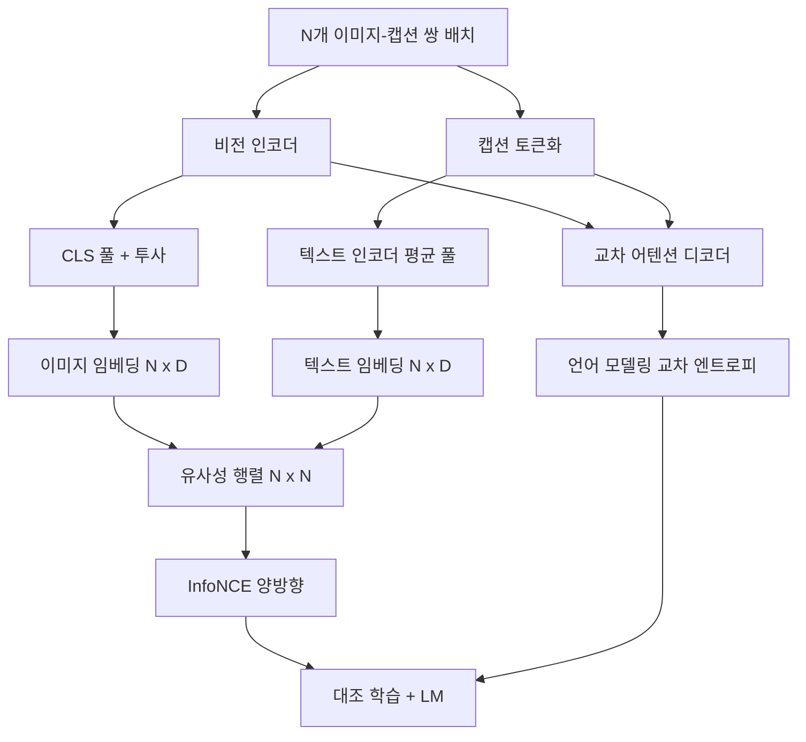

# 비전-언어 사전 학습

> 인코더, 투사(projection), 디코더가 연결되었습니다. 이제 이들을 함께 학습합니다. 두 가지 목표가 학습을 주도합니다: 결합 임베딩 공간에서 일치하는 쌍을 서로 끌어당기는 대조 이미지-텍스트 손실(InfoNCE)과, 디코더가 각 이미지의 캡션을 작성하도록 요구하는 언어 모델링 손실입니다. 이 둘을 결합하면 네트워크가 캡션에 맞는 이미지를 찾고, 이미지에 대한 캡션을 작성하는 두 가지 능력을 모두 학습합니다.

**유형:** Build
**언어:** Python
**선수 요건:** 19단계 30-37강 (Track B 기초)
**시간:** 약 90분

## 학습 목표

- 이미지-캡션 쌍 배치에 걸쳐 InfoNCE 대조 손실을 구현합니다.
- 대조 손실을 자기회귀 언어 모델링 손실과 결합합니다.
- 실제 데이터셋 다운로드 없이 200개 쌍의 목업(mock) 이미지-캡션 코퍼스를 합성합니다.
- 50단계 데모 학습 루프를 실행하고 두 손실이 감소하는 것을 관찰합니다.

## 문제점

비전-언어 모델은 두 가지 기술이 필요합니다. 랭킹: 캡션이 주어지면 여러 이미지 중 올바른 이미지를 찾아야 합니다. 생성: 이미지가 주어지면 캡션을 작성해야 합니다. 모델이 한 가지 기술만 사전 학습하면 시스템의 절반만 갖게 됩니다. CLIP은 랭킹을 잘 수행하지만 캡션을 작성할 수 없습니다. GPT-4V는 캡션을 작성할 수 있지만 랭킹을 위해 별도의 검색 헤드를 사용합니다. 다중 목표 사전 학습은 한 번의 패스로 두 가지를 모두 얻습니다.

InfoNCE는 랭킹 부분을 처리합니다. N개 쌍의 배치에서 모델은 N개의 일치하는 쌍을 양의 예로, `N^2 - N` 불일치하는 쌍을 음의 예로 취급한 후, resulting `(N, N)` 유사성 행렬에 대해 교차 엔트로피 손실을 실행합니다. LM 손실은 생성 부분을 처리합니다: 이미지에 조건을 건 표준 다음 토큰 예측입니다. 두 손실 모두 미분 가능하며 인코더, 투사기, 디코더 가중치를 공유할 수 있습니다.

## 개념



### InfoNCE를 한 단락으로

N개의 이미지 임베딩을 행으로, N개의 텍스트 임베딩을 행으로 쌓습니다. 두 임베딩 모두 L2 정규화합니다. `N x N` 행렬 `S = I T^T / tau`를 계산합니다. 여기서 `tau`는 학습된 온도입니다. 대각선 항목은 매칭 쌍이며, 비대각선 항목은 음수(negatives)입니다. 대각선을 따라 타겟 `argmax`을 사용하여 교차 엔트로피를 적용합니다. 행 `i`는 열 `i`에서 가장 높은 값을 가져야 합니다. 열 방향으로도 대칭적으로 동일하게 수행합니다. 총합은 두 값의 평균입니다. 이것이 8줄로 표현된 CLIP 손실입니다.

### 온도가 중요합니다

온도 `tau`는 소프트맥스가 얼마나 첨예한지(peaked)를 제어합니다. 너무 작으면 (예: `tau = 0.01`) 가장 어려운 음수(negative)에서만 기울기가 발생하여 학습이 노이즈가 많아집니다. 너무 크면 소프트맥스가 평평해지고 기울기가 소멸합니다. CLIP는 `tau`를 매개변수로 학습합니다. 이 데모에서도 동일하게 수행합니다.

### 언어 모델링 손실

디코더는 교차 어텐션을 통해 이미지 메모리 토큰을 소비하고 모든 위치에서 다음 텍스트 토큰을 예측합니다. 손실은 다음 위치 타겟을 사용하는 표준 교차 엔트로피입니다. 패딩 위치는 손실에서 제외됩니다.

### 손실 결합하기

`total = contrastive + lm_weight * lm`이며, 여기서 `lm_weight`는 스칼라 값(종종 1.0)입니다. 두 손실은 인코더와 투사(projection)에 공유 기울기를 가지며, LM 손실 기울기는 디코더에만 전달됩니다. 이는 CoCa, BLIP, SigLIP 스타일 모델들이 다양한 가중치를 사용하여 사용하는 멀티태스킹 레시피입니다.

| 구성 요소 | 손실 표면 | 영향 |
|-----------|--------------|---------|
| InfoNCE | 결합 공간에서의 쌍 순위 매기기 | 인코더 + 투사 + 텍스트 헤드 |
| LM | 이미지에 조건을 둔 토큰 예측 | 인코더 + 투사 + 디코더 |
| 결합 | 멀티태스킹 | 전체 스택 |

### 데모에 50단계가 충분한 이유

목(mock) 코퍼스는 랜덤 이미지와 랜덤 캡션 ID를 가진 합성 200쌍 세트입니다. 배치 크기 16으로 50 SGD 단계 후, 절대 값이 실제 데이터 모델이 달성하는 수준보다 높게 유지되더라도 두 손실이 눈에 띄게 감소합니다. 데모의 목적은 기울기 배선이 엔드 투 엔드로 작동하며 LM 손실을 추가해도 대조 학습 목표가 불안정해지지 않는지 확인하는 것입니다.

```figure
ch-infonce-diagonal
```

## 구현하기

`code/main.py`는 다음을 구현합니다:

- `MultimodalModel`는 작은 ViT 인코더, MLP 프로젝터, 임베딩된 id의 평균 풀링(mean-pool)을 사용하는 작은 텍스트 측 인코더, 그리고 61강의 교차 어텐션(Cross-Attention) 디코더를 결합합니다.
- `info_nce_loss(image_emb, text_emb, temperature)`는 양방향 CLIP 스타일 대조 손실입니다.
- `lm_loss(logits, target_ids, padding_id)`는 마스킹된 다음 토큰 교차 엔트로피(Cross-Entropy)입니다.
- `make_mock_corpus(seed, n_pairs)`는 200개의 결정적인 (image, caption_ids) 쌍을 반환합니다.
- 배치 크기 16, Adam 옵티마이저, 학습된 로그 온도 매개변수를 사용하여 50 스텝을 실행하는 학습 루프입니다. 두 손실 모두 5 스텝마다 출력됩니다.

실행해 보세요:

```bash
python3 code/main.py
```

출력: 대조 손실이 약 `ln(16) = 2.77`에서 2.4로 감소하고, LM 손실이 무작위 균일 분포 기준선인 `ln(512) ≈ 6.24`에서 약 4.7로 감소합니다. 두 감소 모두 기울기가 올바르게 연결되었음을 증명합니다. 실제 모델은 수백만 스텝 동안 학습되지만, 동역학은 동일합니다.

## 사용하기

이 손실 레시피는 다음에 포함되어 있습니다:

- **CLIP (2021).** 이미지-텍스트 대조 손실만 사용하며, 별도로 동결된 인코더의 캡션 프로브를 사용합니다.
- **CoCa (2022).** 하나의 모델에서 이미지-텍스트 대조 손실과 이미지 캡셔닝 LM 손실을 결합합니다. 이 강의에서 구축하는 패턴과 정확히 일치합니다.
- **BLIP (2022) 및 BLIP-2.** 대조 손실, LM 손실, 이미지-텍스트 매칭 헤드를 결합합니다. 세 가지 손실이 결합됩니다.
- **SigLIP (2023).** InfoNCE를 시그모이드 쌍 손실로 교체합니다. 대조 역할은 동일하지만 함수 형태가 다릅니다.
- **LLaVA 계열.** 2단계 학습으로, 1단계는 정렬(동결된 LM에 대한 코사인 유사도)이고, 2단계는 동결되지 않은 LM에 LM 손실을 추가합니다. 60강은 1단계에 해당하며, 이 강의는 2단계에 해당합니다.

## 테스트

`code/test_main.py`는 다음을 포함합니다:

- InfoNCE 손실이 이미지/텍스트 행에 대해 대칭적입니다
- 유사도 행렬이 큰 양수 값의 완벽한 대각선일 때 InfoNCE 손실이 0을 반환합니다
- LM 손실이 패딩 위치를 올바르게 마스킹합니다
- 모델 순방향 전파가 두 손실을 오류 없이 생성합니다
- 5 스텝 학습 루프가 결합 손실을 감소시킵니다

실행해 보세요:

```bash
python3 -m unittest code/test_main.py
```

## 연습 문제

1. InfoNCE를 SigLIP 스타일 시그모이드 쌍 손실로 교체하고 목(mock) 코퍼스에서의 수렴을 비교해 보세요.

2. 하드 네거티브 마이닝 단계를 추가해 보세요. 매 배치마다 이전 배치에서 가장 어려운 비대각선 쌍을 선택하여 추가합니다. 훈련 후 대비 손실이 더 빠르게 감소하는지 확인해 보세요.

3. 공통 임베딩 위에 이미지-텍스트 매칭 이진 헤드를 추가하여 세 번째 손실 함수를 만들어 보세요. 이는 BLIP의 3-헤드 구성을 복제하는 방식입니다.

4. 모의 코퍼스를 이미지 해시에 조건을 둔 마르코프 체인에서 생성된 캡션 ID 시퀀스로 대체해 보세요. 실제 학습 가능한 신호가 존재하므로 캡션 생성 손실이 더 감소해야 합니다.

5. 동일한 모델을 `lm_weight = 0`로 훈련하고, `lm_weight = 1`로 다시 훈련해 보세요. 대비 손실을 비교해 보세요. LM 손실이 순위 매기기 목적 함수를 퇴보시키지 않아야 합니다.

## 핵심 용어

| 용어 | 의미 |
|------|---------------|
| InfoNCE | 잡음 대비 추정: 유사성 행렬에 대한 교차 엔트로피 |
| 온도 | 대비 소프트맥스의 첨도를 제어하는 스칼라 |
| 하드 네거티브 | 모델이 혼란을 느끼는 비대각선 쌍으로, 샘플링에 유용 |
| LM 손실 | 캡션 생성 측면에서의 표준 다음 토큰 교차 엔트로피 |
| 공통 임베딩 공간 | 투영 후 이미지 및 텍스트 벡터가 존재하는 공유 공간 |

## 추가 읽기

- 원래 대비 레시피에 대한 CLIP 논문.
- 하나의 모델에서 대비 및 캡션 생성을 결합한 CoCa 논문.
- 시그모이드 쌍 손실 변형 및 그 확장성 이유에 대한 SigLIP 논문.
