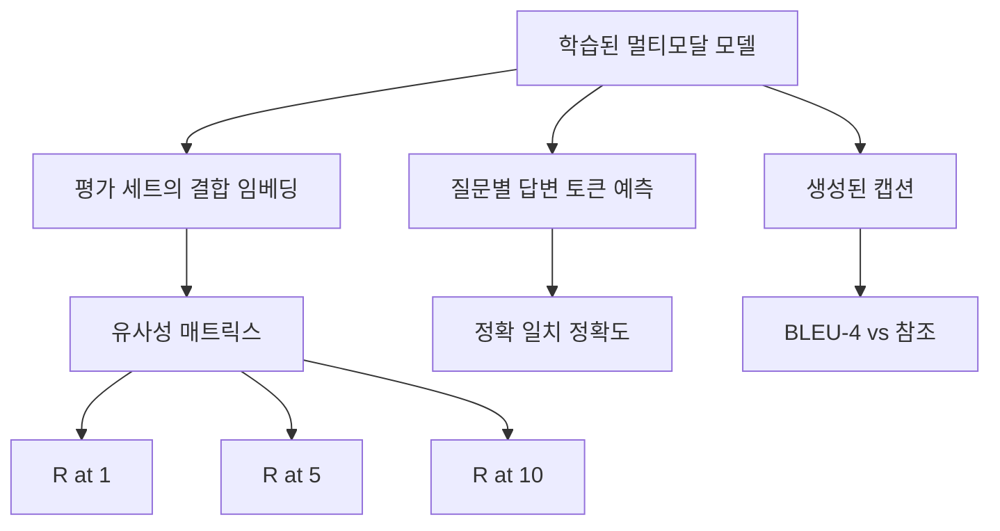

# 멀티모달 평가

> 학습은 루프의 절반입니다. 나머지 절반은 측정입니다. 이 강의에서는 기본 요소로부터 세 가지 평가 영역을 구축합니다: 이미지-캡션 검색(R@1, R@5, R@10으로 보고), 시각적 질의 응답(정확 일치 정확도로 보고), 이미지 캡션 생성(BLEU-4로 보고). 각 지표는 모델의 출력과 몇 초 안에 실행되는 합성 평가 세트에 대한 함수입니다.

**유형:** Build
**언어:** Python
**선수 요건:** 19단계 58-62강 (트랙 E 기초: 인코더, 트랜스포머, 투영, 교차 어텐션 융합, 사전 학습)
**시간:** 약 90분

## 학습 목표

- 이미지와 캡션 임베딩 간의 유사성 행렬에서 Recall@K를 계산합니다.
- (이미지, 질문) 쌍을 고정된 답변 어휘에 매핑하는 모델로부터 정확 일치 VQA 정확도를 계산합니다.
- 외부 라이브러리 없이 생성된 토큰 시퀀스와 참조 토큰 시퀀스로부터 BLEU-4를 계산합니다.
- 62강에서 학습된 모델을 기반으로 구축된 합성 평가 세트에 대해 세 가지 평가를 모두 실행합니다.

## 문제점

학습 손실이 평탄화되면 멀티모달 모델이 완성되었다고 선언하려는 유혹이 있습니다. 학습 손실은 학습 분포에 대한 적합성을 측정하며, 모델이 홀드아웃 배치에서 쌍을 순위를 매기거나, 질문에 답하거나, 사람이 수용할 캡션을 작성할 수 있는지를 측정하지는 않습니다. 세 가지 평가 영역이 표준입니다:

- **검색 (R@1, R@5, R@10).** 쿼리 캡션에 대한 결합 임베딩을 구축합니다. 평가 풀의 모든 이미지를 코사인 유사도로 순위를 매깁니다. 일치하는 이미지가 상위 1, 상위 5, 상위 10에 포함되는지 보고합니다. 대칭적인 (이미지-텍스트) 형태도 동일한 방식으로 실행됩니다.
- **시각적 질의 응답 (정확 일치).** (이미지, 질문)이 주어지면 모델은 답변 토큰을 출력합니다. 정확 일치는 샘플당 1비트입니다: 예측된 답변이 참조 답변과 동일했습니까? 평가 세트에 대해 평균을 냅니다.
- **캡션 생성 (BLEU-4).** 캡션을 생성합니다. 참조 캡션에 대해 1-그램부터 4-그램까지의 정밀도의 기하 평균을 간결성 페널티(간결성 페널티)와 함께 계산합니다. 다중 참조가 표준 형태입니다 (하나의 이미지, 여러 참조 캡션).

각 지표는 얇은 함수입니다. 이 강의에서는 모든 지표를 코드로 구축하여 수식이 구체적이고 표면이 사용자의 통제 하에 있도록 합니다. 실제 벤치마크 스위트(MS-COCO, VQA v2, GQA, OK-VQA)는 동일한 함수 형태에 연결됩니다.

## 개념



### 유사성 매트릭스에서 Recall@K

이미지와 캡션 임베딩 간의 `(N, N)` 코사인 유사도 매트릭스를 구축하세요. 각 행에 대해 열을 유사도 내림차순으로 정렬하세요. Recall@K는 대각선 열 인덱스가 상위 K 위치 내에 있는 행의 비율입니다. 대칭 Recall@K(캡션-이미지)는 전치된 매트릭스에서 계산됩니다. 두 수치 모두 보고됩니다. N=100 평가에서 R@1 = 0.6은 100개의 캡션 중 60개가 상위 일치로 올바른 이미지를 검색했다는 의미입니다.

### VQA 정확 일치

각 (이미지, 질문, 답변)에 대해 이미지를 인코딩하고, 질문을 임베딩하며, 디코더를 통해 융합하고, 다음 토큰을 읽어내세요. 예측된 토큰 id는 참조 id와 비교되며, 같으면 정답입니다. 평가 세트에 대해 평균을 내세요. 실제 VQA 데이터셋은 질문당 여러 개의 인간 주석 답변을 포함하며, 부드러운 정확도 공식(10명의 주석자 중 3명 이상이 동의하면 1.0, 그 미만은 스케일링)을 사용합니다. 이 강의는 명확성을 위해 단일 답변 정확 일치를 사용합니다.

### BLEU-4

```text
BLEU-4 = BP * exp(mean(log p1, log p2, log p3, log p4))
```

여기서 `p_n`는 수정된 n-gram 정확도(생성된 n-gram 중 참조에 나타나는 클리핑된 개수를 총 생성 n-gram으로 나눈 값)이며, `BP`는 간결성 페널티입니다:

```text
BP = 1                if generated length > reference length
   = exp(1 - r/g)     otherwise, where r is reference length and g is generated
```

일부 `p_n`가 0인 작은 샘플의 경우 스무딩이 필요합니다. 구현은 Chen과 Cherry의 "method 1"(0인 개수에 대해 분자와 분모에 1을 더함)을 사용하며, 이는 낮은 개수 환경에서 가장 안전한 기본값입니다.

### 합성 평가 스위트

50개 샘플 평가 스위트는 62강에서 사용된 동일한 목(mock) 코퍼스 패턴을 메모리에 구축하며, 홀드아웃 시드를 사용합니다. 세 개의 리스트가 스위트를 구성합니다:

- `pairs`: 검색을 위한 (이미지, caption_ids) 쌍 50개.
- `vqa`: (이미지, question_ids, answer_id) 삼중항 50개.
- `caps`: 이미지당 최대 3개의 참조를 포함하는 (이미지, [reference_caption_ids, ...]) 항목 50개.

이 스위트는 시드(seed)로부터 결정적으로 생성되며 학습 코퍼스에서 제외되므로, 지표는 모델이 한 번도 본 적 없는 데이터에 대해 계산됩니다. 스위트를 JSON으로 저장하는 것은 연습 문제로 남겨두었습니다 (아래 참조).

| 지표 | 범위 | 랜덤 기준선 (N=50) |
|--------|-------|------------------------|
| R@1 | 0~1 | 0.02 (1 / N) |
| R@5 | 0~1 | 0.10 |
| R@10 | 0~1 | 0.20 |
| VQA EM | 0~1 | 1 / 어휘 |
| BLEU-4 | 0~1 | 작지만 0이 아님 |

합성 데이터로 50단계 학습을 실행할 경우, 지표가 높게 나오기를 기대하지는 않습니다. 랜덤 기준선보다 높게 나오기를 기대하며, 이것이 데모가 확인하는 부분입니다.

```figure
ch-recall-window
```

## 구현하기

`code/main.py`는 다음을 구현합니다:

- `recall_at_k(sim_matrix, k)`, 양방향 모두에 대해 `[0, 1]` 범위의 float를 반환합니다.
- `vqa_exact_match(predictions, references)`, `int`의 평균을 반환합니다.
- `bleu4(generated, references, smoothing=True)`, 다중 참조 지원 포함.
- `build_eval_suite(seed, n_samples, vocab_size, max_len)`, 결정적인 평가 목록 3개를 반환합니다.
- `evaluate(model, suite)`, 세 가지 지표 모두를 실행하고 `dict`의 숫자 값을 반환합니다.
- 62강에서 새로 초기화된 멀티모달 모델을 로드하여 평가한 후, 50단계 학습을 수행하고 다시 평가하여 학습 전후 지표를 출력하는 데모입니다.

실행해 보세요:

```bash
python3 code/main.py
```

출력: 학습 전후 지표 표에서 검색이 랜덤에 가까운 수준에서 모델이 학습한 신호 쪽으로 개선되고, VQA가 랜덤보다 개선되며, BLEU-4가 개선되는 것을 확인할 수 있습니다 (합성 구조는 4-gram 정밀도 상승에 충분합니다).

## 사용하기

각 지표는 생산 벤치마크에 직접 매핑됩니다:

- **검색.** MS-COCO 5K val, Flickr30K, ImageNet zero-shot은 모두 동일한 유사성 행렬에 대한 R@K 문제입니다. 합성 평가를 실제 파일로 교체하면 함수 시그니처는 변하지 않습니다.
- **VQA.** VQA v2, GQA, OK-VQA는 동일한 정확 일치(exact-match) 형태를 사용합니다 (VQA v2의 경우 단일 답변 EM 대신 soft-acc를 사용).
- **BLEU-4.** MS-COCO 캡셔닝, NoCaps, Flickr30K 캡셔닝은 모두 BLEU-4와 CIDEr, METEOR를 사용합니다. CIDEr를 추가하는 것은 하나의 함수를 더하는 것입니다.

실제 벤치마크의 경우 `build_eval_suite`을 실제 로더로 교체하고 함수 본문은 유지하세요. 수식은 벤치마크에 독립적입니다.

## 테스트

`code/test_main.py`이 다루는 내용:

- k < N인 경우, 완전한 단위 유사도 행렬에서는 recall@k가 1.0을 반환하고, 뒤집힌 행렬에서는 0.0을 반환합니다
- recall@k는 `k <= N` 상한을 준수합니다
- 생성된 결과가 참조 중 하나와 정확히 일치할 때 bleu4는 1.0을 반환합니다
- 어휘가 완전히 겹치지 않는 경우 bleu4는 0.0을 반환합니다
- VQA 정확 일치 점수는 일치하는 쌍의 비율과 같습니다
- build_eval_suite는 예상된 쌍의 수, VQA 항목 수, 캡션 항목 수를 반환합니다

실행해 보세요:

```bash
python3 -m unittest code/test_main.py
```

## 연습 문제

1. 캡셔닝 지표에 CIDEr를 추가하세요. CIDEr은 n-gram에 TF-IDF 가중치를 적용하여 정보량이 높은 토큰에 보상을 부여합니다.

2. 소프트 정확도 VQA를 구현하세요. 하나의 질문에 대해 여러 개의 인간 답변이 있으며, 하나라도 일치하면 정확도는 `min(human_count / 3, 1)`입니다. VQA v2를 복제하는 방식입니다.

3. 빈 생성 시퀀스를 처리하되 크래시하지 않도록 `bleu4`의 NaN-safe 변형을 추가하세요.

4. R@K와 함께 평균 역순위(MRR)를 계산하세요. MRR은 정답이 상위 K를 벗어난 어디에 위치하는지에 민감하며, R@K는 정답이 상위 K에 포함되는지 여부에 민감합니다.

5. 학습 중 5개 체크포인트(단계 0, 10, 20, 30, 40, 50)에서 모델에 대한 평가를 실행하고 학습 곡선을 플롯하세요. 지표 궤적이 손실 궤적을 따르는지 확인하세요.

## 핵심 용어

| 용어 | 의미 |
|------|---------------|
| R@K | 쿼리 중 정답이 상위 K 결과에 포함되는 쿼리의 비율 |
| 정확 일치 | 가장 단순한 VQA 점수 산정: 예측된 답변이 참조와 일치 |
| BLEU-4 | 1~4-gram 정밀도의 기하 평균, 간결성 페널티 포함 |
| 다중 참조 | 캡셔닝 지표는 이미지당 여러 참조 캡션을 허용 |
| 홀드아웃 | 평가 세트는 학습 코퍼스와 시드가 겹치지 않는 범위에서 샘플링 |

## 추가 읽기

- 소프트 정확도 공식 및 데이터셋 통계에 대한 VQA v2 논문.
- TF-IDF 가중 n-gram 캡셔닝을 위한 CIDEr 논문입니다.
- 스무딩 변형에 대한 BLEU 원 논문(Papineni et al., 2002)입니다.
- 표준 참조 구현을 위한 MS-COCO 캡셔닝 평가 스크립트입니다.
