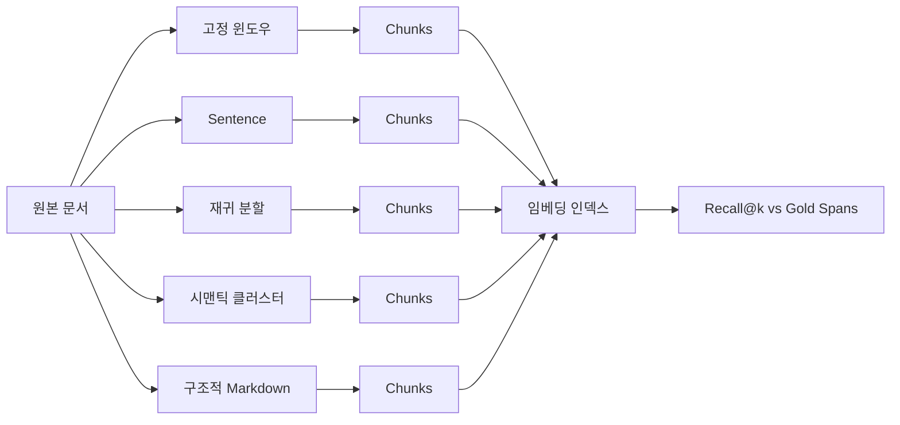

# 청킹 전략 비교

> 청킹은 리트리버가 노출할 수 있는 범위를 결정합니다. 경계를 잘못 설정하면 임베딩 모델, 리랭커, LLM 모두 downstream에서 손상을 복구할 수 없습니다.

**유형:** Build
**언어:** Python
**선수 요건:** 11단계 04강 (임베딩), 06강 (RAG), 07강 (고급 RAG); 19단계 Track B 기초 (20-29강)
**시간:** 약 90분

## 학습 목표
- 고정 윈도우, 문장, 재귀 분할, 시맨틱 클러스터링, 구조적 마크다운 헤더의 다섯 가지 청킹 전략을 처음부터 구현해 보세요.
- 골드 라벨이 붙은 답변 스팬이 포함된 픽스처 코퍼스에 대해 recall@k를 측정하고, 산문에서는 한 전략이, 기술 문서에서는 다른 전략이 승리하는 이유를 설명해 보세요.
- 청킹 길이 분포를 읽고 각 전략이 유발하는 실패 모드(고립된 문장, 기호 중간 절단, 헤더 전용 청크, 시맨틱 드리프트)을 인식해 보세요.
- 벤치마크를 실행하지 않고도 문서 유형, 평균 문단 길이, 형식이 명시적 구조를 포함하는지라는 세 가지 속성을 검토하여 새 코퍼스에 대한 기본값을 선택해 보세요.

## 문제점

모든 RAG 파이프라인은 임베딩 모델이 수용할 수 있을 만큼 작고, 각 청크가 자기 완결적인 아이디어를 담을 수 있을 만큼 큰 조각으로 소스 문서를 잘라내는 것부터 시작합니다. 어디에서 잘라낼지 선택하는 것은 하이퍼파라미터가 아닙니다. 이는 리트리버가 반환할 수 있는 상한선입니다.

"예산 중단 임계값은 어떤 모습인가"라는 쿼리는 중단 임계값을 포함하는 청크가 도달 가능해야만 성공할 수 있습니다. 고정 윈도우 분할기가 임계값을 주변 컨텍스트와 분리하여 잘라내면, 임베딩은 다른 클러스터로 이동하고, BM25 점수는 떨어지며, 리랭커는 잡음을 보게 되고, LLM이 생성하는 답변은 틀리게 됩니다. 2024년 논문 "LongRAG: Enhancing Retrieval-Augmented Generation with Long-context LLMs"는 청킹 선택만으로 검색 recall이 절대적으로 35퍼센트 변동함을 측정했습니다. 2025년 후속 연구인 컨텍스트 청크 헤더는 격차를 좁혔지만 완전히 해소하지는 못했습니다.

이 강의에서는 다섯 가지 전략을 나란히 구축하고, 골드 라벨이 붙은 답변 스팬이 포함된 픽스처 코퍼스에 대해 실행하며, recall 수치를 직접 읽어보게 합니다.

## 개념



### 고정 윈도우

브루트 포스 기준선입니다. 모든 N자마다 잘라냅니다. 선택적으로 겹치도록 설정하여, 위치 N에서 잘린 문장이 위치 N - 겹침에서 시작하는 청크 안에 온전히 포함되게 할 수 있습니다. 빠르고 결정적이지만, 경계 처리는 형편없습니다. 기본값으로 사용하지 말고, 통제 기준으로 사용해 보세요.

### 문장

정규식이나 간단한 상태 기계로 문장 경계에서 분할합니다. 목표 문자 예산까지 하나 이상의 문장을 청크에 담습니다. 단어 중간에서 자르는 것을 멈추는 방식입니다. 여전히 문단 중간이나 섹션 중간에서 자릅니다. 초기 RAG 파이프라인의 기본값이며, 다른 구조가 없는 산문에는 합리적인 선택입니다.

### 재귀 분할

2023년대의 라이브러리들이 대중화한 계층 전략입니다. 가장 강한 구분자(두 줄의 줄바꿈, 문단)부터 분할을 시도하고, 다음 구분자(한 줄의 줄바꿈), 문장, 문자 순으로 단계적으로 내려갑니다. 청크가 예산에 맞으면 재귀가 종료됩니다. 구조가 일관되지 않은 문서에 강하며, 영역별로 적응합니다.

### 시맨틱 클러스터링

모든 문장을 임베딩합니다. 주제 중심점(centroid)을 공유하는 연속적인 문장들을 클러스터링합니다. 중심점과의 연속적인 유사도가 임계값 아래로 떨어지면 자릅니다. 경계는 문자가 아닌 의미를 반영합니다. 구축이 느리고 임베딩 모델에 의존하지만, 문단 내에서 주제가 바뀌는 문서에 대해 탄력적입니다.

### 구조적 Markdown 헤더

명시적인 구조(Markdown, reStructuredText, RFC 스타일의 번호가 매겨진 섹션)를 가진 문서의 경우, 헤더 경계에서 자릅니다. 각 청크는 헤더와 그 아래에 있는 모든 내용을, 같은 수준이나 더 높은 수준의 다음 헤더까지 포함합니다. 주제별 청크가 가장 작지만, 코퍼스가 잘 형성된 경우에만 사용할 수 있습니다.

### recall@k가 경계 선택을 측정하는 방법

골드 레이블이 붙은 쿼리는 소스 문서 내 답변 스팬의 정확한 문자 오프셋을 포함합니다. 청킹 후, 리트리버가 반환한 상위 k개 청크 중 하나가 골드 스팬과 겹치는지 확인합니다. 겹치면 해당 쿼리의 recall@k는 1이고, 겹치지 않으면 0입니다. 쿼리 집합 전체에 대해 평균을 계산합니다. 각 전략에 대해 동일한 평가를 실행하면 스프레드가 현재 코퍼스에 어떤 경계 정책이 살아남는지 보여줍니다.

```figure
ci-chunk-boundaries
```

## 구현하기

`code/main.py`는 다음을 구현합니다:

- `fixed_window(text, size, overlap)` - 기준선(baseline).
- `sentence_chunks(text, target)` - 단순 문장 패커.
- `recursive_split(text, separators, target)` - 계층적 재귀.
- `semantic_chunks(text, similarity_threshold)` - 결정론적 모의 임베딩 위에 centroid 기반 클러스터링을 적용합니다.
- `structural_markdown(text)` - 헤더 인식 분할기.
- `mock_embed(text, dim)` - 해시 기반 임베딩으로 루프가 오프라인에서 실행되도록 합니다.
- `DenseIndex` - 19단계 Track B의 하이브리드 검색 강의에서 사용된 것과 동일한 형태입니다.
- `eval_recall(strategy, corpus, queries, k)` - 비교 루프.
- 모든 전략을 픽스처 코퍼스에 실행하고 recall@k 테이블을 출력하는 `main()`입니다.

실행해 보세요:

```bash
python3 code/main.py
```

출력은 각 전략에 대해 한 행, 각 k에 대해 한 열을 가진 작은 테이블입니다. Sentence는 구조화된 픽스처에서 패배합니다. Structural-markdown은 markdown 픽스처에서 승리합니다. Recursive는 재귀가 적응하므로 혼합 픽스처에서 제 실력을 발휘합니다. Semantic clustering은 유용한 구조적 단서가 없는 산문 픽스처에서 승리합니다.

## 테이블이 숨기지 못하는 실패 모드

**고립된 문장.** Sentence packing은 주제 문장을 놓친 청크를 생성합니다. 임베딩은 그 결과 잘못된 클러스터를 가리키게 됩니다.

**심볼 중간 절단.** 코드나 YAML 내에서 고정 윈도우가 식별자를 반으로 쪼개면 두 절반이 잡음으로 임베딩됩니다.

**헤더 전용 청크.** Structural markdown은 `## Title`만 포함된 청크를 생성합니다. 이런 청크를 필터링하거나 다음 청크의 첫 단락을 붙여 넣으세요.

**의미적 드리프트.** Semantic clustering은 코퍼스가 균일하게 주제에 집중되어 있을 때 과소 절단합니다. 5000자 청크는 많은 구체적인 답변을 하나의 확산된 임베딩에 담습니다. Semantic을 하드 문자 상한과 결합하세요.

**오래된 임베딩.** 시맨틱 클러스터링은 임베딩 모델을 사용합니다. 모델을 변경하면 청크도 변경됩니다. 검색 모델과 청크 모델을 별도로 고정하거나 인덱스를 함께 재구축하세요.

## 벤치마크를 실행하지 않고 기본값을 선택하는 것

새로운 코퍼스에 대한 기본 청커는 세 가지 속성에 의해 결정됩니다.

| 속성 | 값 | 기본값 |
|----------|-------|---------|
| 문서 유형 | 구조가 없는 산문 | 재귀 분할, 목표 800 |
| 문서 유형 | Markdown / RFC / API 문서 | 구조적 Markdown |
| 문서 유형 | 코드 | AST 인식 (범위 밖; 19단계 02강 참조) |
| 단락 길이 | 길고 단일 주제 | 문장, 목표 500 |
| 단락 길이 | 짧고 혼합된 주제 | 시맨틱, 임계값 0.6 |

확신이 서지 않을 때는 재귀 분할을 선택하세요. 이는 가장 강력한 단일 전략 기준선입니다.

## 사용하기

프로덕션 패턴:

- 새로운 파이프라인을 출시하기 전에 평가를 실행하세요. 라이브러리의 기본 전략을 신뢰하지 마세요.
- 임베딩 모델이나 코퍼스 구성을 변경할 때마다 평가를 다시 실행하세요. 승자는 코퍼스에 의존합니다.
- 각 청크의 메타데이터에 전략 이름을 저장하여 나중에 회귀를 추적할 수 있도록 하세요.

## 출시하기

69강의 Track F 엔드투엔드 RAG 시스템은 여기서 선택한 청커를 첫 단계로 사용합니다. 68강의 평가 하네스는 이 강의에서 `eval_recall`가 반환하는 동일한 형태에서 recall@k를 읽습니다. 코퍼스에서 승리하는 전략을 선택하고 이를 전달하세요.

## 연습 문제

1. 여섯 번째 전략을 추가하세요: 문자 수 대신 `tiktoken`를 사용하는 토큰 윈도우. 동일한 픽스처에서 고정 윈도우와 비교하세요.
2. 산문 픽스처에 30퍼센트 비율의 코드 블록을 주입하세요. 테이블을 다시 실행하세요. 구조적 Markdown을 제외한 모든 전략이 recall을 잃는 이유를 설명하세요.
3. 결정론적 임베딩을 프로젝트의 실제 제공자로부터 가져온 임베딩으로 교체하세요. 시맨틱 클러스터링 recall 델타를 측정하세요. 전략 간의 차이가 넓어지는지 좁아지는지 보고하세요.
4. 각 청크에 `summary` 필드를 추가하세요: 한 문장의 중심점 설명입니다. 요약이 청크 본문에 추가된 상태로 평가를 다시 실행하세요. 재현율 상승을 측정해 보세요.

## 핵심 용어

| 용어 | 사람들이 말하는 것 | 실제 의미 |
|------|-----------------|------------------------|
| Recall@k | "올바른 청크를 가져왔나요?" | 상위 k개 청크 중 하나가 정답 스팬과 겹치는 쿼리의 비율 |
| 청크 겹침 | "슬라이딩 윈도우" | 이전 청크의 마지막 N글자를 다음 청크에 다시 포함하기 |
| 구조적 분할기 | "헤더 인식 청크" | H1/H2/H3 경계에서 분할; 헤더 텍스트는 청크의 일부입니다 |
| 시맨틱 청커 | "주제 인식 청크" | 문장을 임베딩하고, 중심점 유사성으로 클러스터링하며, 드리프트에서 분할 |
| 중심점 드리프트 | "주제 이동" | 이동 평균과 다음 문장 간의 코사인 유사도가 임계값 아래로 떨어짐 |

## 추가 읽기

- [LongRAG: Enhancing Retrieval-Augmented Generation with Long-context LLMs (arXiv 2406.15319)](https://arxiv.org/abs/2406.15319)
- [Anthropic, Contextual Retrieval](https://www.anthropic.com/news/contextual-retrieval)
- [LlamaIndex, Chunking strategies for production RAG](https://docs.llamaindex.ai/en/stable/optimizing/production_rag/)
- 11단계 06강 - RAG 기초
- 11단계 07강 - 고급 RAG
- 19단계 65강 - 여기서 생성된 청크를 랭킹하는 하이브리드 검색
- 19단계 68강 - 프로덕션에서 전략 선택을 점수화하는 평가 하네스
